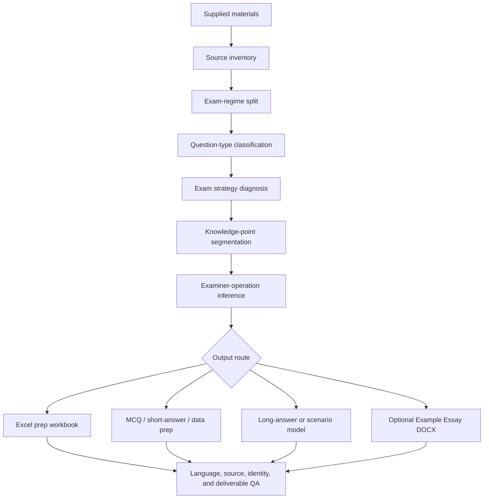

# SBS Exam Prep Workflow

`sbs-exam-prep-workflow` is a Codex Skill for building evidence-grounded exam preparation outputs from lecture slides, formal past papers, practical materials, MCQs, short-answer questions, long-answer prompts, essay prompts, exemplars, extra reading recommendations, and recommended books.

The Skill is designed around one principle:

```text
inputs -> exam format -> question type -> examiner operation -> knowledge point -> preparation output
```

It is not a topic-hotness predictor. Frequency and recency are useful signals, but the main task is to infer how the examiner asks, what kind of reasoning the question rewards, and what preparation artefact best matches that strategy.

## What It Produces

Default output is an Excel-first revision workbook. Complete Example Essays are generated only when explicitly requested.

Typical student-facing outputs:

| Request type | Main output | Purpose |
| --- | --- | --- |
| Source inventory | JSON or concise report | Identify files, roles, extraction status, and evidence limits. |
| Exam-prep workbook | `Exam_Prep_Map` Excel workbook | Map lecture material to knowledge points and exam-facing prep actions. |
| Essay/problem-essay prep | Predicted essay themes, paragraph plans, essay-ready synthesis | Prepare broad examinable themes without inventing exact future stems. |
| MCQ prep | Discriminator axes, contrast tables, traps, concise flashcards | Train recognition of close alternatives and common distractors. |
| Short-answer prep | Mark-scaled schemas and reference expansions | Convert content into 2/4/6/8-mark answer shapes. |
| Practical/data/problem prep | Input -> operation -> inference -> limitation -> follow-up logic | Train graph, protocol, case, calculation, and result interpretation. |
| Scenario/project long answer | Method -> readout -> interpretation -> control -> caveat model | Match method-heavy or scenario-based questions. |
| Example Essay mode | One standalone `.docx` per essay | Produce polished, source-grounded model essays with DOCX formatting and source audit. |

Internal helper files such as manifests, source maps, QA JSON, citation logs, rendered previews, and source-audit files may be generated for validation. They are not mixed into the final user-facing output unless an audit package is explicitly requested.

## Workflow Logic



The Skill first classifies the evidence, then chooses the preparation strategy. It avoids applying essay logic to MCQ, short-answer, data/problem, or practical questions.

## Evidence Model

Each input has a role and a limit.

| Source type | How it is used |
| --- | --- |
| Lecture slides and official notes | Primary factual source for course content and lecture logic. |
| Formal past papers | Exam format, answer rules, question type, and current prediction evidence. |
| Practical materials, mocks, quizzes, answer keys, exemplars | Coverage, answer style, practice planning, and schema evidence, with provenance kept separate. |
| Extra reading recommendations and recommended books | Enrichment only after the relevant chapter, section, paper, DOI, PubMed record, publisher page, or textbook source is verified. |
| External examples, screenshots, previous essays, benchmark fixtures | Transferable workflow and language lessons only. They cannot supply factual content or prediction evidence for a new source set. |

Failed extraction, weak OCR, unreadable images, missing files, and unsupported formats become QA flags. The Skill does not infer hidden content from them.

## Strategy Routing

The same source set can contain several question types, so the far-right workbook prep area changes by detected exam strategy.

| Detected strategy | Preparation logic |
| --- | --- |
| Stable essay or problem-essay regime | Predict examinable themes by source scope, examiner operation, and lecture centrality. Exact future question wording is not the default product. |
| MCQ-heavy regime | Build discriminator axes, exception lists, mechanism-order traps, contrast tables, and wrong-option diagnosis. |
| Short-answer regime | Build concise mark-producing schemas plus fuller reference expansions. |
| Data/problem/practical regime | Build graph/table/protocol/case logic: input, operation, inference, limitation, and follow-up. |
| Project/scenario long-answer regime | Build method families, expected readouts, interpretation, controls, caveats, and compact model answers when requested. |
| Mixed-format regime | Keep one workbook, but separate prep logic by section and question type. |

## Knowledge-Point Design

Knowledge points are reasoning blocks, not slide dumps.

Valid knowledge points usually follow one of these shapes:

```text
mechanism -> evidence -> consequence
process input -> actors -> mechanism -> output
method principle -> scenario application -> readout -> interpretation -> control
data -> inference -> limitation -> further test
comparison axis -> examples -> synthesis
problem -> proposed solution -> evidence -> implication
```

Workbook prose is written as student-facing synthesis:

```text
claim -> mechanism -> evidence/example -> consequence
```

It should not narrate pages, slides, source order, or instructions about how to write an answer.

## Example Essay Mode

Example Essay mode is a separate DOCX-first branch. It runs only when the user explicitly asks for complete Example Essays, model essays, full essay-style answers, or complete essay documents.

Before drafting, the Skill runs this internal sequence:

```text
question analysis
source scope detection
source reading
source logic reconstruction
citation detection and original-source reading
classic-experiment fallback when slide citations are absent
extra-reading chapter matching or academic search
knowledge inventory
paragraph plan
language compression plan
exam-ready refinement pass
highlight plan
source-to-run mapping
DOCX generation
DOCX formatting lint
visual/render QA
source audit
examiner-fit checklist
```

Essay language is controlled by the shared language contract:

- start with the answer or problem, not metacommentary;
- build paragraphs through claim, mechanism, evidence, scope, and consequence;
- convert evidence-heavy examples into `evidence -> mechanism -> interpretation -> limitation`;
- compress repetition without deleting academic mechanisms;
- remove lecture-route narration and exam-guidance phrasing;
- calibrate citation strength, using cautious verbs unless a source directly proves causality;
- conclude by synthesis, not by adding new evidence.

DOCX output uses Arial, 2.5 cm margins, justified body text, centered title, left-aligned headings, and 1.5 line spacing.

Highlighting rules:

| Highlight | Meaning |
| --- | --- |
| Green | Original citation source or verified classic experiment, after it has been resolved and read. |
| Yellow | Uploaded Extra Reading Book content matched to the relevant chapter or section. |
| No highlight | Ordinary lecture-slide or official-source content. |

## Academic Integrity Boundary

This Skill is for preparation, revision, source organization, workbook generation, and practice-question planning.

It must not be used for:

- live exams;
- active assessed submissions;
- contract-cheating requests;
- presenting predicted themes as official questions;
- inventing citations, statistics, dates, mark schemes, source names, mechanisms, or lecturer preferences.

Essay/problem-essay predictions must be labelled as predicted themes. Practice stems may be included only as practice variants derived from the theme.

## Repository Structure

| Path | Role |
| --- | --- |
| `SKILL.md` | Top-level Codex Skill instructions and output contract. |
| `references/` | Protocols for evidence handling, routing, scoring, language quality, Example Essays, Excel output, regression, and release. |
| `scripts/` | Helper CLIs for extraction, grouping, language linting, DOCX generation, citation resolution, source audit, deliverable linting, gap reporting, and GitHub-ready QA. |
| `schemas/` | JSON schemas for Example Essay plans, language deltas, example contributions, and gap reports. |
| `benchmarks/` | Sanitized benchmark metadata and lint fixtures. They preserve transferable workflow rules only. |
| `tests/fixtures/` | Small public fixtures for DOCX, source-grounding, and citation-fallback checks. |
| `agents/` | Optional Skill interface metadata. |

## Install

Clone as a Codex Skill:

```bash
mkdir -p ~/.codex/skills
git clone https://github.com/OctavianYimingZhang/sbs-exam-prep-workflow.git ~/.codex/skills/sbs-exam-prep-workflow
```

Install Python dependencies for helper scripts:

```bash
cd ~/.codex/skills/sbs-exam-prep-workflow
python3 -m venv .venv
source .venv/bin/activate
python -m pip install -r requirements.txt
```

The scripts are plain Python files. Extraction and DOCX quality depend on the installed document libraries and source-file quality.

## Common Commands

Inventory sources:

```bash
python scripts/extract_sources.py /path/to/input_dir --output /path/to/output_dir --target "Target Course"
```

Group sources by target and regime:

```bash
python scripts/target_grouper.py /path/to/output_dir/source_scan.json --output /path/to/output_dir/target_groups.json
```

Lint workbook prose:

```bash
python scripts/essay_style_linter.py --workbook /path/to/workbook.xlsx
```

Lint complete Example Essay language:

```bash
python scripts/example_essay_language_linter.py --plan /path/to/example_essay_plan.json
```

Generate Example Essay DOCX files from a plan:

```bash
python scripts/generate_example_essay_docx.py --plan /path/to/example_essay_plan.json --output-dir /path/to/output --strict
```

Prepare citation resolution or classic-experiment fallback:

```bash
python scripts/lecture_citation_resolver.py --input /path/to/slides.pptx --output-dir /path/to/internal_qa --classic-search-if-no-citations
```

Check that public output excludes helper artefacts:

```bash
python scripts/final_deliverable_linter.py /path/to/public_output
```

Analyse external examples into transferable deltas:

```bash
python scripts/analyze_example_corpus.py /path/to/examples --output /path/to/example_analysis.json --max-files 80
```

Run metadata-only regression checks:

```bash
python scripts/cross_subject_regression_check.py --metadata-only --suite benchmarks/cross_subject_regression_suite.json
python scripts/cross_subject_regression_check.py --metadata-only --suite benchmarks/method_long_answer_suite.json
```

Run the full local QA gate:

```bash
python scripts/github_ready_check.py --ci
```

## Benchmark Sanitization

The public benchmark files are regression fixtures. They test generic behaviours such as regime splitting, question-type routing, workbook layout adaptation, source-boundary discipline, Example Essay language quality, and cross-source leakage prevention.

They intentionally exclude private lecture slides, past papers, notes, mocks, student files, generated workbooks, local absolute paths, and cached run outputs.

## License

MIT.
