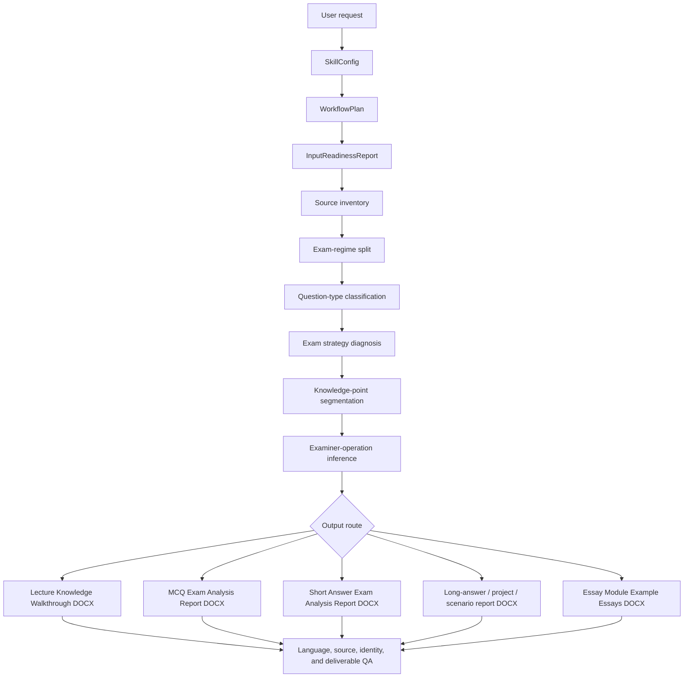

# Everything Exam Preparation

`everything-exam-preparation` is the Codex Skill in this repository. It turns a student's exam materials into Word-first, evidence-grounded revision artifacts: a lecture knowledge walkthrough plus question-type add-on reports for MCQ, Short Answer, Long Answer/Project/Scenario, and Essay exams.

The Skill name follows the GitHub repository name in Codex-safe lowercase hyphen form. The workflow itself is course-agnostic: it must learn from uploaded materials and validated sources, not from hard-coded course, topic, or example names.

The project exists because exam preparation is not one task. The correct output depends on the evidence available and on the way the exam asks questions. A student who uploads slides and MCQs should not receive essay-theme planning by default; a student who uploads essay prompts should not receive a generic flashcard table unless that is the requested artifact.

## What This Skill Does

The Skill reads the supplied materials, classifies their evidence role, detects the relevant exam format, and organises examinable knowledge first. The default route for general lecture review is a Word-first `Lecture Knowledge Walkthrough DOCX`: it follows lecture order, splits content into conceptual modules, and explains the knowledge in directly revisable prose.

Question-type routes are add-ons to that knowledge walkthrough: MCQ Exam Analysis Report, Short Answer Exam Analysis Report, Long Answer/Project/Scenario Report, and Essay Module Example Essays. Past-paper analysis is used as a chat-only pre-generation brief to guide those outputs. Excel workbooks and public prediction workbooks are no longer student-facing output routes.

The invariant is that process helper files stay separate. Public outputs may include any requested student-facing artifact, but run manifests, source maps, QA JSON, lineage files, citation logs, rendered previews, and other internal validation files must not be mixed into the student-facing folder unless the user explicitly requests an audit package.

## What This Skill Does Not Do

- It does not use hard-coded course, lecture, or example names as trigger logic.
- It does not claim exact future exam questions.
- It does not treat frequency or recency as sufficient evidence for prediction.
- It does not generate Excel workbooks or public past-paper prediction files as ordinary outputs.
- It does not invent citations, statistics, source names, mechanisms, mark schemes, or lecturer preferences.
- It does not use external examples as factual evidence for a new source set.
- It does not support live exams, active assessed submissions, or contract-cheating requests.

## Safety And Privacy

This repository should contain only the Skill, public fixtures, sanitized benchmark metadata, protocols, schemas, and helper scripts. Do not commit private lecture slides, past papers, books, student data, generated student outputs, run manifests, source maps, QA JSON, citation logs, or internal audit folders.

Example Essay outputs are revision exemplars. They are not submission-ready assessed work, and the Skill must not present them as work the student can submit for credit.

## Core Principle

The Skill is designed around one first-principles chain:

```text
inputs -> exam format -> question type -> examiner operation -> knowledge point -> preparation output
```

It is not a topic-hotness predictor. Frequency and recency are useful signals, but the main task is to infer how the examiner asks, what kind of reasoning the question rewards, and what preparation artefact best matches that strategy.

For any non-trivial run, the Skill uses a typed planning chain before generation:

```text
User request -> SkillConfig -> WorkflowPlan -> InputReadinessReport -> validated output
```

This makes the workflow configurable and auditable. The Skill first decides the requested output mode, then checks which source classes are needed, then plans the minimum action path, then blocks only the conclusions that lack evidence.

## At A Glance

| Area | Behaviour |
| --- | --- |
| Default route | `knowledge_walkthrough_docx`, a Word-first lecture walkthrough. |
| Question-type routes | MCQ, Short Answer, Long Answer/Project/Scenario, and Essay add-ons built on top of the walkthrough. |
| Prediction route | Chat-only Exam Analysis Brief for module/point selection, not a public prediction file. |
| Planning layer | `SkillConfig -> WorkflowPlan -> InputReadinessReport`. |
| Evidence model | Each source has a role and a limit before it can support a claim. |
| Public boundary | Student-facing artifacts are separated from internal helper and QA files. |
| Release gate | Local validation, identity-trigger linting, public-output linting, and repository QA. |

## Core Workflow

1. Classify source files by role, trust level, extraction quality, and evidence limits.
2. Diagnose the exam format and split incompatible exam regimes before comparing papers.
3. Classify question types before choosing a preparation strategy.
4. Convert source fragments into knowledge points and examiner operations.
5. Select the walkthrough plus any question-type add-on that matches the evidence and requested artifact.
6. Rewrite internal reasoning into student-facing revision content.
7. Run QA so unsupported claims and process helper files do not enter the final public output.

## Quick Start

Clone the public repository as a Codex Skill:

```bash
mkdir -p ~/.codex/skills
git clone https://github.com/OctavianYimingZhang/Everything-Exam-Preparation.git ~/.codex/skills/everything-exam-preparation
cd ~/.codex/skills/everything-exam-preparation
```

Install helper-script dependencies:

```bash
python3 -m venv .venv
source .venv/bin/activate
python -m pip install -r requirements.txt
```

Run a fixture-based planning check:

```bash
python scripts/plan_workflow.py \
  --config tests/fixtures/planner/skill_config_knowledge_walkthrough.json \
  --output /tmp/sbs_workflow_plan.json
```

Generate a fixture-based Lecture Knowledge Walkthrough DOCX while keeping public output and internal QA separate:

```bash
python scripts/generate_knowledge_walkthrough_docx.py \
  --plan tests/fixtures/knowledge_walkthrough/knowledge_walkthrough_plan.json \
  --output-dir /tmp/sbs_public_output \
  --qa-dir /tmp/sbs_internal_qa \
  --deliverable-only \
  --strict
```

Run the main repository QA gate:

```bash
python scripts/github_ready_check.py --ci
```

## Operational Ontology

The Skill treats exam preparation as an operational object graph rather than a loose file index:

```text
SourceDocument -> SourceFragment -> KnowledgePoint -> ExaminerOperation -> QuestionArchetype -> EvidenceClaim -> PrepArtifact -> QAFlag
```

This matters because exam preparation needs evidence permissions, not only retrieval. For example:

- lecture slides can support factual course content;
- formal past papers can support exam structure and archetype inference;
- old-format papers can support coverage but not current blueprint prediction;
- external examples can support workflow rules but not target factual claims;
- recommended books and papers can enrich only after chapter, section, DOI, PubMed, publisher, or original-source verification;
- helper artifacts stay internal unless an audit package is requested.

The machine-readable ontology contract lives in [`ontology/ontology.json`](ontology/ontology.json). The workflow protocol is in [`references/operational_ontology_protocol.md`](references/operational_ontology_protocol.md).

## Runtime Control Plane

The Skill treats each non-trivial run as a small auditable data product. Internal helper artifacts stay out of the student-facing folder, but they can be generated under `internal_qa/` to make the run reproducible:

```text
Bronze: source inventory, extraction status, source hashes
Silver: source fragments, fragment partitions, past-paper question records
Gold: knowledge points, examiner operations, archetypes, evidence claims, QA flags
Serving: knowledge walkthrough DOCX, question-type report DOCX, direct answer, optional audit package
```

The publish gate is:

```text
No object -> no link.
No valid link -> no claim.
No verified claim -> no student-facing synthesis.
No lineage -> no reproducible publish.
No QA pass -> no publish.
```

This is implemented with a fragment metadata index, a runtime ontology validator, and run manifest/lineage linting. The goal is not to run a cloud data platform; the goal is to make local exam-prep generation pruneable, auditable, and reproducible.

## Output Routes

Choose one mode, or provide materials and ask for exam prep. General lecture-review requests use `full_workflow`, which resolves to the Word-first lecture walkthrough route. Question-type prep modes add a second DOCX report on top of the walkthrough unless the user explicitly opts out.

| Mode | Use when | Output |
| --- | --- | --- |
| `full_workflow` | You want the default lecture-review workflow. | Source coverage card plus Lecture Knowledge Walkthrough DOCX. |
| `source_inventory` | You only want file roles and extraction status. | Source inventory and evidence-use limits. |
| `exam_format_diagnosis` or `exam_analysis_brief` | You want exam/past-paper analysis before file generation. | Chat-only exam analysis brief; no prediction file. |
| `knowledge_walkthrough_docx` | You want to go through lecture knowledge in order. | Lecture-first Word walkthrough with module overviews, knowledge walkthroughs, key logic, common confusions, and recap. |
| `mcq_exam_prep` | You need MCQ-focused preparation. | Walkthrough plus MCQ Point Card report. |
| `short_answer_exam_prep` | You need short-answer preparation. | Walkthrough plus module logic, point cards, highlighted keywords, and Example Answers. |
| `long_answer_project_scenario_prep` | You need practical, data, project, scenario, method, case, or long-answer prep. | Walkthrough plus question analysis, answer order, reusable blocks, Example Answer, and adaptation notes. |
| `essay_exam_prep` | You need essay preparation. | Walkthrough plus module-level big Example Essays with adaptation maps and paragraph banks. |
| `evidence_gap_audit` | You want to know what is missing. | Source coverage, blockers, unresolved conflicts, next-source checklist. |
| `incremental_refresh` | You add new slides, papers, readings, answers, or feedback after a prior run. | Only affected objects and artifacts are refreshed. |

The strongest source pack includes lecture slides/official notes, formal past papers, mark schemes or answer keys where available, practical/data materials, essay or long-answer prompts, extra reading recommendations/books, and any user weak areas or time budget if personalization is requested. Missing sources do not automatically stop the run; only unsupported conclusions are blocked.

Mode names are user-facing entry points. Preset names are planning-layer objects. Old workbook-style request wording is normalized internally to the current Word-first routes; it is not a public output contract.

## Setup And Planning Layer

The Skill separates configuration from execution.

| Layer | File or object | Role |
| --- | --- | --- |
| Setup | `SkillConfig` | Stores target details, source inputs, evidence policy, output preset, QA strictness, and advanced reuse settings. |
| Plan | `WorkflowPlan` | Converts the chosen preset into ordered actions, dependencies, expected outputs, skipped modules, blockers, and publish gates. |
| Readiness | `InputReadinessReport` | Checks whether the selected preset has its required source classes. |
| Preview | rendered plan | Shows the user what will run, what will be skipped, and what is blocked. |
| Execution | ontology actions | Produces source objects, knowledge objects, prep artifacts, QA flags, manifests, and lineage. |

The planning layer supports these presets:

| Preset | Minimum source classes | Main route |
| --- | --- | --- |
| `source_inventory_only` | any readable source | file classification and evidence limits |
| `exam_format_diagnosis` | formal past papers | chat-only exam analysis brief |
| `knowledge_walkthrough_docx` | lecture slides or official notes | default Word walkthrough |
| `mcq_exam_prep` | lecture slides or official notes | walkthrough plus MCQ report |
| `short_answer_exam_prep` | lecture slides or official notes | walkthrough plus Short Answer report |
| `long_answer_project_scenario_prep` | lecture slides or official notes | walkthrough plus long-answer/project/scenario report |
| `essay_exam_prep` | lecture slides or official notes | walkthrough plus module-level Example Essays |
| `audit_lint_only` | none | requested checks only |
| `github_ready_qa` | none | repository release gate |

The setup protocol is in [`references/interactive_setup_protocol.md`](references/interactive_setup_protocol.md). Practical usage guidance is in [`references/best_usage_guide.md`](references/best_usage_guide.md).

## Student-Facing Outputs

Student-facing outputs are Word-first. The selected route controls which DOCX artifacts are produced. The hard rule is that internal helper and QA files are not mixed into ordinary student-facing output.

Default lecture-review output is a Word-first revision walkthrough. Complete Example Essays are generated only when explicitly requested.

Typical student-facing outputs:

| Request type | Main output | Purpose |
| --- | --- | --- |
| Source inventory | JSON or concise report | Identify files, roles, extraction status, and evidence limits. |
| Lecture knowledge walkthrough | `Lecture_Knowledge_Walkthrough.docx` | Go through lectures in order through AI-inferred conceptual modules. |
| Exam analysis brief | Chat-only pre-generation note | Use paper patterns to choose modules and points without creating a prediction file. |
| Essay/problem-essay prep | `Essay_Module_Example_Essays.docx` | Prepare module-level big Example Essays with adaptation maps and paragraph banks. |
| MCQ prep | MCQ Point Cards and optional separate practice packs | Train recognition of close alternatives, common distractors, and expected-value answer strategy. |
| Short-answer prep | Module logic, point cards, highlighted keywords, and example answers | Convert content into source-linked mark-scaled answer shapes. |
| Long-answer/project/scenario prep | `LongAnswer_Project_Scenario_Report.docx` | Train scenario, method, readout, interpretation, control, limitation, and adaptation logic. |

Internal helper files such as manifests, source maps, QA JSON, citation logs, rendered previews, and source-audit files may be generated for validation. They are not mixed into the final user-facing output unless an audit package is explicitly requested.

## Workflow Logic



The Skill first classifies the evidence, then chooses the preparation strategy. It avoids applying essay logic to MCQ, short-answer, data/problem, or practical questions.

## Student-Facing Output Filter

Internal reasoning can use source anchors, confidence, recurrence, lecture centrality, examiner operation, discriminator axes, and evidence rules. Ordinary student-facing reports must not display those internal fields.

Visible output should be rewritten as:

```text
priority -> point/module -> explanation -> exam-use answer or walkthrough
```

Forbidden in ordinary student-facing reports:

```text
source anchor
evidence rationale
confidence
recurrence count
lecture centrality
examiner operation
discriminator axis
task verb
reference expansion
common omissions
past-paper year mapping
prediction score
```

For MCQ reports, the default visible item is an MCQ Point Card: priority, point, knowledge explanation, how the exam tests it, common traps, and must-remember rule. Practice questions, answer keys, contrast tables, and separate trap banks are separate optional outputs, not part of the default MCQ high-yield report.

For Short Answer reports, each section starts with module logic, then point cards. Required keywords are bolded inside the explanation, and mark logic is absorbed into the Example Answer. The student report does not show mark-producing schema, required-term fields, reference expansion, common omissions, task verb, confidence, evidence, or source anchors.

The full policy is in [`references/student_facing_output_policy.md`](references/student_facing_output_policy.md).

## Knowledge Walkthrough DOCX

The `knowledge_walkthrough_docx` route is for going through lecture content. It does not predict papers, write essays, or create practice packs by default.

Each lecture becomes:

```text
Lecture Overview
Module Map
Module 1
Module 2
...
Lecture Recap
```

Each module contains:

```text
What This Module Explains
Knowledge Walkthrough
Key Logic
Common Confusions
Must Master
```

The route is defined in [`references/knowledge_walkthrough_docx_protocol.md`](references/knowledge_walkthrough_docx_protocol.md).

## Exam Analysis Brief

Past-paper analysis is handled as preparation allocation and shown in chat before file generation:

```text
past papers -> current exam regime -> PastPaperQuestion records -> QuestionArchetype registry -> slot grammar -> KP compatibility -> chat brief -> output selection
```

The Skill should not answer "what exact question will appear?" or create a separate prediction file. It should answer briefly in chat:

```text
What exam type is visible, what module/point selection follows from the evidence, what files will be generated, and which weak areas will not be overclaimed?
```

The prediction protocol is in [`references/past_paper_prediction_protocol.md`](references/past_paper_prediction_protocol.md).

## Evidence Model

Each input has a role and a limit.

| Source type | How it is used |
| --- | --- |
| Lecture slides and official notes | Primary factual source for course content and lecture logic. |
| Formal past papers | Exam format, answer rules, question type, and current prediction evidence. |
| Practical materials, mocks, quizzes, answer keys, exemplars | Coverage, answer style, practice planning, and schema evidence, with provenance kept separate. |
| Extra reading recommendations and recommended books | Enrichment only after the relevant chapter, section, paper, DOI, PubMed record, publisher page, or textbook source is verified. |
| External examples, screenshots, previous essays, benchmark fixtures | Transferable workflow and language lessons only. They cannot supply factual content or prediction evidence for a new source set. |

Failed extraction, weak OCR, unreadable images, missing files, and unsupported formats become QA flags. The Skill does not infer hidden content from them.

## Strategy Routing

The same source set can contain several question types, so the add-on report changes by detected exam strategy.

| Detected strategy | Preparation logic |
| --- | --- |
| Stable essay or problem-essay regime | Select examinable modules and generate module-level big Example Essays with adaptation maps. |
| MCQ-heavy regime | Generate MCQ Point Cards: point, explanation, how the exam tests it, traps, must-remember rule. |
| Short-answer regime | Generate module logic plus point cards with highlighted keywords and Example Answers. |
| Data/problem/practical regime | Route into the long-answer/project/scenario report when the answer needs input, operation, inference, limitation, control, or follow-up. |
| Project/scenario long-answer regime | Generate question analysis, answer order, reusable blocks, Example Answer, and adaptation notes. |
| Mixed-format regime | Generate the walkthrough plus the relevant DOCX add-on reports. |

Prediction safety rules:

- do not claim exact future wording;
- do not expose precise numerical probabilities from small paper sets;
- do not let lecturer/source-block style raise confidence above `Medium` without repeated current-regime evidence;
- do not generate unbounded short-answer question lists;
- do not claim MCQ official answers without answer-key evidence.

## Knowledge-Point Design

Knowledge points are reasoning blocks, not slide dumps.

Valid knowledge points usually follow one of these shapes:

```text
mechanism -> evidence -> consequence
process input -> actors -> mechanism -> output
method principle -> scenario application -> readout -> interpretation -> control
data -> inference -> limitation -> further test
comparison axis -> examples -> synthesis
problem -> proposed solution -> evidence -> implication
```

Student-facing prose is written as synthesis:

```text
claim -> mechanism -> evidence/example -> consequence
```

It should not narrate pages, slides, source order, or instructions about how to write an answer.

## Example Essay Mode

Example Essay mode is a separate DOCX-first revision-exemplar branch. It runs only when the user explicitly asks for complete Example Essays, model essays, full essay-style answers, or complete essay documents, and it must not be framed as submission-ready assessed work.

For complete Example Essay generation, the Skill runs this internal sequence:

```text
question analysis
source scope detection
source reading
ppt/source logic reconstruction
citation detection and original-source reading
classic-experiment fallback when slide citations are absent
extra-reading scope matching
knowledge inventory
paragraph plan
first draft
citation and Extra Reading integration
compression budget estimate
expression-efficiency compression pass
accuracy-preservation pass
analytic argument pass
sentence-level Extra Reading micro-detail pass
highlight plan
source-to-run mapping
DOCX generation
DOCX formatting lint
visual/render QA
source audit
examiner-fit checklist
```

Essay language is controlled by the shared language contract:

- start with the answer or problem, not metacommentary;
- build paragraphs through claim, mechanism, evidence, scope, and consequence;
- convert evidence-heavy examples into `evidence -> mechanism -> interpretation -> limitation`;
- use lecture/PPT/source logic as the skeleton and Extra Reading only as a precision layer;
- add named molecular, cellular, channel, receptor, pathway, assay, circuit, gene, method, or case detail only when it sharpens a parent PPT/source mechanism slot;
- reject true-but-unneeded catalogues, review-style drift, and details that need a new explanatory sentence before they are useful;
- estimate a safe compression budget before shortening, protecting the source skeleton, essential evidence, citation-supported named details, and analytic limitations;
- run final compression after citation and Extra Reading integration, preserving causal strength, scope qualifiers, model boundaries, and evidence interpretation;
- remove lecture-route narration and exam-guidance phrasing;
- calibrate citation strength, using cautious verbs unless a source directly proves causality;
- require analytic sentences, not just descriptive lists of components;
- conclude by synthesis, not by adding new evidence.

DOCX output uses Arial, 2.5 cm margins, justified body text, centered title, left-aligned headings, and 1.5 line spacing.

Highlighting rules:

| Highlight | Meaning |
| --- | --- |
| Green | Original citation source or verified classic experiment, after it has been resolved and read. |
| Yellow | Uploaded Extra Reading Book content matched to the relevant chapter or section. |
| No highlight | Ordinary lecture-slide or official-source content. |

## Academic Integrity Boundary

This Skill is for preparation, revision, source organization, Word-first report generation, and practice-route planning.

It must not be used for:

- live exams;
- active assessed submissions;
- contract-cheating requests;
- presenting predicted themes as official questions;
- inventing citations, statistics, dates, mark schemes, source names, mechanisms, or lecturer preferences.

Essay/problem-essay predictions must be labelled as predicted themes. Practice stems may be included only as practice variants derived from the theme.

## Repository Structure

| Path | Role |
| --- | --- |
| `SKILL.md` | Top-level Codex Skill instructions and output contract. |
| `ontology/` | Machine-readable operational ontology: object types, link types, action types, validation rules, and query templates. |
| `references/` | Protocols for evidence handling, routing, planning, student-facing filters, language quality, Example Essays, legacy internal workbook compatibility, regression, and release. |
| `scripts/` | Helper CLIs for planning, readiness checks, extraction, grouping, DOCX generation, student-output linting, language linting, citation resolution, source audit, deliverable linting, gap reporting, and GitHub-ready QA. |
| `schemas/` | JSON schemas for setup config, workflow plans/actions, readiness reports, student output contracts, knowledge walkthrough plans, Example Essay plans, language deltas, example contributions, runtime objects, fragment partitions, run manifests, and lineage events. |
| `benchmarks/` | Sanitized benchmark metadata and lint fixtures. They preserve transferable workflow rules only. |
| `tests/fixtures/` | Small public fixtures for DOCX, source-grounding, and citation-fallback checks. |
| `agents/` | Optional Skill interface metadata, presets, prompt cards, and setup wizard metadata. |

Key public contracts:

| Contract | File |
| --- | --- |
| Student-facing output filter | `references/student_facing_output_policy.md` |
| Lecture walkthrough route | `references/knowledge_walkthrough_docx_protocol.md` |
| Setup and planning route | `references/interactive_setup_protocol.md` |
| Exam-analysis brief route | `references/past_paper_prediction_protocol.md` |
| Example Essay route | `references/essay_generation_protocol.md` and `references/example_essay_docx_output_protocol.md` |
| Release gate | `references/github_release_protocol.md` |

## Install

Clone as a Codex Skill:

```bash
mkdir -p ~/.codex/skills
git clone https://github.com/OctavianYimingZhang/Everything-Exam-Preparation.git ~/.codex/skills/everything-exam-preparation
```

The GitHub repository is named `Everything-Exam-Preparation`; the local folder name `everything-exam-preparation` is the Codex Skill id.

Install Python dependencies for helper scripts:

```bash
cd ~/.codex/skills/everything-exam-preparation
python3 -m venv .venv
source .venv/bin/activate
python -m pip install -r requirements.txt
```

The scripts are plain Python files. Extraction and DOCX quality depend on the installed document libraries and source-file quality.

## Command Catalog

Generate a Lecture Knowledge Walkthrough DOCX:

```bash
python scripts/generate_knowledge_walkthrough_docx.py \
  --plan /path/to/knowledge_walkthrough_plan.json \
  --output-dir /path/to/public_output \
  --qa-dir /path/to/internal_qa \
  --deliverable-only \
  --strict
```

Lint a Lecture Knowledge Walkthrough DOCX:

```bash
python scripts/knowledge_walkthrough_linter.py /path/to/public_output
```

Create a workflow plan from a setup config:

```bash
python scripts/plan_workflow.py \
  --config /path/to/skill_config.json \
  --output /path/to/internal_qa/workflow_plan.json
```

Check whether the selected preset has enough source support:

```bash
python scripts/input_readiness_check.py \
  --config /path/to/skill_config.json \
  --output /path/to/internal_qa/input_readiness.json
```

Render a plan preview:

```bash
python scripts/render_workflow_plan.py \
  --plan /path/to/internal_qa/workflow_plan.json \
  --output /path/to/internal_qa/workflow_plan.md
```

Create a run status object:

```bash
python scripts/run_status_report.py \
  --plan /path/to/internal_qa/workflow_plan.json \
  --output /path/to/internal_qa/run_status.json
```

Inventory sources:

```bash
python scripts/extract_sources.py /path/to/input_dir --output /path/to/output_dir --target "Target Course"
```

Group sources by target and regime:

```bash
python scripts/target_grouper.py /path/to/output_dir/source_scan.json --output /path/to/output_dir/target_groups.json
```

Extract question-level past-paper records:

```bash
python scripts/extract_past_paper_questions.py /path/to/past_papers \
  --target-group-key "Target Course" \
  --current-regime-key "current_regime" \
  --output-dir /path/to/internal_qa
```

Build a fragment metadata index:

```bash
python scripts/build_fragment_index.py \
  --source-scan /path/to/internal_qa/source_scan.json \
  --output-dir /path/to/internal_qa
```

Validate runtime ontology objects and links:

```bash
python scripts/ontology_validator.py \
  --objects-dir /path/to/internal_qa/ontology_objects \
  --links /path/to/internal_qa/ontology_links/links.jsonl
```

Lint a run manifest and lineage events:

```bash
python scripts/run_manifest_linter.py \
  --manifest /path/to/internal_qa/run_manifest.json \
  --lineage-events /path/to/internal_qa/lineage_events.jsonl

python scripts/lineage_report.py \
  --manifest /path/to/internal_qa/run_manifest.json \
  --lineage-events /path/to/internal_qa/lineage_events.jsonl \
  --output /path/to/internal_qa/lineage_report.json
```

Validate action writer coverage and the interaction contract:

```bash
python scripts/validate_action_writer_coverage.py
python scripts/validate_interaction_contract.py
python scripts/validate_workflow_planning_contract.py
```

Lint ontology and past-paper prediction outputs:

```bash
python scripts/ontology_linter.py
python scripts/past_paper_prediction_linter.py \
  --input /path/to/internal_qa/past_paper_questions.json \
  --suite benchmarks/past_paper_prediction_suite.json
```

Lint student-facing prose fixtures:

```bash
python scripts/essay_style_linter.py --fixture benchmarks/kp_essay_style_linter_fixtures.json
```

Lint complete Example Essay language:

```bash
python scripts/example_essay_language_linter.py --plan /path/to/example_essay_plan.json
```

Generate Example Essay DOCX files from a plan:

```bash
python scripts/generate_example_essay_docx.py --plan /path/to/example_essay_plan.json --output-dir /path/to/output --strict
```

Prepare citation resolution or classic-experiment fallback:

```bash
python scripts/lecture_citation_resolver.py --input /path/to/slides.pptx --output-dir /path/to/internal_qa --classic-search-if-no-citations
```

Check that public output excludes helper artefacts:

```bash
python scripts/final_deliverable_linter.py /path/to/public_output
```

Analyse external examples into transferable deltas:

```bash
python scripts/analyze_example_corpus.py /path/to/examples --output /path/to/example_analysis.json --max-files 80
```

Run metadata-only regression checks:

```bash
python scripts/cross_subject_regression_check.py --metadata-only --suite benchmarks/cross_subject_regression_suite.json
python scripts/cross_subject_regression_check.py --metadata-only --suite benchmarks/method_long_answer_suite.json
python scripts/cross_subject_regression_check.py --metadata-only --suite benchmarks/past_paper_prediction_suite.json
```

Run the full local QA gate:

```bash
python scripts/github_ready_check.py --ci
```

## Benchmark Sanitization

The public benchmark files are regression fixtures. They test generic behaviours such as regime splitting, question-type routing, output layout adaptation, source-boundary discipline, Example Essay language quality, ontology contract integrity, action writer coverage, interaction contract coverage, runtime object-store validation, run-manifest lineage, past-paper prediction hard failures, and cross-source leakage prevention.

They intentionally exclude private lecture slides, past papers, notes, mocks, student files, generated outputs, local absolute paths, and cached run outputs.

## License

MIT.
