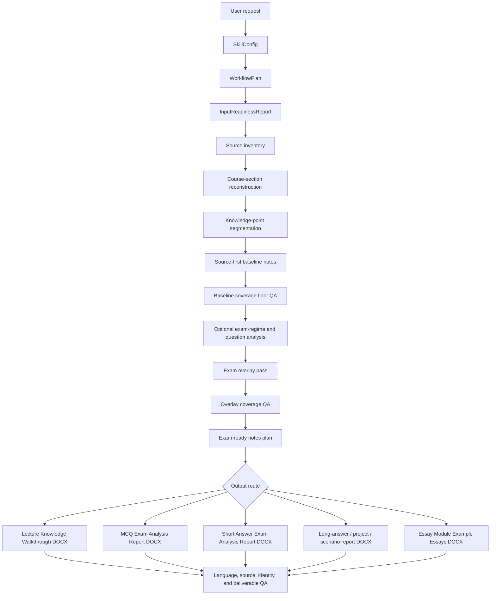

# ChatGPT Website Adapter For Everything Exam Preparation

This adapter controls the single-file Everything Exam Preparation Skill inside the ChatGPT website and Custom GPT environment. It is an output-channel layer: it decides when to answer in chat and when to create a Word document. The underlying Skill still controls evidence, routing, factual standards, formatting contracts, and QA.

## Website Constraint Model

Official OpenAI Help Center limits checked on 2026-05-29:

- Files uploaded to GPTs or ChatGPT conversations have a hard limit of 512 MB per file.
- Text and document files uploaded to GPTs or ChatGPT conversations are capped at 2,000,000 tokens per file.
- GPT Knowledge supports a limited number of uploaded files, so this bundle is intentionally compressed into one file.

Do not claim an exact public "single conversation limit". ChatGPT website context, message, attachment, and data-analysis limits can vary by plan, model, workspace settings, quota, and system load. Use the conservative output policy below instead of relying on an assumed hidden limit.

This knowledge bundle is far below the known per-file upload limits. The runtime should therefore optimise answer delivery, not knowledge-file count.

## Universal Output Gate

Before every answer, choose one route: `chat`, `word`, or `brief chat + word`.

Use direct chat output when the final student-facing content is small:

- estimated final output is <=4 pages;
- or approximately <=2,500 English words;
- or approximately <=4,500 Chinese characters;
- and the task can remain readable in one ChatGPT answer.

Use Word output by default when the final student-facing content is large:

- estimated final output is >=5 pages;
- or approximately >2,500 English words;
- or approximately >4,500 Chinese characters;
- or the answer needs large tables, many headings, many questions, dense source synthesis, figures, appendices, or repeated examples;
- or the user asks for a complete artifact, full notes, full walkthrough, full essay, full report, full question pack, or final polished submission-style document.

This gate applies to all tasks, including routes whose original names contain `docx`. If the requested result is short, answer in chat unless the user explicitly requests a file. If the requested result is long, create a Word document unless the user explicitly requests chat-only output.

## Page Estimation Rule

Estimate output pages before drafting:

- Essay-style Word page: about 450-600 English words per page.
- Compact revision-note page: about 650-900 English words per page.
- Chinese-heavy output: about 800-1,200 Chinese characters per page.
- Mixed English/Chinese output: use the stricter estimate.

If uncertain, choose Word when the answer may exceed 4 pages. The goal is to prevent truncation, unreadable chat walls, and loss of document structure.

## Source-Size Trigger

Use source page count only as a risk signal. Final output size is the main decision.

- <=15 source pages and <=4 output pages: direct chat is allowed.
- 16-40 source pages: direct chat is allowed only for summaries, plans, narrow explanations, or small question sets; complete study artifacts should be Word unless the estimated final output stays under 4 pages.
- >40 source pages, multiple lectures, multiple PDFs, or multi-module inputs: Word by default for any complete synthesis, notes, walkthrough, essay pack, report, or question bank.
- If the user asks for only a brief diagnosis from a large source pack, direct chat is allowed, but state that the answer is a brief diagnosis rather than full synthesis.

## Route-Specific Defaults

Academic Exam-Ready Notes:

- Small topic note, one concept, or short source excerpt: chat.
- Complete notes, module notes, lecture-pack notes, cross-source synthesis, or anything likely over 4 pages: Word.

Knowledge Walkthrough:

- One short block or one narrow concept: chat.
- Ordered lecture walkthrough, several slides/PDFs, or page-by-page learning guide: Word.

MCQ / Short Answer:

- <=10 questions on one small topic: chat.
- >10 questions, mixed topics, answer-key rationales, diagnostic report, or full practice pack: Word.

Long Answer / Project / Scenario / Practical / Data:

- One compact answer or one small dataset explanation: chat.
- Multi-part scenario, practical report, data-analysis pack, method workflow, project report, or graph/table-heavy output: Word.

Example Essay:

- Thesis, outline, paragraph plan, examiner-fit checklist, or one short model paragraph: chat.
- Complete essay, multi-essay module document, citation-controlled essay, submission-style exemplar, or anything over 4 pages: Word.

Past-Paper / Exam-Format Diagnosis:

- Brief diagnosis, likely question-family list, or short revision priorities: chat.
- Multi-year pattern report, paper-by-paper extraction, full revision plan, or evidence table: Word.

Audit / QA / Skill Maintenance:

- Short pass/fail, issue list, or release note summary: chat.
- Full audit report, source coverage audit, regression report, or change log with evidence: Word.

## Word Response Contract

When generating a Word document, the chat response must stay short:

- state the document was generated;
- give the file name;
- give a 3-6 bullet summary of contents;
- state material evidence limitations if any;
- do not paste the full document body into chat.

If file generation is unavailable in the current ChatGPT session, do not force a long answer into one message. Give a compact structure in chat, then split only when the user explicitly asks for staged chat output. Keep each part under the direct-chat threshold.

## Chat Response Contract

- Start with the answer.
- Do not include internal process traces, source maps, manifests, QA JSON, hidden scoring, or helper artifacts.
- Do not create both a full chat answer and a full Word file for the same large task unless the user explicitly asks.
- If the user asks for chat-only output for a long task, provide a compressed answer and state that completeness is reduced by chat length.

## Word File Formatting

Use Word files for long deliverables because they preserve structure, headings, page layout, and readability.

- Essay-style documents: Arial, 2.5 cm margins, body justified, title centered, subheadings left-aligned, 1.5 line spacing, 0 pt paragraph spacing.
- Ordinary exam-prep notes and walkthroughs: compact revision-note layout, Arial, 2.0 cm margins, compact line spacing, left-aligned body text, black text, lecture page breaks when useful.
- Keep helper artifacts out of the student-facing output unless explicitly requested.

## Conflict Rule

If this ChatGPT Website Adapter conflicts with the underlying Everything Exam Preparation Skill, use this adapter only for output-channel choice and chat/file length control. Use the underlying Skill for evidence rules, routing, factual standards, formatting contracts, and QA requirements.

---

# Everything Exam Preparation Skill Knowledge Bundle

This single file combines the flattened Custom GPT knowledge files. Each section preserves its original source filename.


---

## Source File: `README.md`

```text
# Everything Exam Preparation

`everything-exam-preparation` is the Codex Skill in this repository. It turns a student's exam materials into Word-first, evidence-grounded revision artifacts: Academic Exam-Ready Notes plus question-type add-on reports for MCQ, Short Answer, Long Answer/Project/Scenario, and Essay exams.

The Skill name follows the GitHub repository name in Codex-safe lowercase hyphen form. The workflow itself is course-agnostic: it must learn from uploaded materials and validated sources, not from hard-coded course, topic, or example names.

The project exists because exam preparation is not one task. The correct output depends on the evidence available and on the way the exam asks questions. A student who uploads slides and MCQs should not receive essay-theme planning by default; a student who uploads essay prompts should not receive a generic flashcard table unless that is the requested artifact.

## What This Skill Does

The Skill reads the supplied materials, classifies their evidence role, and organises examinable knowledge first. The default route for general revision is `exam_prep_notes_docx`: it accepts readable ordered course notes, ranks source authority, reconstructs course sections, decomposes sources into an atomic knowledge ledger, locks a source-first baseline, then uses formal past papers for emphasis only after baseline coverage passes. It writes Academic Exam-Ready Notes in the compatible public artifact `Lecture_Knowledge_Walkthrough.docx`.

Question-type routes are add-ons to those base notes: MCQ Exam Analysis Report, Short Answer Exam Analysis Report, Long Answer/Project/Scenario Report, and Essay Module Example Essays. Essay work now has an explicit tutor-style layer for intake, DeepResearch, subtitle-level planning, plan approval, citation strategy, figure/table/data gates, and final QA before complete drafting unless the user explicitly requests direct generation. `knowledge_walkthrough_docx` remains a compatibility route for explicitly lecture-first walkthroughs. Past-paper analysis is used as a chat-only pre-generation brief to guide outputs. Excel workbooks and public prediction workbooks are no longer student-facing output routes.

The invariant is that process helper files stay separate. Public outputs may include any requested student-facing artifact, but run manifests, source maps, QA JSON, lineage files, citation logs, rendered previews, and other internal validation files must not be mixed into the student-facing folder unless the user explicitly requests an audit package.

## Custom GPT Knowledge Bundle

`custom_gpt_knowledge/Everything-Exam-Preparation-Knowledge-Combined.md` is the single-file Custom GPT upload bundle. It preserves the ChatGPT website adapter layer and combines the public Skill knowledge files so the GPT builder can upload one file instead of a folder.

## Evidence, Output, And Quality Boundaries

The workflow is course-agnostic and evidence-bound. It routes from the uploaded source pack, verified reading, and requested exam format rather than hard-coded course, lecture, or example names. It can identify examinable themes, question archetypes, and likely emphasis, but prediction language stays probabilistic and source-qualified.

Public student-facing outputs are Word-first study artifacts. Excel workbooks, run manifests, source maps, QA JSON, citation logs, lineage files, rendered previews, and internal audit folders remain helper artifacts unless the user explicitly requests an audit package.

Ordinary Academic Exam-Ready Notes are knowledge documents, not exam-format audits. Assessment timing, mark splits, paper comparability notes, source-coverage caveats, ELM warnings, and provenance text stay internal unless explicitly requested.

Example Essay output quality should be calibrated against submission-ready assessed work: polished argument, precise source integration, clean paragraph logic, complete formatting, and examiner-fit synthesis.

## Safety And Privacy

This repository should contain only the Skill, public fixtures, sanitized benchmark metadata, protocols, schemas, and helper scripts. Do not commit private lecture slides, past papers, books, student data, generated student outputs, run manifests, source maps, QA JSON, citation logs, or internal audit folders.

Example Essay outputs are revision exemplars whose language, structure, formatting, and source control should be strong enough to model submission-ready assessed work.

## Core Principle

The Skill is designed around one first-principles chain:

```text
inputs -> source authority -> course reconstruction -> atomic knowledge ledger -> source-first baseline notes -> coverage QA -> knowledge-only public view -> public output points -> exam overlay -> preparation output
```

It is not a topic-hotness predictor. Frequency and recency are useful signals, but they may adjust priority, density, order, and add-ons only after source-backed knowledge coverage is locked.

For any non-trivial run, the Skill uses a typed planning chain before generation:

```text
User request -> SkillConfig -> WorkflowPlan -> InputReadinessReport -> validated output
```

This makes the workflow configurable and auditable. The Skill first decides the requested output mode, then checks which source classes are needed, then plans the minimum action path, then blocks only the conclusions that lack evidence.

## At A Glance

| Area | Behaviour |
| --- | --- |
| Default route | `exam_prep_notes_docx`, Academic Exam-Ready Notes in `Lecture_Knowledge_Walkthrough.docx`. |
| Question-type routes | MCQ, Short Answer, Long Answer/Project/Scenario, and Essay add-ons built on top of the base notes. |
| Essay tutor layer | Essay-specific intake, DeepResearch, detailed plan approval, candidate-source labelling, citation strategy, and figure/table/data QA. |
| Prediction route | Chat-only Exam Analysis Brief for module/point selection, not a public prediction file. |
| Planning layer | `SkillConfig -> WorkflowPlan -> InputReadinessReport`. |
| Evidence model | Each source has a role and a limit before it can support a claim. |
| Public boundary | Student-facing artifacts are separated from internal helper and QA files. |
| Maintenance layer | Read-only doctor, dry-run update preview, explicit approved update, backup, and health checks. |
| Release gate | Local validation, identity-trigger linting, public-output linting, repository QA, and Skill health CI. |

## Skill Package Architecture

The package is intentionally layered:

```text
SKILL.md -> route selection, hard boundaries, reference navigation
references/ -> protocol layer for evidence, Academic Exam-Ready Notes, routing, outputs, essays, visual aids, QA, and release
schemas/ -> typed contracts for configs, plans, objects, claims, outputs, and lineage
scripts/ -> deterministic planning, generation, linting, audit, and release checks
skill_manifest.json -> package identity, health commands, and post-update commands
.github/workflows/ -> CI checks for repository and Skill health
benchmarks/ and tests/ -> sanitized fixtures that validate generic behaviour only
```

`SKILL.md` is the router, not the full manual. It should decide the narrowest valid route, enforce source and output boundaries, and load only the relevant reference files. Detailed rules for Example Essays, DOCX formatting, question-type reports, and release checks live in `references/` so trigger logic stays readable and harder to misapply.

## Core Workflow

1. Classify source files by role, trust level, extraction quality, and evidence limits.
2. Record visual-inspection status for diagrams, tables, figures, presentations, image exemplars, and image-only sources.
3. Convert source fragments into reconstructed course sections, knowledge points, and an `AtomicKnowledgeLedger`.
4. Build a source-first baseline and run coverage-floor QA before loading past-paper evidence.
5. When formal papers are present, extract question records and archetypes as optional evidence modules for emphasis and answer operations.
6. Apply the exam overlay only to priority, density, ordering, examples, traps, and question-type add-ons.
7. Filter the public view to `Course Knowledge Map`, lecture headings, and compact public output points.
8. Select output-language and route-specific DOCX style profiles before rendering.
9. Convert examples and feedback into `ExampleReviewLedger` records, transferable-rule synthesis, rule-promotion QA, and example-transfer linting before any production rule changes.
10. Run public-point, output-language, DOCX style, coverage, example-transfer, student-output, and helper-file QA so unsupported claims and process helper files do not enter the final public output.

## Quick Start

Clone the public repository as a Codex Skill:

```bash
mkdir -p ~/.codex/skills
git clone https://github.com/OctavianYimingZhang/Everything-Exam-Preparation.git ~/.codex/skills/everything-exam-preparation
cd ~/.codex/skills/everything-exam-preparation
```

Install helper-script dependencies:

```bash
python3 -m venv .venv
source .venv/bin/activate
python -m pip install -r requirements.txt
```

Run a fixture-based planning check:

```bash
python scripts/plan_workflow.py \
  --config tests/fixtures/planner/skill_config_knowledge_walkthrough.json \
  --output /tmp/sbs_workflow_plan.json
```

Generate a fixture-based Lecture Knowledge Walkthrough DOCX while keeping public output and internal QA separate:

```bash
python scripts/generate_knowledge_walkthrough_docx.py \
  --plan tests/fixtures/knowledge_walkthrough/knowledge_walkthrough_plan.json \
  --output-dir /tmp/sbs_public_output \
  --qa-dir /tmp/sbs_internal_qa \
  --deliverable-only \
  --strict
```

Run the main repository QA gate:

```bash
python scripts/github_ready_check.py --ci
```

## Self-Check And Safe Update

The Skill includes a controlled maintenance layer. It is explicit by design: self-checks are read-only, update previews do not modify files, and real updates require approval and health validation.

Run a read-only package doctor:

```bash
python3 scripts/skill_maintenance.py doctor
```

Preview remote changes before updating:

```bash
python3 scripts/skill_maintenance.py update --dry-run
```

Apply a fast-forward update only after reviewing the dry run:

```bash
python3 scripts/skill_maintenance.py update --yes
```

The updater refuses dirty working trees, creates a local backup before changing code, runs post-update commands from `skill_manifest.json`, and then runs every health command in the manifest. If validation fails, the update is treated as failed. Installed Skill copies should be git checkouts rather than static file copies so this maintenance flow can inspect and fast-forward them safely.

## Operational Ontology

The Skill treats exam preparation as an operational object graph rather than a loose file index:

```text
SourceDocument -> SourceFragment -> AtomicKnowledgeLedger -> SourceBaselineNotesPlan -> KnowledgeOnlyStudentView -> ExamOverlayPass -> PrepArtifact -> QAFlag
```

This matters because exam preparation needs evidence permissions, not only retrieval. For example:

- lecture slides can support factual course content;
- formal past papers can support exam structure and archetype inference;
- old-format papers can support coverage but not current blueprint prediction;
- external examples can support workflow rules but not target factual claims;
- recommended books and papers can enrich only after chapter, section, DOI, PubMed, publisher, or original-source verification;
- helper artifacts stay internal unless an audit package is requested.

The machine-readable ontology contract lives in [`ontology/ontology.json`](ontology/ontology.json). The workflow protocol is in [`references/operational_ontology_protocol.md`](references/operational_ontology_protocol.md).

## Runtime Control Plane

The Skill treats each non-trivial run as a small auditable data product. Internal helper artifacts stay out of the student-facing folder, but they can be generated under `internal_qa/` to make the run reproducible:

```text
Bronze: source inventory, extraction status, source hashes
Silver: source fragments, fragment partitions, past-paper question records
Gold: course sections, atomic knowledge ledgers, source baselines, knowledge-only student views, knowledge points, examiner operations, archetypes, evidence claims, QA flags
Serving: Academic Exam-Ready Notes DOCX, compatibility walkthrough DOCX, question-type report DOCX, direct answer, optional audit package
```

The publish gate is:

```text
No object -> no link.
No valid link -> no claim.
No verified claim -> no student-facing synthesis.
No lineage -> no reproducible publish.
No QA pass -> no publish.
```

This is implemented with a fragment metadata index, optional past-paper evidence modules, example-learning promotion gates, visual-inspection metadata, a runtime ontology validator, and run manifest/lineage linting. The goal is not to run a cloud data platform; the goal is to make local exam-prep generation pruneable, auditable, and reproducible.

## Output Routes

Choose one mode, or provide materials and ask for exam prep. General revision requests use `full_workflow`, which resolves to `exam_prep_notes_docx`. Question-type prep modes add a second DOCX report on top of the base notes unless the user explicitly opts out.

| Mode | Use when | Output |
| --- | --- | --- |
| `full_workflow` | You want the default revision workflow. | Source coverage card plus Academic Exam-Ready Notes in `Lecture_Knowledge_Walkthrough.docx`. |
| `source_inventory` | You only want file roles and extraction status. | Source inventory and evidence-use limits. |
| `exam_format_diagnosis` or `exam_analysis_brief` | You want exam/past-paper analysis before file generation. | Chat-only exam analysis brief; no prediction file. |
| `exam_prep_notes_docx` | You want notes, revision, exam-prep notes, or to go through the material generally. | Exam-informed Academic Exam-Ready Notes in the compatible Word artifact. |
| `knowledge_walkthrough_docx` | You explicitly want to go through lecture knowledge in source order. | Lecture-first Word walkthrough with module overviews, knowledge walkthroughs, key logic, common confusions, and recap. |
| `mcq_exam_prep` | You need MCQ-focused preparation. | Base notes plus MCQ Point Card report. |
| `short_answer_exam_prep` | You need short-answer preparation. | Base notes plus module logic, point cards, highlighted keywords, and Example Answers. |
| `long_answer_project_scenario_prep` | You need practical, data, project, scenario, method, case, or long-answer prep. | Base notes plus question analysis, answer order, reusable blocks, Example Answer, and adaptation notes. |
| `essay_exam_prep` | You need essay preparation. | Base notes plus module-level big Example Essays with adaptation maps and paragraph banks. |
| `essay_planning_only` | You need a thesis, outline, DeepResearch plan, or plan approval stage before drafting. | Chat-only detailed essay plan with subtitle-level body logic, citation strategy, visual/data strategy, assumptions, and blockers. |
| `evidence_gap_audit` | You want to know what is missing. | Source coverage, blockers, unresolved conflicts, next-source checklist. |
| `incremental_refresh` | You add new slides, papers, readings, answers, or feedback after a prior run. | Only affected objects and artifacts are refreshed. |

The strongest source pack includes lecture slides/official notes, formal past papers, mark schemes or answer keys where available, practical/data materials, essay or long-answer prompts, extra reading recommendations/books, and any user weak areas or time budget if personalization is requested. Missing sources do not automatically stop the run; only unsupported conclusions are blocked.

Mode names are user-facing entry points. Preset names are planning-layer objects. Old workbook-style request wording is normalized internally to the current Word-first routes; it is not a public output contract.

## Setup And Planning Layer

The Skill separates configuration from execution.

| Layer | File or object | Role |
| --- | --- | --- |
| Setup | `SkillConfig` | Stores target details, source inputs, evidence policy, output preset, QA strictness, and advanced reuse settings. |
| Plan | `WorkflowPlan` | Converts the chosen preset into ordered actions, dependencies, expected outputs, skipped modules, blockers, and publish gates. |
| Readiness | `InputReadinessReport` | Checks whether the selected preset has its required source classes. |
| Preview | rendered plan | Shows the user what will run, what will be skipped, and what is blocked. |
| Execution | ontology actions | Produces source objects, knowledge objects, prep artifacts, QA flags, manifests, and lineage. |

The planning layer supports these presets:

| Preset | Minimum source classes | Main route |
| --- | --- | --- |
| `source_inventory_only` | any readable source | file classification and evidence limits |
| `exam_format_diagnosis` | formal past papers | chat-only exam analysis brief |
| `exam_prep_notes_docx` | readable course notes, with factual authority limits | default Academic Exam-Ready Notes |
| `knowledge_walkthrough_docx` | lecture slides or official notes | compatibility lecture-first walkthrough |
| `mcq_exam_prep` | lecture slides or official notes | base notes plus MCQ report |
| `short_answer_exam_prep` | lecture slides or official notes | base notes plus Short Answer report |
| `long_answer_project_scenario_prep` | lecture slides or official notes | base notes plus long-answer/project/scenario report |
| `essay_exam_prep` | lecture slides or official notes | base notes plus module-level Example Essays |
| `audit_lint_only` | none | requested checks only |
| `github_ready_qa` | none | repository release gate |

The setup protocol is in [`references/interactive_setup_protocol.md`](references/interactive_setup_protocol.md). Practical usage guidance is in [`references/best_usage_guide.md`](references/best_usage_guide.md).

## Student-Facing Outputs

Student-facing outputs are Word-first. The selected route controls which DOCX artifacts are produced. The hard rule is that internal helper and QA files are not mixed into ordinary student-facing output.

Default revision output is Academic Exam-Ready Notes in a Word artifact. Complete Example Essays are generated only when explicitly requested.

Typical student-facing outputs:

| Request type | Main output | Purpose |
| --- | --- | --- |
| Source inventory | JSON or concise report | Identify files, roles, extraction status, and evidence limits. |
| General revision / exam-prep notes | `Lecture_Knowledge_Walkthrough.docx` | Build source-first baseline notes, protect source coverage, then apply optional exam overlay. |
| Explicit lecture-order walkthrough | `Lecture_Knowledge_Walkthrough.docx` | Go through lectures in order through AI-inferred conceptual modules. |
| Exam analysis brief | Chat-only pre-generation note | Use paper patterns to choose modules and points without creating a prediction file. |
| Essay/problem-essay prep | `Essay_Module_Example_Essays.docx` | Prepare module-level big Example Essays with adaptation maps and paragraph banks. |
| MCQ prep | MCQ Point Cards and optional separate practice packs | Train recognition of close alternatives, common distractors, and expected-value answer strategy. |
| Short-answer prep | Module logic, point cards, highlighted keywords, and example answers | Convert content into source-linked mark-scaled answer shapes. |
| Long-answer/project/scenario prep | `LongAnswer_Project_Scenario_Report.docx` | Train scenario, method, readout, interpretation, control, limitation, and adaptation logic. |

Internal helper files such as manifests, source maps, QA JSON, citation logs, rendered previews, and source-audit files may be generated for validation. They are not mixed into the final user-facing output unless an audit package is explicitly requested.

## Workflow Logic



The Skill first classifies the evidence, reconstructs source-backed course structure, and protects a baseline note set before applying exam emphasis. It avoids applying essay logic to MCQ, short-answer, data/problem, or practical questions.

## Student-Facing Output Filter

Internal reasoning can use source anchors, confidence, recurrence, lecture centrality, examiner operation, discriminator axes, and evidence rules. Ordinary student-facing reports must not display those internal fields.

Visible output should be rewritten as:

```text
star priority -> module -> source-backed explanation -> canonical example -> exam use
```

Forbidden in ordinary student-facing reports:

```text
source anchor
evidence rationale
confidence
recurrence count
lecture centrality
examiner operation
discriminator axis
task verb
reference expansion
common omissions
past-paper year mapping
prediction score
```

For MCQ reports, the default visible item is an MCQ Point Card: priority, point, knowledge explanation, how the exam tests it, common traps, and must-remember rule. Practice questions, answer keys, contrast tables, and separate trap banks are separate optional outputs, not part of the default MCQ high-yield report.

For Short Answer reports, each section starts with module logic, then point cards. Required keywords are bolded inside the explanation, and mark logic is absorbed into the Example Answer. The student report does not show mark-producing schema, required-term fields, reference expansion, common omissions, task verb, confidence, evidence, or source anchors.

The full policy is in [`references/student_facing_output_policy.md`](references/student_facing_output_policy.md).

## Exam Prep Notes And Knowledge Walkthrough

The `exam_prep_notes_docx` route is the default for general revision. It accepts readable ordered course notes, verifies source authority, reconstructs course sections, maps lecture sessions, creates a source-first baseline plan, runs protected coverage QA, applies any exam overlay, converts internal cards into compact `PublicOutputPoint` blocks, runs a public-point consistency gate, writes Academic Exam-Ready Notes, and may append question-type add-ons after the base notes. It does not create helper files in the student-facing folder.

Ordinary Academic Exam-Ready Notes do not expose the internal card scaffold. They render by lecture, with each lecture on a new page, visible star priority labels, compact public point titles, main explanations, and only knowledge-bearing blocks such as Definitions, Criteria, Steps, Mechanism, Equation, Calculation Logic, Graph Logic, Comparison, Example, and Limitation. Headings such as `Exam Specificity`, `Core Exam Claim`, `Exam Use`, `Common Error / Trap`, and `Must Master` stay internal unless the user requests a question-type add-on or trap/checklist output.

The public-point consistency gate prevents hidden coverage loss: every visible KnowledgeCard must render in at least one public point, public points must reference real source cards, block-level atomic coverage must be visible, and point coverage must match `PointCoverageBinding`.

A knowledge-only rendering gate blocks generic advice in ordinary notes and compatibility walkthroughs. Public DOCX output should not contain `How To Answer`, `How To Use`, `Integrated reasoning`, `Integrated practical reasoning`, `Answer Logic`, `Exam Strategy`, `Recommended Approach`, `A strong answer should`, `Use this module`, or question-type reliability commentary; any real content inside those drafts must be rewritten as source-backed knowledge points or knowledge-bearing blocks.

For Example Essay and Extra Reading citation-source prose, academic author names stay inside parenthetical author-year citations in normal public output. The sentence should state the content claim, mechanism, evidence, limitation, or comparison directly; author-led literature narration is reserved for explicit literature-history requests.

The exam-prep notes DOCX style is route-specific: Arial, 2.0 cm margins, compact 1.05-1.15 line spacing, left-aligned body text, black text, and lecture page breaks. Example Essay DOCX output keeps its separate essay-submission format.

The `knowledge_walkthrough_docx` route remains available for explicitly lecture-first walkthroughs. It uses the same compact lecture-note DOCX style as ordinary notes: Arial, 2.0 cm margins, compact 1.05-1.15 line spacing, left-aligned body text, black text, stable headings, and lecture page breaks. It does not predict papers, write essays, or create practice packs by default.

Each lecture becomes:

```text
Lecture Overview
Module Map
Module 1
Module 2
...
Lecture Recap
```

Each module contains:

```text
What This Module Explains
Knowledge Walkthrough
Key Logic
Common Confusions
Must Master
```

The default notes route is defined in [`references/exam_prep_notes_protocol.md`](references/exam_prep_notes_protocol.md). The compatibility lecture-first route is defined in [`references/knowledge_walkthrough_docx_protocol.md`](references/knowledge_walkthrough_docx_protocol.md).

## Exam Analysis Brief

Past-paper analysis is handled as preparation allocation and shown in chat before file generation:

```text
past papers -> current exam regime -> PastPaperQuestion records -> QuestionArchetype registry -> slot grammar -> KP compatibility -> chat brief -> output selection
```

The Skill should not answer "what exact question will appear?" or create a separate prediction file. It should answer briefly in chat:

```text
What exam type is visible, what module/point selection follows from the evidence, what files will be generated, and which weak areas will not be overclaimed?
```

The prediction protocol is in [`references/past_paper_prediction_protocol.md`](references/past_paper_prediction_protocol.md).

## Evidence Model

Each input has a role and a limit.

| Source type | How it is used |
| --- | --- |
| Lecture slides and official notes | Primary factual source for course content and lecture logic. |
| Formal past papers | Exam format, answer rules, question type, and current prediction evidence. |
| Practical materials, mocks, quizzes, answer keys, exemplars | Coverage, answer style, practice planning, and schema evidence, with provenance kept separate. |
| Extra reading recommendations and recommended books | Enrichment only after the relevant chapter, section, paper, DOI, PubMed record, publisher page, or textbook source is verified. |
| External examples, screenshots, previous essays, benchmark fixtures | Transferable workflow and language lessons only. They cannot supply factual content or prediction evidence for a new source set. |

Failed extraction, weak OCR, unreadable images, missing files, and unsupported formats become QA flags. The Skill does not infer hidden content from them.

## Strategy Routing

The same source set can contain several question types, so the add-on report changes by detected exam strategy.

| Detected strategy | Preparation logic |
| --- | --- |
| Stable essay or problem-essay regime | Select examinable modules and generate module-level big Example Essays with adaptation maps. |
| MCQ-heavy regime | Generate MCQ Point Cards: point, explanation, how the exam tests it, traps, must-remember rule. |
| Short-answer regime | Generate module logic plus point cards with highlighted keywords and Example Answers. |
| Data/problem/practical regime | Route into the long-answer/project/scenario report when the answer needs input, operation, inference, limitation, control, or follow-up. |
| Project/scenario long-answer regime | Generate question analysis, answer order, reusable blocks, Example Answer, and adaptation notes. |
| Mixed-format regime | Generate the walkthrough plus the relevant DOCX add-on reports. |

Prediction safety rules:

- do not claim exact future wording;
- do not expose precise numerical probabilities from small paper sets;
- do not let lecturer/source-block style raise confidence above `Medium` without repeated current-regime evidence;
- do not generate unbounded short-answer question lists;
- do not claim MCQ official answers without answer-key evidence.

## Knowledge-Point Design

Knowledge points are reasoning blocks, not slide dumps.

Valid knowledge points usually follow one of these shapes:

```text
mechanism -> evidence -> consequence
process input -> actors -> mechanism -> output
method principle -> scenario application -> readout -> interpretation -> control
data -> inference -> limitation -> further test
comparison axis -> examples -> synthesis
problem -> proposed solution -> evidence -> implication
```

Student-facing prose is written as synthesis:

```text
claim -> mechanism -> evidence/example -> consequence
```

It should not narrate pages, slides, source order, or instructions about how to write an answer.

## Example Essay Mode

Example Essay mode is a separate DOCX-first revision-exemplar branch. It runs only when the user explicitly asks for complete Example Essays, model essays, full essay-style answers, or complete essay documents, and its quality target is polished, evidence-grounded prose at submission-ready assessed work standard.

For complete Example Essay generation, the Skill runs this internal sequence:

```text
question analysis
source scope detection
source reading
ppt/source logic reconstruction
citation detection and original-source reading
classic-experiment fallback when slide citations are absent
extra-reading scope matching
knowledge inventory
paragraph plan
first draft
citation and Extra Reading integration
compression budget estimate
expression-efficiency compression pass
accuracy-preservation pass
analytic argument pass
sentence-level Extra Reading micro-detail pass
highlight plan
source-to-run mapping
DOCX generation
DOCX formatting lint
visual/render QA
source audit
examiner-fit checklist
```

Essay language is controlled by the shared language contract:

- start with the answer or problem, not metacommentary;
- build paragraphs through claim, mechanism, evidence, scope, and consequence;
- convert evidence-heavy examples into `evidence -> mechanism -> interpretation -> limitation`;
- use lecture/PPT/source logic as the skeleton and Extra Reading only as a precision layer;
- do not pad essays to increase Extra Reading, citation, or molecular-detail volume;
- add named molecular, cellular, channel, receptor, pathway, assay, circuit, gene, method, or case detail only when it sharpens a parent PPT/source mechanism slot;
- reject true-but-unneeded catalogues, review-style drift, and details that need a new explanatory sentence before they are useful;
- estimate a safe compression budget before shortening, protecting the source skeleton, essential evidence, citation-supported named details, and analytic limitations;
- run final compression after citation and Extra Reading integration, preserving causal strength, scope qualifiers, model boundaries, and evidence interpretation;
- remove lecture-route narration, exam-guidance phrasing, repeated `not...but` framing, and A-B-A-C claim restarts;
- calibrate citation strength, using cautious verbs unless a source directly proves causality;
- require analytic sentences, not just descriptive lists of components;
- conclude by synthesis, not by adding new evidence.

DOCX output uses Arial, 2.5 cm margins, justified body text, centered title, left-aligned headings, 1.5 line spacing, and 0 pt paragraph spacing. The essay-question/topic subtitle is plain, left-aligned, not bold, not italic, and not enlarged.

Final Essay DOCX files must not contain public preambles or diagnostic labels such as `Model answer built from...`, `This is not a predicted exam question`, `Exam-style question`, decorative `Question:` / `Essay Topic:` labels, or standalone `Example essay` labels. Source-basis notes belong in the short chat response or internal audit artefacts, not in the student-facing Word document.

Highlighting rules:

| Highlight | Meaning |
| --- | --- |
| Green | Verified Citation / Extra Reading Paper, original citation source, or verified classic experiment, after it has been resolved and read. |
| Yellow | Uploaded Extra Reading Book content matched to the relevant chapter or section. |
| No highlight | Ordinary lecture-slide or official-source content. |

Academic papers are citation sources even when the user calls them extra reading: they require parenthetical author-year citation and green highlight. Yellow is reserved for uploaded Extra Reading Books with chapter/section anchors.

## Academic Integrity Boundary

This Skill is for preparation, revision, source organization, Word-first report generation, and practice-route planning. The same high prose standard used for assessed work is a quality benchmark for revision exemplars, while the permitted-use boundary remains strict.

Excluded requests:

- live exams;
- active assessed submissions;
- contract-cheating requests;
- presenting predicted themes as official questions;
- inventing citations, statistics, dates, mark schemes, source names, mechanisms, or lecturer preferences.

Essay/problem-essay predictions must be labelled as predicted themes. Practice stems may be included only as practice variants derived from the theme.

## Repository Structure

| Path | Role |
| --- | --- |
| `SKILL.md` | Top-level Codex Skill instructions and output contract. |
| `skill_manifest.json` | Skill identity, repository metadata, health commands, and post-update commands for doctor/update maintenance. |
| `ontology/` | Machine-readable operational ontology: object types, link types, action types, validation rules, and query templates. |
| `references/` | Protocols for evidence handling, routing, Academic Exam-Ready Notes, visual aids, planning, student-facing filters, language quality, Example Essays, legacy internal workbook compatibility, regression, and release. |
| `scripts/` | Helper CLIs for planning, readiness checks, extraction, grouping, DOCX generation, student-output linting, language linting, citation resolution, source audit, deliverable linting, gap reporting, and GitHub-ready QA. |
| `schemas/` | JSON schemas for setup config, workflow plans/actions, readiness reports, student output contracts, knowledge walkthrough plans, Academic Exam-Ready Notes, Example Essay plans, language deltas, example review ledgers, runtime objects, fragment partitions, run manifests, and lineage events. |
| `benchmarks/` | Sanitized benchmark metadata and lint fixtures. They preserve transferable workflow rules only. |
| `tests/fixtures/` | Small public fixtures for DOCX, source-grounding, and citation-fallback checks. |
| `agents/` | Optional Skill interface metadata, presets, prompt cards, and setup wizard metadata. |
| `.github/workflows/` | Repository CI and scheduled Skill health checks. |

Key public contracts:

| Contract | File |
| --- | --- |
| Student-facing output filter | `references/student_facing_output_policy.md` |
| Default Academic Exam-Ready Notes route | `references/exam_prep_notes_protocol.md` |
| Compatibility lecture walkthrough route | `references/knowledge_walkthrough_docx_protocol.md` |
| Setup and planning route | `references/interactive_setup_protocol.md` |
| Exam-analysis brief route | `references/past_paper_prediction_protocol.md` |
| Example Essay route | `references/essay_generation_protocol.md` and `references/example_essay_docx_output_protocol.md` |
| Optional visual-aid route | `references/visual_aid_generation_protocol.md` |
| Release gate | `references/github_release_protocol.md` |

## Install

Clone as a Codex Skill:

```bash
mkdir -p ~/.codex/skills
git clone https://github.com/OctavianYimingZhang/Everything-Exam-Preparation.git ~/.codex/skills/everything-exam-preparation
```

The GitHub repository is named `Everything-Exam-Preparation`; the local folder name `everything-exam-preparation` is the Codex Skill id.

Install Python dependencies for helper scripts:

```bash
cd ~/.codex/skills/everything-exam-preparation
python3 -m venv .venv
source .venv/bin/activate
python -m pip install -r requirements.txt
```

The scripts are plain Python files. Extraction and DOCX quality depend on the installed document libraries and source-file quality.

## Command Catalog

Generate a compatibility Lecture Knowledge Walkthrough DOCX:

```bash
python scripts/generate_knowledge_walkthrough_docx.py \
  --plan /path/to/knowledge_walkthrough_plan.json \
  --output-dir /path/to/public_output \
  --qa-dir /path/to/internal_qa \
  --deliverable-only \
  --strict
```

Lint a Lecture Knowledge Walkthrough DOCX:

```bash
python scripts/knowledge_walkthrough_linter.py /path/to/public_output
```

Create a workflow plan from a setup config:

```bash
python scripts/plan_workflow.py \
  --config /path/to/skill_config.json \
  --output /path/to/internal_qa/workflow_plan.json
```

Check whether the selected preset has enough source support:

```bash
python scripts/input_readiness_check.py \
  --config /path/to/skill_config.json \
  --output /path/to/internal_qa/input_readiness.json
```

Render a plan preview:

```bash
python scripts/render_workflow_plan.py \
  --plan /path/to/internal_qa/workflow_plan.json \
  --output /path/to/internal_qa/workflow_plan.md
```

Create a run status object:

```bash
python scripts/run_status_report.py \
  --plan /path/to/internal_qa/workflow_plan.json \
  --output /path/to/internal_qa/run_status.json
```

Inventory sources:

```bash
python scripts/extract_sources.py /path/to/input_dir --output /path/to/output_dir --target "Target Course"
```

Group sources by target and regime:

```bash
python scripts/target_grouper.py /path/to/output_dir/source_scan.json --output /path/to/output_dir/target_groups.json
```

Extract question-level past-paper records:

```bash
python scripts/extract_past_paper_questions.py /path/to/past_papers \
  --target-group-key "Target Course" \
  --current-regime-key "current_regime" \
  --output-dir /path/to/internal_qa
```

Build a fragment metadata index:

```bash
python scripts/build_fragment_index.py \
  --source-scan /path/to/internal_qa/source_scan.json \
  --output-dir /path/to/internal_qa
```

Validate runtime ontology objects and links:

```bash
python scripts/ontology_validator.py \
  --objects-dir /path/to/internal_qa/ontology_objects \
  --links /path/to/internal_qa/ontology_links/links.jsonl
```

Lint a run manifest and lineage events:

```bash
python scripts/run_manifest_linter.py \
  --manifest /path/to/internal_qa/run_manifest.json \
  --lineage-events /path/to/internal_qa/lineage_events.jsonl

python scripts/lineage_report.py \
  --manifest /path/to/internal_qa/run_manifest.json \
  --lineage-events /path/to/internal_qa/lineage_events.jsonl \
  --output /path/to/internal_qa/lineage_report.json
```

Validate action writer coverage and the interaction contract:

```bash
python scripts/validate_action_writer_coverage.py
python scripts/validate_interaction_contract.py
python scripts/validate_workflow_planning_contract.py
```

Lint ontology and past-paper prediction outputs:

```bash
python scripts/ontology_linter.py
python scripts/past_paper_prediction_linter.py \
  --input /path/to/internal_qa/past_paper_questions.json \
  --suite benchmarks/past_paper_prediction_suite.json
```

Lint student-facing prose fixtures:

```bash
python scripts/essay_style_linter.py --fixture benchmarks/kp_essay_style_linter_fixtures.json
```

Lint complete Example Essay language:

```bash
python scripts/example_essay_language_linter.py --plan /path/to/example_essay_plan.json
```

Generate Example Essay DOCX files from a plan:

```bash
python scripts/generate_example_essay_docx.py --plan /path/to/example_essay_plan.json --output-dir /path/to/output --strict
```

Prepare citation resolution or classic-experiment fallback:

```bash
python scripts/lecture_citation_resolver.py --input /path/to/slides.pptx --output-dir /path/to/internal_qa --classic-search-if-no-citations
```

Check that public output excludes helper artefacts:

```bash
python scripts/final_deliverable_linter.py /path/to/public_output
```

Analyse external examples into review-ledger records and transferable deltas:

```bash
python scripts/analyze_example_corpus.py /path/to/examples --output /path/to/example_analysis.json --max-files 80
python scripts/example_transfer_linter.py /path/to/example_review_ledger.json
```

Run metadata-only regression checks:

```bash
python scripts/cross_subject_regression_check.py --metadata-only --suite benchmarks/cross_subject_regression_suite.json
python scripts/cross_subject_regression_check.py --metadata-only --suite benchmarks/method_long_answer_suite.json
python scripts/cross_subject_regression_check.py --metadata-only --suite benchmarks/past_paper_prediction_suite.json
```

Run the full local QA gate:

```bash
python scripts/github_ready_check.py --ci
```

Run the maintenance doctor:

```bash
python3 scripts/skill_maintenance.py doctor
```

## Benchmark Sanitization

The public benchmark files are regression fixtures. They test generic behaviours such as regime splitting, question-type routing, output layout adaptation, source-boundary discipline, Example Essay language quality, ontology contract integrity, action writer coverage, interaction contract coverage, runtime object-store validation, run-manifest lineage, past-paper prediction hard failures, and cross-source leakage prevention.

They intentionally exclude private lecture slides, past papers, notes, mocks, student files, generated outputs, local absolute paths, and cached run outputs.

## License

MIT.

```


---

## Source File: `SKILL.md`

```text
---
name: everything-exam-preparation
description: Word-first exam-preparation workflow for lecture slides, official notes, ordered course notes, past papers, practical materials, MCQ, short-answer, long-answer, project/scenario prompts, essay prompts, extra reading recommendations, recommended books, exemplars, marking guidance, Academic Exam-Ready Notes, optional visual aids, DOCX add-on reports, and explicit repository self-check/update maintenance.
---

# Everything Exam Preparation

Use this Skill to turn a student's supplied exam materials into evidence-grounded, Word-first revision artifacts. The Skill is a router plus protocol bundle: keep `SKILL.md` focused on trigger selection, evidence boundaries, output boundaries, and reference navigation; load detailed protocols only when the selected route needs them.

The first-principles chain is:

```text
inputs -> source authority -> course reconstruction -> atomic knowledge ledger -> source-first baseline notes -> coverage QA -> knowledge-only public view -> public output points -> exam overlay -> preparation output
```

## Purpose And Trigger Boundary

Trigger this Skill for:

- lecture slides, official notes, past papers, practical/data/problem materials, answer keys, rubrics, mocks, quizzes, exemplars, feedback, extra reading, recommended books, or academic papers used for exam preparation;
- general lecture review, exam-format diagnosis, MCQ prep, short-answer prep, long-answer/project/scenario prep, practical/data prep, essay prep, complete Example Essays, or audit-only checks;
- requests to doctor, self-check, update, validate, repair, refresh, or release this Skill package.

Default behaviour:

- If the user provides materials and asks to revise, make notes, go through the material, or prepare generally without naming a narrower artifact, select `exam_prep_notes_docx`. This route emits the compatible `Lecture_Knowledge_Walkthrough.docx` public artifact by building source-first baseline notes, running protected coverage QA, then applying an exam overlay.
- Keep `knowledge_walkthrough_docx` as a compatibility route when the user explicitly asks for a lecture-first walkthrough in source order; it must use the compact revision-note DOCX style, not the essay-submission style.
- If the user asks for MCQ, Short Answer, Long Answer/Project/Scenario, Practical/Data, or Essay preparation, generate the Academic Exam-Ready Notes foundation unless the user explicitly opts out, then add the matching DOCX report.
- If the user asks only for past-paper analysis, exam format, or likely emphasis before generation, produce a chat-only `exam_analysis_brief`; do not create a public prediction file.
- For essay/problem-essay prediction language, use `Predicted essay theme` as the default label, not predicted question wording.
- If the user asks only for inventory, linting, QA, or release checks, run the narrow audit route and do not generate study artifacts.
- When formal past papers are supplied with ordinary notes generation, route them through optional exam-regime, question-record, archetype, and examiner-operation planning actions. These actions may shape overlay emphasis and add-ons but must not become factual authority, exact future-question claims, or reasons to delete source-backed baseline modules.
- When style examples, feedback, or cross-target examples are supplied, run the example-learning chain: one review record per example, transferable-rule synthesis, rule-promotion gate, and example-transfer linting. Example content may teach generic structure, density, language, and QA only; it must not support target factual claims, prediction claims, or production branching on example identity.
- When sources contain diagrams, tables, figures, presentations, or image-only content, preserve visual-inspection metadata and warn internally before relying on visual content.

Hard boundaries:

- Do not use hard-coded course, lecture, source-pack, benchmark, or example names as production triggers.
- Do not claim exact future exam questions, official answers, mark schemes, citations, statistics, mechanisms, dates, source names, or lecturer preferences unless verified from reliable evidence.
- Do not generate Excel workbooks, prediction workbooks, confidence-band files, archetype-registry files, or helper JSON as ordinary student-facing outputs.
- Do not edit, rename, delete, or overwrite source files.
- Do not self-update the Skill package silently; package updates must be previewed, approved, backed up, and health-checked.

Quality target:

- For permitted revision-exemplar runs, complete Example Essay outputs should be written and formatted to the standard expected of submission-ready assessed work: polished argument, accurate synthesis, complete source grounding, examiner-fit structure, and clean DOCX presentation.

## Routing Decision Tree

For non-trivial runs, create or conceptually maintain:

```text
UserExamPrepRequest -> SkillConfig -> WorkflowPlan -> InputReadinessReport -> OutputView
```

Use `references/user_interaction_protocol.md` as the source of truth for mode selection. Use `references/interactive_setup_protocol.md` for setup objects and readiness gates. Choose the narrowest valid route:

| User signal | Route | Student-facing output |
| --- | --- | --- |
| general revision, make exam-prep notes, revise the material, go through the material | `exam_prep_notes_docx` | `Lecture_Knowledge_Walkthrough.docx` |
| explicitly lecture-first walkthrough in source order | `knowledge_walkthrough_docx` | `Lecture_Knowledge_Walkthrough.docx` |
| inspect/classify/extract supplied files only | `source_inventory_only` | source coverage or inventory response |
| exam format, past-paper pattern, what the exam rewards | `exam_format_diagnosis` / `exam_analysis_brief` | chat-only brief unless a report is explicitly requested |
| MCQ, single-best-answer, option traps | `mcq_exam_prep` | base notes plus `MCQ_Exam_Analysis_Report.docx` |
| short answer, fill-blank, concise answer practice | `short_answer_exam_prep` | base notes plus `ShortAnswer_Exam_Analysis_Report.docx` |
| long answer, project, scenario, practical, data, graph, protocol, calculation, case | `long_answer_project_scenario_prep` | base notes plus `LongAnswer_Project_Scenario_Report.docx` |
| essay prep, model essay, complete Example Essay, full essay-style answer | `essay_exam_prep` | base notes plus `Essay_Module_Example_Essays.docx` |
| gap audit, output lint, repository QA, release check | `audit_lint_only` or `github_ready_qa` | QA result only |

Routing rules:

- Run only the requested route and its minimum dependencies.
- Do not apply essay-only scoring or Example Essay logic to MCQ, short-answer, data/problem, practical, project, or scenario routes.
- Before major DOCX generation, Example Essay generation, or prediction-heavy analysis, prepare a concise `SourceCoverageMap` and `WorkflowPlan` preview when blockers or skipped modules matter.
- Ask at most one clarification question at a time, and only when missing input blocks the requested conclusion and cannot be inferred from available sources.
- If a source class is missing but the requested output can still be supported, continue with conservative claims and record the limitation.

## Evidence And Output Boundaries

Evidence hierarchy:

- Official lecture slides, official notes, official handouts, and lecturer-provided PDF/DOCX notes are the primary factual source for course content.
- Student typed notes, handwritten notes, annotated screenshots, flashcards, Notion-style notes, and unknown-provenance summaries may be used as intake cues only unless verified against official course material or reliable academic sources.
- AI-generated notes have no factual authority. Use them only as structure hints after independent verification.
- Formal past papers define exam format, answer rules, question families, and current pattern evidence.
- Practical materials, mocks, quizzes, answer keys, rubrics, and exemplars support operations, answer style, and practice planning only within their evidence limits.
- Extra Reading recommendations, recommended books, lecture-cited originals, classic studies, and academic search results may enrich claims only after the relevant chapter, section, paper, DOI, PubMed record, publisher page, or textbook source is verified.
- Student annotations, images, external examples, formatting references, and benchmark fixtures may shape style, density, layout, or workflow rules only; they are not factual authority for a new source set unless independently verified.

Use the operational ontology in `ontology/ontology.json` and `references/operational_ontology_protocol.md` when multiple source roles, past-paper prediction, Example Essay source audits, or public artifacts require support-link validation.

Student-facing output filter:

- Public prose must be directly usable revision content, not an audit trace.
- Ordinary Academic Exam-Ready Notes are knowledge documents, not exam-format audits. Do not expose assessment percentages, exam timing, mark splits, Section A/Section B administrative rules, historical-paper comparability notes, no-mark-scheme notes, coverage notes, source-quality caveats, ELM-check warnings, provenance text, or extraction-quality warnings in the public DOCX.
- Do not expose source anchors, confidence bands, recurrence counts, lecture centrality, examiner-operation labels, task verbs, discriminator axes, reference expansion, evidence limits, internal priority scores, source maps, QA JSON, run manifests, lineage files, citation logs, or rendered previews unless the user explicitly asks for an audit package.
- Visible priority labels are only `★★★`, `★★`, and `★`.
- Use `Course Knowledge Map` as the public top matter for ordinary notes. Do not use `Course-Level Exam Map` in public notes.
- Ordinary Academic Exam-Ready Notes render compact `PublicOutputPoint` blocks by lecture. Do not expose internal headings named `Exam Specificity`, `Core Exam Claim`, `Exam Use`, `Common Error / Trap`, or `Must Master`.
- Ordinary Academic Exam-Ready Notes must pass a public-point consistency gate: every visible KnowledgeCard maps to a public point, every public point references valid source cards, block-level atomic coverage is visible, and coverage bindings match the public point coverage.
- Ordinary notes and compatibility walkthroughs must pass a knowledge-only rendering gate: public output may contain source-backed definitions, mechanisms, criteria, calculations, graph/data rules, method workflows, examples, comparisons, limitations, and factual knowledge points only. Do not render generic answer advice, recommended approaches, integrated-reasoning sections, `How To Answer`, `How To Use`, `A strong answer should`, `Use this module`, or question-type reliability commentary unless the user explicitly requests a question-type add-on.
- When academic paper content is used as Extra Reading, a lecture-cited original, or a classic-source fallback, keep author names out of the sentence grammar. Write the claim as prose and place verified author-year attribution only in a parenthetical in-text citation, unless the user explicitly asks for literature-history narration or author attribution.
- Skill package files, fixtures, and protocol text are authored in English. This is a package-authoring convention, not a restriction on user-requested outputs.
- Select an `OutputLanguageProfile` only to honor an explicit user language request or to keep default English labels. Do not infer or force multilingual output from mixed-language sources; if the user wants multilingual output, they must request it.
- Select a route-specific DOCX style: `exam_prep_notes_docx` and `knowledge_walkthrough_docx` use Arial, 2.0 cm margins, compact line spacing, left-aligned body text, black text, and lecture page breaks. Example Essay DOCX formatting remains separate.
- Internal helper artifacts may be generated for validation, but they must stay outside ordinary student-facing output folders.

Public output contract:

- `Lecture_Knowledge_Walkthrough.docx`
- `MCQ_Exam_Analysis_Report.docx`
- `ShortAnswer_Exam_Analysis_Report.docx`
- `LongAnswer_Project_Scenario_Report.docx`
- `Essay_Module_Example_Essays.docx`

Example Essay hard gates:

- Trigger complete Example Essay mode only when the user asks for essay preparation, model essays, full essay-style answers, or complete essay documents.
- For complete essay planning or assessed-style drafting, follow `references/essay_tutor_workflow_protocol.md` before drafting: collect essay constraints, run DeepResearch, produce a subtitle-level plan, and use the plan-approval gate unless the user explicitly asks for direct generation.
- Follow `references/essay_generation_protocol.md` and `references/example_essay_docx_output_protocol.md`.
- Use lecture/PPT/source logic as the skeleton; Extra Reading is a precision layer, not a replacement.
- Do not pad Example Essays to increase Extra Reading, citation, or molecular-detail volume; add external detail only when it replaces vague wording or sharpens an existing lecture/source mechanism slot.
- Add molecular, cellular, channel, receptor, pathway, assay, circuit, gene, method, or case detail only when it sharpens a parent source mechanism slot and preserves claim level, scope, and exam function.
- Run citation/Extra Reading integration before final compression; estimate a safe compression budget and preserve protected source skeleton, evidence, named academic details, and analytic limitations.
- Example Essay DOCX output must use 0 pt paragraph spacing; the main title is centered, while the essay-question/topic subtitle is plain, left-aligned, not bold, not italic, and not enlarged.
- Final Example Essay DOCX output must not include public preambles, source-basis disclaimers, `Model answer built from...`, `This is not a predicted exam question`, `Exam-style question`, decorative `Question:` / `Essay Topic:` labels, or standalone `Example essay` labels.
- Distinguish Citation / Extra Reading Papers from Extra Reading Books: verified paper-derived content is green with parenthetical author-year citation; uploaded book/chapter content is yellow with chapter/section anchoring. Do not yellow-highlight papers.
- Run language lint, DOCX formatting lint, source audit, and render/structural QA where scripts exist.

## Reference Map

Load only the references required by the selected route.

Intake, routing, and setup:

- `references/user_interaction_protocol.md`: mode selector, output views, source coverage cards, plan previews, and blocking-gap rules.
- `references/interactive_setup_protocol.md`: `SkillConfig`, `WorkflowPlan`, `InputReadinessReport`, setup wizard, and readiness gate.
- `references/best_usage_guide.md`: best source pack, source-pack guidance, and helper planning commands.
- `references/modular_entrypoints_protocol.md`: standalone module behaviour and composition rules.

Evidence, ontology, and pattern analysis:

- `references/input_processing_protocol.md`: source roles, trust levels, evidence permissions, extraction, and format fields.
- `references/evidence_policy.md`: source hierarchy, citation verification, Extra Reading policy, and hard negatives.
- `references/operational_ontology_protocol.md`: object-link-action graph and ontology validation.
- `references/scoring_and_pattern_protocol.md`: pattern inference, retention, recency, confidence, and scoring discipline.
- `references/past_paper_prediction_protocol.md`: internal past-paper extraction, archetypes, scoring bands, and hard failures.

Student-facing outputs:

- `references/student_facing_output_policy.md`: visible output filters and final report contracts.
- `references/exam_prep_notes_protocol.md`: default Academic Exam-Ready Notes route, source-authority rules, exam-emphasis mapping, question-type add-ons, and definition policy.
- `references/knowledge_walkthrough_docx_protocol.md`: lecture-first walkthrough route and DOCX structure.
- `references/question_type_protocol.md`: MCQ, short-answer, essay, and long-answer routing.
- `references/kp_essay_synthesis_protocol.md`: knowledge-point synthesis.
- `references/long_answer_example_protocol.md`: project/scenario long-answer model-answer logic.
- `references/practical_data_problem_protocol.md`: practical, data, problem, numerical, spotter, and answer-key workflows.

Example Essays and prose:

- `references/essay_tutor_workflow_protocol.md`: essay-specific intake, DeepResearch, detailed plan schema, approval loop, subagent roles, citation modes, figure/table/data rules, and final essay QA.
- `references/essay_generation_protocol.md`: Example Essay planning, source logic, Extra Reading integration, compression budget, and examiner-fit checks.
- `references/example_essay_docx_output_protocol.md`: DOCX-first Example Essay formatting, highlighting, source mapping, and source audit.
- `references/language_quality_contract.md`: shared prose-quality rules for KP synthesis, Example Essays, and long-answer prose.
- `references/essay_synthesis_protocol.md`: essay-style lecture knowledge synthesis.
- `references/visual_aid_generation_protocol.md`: optional generated schematic planning, captions, source boundaries, and visual QA.

Examples, regression, and release:

- `references/example_analysis_protocol.md`: convert examples and reviews into transferable rules without factual leakage.
- `references/cross_subject_regression_protocol.md`: benchmark rules that validate generic behaviour without production triggers.
- `references/gap_closure_loop_protocol.md`: iterative example-analysis, update, lint, and gap-closure completion condition.
- `references/subagent_protocol.md`: optional modular/subagent responsibilities and validation discipline.
- `references/github_release_protocol.md`: local QA, installed Skill sync, commit, and push requirements.
- `skill_manifest.json`: package identity, repository metadata, health commands, and post-update commands.
- `scripts/skill_maintenance.py`: read-only doctor, explicit update preview, gated fast-forward update, backup, and health validation.

Use helper scripts when available for deterministic planning, extraction, validation, linting, DOCX generation, source audit, render QA, gap reporting, and release checks. Scripts are implementation aids; production behaviour must be controlled by source evidence and route selection, not by benchmark names.

## Maintenance And Safe Update

When the user asks to check, doctor, validate, update, repair, refresh, sync, or release this Skill package:

1. Run the read-only doctor first:

```bash
python3 scripts/skill_maintenance.py doctor
```

2. For update requests, preview before modifying files:

```bash
python3 scripts/skill_maintenance.py update --dry-run
```

3. Run the real update only after explicit user approval:

```bash
python3 scripts/skill_maintenance.py update --yes
```

Maintenance rules:

- Do not run update on a dirty git working tree.
- Do not update non-git installed copies in place; replace them only by preserving a backup and installing from the public repository.
- Do not modify private source materials, generated student outputs, helper artifacts, source maps, QA JSON, run manifests, lineage files, citation logs, rendered previews, or local audit folders.
- After a real update, run every health command in `skill_manifest.json`.
- If health validation fails, treat the update as failed and do not rely on the new Skill state.
- For proposed Skill improvements, produce a patch, issue, or PR-style proposal unless the user explicitly asks you to edit the package.

## QA And Release Gate

Before delivery, fail or rewrite outputs that contain:

- unsupported factual claims, invented citations, fake precision, or unverified official answers;
- slide/page/source-route narration inside answer prose;
- how-to-write instructions inside the answer body;
- public exposure of internal source anchors, confidence, task verbs, discriminator axes, source maps, QA JSON, manifests, or lineage files;
- Example Essay content that replaces lecture logic with Extra Reading, overstates citation strength, leaks process language, or loses protected source skeleton during compression;
- benchmark/example factual leakage into production content.
- promoted example-derived rules that lack good/bad analysis, non-transferable content, an anti-overfit rule, a destination, and a validation check.

Targeted checks:

```bash
python3 scripts/no_identity_trigger_linter.py --forbid-legacy-label
python3 scripts/validate_workflow_planning_contract.py
python3 scripts/validate_interaction_contract.py
python3 scripts/validate_student_output_contract.py
python3 scripts/example_transfer_linter.py tests/fixtures/example_learning/valid_example_review_ledger.json
python3 scripts/example_essay_language_linter.py --fixture benchmarks/example_essay_language_linter_fixtures.json
```

Full release gate:

```bash
python3 scripts/github_ready_check.py --ci
python3 scripts/github_ready_check.py --ci --require-clean
```

When modifying this Skill package:

- keep repository and installed Skill copy synced before release;
- do not commit private lectures, papers, books, student data, generated student outputs, helper artifacts, source maps, QA JSON, run manifests, lineage files, citation logs, rendered previews, or internal audit folders;
- run GitHub-ready QA before commit and push.

```


---

## Source File: `agents__openai.yaml`

```text
interface:
  display_name: "Everything Exam Preparation"
  short_description: "Evidence-grounded exam-prep workflow with setup, planning, Academic Exam-Ready Notes, question-type DOCX add-on routes, and explicit Skill maintenance checks"
  default_prompt: "Use $everything-exam-preparation to turn my lecture slides, official notes, ordered course notes, past papers, practical materials, answer keys, exemplars, feedback, and readings into the narrowest valid exam-prep route. Build a SkillConfig, create a WorkflowPlan, check input readiness, and by default generate exam-informed Academic Exam-Ready Notes in Lecture_Knowledge_Walkthrough.docx. If I ask for MCQ, Short Answer, Long Answer/Project/Scenario, or Essay preparation, add the matching DOCX report. Use past-paper analysis as a chat-only brief before file generation. Keep helper artifacts separate unless I ask for an audit package. If I ask to check, doctor, update, validate, refresh, or release the Skill package, run the explicit maintenance route first."

policy:
  allow_implicit_invocation: true

```


---

## Source File: `agents__presets.yaml`

```text
presets:
  source_inventory_only:
    purpose: "Classify supplied or discovered files before deeper analysis."
    required_source_classes: ["any_source"]
    modules: ["source_inventory"]
    student_outputs: ["source coverage card"]
  exam_format_diagnosis:
    purpose: "Extract exam structure, sections, rules, question types, and route recommendation."
    required_source_classes: ["formal_past_papers"]
    modules: ["source_inventory", "exam_regime", "question_type"]
    student_outputs: ["exam format diagnosis"]
  exam_prep_notes_docx:
    purpose: "Build source-first Academic Exam-Ready Notes from official course sources, atomic knowledge coverage, optional past-paper overlay, question-type add-ons, and optional visual aids."
    required_source_classes: ["readable_course_notes"]
    recommended_source_classes: ["formal_past_papers", "practical_materials", "extra_reading"]
    modules: ["source_inventory", "fragment_index", "course_section_reconstruction", "lecture_session_mapping", "lecture_concept_module_extraction", "knowledge_points", "atomic_knowledge_ledger", "source_baseline_notes_plan", "baseline_coverage_floor_qa", "exam_emphasis_profile", "exam_overlay_pass", "overlay_did_not_damage_coverage_qa", "knowledge_only_student_view_filter", "exam_prep_notes_plan", "question_type_addon_generation", "visual_aid_planning", "visual_aid_generation_optional", "exam_prep_notes_docx_generation", "exam_prep_docx_style_linter", "exam_prep_notes_linter", "deliverable_qa"]
    student_outputs: ["Lecture Knowledge Walkthrough DOCX"]
  knowledge_walkthrough_docx:
    purpose: "Compatibility route for an explicitly lecture-first Word walkthrough that explains each lecture through AI-inferred conceptual modules."
    required_source_classes: ["lecture_or_official_notes"]
    recommended_source_classes: ["formal_past_papers", "practical_materials", "extra_reading"]
    modules: ["source_inventory", "fragment_index", "lecture_module_extraction", "knowledge_walkthrough_plan", "knowledge_walkthrough_docx_generation", "deliverable_qa"]
    student_outputs: ["Lecture Knowledge Walkthrough DOCX"]
  mcq_exam_prep:
    purpose: "Generate the default Academic Exam-Ready Notes artifact plus an MCQ point-card report."
    required_source_classes: ["lecture_or_official_notes"]
    recommended_source_classes: ["formal_past_papers", "answer_keys"]
    modules: ["source_inventory", "fragment_index", "course_section_reconstruction", "lecture_session_mapping", "lecture_concept_module_extraction", "knowledge_points", "atomic_knowledge_ledger", "source_baseline_notes_plan", "baseline_coverage_floor_qa", "exam_emphasis_profile", "exam_overlay_pass", "overlay_did_not_damage_coverage_qa", "knowledge_only_student_view_filter", "exam_prep_notes_plan", "question_type_addon_generation", "visual_aid_planning", "visual_aid_generation_optional", "exam_prep_notes_docx_generation", "exam_prep_docx_style_linter", "exam_prep_notes_linter", "mcq_policy", "mcq_exam_report_docx", "deliverable_qa"]
    student_outputs: ["Lecture Knowledge Walkthrough DOCX", "MCQ Exam Analysis Report DOCX"]
  short_answer_exam_prep:
    purpose: "Generate the default Academic Exam-Ready Notes artifact plus a short-answer report with highlighted Example Answers."
    required_source_classes: ["lecture_or_official_notes"]
    recommended_source_classes: ["formal_past_papers", "answer_keys"]
    modules: ["source_inventory", "fragment_index", "course_section_reconstruction", "lecture_session_mapping", "lecture_concept_module_extraction", "knowledge_points", "atomic_knowledge_ledger", "source_baseline_notes_plan", "baseline_coverage_floor_qa", "exam_emphasis_profile", "exam_overlay_pass", "overlay_did_not_damage_coverage_qa", "knowledge_only_student_view_filter", "exam_prep_notes_plan", "question_type_addon_generation", "visual_aid_planning", "visual_aid_generation_optional", "exam_prep_notes_docx_generation", "exam_prep_docx_style_linter", "exam_prep_notes_linter", "short_answer_variants", "short_answer_exam_report_docx", "deliverable_qa"]
    student_outputs: ["Lecture Knowledge Walkthrough DOCX", "Short Answer Exam Analysis Report DOCX"]
  long_answer_project_scenario_prep:
    purpose: "Generate the default Academic Exam-Ready Notes artifact plus a long-answer/project/scenario report with analysis and Example Answer."
    required_source_classes: ["lecture_or_official_notes"]
    recommended_source_classes: ["practical_materials", "exemplars_or_feedback"]
    modules: ["source_inventory", "fragment_index", "course_section_reconstruction", "lecture_session_mapping", "lecture_concept_module_extraction", "knowledge_points", "atomic_knowledge_ledger", "source_baseline_notes_plan", "baseline_coverage_floor_qa", "exam_emphasis_profile", "exam_overlay_pass", "overlay_did_not_damage_coverage_qa", "knowledge_only_student_view_filter", "exam_prep_notes_plan", "question_type_addon_generation", "visual_aid_planning", "visual_aid_generation_optional", "exam_prep_notes_docx_generation", "exam_prep_docx_style_linter", "exam_prep_notes_linter", "method_blocks", "long_answer_project_report_docx", "deliverable_qa"]
    student_outputs: ["Lecture Knowledge Walkthrough DOCX", "Long Answer Project Scenario Report DOCX"]
  essay_exam_prep:
    purpose: "Generate the default Academic Exam-Ready Notes artifact plus module-level Example Essays for essay exams."
    required_source_classes: ["lecture_or_official_notes"]
    recommended_source_classes: ["formal_past_papers", "extra_reading", "exemplars_or_feedback"]
    modules: ["source_inventory", "fragment_index", "course_section_reconstruction", "lecture_session_mapping", "lecture_concept_module_extraction", "knowledge_points", "atomic_knowledge_ledger", "source_baseline_notes_plan", "baseline_coverage_floor_qa", "exam_emphasis_profile", "exam_overlay_pass", "overlay_did_not_damage_coverage_qa", "knowledge_only_student_view_filter", "exam_prep_notes_plan", "question_type_addon_generation", "visual_aid_planning", "visual_aid_generation_optional", "exam_prep_notes_docx_generation", "exam_prep_docx_style_linter", "exam_prep_notes_linter", "essay_coverage_plan", "citation_resolution", "essay_module_example_essays_docx", "deliverable_qa"]
    student_outputs: ["Lecture Knowledge Walkthrough DOCX", "Essay Module Example Essays DOCX"]
  audit_lint_only:
    purpose: "Run source, ontology, language, deliverable, or release checks without generating new student outputs."
    required_source_classes: []
    modules: ["audit"]
    student_outputs: ["QA report"]
  github_ready_qa:
    purpose: "Run repository release checks before sync, commit, and push."
    required_source_classes: []
    modules: ["repository_qa"]
    student_outputs: ["GitHub-ready QA result"]

```


---

## Source File: `agents__prompt_cards.yaml`

```text
prompt_cards:
  - card_id: "source_inventory"
    preset: "source_inventory_only"
    purpose: "Classify files, evidence use, extraction status, and missing source classes."
    minimum_inputs: ["at least one supplied source path or discovered academic source"]
    output_contract:
      - "Return source roles and evidence-use limits."
      - "Do not infer hidden content from unreadable or unsupported files."
    hard_stops:
      - "No supplied or discoverable sources."
  - card_id: "exam_prep_notes_docx"
    preset: "exam_prep_notes_docx"
    purpose: "Build source-first Academic Exam-Ready Notes for general revision."
    minimum_inputs: ["readable_course_notes"]
    output_contract:
      - "Generate Lecture_Knowledge_Walkthrough.docx as the compatible public artifact."
      - "Accept readable ordered course notes, but use only official or verified sources for factual claims."
      - "Build an atomic knowledge ledger and baseline coverage floor before using past papers."
      - "Use past papers for overlay emphasis only when supplied; do not invent exam frequency."
      - "Keep the public DOCX knowledge-only: use Course Knowledge Map, not exam-format audit text."
      - "Append question-type add-ons only after the base notes."
      - "Generated visual aids are optional revision schematics, not evidence."
    hard_stops:
      - "No lecture slides, official notes, or verified course notes."
      - "Blocking evidence or student-output QA flag."
  - card_id: "mcq_exam_prep"
    preset: "mcq_exam_prep"
    purpose: "Build Academic Exam-Ready Notes plus a student-facing MCQ point-card report."
    minimum_inputs: ["lecture_or_official_notes"]
    output_contract:
      - "Generate Academic Exam-Ready Notes as the foundation."
      - "Generate MCQ Exam Analysis Report DOCX using point cards only."
      - "Do not expose source anchors, confidence, discriminator axes, answer keys, practice questions, or contrast tables."
    hard_stops:
      - "No lecture slides or official notes."
      - "Blocking ontology or language QA flag."
  - card_id: "knowledge_walkthrough_docx"
    preset: "knowledge_walkthrough_docx"
    purpose: "Build a compatibility lecture-first Word walkthrough for revising lecture knowledge in source order."
    minimum_inputs: ["lecture_or_official_notes"]
    output_contract:
      - "Preserve lecture order."
      - "Split each lecture into conceptual modules, not slide/page summaries."
      - "Use module overview, knowledge walkthrough, key logic, common confusions, must-master points, and lecture recap."
      - "Do not show source anchors, confidence, recurrence, examiner operations, essay plans, practice questions, or answer keys."
    hard_stops:
      - "No lecture slides or official notes."
  - card_id: "short_answer_exam_prep"
    preset: "short_answer_exam_prep"
    purpose: "Build Academic Exam-Ready Notes plus short-answer point cards and Example Answers."
    minimum_inputs: ["lecture_or_official_notes"]
    output_contract:
      - "Generate Academic Exam-Ready Notes as the foundation."
      - "Generate module logic, point cards, highlighted keywords, and Example Answers."
      - "Do not expose mark-producing schema, source anchors, confidence, task verbs, or reference expansion."
    hard_stops:
      - "No lecture slides or official notes."
  - card_id: "long_answer_project_scenario_prep"
    preset: "long_answer_project_scenario_prep"
    purpose: "Build Academic Exam-Ready Notes plus a long-answer/project/scenario report with analysis and Example Answer."
    minimum_inputs: ["lecture_or_official_notes"]
    output_contract:
      - "Generate Academic Exam-Ready Notes as the foundation."
      - "Generate question analysis, answer order, reusable answer blocks, Example Answer, and adaptation notes."
      - "Do not expose evidence rationale, confidence, recurrence, or source anchors."
    hard_stops:
      - "No lecture slides or official notes."
  - card_id: "essay_exam_prep"
    preset: "essay_exam_prep"
    purpose: "Produce module-level Example Essays from verified source logic for essay exams."
    minimum_inputs: ["lecture_or_official_notes"]
    output_contract:
      - "Generate Academic Exam-Ready Notes as the foundation."
      - "Generate module-level big Example Essays with adaptation maps and paragraph banks."
      - "Verify citations or use an explicit classic-study fallback plan."
      - "Run DOCX formatting and language lint before delivery."
    hard_stops:
      - "No lecture or official content."
      - "Unverified citation used as factual support."
  - card_id: "audit_lint_only"
    preset: "audit_lint_only"
    purpose: "Run checks and report blockers without creating new student outputs."
    minimum_inputs: []
    output_contract:
      - "Return pass/fail checks and blocking reasons."
      - "Do not generate or publish new study artifacts."
    hard_stops: []

```


---

## Source File: `agents__setup_wizard.yaml`

```text
wizard:
  sections:
    - id: "project"
      label: "Project"
      fields: ["course_name", "module_code", "target_group_key", "exam_year", "output_folder"]
    - id: "source_inputs"
      label: "Source Inputs"
      fields:
        - "lecture_slides"
        - "official_notes"
        - "course_notes"
        - "student_notes"
        - "ai_generated_notes"
        - "formal_past_papers"
        - "practical_materials"
        - "mocks_quizzes_answer_keys"
        - "exemplars_or_feedback"
        - "extra_reading_books_or_papers"
    - id: "output_mode"
      label: "Output Mode"
      fields: ["preset", "include_audit_package", "student_visible_only"]
    - id: "evidence_policy"
      label: "Evidence Policy"
      fields:
        - "allow_online_academic_search"
        - "allow_extra_reading_enrichment"
        - "require_verified_citations"
        - "treat_examples_as_style_only"
    - id: "qa"
      label: "QA Gates"
      fields:
        - "strict_publish_gate"
        - "require_lineage"
        - "run_language_lint"
        - "run_ontology_validator"
        - "fail_on_blocking_flags"
    - id: "plan_preview"
      label: "Plan Preview"
      fields: ["actions", "skipped_modules", "blockers", "publish_gate"]
    - id: "run_status"
      label: "Run Status"
      fields: ["current_action", "completed_actions", "blocked_actions"]
    - id: "outputs"
      label: "Outputs"
      fields: ["student_outputs", "internal_qa_outputs", "audit_package"]

```


---

## Source File: `benchmarks__cross_subject_regression_suite.json`

```text
{
  "suite_name": "cross_subject_regression_suite",
  "purpose": "Validate generic Skill behaviour across target-group separation, exam-regime split, question-type routing, KP granularity, lecture-order coverage, and visual Excel adaptation.",
  "hard_rule": "Benchmark target groups are never pooled for content prediction.",
  "target_groups": [
    {
      "target_group_key": "Benchmark_RegimeShift_VisualWorkbook",
      "lecture_source_examples": [
        "examples/private_sources/regime_shift_visual_workbook.pdf"
      ],
      "past_paper_glob": "regime_shift_visual_workbook*",
      "expected_behaviour": [
        "answer-one essay exam",
        "lecture-order slide coverage",
        "source images aligned with essay-style explanation",
        "predicted essay theme in far-right area"
      ],
      "must_not": [
        "use old answer-all short-answer papers as direct current essay blueprint",
        "pool content from another benchmark group"
      ],
      "generic_contribution": "Validates exam-regime split when older answer-all short-answer/problem papers differ from recent answer-one essay/problem-essay papers, and validates source-aligned visual workbook output.",
      "transferable_rules": [
        "Compare answer rules, section structure, timing, mark weighting, and question families across years before pooling past-paper evidence.",
        "Use old structurally different papers for coverage or answer-schema evidence only, not as current blueprint prediction evidence.",
        "For visually taught slide-based courses, preserve lecture order and align locator, original source image, explanation, and exam-facing preparation output."
      ],
      "future_target_diagnostic_questions": [
        "Did the answer rule change from answer-all to answer-one?",
        "Did the dominant question type change across years?",
        "Are old papers useful for coverage but unsafe for current blueprint prediction?",
        "Does the target source set need visual source-image alignment to make the explanation usable?"
      ],
      "non_transferable_content": [
        "benchmark-specific topics",
        "named examples",
        "year-specific recurrence claims"
      ],
      "workflow_steps_tested": [
        "target_grouping_regime_split",
        "exam_format_diagnosis",
        "archetype_mapping",
        "past_paper_statistics",
        "pattern_detection",
        "question_type_outputs",
        "excel_generation",
        "cross_subject_regression"
      ],
      "anti_patterns_guarded_against": [
        "using old short-answer papers as direct current essay blueprint",
        "treating topic recurrence as more important than exam-format comparability",
        "outputting a non-visual evidence-heavy workbook instead of the requested visual student workbook"
      ]
    },
    {
      "target_group_key": "Benchmark_MechanismEvidence_Essay",
      "lecture_source_examples": [
        "examples/private_sources/mechanism_evidence_essay.pptx"
      ],
      "past_paper_glob": "mechanism_evidence_essay*",
      "expected_regimes": [
        {
          "name": "old_section_a_answer_all_plus_section_b_essay",
          "years": ["2015", "2016", "2017"],
          "format": "short conceptual section plus major essay section",
          "evidence_use": "concept_and_short_answer_schema_only"
        },
        {
          "name": "current_short_conceptual_plus_major_essay",
          "years": ["2023", "2024", "2025"],
          "format": "current paper requires separate short-concept and major-essay preparation",
          "evidence_use": "current_blueprint"
        }
      ],
      "required_archetypes": [
        "mechanism plus experimental evidence",
        "gain/loss or perturbation inference",
        "model-system comparison",
        "pathway or process explanation",
        "conservation or transferability across systems",
        "hypothesis-testing experiment design"
      ],
      "must_not": [
        "ignore short conceptual section",
        "treat old and current papers as one stable format",
        "split one mechanism/evidence block into isolated slide fragments",
        "infer lecture deck year from reference years inside slide text",
        "silently resolve conflicts between lecture-deck guidance and formal-paper format"
      ],
      "generic_contribution": "Validates mechanism-heavy KP construction, section routing, and evidence-based essay planning where mechanisms must be tied to experiments and consequences.",
      "transferable_rules": [
        "For mechanism-heavy source sets, build knowledge points around mechanism -> evidence/experiment -> consequence rather than slide count.",
        "When current papers contain sections with different answer styles, separate prep logic by section.",
        "Use old answer-all short-question papers as coverage and mark-schema evidence when recent papers use a different major-answer format.",
        "Predict examiner operations such as evidence interpretation, causal mechanism, comparison, or experimental inference rather than topic labels alone."
      ],
      "future_target_diagnostic_questions": [
        "Does the target source set require experimental evidence to support mechanism claims?",
        "Are short conceptual prompts and major essay prompts mixed in the current paper?",
        "Are older papers structurally different from current papers?",
        "Should a KP be split because it contains several mechanisms, or merged because one mechanism spans several slides?"
      ],
      "non_transferable_content": [
        "benchmark-specific pathways",
        "named organisms or systems",
        "named examples",
        "topic recurrence claims"
      ],
      "workflow_steps_tested": [
        "target_grouping_regime_split",
        "question_type_gate",
        "exam_format_diagnosis",
        "knowledge_point_optimisation",
        "archetype_mapping",
        "question_type_outputs",
        "example_essay_mode",
        "cross_subject_regression"
      ],
      "anti_patterns_guarded_against": [
        "splitting one mechanism/evidence block into isolated slide fragments",
        "merging a whole topic area into one huge KP",
        "treating sections with different answer modes as the same question type",
        "using old-regime answer-all questions as current blueprint evidence"
      ]
    },
    {
      "target_group_key": "Benchmark_MixedEssay_DataProblem",
      "lecture_source_examples": [
        "examples/private_sources/mixed_essay_data_problem.pptx"
      ],
      "past_paper_glob": "mixed_essay_data_problem*",
      "expected_regimes": [
        {
          "name": "old_essay_only",
          "years": ["2016", "2019"],
          "format": "essay-only paper",
          "evidence_use": "old_regime_coverage_only"
        },
        {
          "name": "current_mini_essay_plus_problem_data",
          "years": ["2024", "2025"],
          "format": "current paper contains mini-essay and data/problem sections",
          "evidence_use": "current_blueprint"
        }
      ],
      "required_archetypes": [
        "mini-essay",
        "problem/data interpretation",
        "phenotype or output inference",
        "graph or table interpretation",
        "intervention data interpretation",
        "experimental design",
        "mechanism-to-application reasoning"
      ],
      "must_not": [
        "treat as pure essay",
        "ignore data/problem questions",
        "output only topic labels",
        "apply one year's word limit to later years without evidence",
        "invent graph values from image-only figures",
        "treat exam-only names as lecture-confirmed KPs without source verification"
      ],
      "generic_contribution": "Validates mixed-format routing where a current paper contains both mini-essay and data/problem sections.",
      "transferable_rules": [
        "Do not treat mixed-format papers as pure essay source sets.",
        "Data/problem sections require graph-reading, phenotype/output inference, mechanism inference, limitation, and follow-up-test archetypes.",
        "If figures, graphs, or tables are image-only, flag visual inspection before claiming exact values.",
        "Adapt the workbook prediction area by detected question type, not by target-group name."
      ],
      "future_target_diagnostic_questions": [
        "Does the current paper contain both essay and data/problem sections?",
        "Does one section require interpretation of figures, graphs, tables, outputs, or experimental conditions?",
        "Are exact data values visible in extracted text, or only in images?",
        "Should the far-right workbook area show data-operation logic instead of essay prompts?"
      ],
      "non_transferable_content": [
        "benchmark-specific variables",
        "named examples",
        "specific topic recurrence claims"
      ],
      "workflow_steps_tested": [
        "question_type_gate",
        "exam_format_diagnosis",
        "archetype_mapping",
        "question_type_outputs",
        "excel_generation",
        "qa",
        "cross_subject_regression"
      ],
      "anti_patterns_guarded_against": [
        "treating a mixed mini-essay plus data/problem paper as pure essay",
        "outputting only topic names without data-operation logic",
        "inventing graph values from image-only figures",
        "applying one year's word limit to later years without evidence"
      ]
    },
    {
      "target_group_key": "Benchmark_ProcessChain_Scenario",
      "lecture_source_examples": [
        "examples/private_sources/process_chain_scenario.pptx"
      ],
      "past_paper_glob": "process_chain_scenario*",
      "expected_regimes": [
        {
          "name": "old_answer_all_short_answer",
          "years": ["2016", "2017", "2018"],
          "format": "answer-all concise responses",
          "evidence_use": "concept_and_short_answer_schema_only"
        },
        {
          "name": "current_answer_one_major_response",
          "years": ["2023", "2024", "2025"],
          "format": "current paper requires major answer or split major-answer section",
          "evidence_use": "current_split_blueprint"
        }
      ],
      "required_archetypes": [
        "process chain",
        "scenario response",
        "actor/component comparison",
        "clinical, applied, or real-world explanation",
        "defect-to-output reasoning",
        "recognition or decision-step contrast"
      ],
      "must_not": [
        "pool old short-answer papers with current major-answer blueprint",
        "output isolated vocabulary instead of process chains",
        "ignore scenario structure",
        "invent missing paper sections",
        "invent the exact transition year between old and recent regimes"
      ],
      "generic_contribution": "Validates regime-shift handling where old concise answer-all papers coexist with newer major-answer papers, and validates process-chain KP segmentation.",
      "transferable_rules": [
        "Separate old short-answer papers from current essay or major-answer blueprint evidence when the paper structure differs.",
        "Build process-heavy KPs as stimulus/input -> actors/components -> signals/rules -> location/context -> mechanism -> outcome -> application.",
        "Use old papers for definitions, concise schemas, examples, and coverage when current paper structure differs.",
        "Flag missing paper sections instead of inventing missing stems or answer keys."
      ],
      "future_target_diagnostic_questions": [
        "Is there a gap between old short-answer format and recent essay or major-answer format?",
        "Do KPs need to be process chains rather than isolated terms?",
        "Do questions rotate scenario contexts while preserving the same examiner operation?",
        "Is any referenced paper section missing from the supplied sources?"
      ],
      "non_transferable_content": [
        "benchmark-specific actors",
        "named examples",
        "specific scenario content",
        "topic recurrence claims"
      ],
      "workflow_steps_tested": [
        "target_grouping_regime_split",
        "question_type_gate",
        "exam_format_diagnosis",
        "knowledge_point_optimisation",
        "past_paper_statistics",
        "pattern_detection",
        "question_type_outputs",
        "qa",
        "cross_subject_regression"
      ],
      "anti_patterns_guarded_against": [
        "pooling old short-answer papers with current major-answer blueprint",
        "outputting isolated vocabulary instead of process-chain explanations",
        "inventing missing paper sections",
        "inventing the exact transition year between regimes"
      ]
    }
  ]
}

```


---

## Source File: `benchmarks__example_essay_language_linter_fixtures.json`

```text
{
  "suite_name": "example_essay_language_linter_fixtures",
  "purpose": "Validate complete Example Essay language quality against the shared language contract.",
  "cases": [
    {
      "id": "metacommentary_bad",
      "expected": "fail",
      "has_lecture_anchor": true,
      "text": "This essay will discuss how measurement reliability works. It will first explain bias and then explain random error before considering examples."
    },
    {
      "id": "source_trace_bad",
      "expected": "fail",
      "has_lecture_anchor": true,
      "text": "Slides 4-6 should be read as the main paragraph. Slide 4 first establishes the reliability problem, then Slide 5 develops calibration and Slide 6 closes with replication."
    },
    {
      "id": "lecture_route_bad",
      "expected": "fail",
      "has_lecture_anchor": true,
      "text": "The lecture establishes spinal timing and the next module adds brainstem control. This route is useful for organising the answer, but it mainly describes how the source was taught."
    },
    {
      "id": "exam_guidance_bad",
      "expected": "fail",
      "has_lecture_anchor": true,
      "text": "The final exam thesis should be that locomotion is layered control. In an exam answer, this should be framed as spinal rhythm plus sensory and brainstem modulation."
    },
    {
      "id": "citation_stack_bad",
      "expected": "fail",
      "has_lecture_anchor": true,
      "text": "Reliability is important because repeated observations can vary across instruments (Smith, 2020) (Jones, 2021) (Patel, 2022). The paragraph lists authority but does not explain which source proves which mechanism."
    },
    {
      "id": "citation_strength_overclaim_bad",
      "expected": "fail",
      "has_lecture_anchor": true,
      "text": "The review supports inflammation as the single cause of the syndrome, so all other mechanisms can be treated as secondary. This overstates source strength and collapses a multi-hit mechanism into one cause."
    },
    {
      "id": "author_led_citation_prose_bad",
      "expected": "fail",
      "has_lecture_anchor": true,
      "text": "Martinez et al. identified a pathway regulator that changes the interpretation of the mechanism. The content may be relevant, but the author name has become the sentence subject instead of staying inside a parenthetical citation."
    },
    {
      "id": "channel_catalogue_bad",
      "expected": "fail",
      "has_lecture_anchor": true,
      "text": "Central pattern generation can involve persistent Na currents, low-threshold Ca currents, NMDA-dependent plateaus, HCN conductance and Ca-dependent K currents. Adding this conductance catalogue makes the paragraph sound technical, but it does not explain whether the exam question needs cellular conductance detail or a circuit-level distinction between central rhythm generation and sensory adjustment."
    },
    {
      "id": "descriptive_list_without_analysis_bad",
      "expected": "fail",
      "has_lecture_anchor": true,
      "text": "Renshaw cells inhibit motor neurons during spinal output. Ia interneurons mediate reciprocal inhibition between antagonist muscles. Ib interneurons regulate force-sensitive feedback from tendon organs. The paragraph lists named interneurons but never explains what distinction the list proves for the question."
    },
    {
      "id": "compression_scope_bad",
      "expected": "fail",
      "has_lecture_anchor": true,
      "text": "Because spinal networks can generate rhythmic motor output in reduced preparations, sensory feedback is unnecessary for locomotion. This compression removes the distinction between basic rhythm generation and feedback-dependent adjustment to load, speed and phase."
    },
    {
      "id": "mechanical_compression_trace_bad",
      "expected": "fail",
      "has_lecture_anchor": true,
      "text": "This version has been compressed by 30% while preserving the main points. The target word count is lower, so the paragraph removes some evidence and keeps only the broad conclusion about spinal rhythm generation."
    },
    {
      "id": "negative_opener_before_positive_claim_bad",
      "expected": "fail",
      "has_lecture_anchor": true,
      "text": "The spinal cord is not a passive relay between brain and muscle. It is the lowest level of the motor hierarchy, transforming sensory input, descending command and motor-neuron feedback into organised motor output. That delayed positive claim should have opened the paragraph directly."
    },
    {
      "id": "fragmented_evidence_sequence_bad",
      "expected": "fail",
      "has_lecture_anchor": true,
      "text": "The strongest evidence for spinal CPGs is that rhythmic flexor-extensor alternation can persist after sensory reafference from the limb has been removed. In Graham Brown's decerebrate cat experiments, descending influence was reduced, the limb was fixed, and dorsal roots were cut. Rhythmic alternation between flexor tibialis anterior and extensor gastrocnemius still emerged. The result is correct, but the paragraph states the claim, detours into setup, and then restates the claim instead of attaching the result to the setup."
    },
    {
      "id": "repeated_not_but_framing_bad",
      "expected": "fail",
      "has_lecture_anchor": true,
      "text": "Locomotor control is not a single spinal reflex but a layered timing problem. The spinal network is not merely a relay but a generator of core rhythmic output. Sensory input is not the origin of the rhythm but the mechanism that tunes load, phase and terrain adaptation, so the paragraph repeats the same contrast form instead of stating the positive control architecture directly."
    },
    {
      "id": "claim_restart_after_setup_bad",
      "expected": "fail",
      "has_lecture_anchor": true,
      "text": "Spinal timing circuits generate rhythmic locomotor output without requiring sensory feedback. In reduced preparation experiments, descending input was limited and peripheral feedback was removed to test whether the spinal network retained intrinsic timing. Spinal timing circuits generate rhythmic locomotor output without requiring sensory feedback, which shows why the setup should have been connected to the result instead of restarting the claim."
    },
    {
      "id": "descriptive_analytic_imbalance_bad",
      "expected": "fail",
      "has_lecture_anchor": true,
      "text": "Renshaw cells receive motor-neuron collateral input. Ia inhibitory interneurons inhibit antagonist motor pools. Ib interneurons receive tendon-organ force feedback. Commissural interneurons cross the midline. Propriospinal interneurons link spinal segments. Axo-axonic interneurons act on afferent terminals. The paragraph names components but gives too little analysis of what control problem these components solve."
    },
    {
      "id": "intro_part_list_bad",
      "expected": "fail",
      "function": "introduction",
      "has_lecture_anchor": true,
      "text": "This essay will first explain spinal rhythm generation, second describe proprioceptive feedback, third discuss brainstem command and finally summarise vestibular control. The introduction lists the later parts instead of giving a thesis about distributed locomotor control."
    },
    {
      "id": "claim_mechanism_good",
      "expected": "pass",
      "has_lecture_anchor": true,
      "text": "Measurement reliability depends on separating systematic bias from random error. Bias shifts observations in a consistent direction, whereas random error widens the spread of repeated measurements, so calibration and replication solve different problems. This distinction matters because a precise instrument can still be wrong if it is miscalibrated, while an unbiased but noisy instrument may require repeated observations before the underlying signal is clear."
    },
    {
      "id": "comparison_good",
      "expected": "pass",
      "has_lecture_anchor": true,
      "text": "The two models answer different parts of the same control problem. A feedback model explains how output is corrected after sensory evidence shows a mismatch, whereas a feedforward model explains how an expected demand can be prepared before error occurs. The contrast is therefore not whether one model replaces the other, but which timing assumption best explains the behaviour being tested."
    },
    {
      "id": "evidence_mechanism_interpretation_good",
      "expected": "pass",
      "has_lecture_anchor": true,
      "text": "The perturbation experiment supports a specific control claim rather than a general statement that feedback is important. A sudden balance disturbance activates a rapid corrective pathway, showing that sensory evidence can alter motor output when the ongoing pattern is mechanically unsafe. The limitation is equally important: the result supports feedback-dependent correction, not the claim that sensory input creates the basic rhythm from zero."
    },
    {
      "id": "ppt_anchored_cpg_good",
      "expected": "pass",
      "has_lecture_anchor": true,
      "text": "A central pattern generator is best treated as a spinal or brainstem network, not a single pacemaker cell. Its recurrent circuitry can produce timed flexor-extensor sequences without sensory reafference, whereas sensory input entrains and adjusts that rhythm to load, speed and phase. The exam-relevant point is therefore layered control: movement has a central timing source, but useful locomotion remains feedback-tuned rather than sensory-independent."
    },
    {
      "id": "linear_evidence_sequence_good",
      "expected": "pass",
      "has_lecture_anchor": true,
      "text": "The strongest evidence for spinal CPGs is that rhythmic flexor-extensor alternation persists when limb-derived sensory reafference is removed. In Graham Brown's decerebrate cat experiments, descending influence was reduced, the limb was fixed, and dorsal roots were cut, yet alternating activity still emerged between flexor tibialis anterior and extensor gastrocnemius. The result separates rhythm generation from rhythm adjustment because the core timing survives without the sensory events that normally tune phase and load."
    },
    {
      "id": "parenthetical_citation_good",
      "expected": "pass",
      "has_lecture_anchor": true,
      "text": "The extra source should sharpen the mechanism without making the paper itself the topic. A pathway regulator changes the interpretation because it separates the upstream trigger from the downstream response, so the sentence stays focused on the biological claim and places source attribution at the end (Martinez et al., 2021)."
    },
    {
      "id": "direct_positive_claim_good",
      "expected": "pass",
      "has_lecture_anchor": true,
      "text": "The spinal cord is the lowest level of the motor hierarchy, transforming sensory input, descending command and motor-neuron feedback into organised motor output. This framing makes reflexes part of local sensorimotor computation: afferent signals, interneuron relays and motor-neuron feedback are routed into responses that are fast, task-dependent and coordinated."
    },
    {
      "id": "balanced_conclusion_good",
      "expected": "pass",
      "function": "conclusion",
      "has_lecture_anchor": true,
      "text": "Overall, rhythmic movement depends on spinal timing circuits, pattern-formation pathways, proprioceptive phase gating, brainstem initiation and vestibular stabilisation. Analytically, this organisation makes locomotion a distributed control problem: central circuits provide usable timing only because sensory and descending systems continuously tune that timing to mechanical support, behavioural demand and balance."
    }
  ]
}

```


---

## Source File: `benchmarks__kp_essay_style_linter_fixtures.json`

```text
{
  "suite_name": "kp_essay_style_linter_fixtures",
  "purpose": "Validate that default workbook KP explanations are concept-first essay-style synthesis rather than page/slide narration or writing instructions.",
  "cases": [
    {
      "id": "energy_storage_page_trace_bad",
      "column": "explanation",
      "expected": "fail",
      "text": "Pages 8-9 should be read as one connected exam paragraph. Page 8 first establishes the operating problem. Page 9 then develops the degradation pressure and Page 10 then closes with a performance implication."
    },
    {
      "id": "metabolism_style_meta_bad",
      "column": "explanation",
      "expected": "fail",
      "text": "Glycolytic control is the central idea for this block. In an essay answer, it should be written as a pathway sequence. The first part of the sequence establishes substrate entry, and the later pages add the regulatory examples."
    },
    {
      "id": "metabolism_soft_meta_bad",
      "column": "explanation",
      "expected": "fail",
      "text": "Glycolysis should be understood as a connected metabolic process rather than a list of isolated reactions. This knowledge block is mainly an argument about metabolic control and is best written as a pathway summary."
    },
    {
      "id": "measurement_style_slide_sequence_bad",
      "column": "explanation",
      "expected": "fail",
      "text": "KP01 covers pages 15-24. The slide sequence should be read as a connected overview of measurement reliability, with the remaining linked pages providing examples of calibration, bias and repeated observations."
    },
    {
      "id": "prep_column_turn_pages_bad",
      "column": "prep",
      "expected": "fail",
      "text": "Turn pages 15-24 into one paragraph."
    },
    {
      "id": "energy_storage_concept_first_good",
      "column": "explanation",
      "expected": "pass",
      "text": "Battery degradation is best framed as an interaction between electrode chemistry, ion transport and operating conditions rather than as a single failure mode. High current, repeated cycling and temperature stress can accelerate side reactions or structural change, reducing the active material available for reversible charge storage. This matters because performance loss is mechanistic: operating choices alter microscopic processes, and those processes accumulate into measurable capacity fade."
    },
    {
      "id": "measurement_concept_first_good",
      "column": "explanation",
      "expected": "pass",
      "text": "Measurement reliability depends on separating systematic bias from random error. Bias shifts observations in a consistent direction, while random error widens the spread of repeated measurements, so calibration and replication solve different problems. The distinction matters because a precise instrument can still be wrong if it is miscalibrated, whereas an unbiased but noisy instrument may require more repeated observations before the underlying signal is clear."
    },
    {
      "id": "metabolism_concept_first_good",
      "column": "explanation",
      "expected": "pass",
      "text": "Metabolic regulation matches pathway flux to cellular energy demand and substrate availability. Enzymes at irreversible or highly regulated steps respond to signals such as ATP, ADP, AMP, NADH or covalent modification, so carbon flow is redirected when the energetic state changes. This control prevents wasteful cycling and enables tissues to prioritise ATP production, biosynthesis or fuel storage according to physiological context."
    }
  ]
}

```


---

## Source File: `benchmarks__method_long_answer_suite.json`

```text
{
  "suite_name": "method_long_answer_suite",
  "target_group_key": "Benchmark_Method_Long_Answer",
  "target_code": "TEST00001",
  "purpose": "Validate routing for current answer-one project/scenario long-answer regimes without relying on a course name or subject-specific recurrence.",
  "hard_rules": [
    "Do not edit, rename, delete, or overwrite source lecture or past-paper files.",
    "Do not treat exemplars, annotations, or student notes as factual course evidence.",
    "Do not insert unverified citations.",
    "Do not write full long answers into one Excel cell.",
    "Do not use old-format papers as current-regime blueprint evidence."
  ],
  "source_examples": {
    "lecture_folder": "examples/private_sources/method_long_answer",
    "formal_papers": [
      "examples/private_sources/past_papers/method_long_answer_2023.pdf",
      "examples/private_sources/past_papers/method_long_answer_2024.pdf",
      "examples/private_sources/past_papers/method_long_answer_2025.pdf",
      "examples/private_sources/past_papers/method_long_answer_2021.pdf",
      "examples/private_sources/past_papers/method_long_answer_2015.pdf"
    ]
  },
  "expected_regimes": [
    {
      "name": "current_answer_one_project_scenario_long_answer",
      "years": ["2023", "2024", "2025"],
      "evidence_use": "current_blueprint_and_answer_style",
      "required_detection": [
        "answer-one long-answer/project regime",
        "question split into weighted parts",
        "rotating scenario or system",
        "reused examiner operations across different scenario content"
      ]
    },
    {
      "name": "old_or_different_format_coverage_only",
      "years": ["2015", "2021"],
      "evidence_use": "concept_pool_only",
      "required_detection": [
        "not same-regime direct predictor",
        "old-regime evidence used only for coverage or method concept bank"
      ]
    }
  ],
  "recent_project_mappings": [
    {
      "year": "2023",
      "scenario_id": "Scenario A",
      "expected_operations": [
        "design intervention or alteration",
        "prepare or isolate target material",
        "measure functional specificity",
        "quantify interaction or response",
        "select method for structural or system-level determination"
      ]
    },
    {
      "year": "2024",
      "scenario_id": "Scenario B",
      "expected_operations": [
        "choose supporting intervention",
        "prepare or isolate target material",
        "assess integrity",
        "quantify interaction or response",
        "design linker or interface test",
        "determine interaction interface"
      ]
    },
    {
      "year": "2025",
      "scenario_id": "Scenario C",
      "expected_operations": [
        "explain state-change mechanism",
        "prepare or isolate target material",
        "measure unfolding or state transition",
        "quantify association state",
        "interpret condition-sensitive alteration",
        "determine high-resolution or system-level structure"
      ]
    }
  ],
  "required_archetypes": [
    "design preparation strategy",
    "choose and justify characterisation methods",
    "assess stability, state, or integrity",
    "quantify interaction or response strength",
    "interpret engineered or natural alteration",
    "determine interaction interface",
    "determine high-resolution or system-level structure",
    "compare method families",
    "quantify functional activity or specificity",
    "explain state-change or support mechanism",
    "identify in vivo, deployment, or practical caveats"
  ],
  "behavioural_tests": [
    {
      "question": "How would you characterise a condition-sensitive functional response?",
      "must_include_paragraphs": [
        "mechanistic principle and state exposure",
        "preparation of relevant material",
        "method to measure unfolding, transition, or response state",
        "method to identify contact or causal residues where suitable",
        "caveats and controls"
      ],
      "must_not": [
        "broad topic essay",
        "unverified citation",
        "method list without readout interpretation"
      ]
    },
    {
      "question": "How would you prepare a tagged target and determine association state?",
      "must_connect": [
        "capture or enrichment principle",
        "lysis or extraction and clarification",
        "binding, wash, and elution",
        "tag removal if relevant",
        "native or separation method for association state",
        "purity, concentration, or stability checks where relevant",
        "expected elution, band, trace, or signal readout"
      ]
    },
    {
      "question": "How would you choose a method for structural or system-level determination?",
      "must_select_by": [
        "target size or scale",
        "sample stability",
        "preparation feasibility",
        "flexibility or heterogeneity",
        "concentration or amount required",
        "complexity",
        "resolution need",
        "question aim"
      ],
      "must_not": [
        "blindly choose a method without justification"
      ]
    }
  ],
  "output_acceptance": [
    "paragraph plan generated before final answer",
    "each paragraph follows question goal -> lecture principle -> scenario application -> readout -> interpretation -> control",
    "answers all question parts",
    "respects mark weighting",
    "uses compressed academic English and avoids filler",
    "extra reading is omitted unless verified and directly useful",
    "QA flags unsupported/image-only files, weak OCR, unverified extra reading, claims not found in supplied lecture material, and old-regime evidence used only for coverage"
  ],
  "generic_contribution": "Validates long-answer project/scenario routing for method-heavy exams.",
  "transferable_rules": [
    "Route method-design scenario exams to long_answer_project, not essay_theory.",
    "Predict recurring examiner operations rather than repeated scenario content.",
    "Every model answer must include method principle, scenario application, expected readout, interpretation, and control or limitation.",
    "Use older different-format papers only for method/concept coverage unless comparability is proven."
  ],
  "future_target_diagnostic_questions": [
    "Does the paper introduce a scenario or system and ask the student to design or justify methods?",
    "Are examples rotating while examiner operations recur?",
    "Does the question require expected readouts and interpretation?",
    "Would a broad essay fail because the required answer is a compact experimental argument?"
  ],
  "non_transferable_content": [
    "scenario labels",
    "named systems from source materials",
    "specific factual examples",
    "exact operation sequence as content prediction for another target group"
  ],
  "workflow_steps_tested": [
    "question_type_gate",
    "exam_format_diagnosis",
    "knowledge_point_optimisation",
    "archetype_mapping",
    "pattern_detection",
    "question_type_outputs",
    "long_answer_project_mode",
    "extra_reading_and_exemplars",
    "excel_generation",
    "qa",
    "cross_subject_regression"
  ],
  "anti_patterns_guarded_against": [
    "writing a generic essay for a project/scenario question",
    "predicting repeated scenario systems instead of recurrent examiner operations",
    "listing methods without explaining readouts and interpretation",
    "using old papers as current-regime blueprint"
  ]
}

```


---

## Source File: `benchmarks__past_paper_prediction_suite.json`

```text
{
  "suite_name": "past_paper_prediction_suite",
  "purpose": "Validate generic past-paper prediction behaviour without private paper content.",
  "hard_rules": [
    "Past-paper prediction must produce question-family preparation targets, not exact future stems.",
    "Question-level records must precede archetype scoring.",
    "Old or structurally different regimes may support coverage but must not control current blueprint prediction.",
    "Question-type outputs must be type-specific and student-facing confidence must use bands, not fake precision."
  ],
  "target_groups": [
    {
      "target_group_key": "Benchmark_MCQ_NegativeMarking",
      "target_code": "Benchmark_MCQ",
      "lecture_source_examples": [],
      "past_paper_paths": [],
      "expected_regimes": [
        "mcq_heavy_with_negative_marking"
      ],
      "required_archetypes": [
        "mcq_discriminator_axis",
        "mcq_scoring_policy",
        "wrong_option_diagnosis"
      ],
      "must_not": [
        "claim official answers when no answer key exists",
        "treat keyword frequency as sufficient preparation",
        "omit the expected-value guessing threshold when negative marking is detected"
      ],
      "generic_contribution": "Validates MCQ-heavy preparation where high-yield concepts must be paired with distractor logic and scoring policy.",
      "transferable_rules": [
        "For MCQ regimes, infer discriminator axes, common false statements, calculation traps, and scoring policy.",
        "If negative marking is detected, compute or state the positive expected-value threshold from visible scoring rules.",
        "Do not invent official answer keys."
      ],
      "future_target_diagnostic_questions": [
        "Does the paper specify wrong-answer penalties or multiple-response scoring?",
        "Are there enough option-level records to infer distractor families?",
        "Is an answer key present, or must answers remain lecture-inferred?"
      ],
      "non_transferable_content": [
        "specific concepts",
        "option wording",
        "course identity",
        "real paper years"
      ],
      "workflow_steps_tested": [
        "ExtractPastPaperQuestions",
        "ClassifyQuestionType",
        "InferQuestionArchetype",
        "GeneratePrepArtifact",
        "RunDeliverableQA"
      ],
      "anti_patterns_guarded_against": [
        "raw topic hotness",
        "official-answer hallucination",
        "ignoring negative marking"
      ]
    },
    {
      "target_group_key": "Benchmark_ShortAnswer_VariantSpace",
      "target_code": "Benchmark_SAQ",
      "lecture_source_examples": [],
      "past_paper_paths": [],
      "expected_regimes": [
        "short_answer_family_reuse"
      ],
      "required_archetypes": [
        "bounded_short_answer_variant",
        "mark_scaled_schema",
        "source_linked_kp"
      ],
      "must_not": [
        "generate unbounded question lists",
        "create variants without source-linked knowledge points",
        "claim official mark allocation without mark scheme evidence"
      ],
      "generic_contribution": "Validates short-answer preparation as bounded variant generation from archetype, slot grammar, lecture KP, and mark scale.",
      "transferable_rules": [
        "Generate bounded variants only from question family, slot grammar, source-linked KP, and visible mark scale.",
        "Provide concise exam answer and reference expansion as separate layers.",
        "Flag missing lecture evidence rather than filling gaps from memory."
      ],
      "future_target_diagnostic_questions": [
        "Which short-answer families recur?",
        "Which slots vary across years?",
        "Which KPs can fill each slot with source support?"
      ],
      "non_transferable_content": [
        "named examples",
        "specific answer points",
        "source-set identity"
      ],
      "workflow_steps_tested": [
        "ExtractPastPaperQuestions",
        "InferQuestionArchetype",
        "MapKPToArchetype",
        "GeneratePrepArtifact",
        "RunDeliverableQA"
      ],
      "anti_patterns_guarded_against": [
        "unbounded guessing",
        "answer-schema hallucination",
        "topic-only prediction"
      ]
    },
    {
      "target_group_key": "Benchmark_Method_LongAnswer",
      "target_code": "Benchmark_LongAnswer",
      "lecture_source_examples": [],
      "past_paper_paths": [],
      "expected_regimes": [
        "scenario_project_long_answer"
      ],
      "required_archetypes": [
        "method_block_library",
        "readout_interpretation",
        "control_limitation"
      ],
      "must_not": [
        "predict exact rotating scenario",
        "write generic essay for scenario method prompt",
        "omit readout or control logic"
      ],
      "generic_contribution": "Validates long-answer project preparation as reusable method/readout/control blocks rather than exact scenario prediction.",
      "transferable_rules": [
        "Treat the surface scenario as a rotating slot when the method operation is stable.",
        "Prepare method choice, expected readout, interpretation, control, and limitation.",
        "Use old different-format papers for coverage only unless comparability is proven."
      ],
      "future_target_diagnostic_questions": [
        "Does the paper present a new scenario while asking stable method operations?",
        "Which readouts and controls recur?",
        "Can old papers support only coverage rather than current blueprint?"
      ],
      "non_transferable_content": [
        "named systems",
        "specific methods not present in target sources",
        "real question stems"
      ],
      "workflow_steps_tested": [
        "ClassifyQuestionType",
        "InferQuestionArchetype",
        "GeneratePrepArtifact",
        "RunDeliverableQA"
      ],
      "anti_patterns_guarded_against": [
        "scenario memorisation",
        "essay routing for project answers",
        "method list without interpretation"
      ]
    },
    {
      "target_group_key": "Benchmark_Essay_CoveragePlan",
      "target_code": "Benchmark_Essay",
      "lecture_source_examples": [],
      "past_paper_paths": [],
      "expected_regimes": [
        "answer_one_from_several_essay_options"
      ],
      "required_archetypes": [
        "essay_coverage_plan",
        "argument_skeleton",
        "evidence_bank"
      ],
      "must_not": [
        "claim exact future essay title",
        "prepare every lecture block to equal depth when coverage optimisation is requested",
        "merge short-answer recurrence into essay-theme prediction without Section B fit"
      ],
      "generic_contribution": "Validates essay preparation as coverage planning across lecture blocks, command verbs, argument skeletons, evidence banks, diagrams, comparison axes, and limitations.",
      "transferable_rules": [
        "For answer-one essay sections, optimise for at least one high-quality answer among visible option slots.",
        "Predict lecture-block themes and command verbs, not exact future stems.",
        "Keep short-answer evidence separate from essay evidence unless the same block also fits essay option structure."
      ],
      "future_target_diagnostic_questions": [
        "How many essay options are offered and how many are answered?",
        "Which lecture blocks form coherent examinable themes?",
        "Which evidence and diagram banks transfer across practice variants?"
      ],
      "non_transferable_content": [
        "lecture names",
        "specific essay titles",
        "lecturer identity"
      ],
      "workflow_steps_tested": [
        "SplitExamRegime",
        "InferQuestionArchetype",
        "MapKPToArchetype",
        "GeneratePrepArtifact",
        "RunDeliverableQA"
      ],
      "anti_patterns_guarded_against": [
        "exact-stem prediction",
        "coverage overexpansion",
        "mixed evidence streams"
      ]
    }
  ]
}

```


---

## Source File: `ontology__ontology.json`

```text
{
  "name": "sbs_exam_prep_operational_ontology",
  "version": "0.1.0",
  "purpose": "Typed object-link-action model for evidence-bound exam preparation workflows.",
  "core_principle": "Source files are converted into typed objects and links before they can produce student-facing preparation artifacts.",
  "object_types": {
    "UserExamPrepRequest": {
      "description": "Parsed user intent, requested exam-prep mode, language, source policy, and focus areas.",
      "required_properties": ["request_id", "raw_request", "requested_mode", "language", "target_group_or_gap", "focus_areas", "source_policy", "user_provided_sources", "academic_integrity_status"]
    },
    "UserConstraint": {
      "description": "User-specific constraints that may affect scope, output depth, source policy, and preparation priorities.",
      "required_properties": ["constraint_id", "request_id", "time_budget_or_gap", "preferred_output_depth", "requested_artifacts", "allowed_audit_package", "deadline_or_gap"]
    },
    "SourceCoverageMap": {
      "description": "User-visible source coverage status before generation of major outputs.",
      "required_properties": ["coverage_id", "request_id", "required_source_classes", "available_source_classes", "missing_blocking_sources", "freshness_status", "unreadable_sources", "blocked_conclusions"]
    },
    "GateResult": {
      "description": "Status for an intake, source, ontology, output-view, or publish gate.",
      "required_properties": ["gate_result_id", "gate_name", "outcome", "reason", "blocked_conclusion", "remediation_source", "severity"]
    },
    "OutputView": {
      "description": "Selected projection from the same evidence object graph.",
      "required_properties": ["view_id", "view_type", "included_sections", "omitted_sections", "reason", "artifact_policy"]
    },
    "WorkflowPlan": {
      "description": "Executable plan that turns the parsed request and source coverage into scoped actions, blockers, skipped modules, and publish gates.",
      "required_properties": ["plan_id", "request_scope", "selected_preset", "target_group_key", "source_inventory_required", "fragment_index_required", "actions", "skipped_modules", "blockers", "publish_gate"]
    },
    "LectureModule": {
      "description": "Conceptual module inferred from a lecture or official note for student-facing knowledge walkthrough output.",
      "required_properties": ["module_id", "lecture_id", "lecture_title", "module_title", "module_overview", "knowledge_walkthrough", "key_logic", "common_confusions", "must_master", "source_anchors", "student_visible"]
    },
    "KnowledgeWalkthroughPlan": {
      "description": "DOCX-first student-facing lecture walkthrough plan that preserves lecture order while rewriting each lecture into conceptual modules.",
      "required_properties": ["walkthrough_id", "target_group_key", "lecture_order", "lectures", "student_visible_structure", "forbidden_student_fields", "qa_status"]
    },
    "CourseSection": {
      "description": "Source-backed course-level section reconstructed from official materials before exam-ready notes are written.",
      "required_properties": ["section_id", "target_group_key", "section_title", "section_function", "source_anchors", "student_visible"]
    },
    "LectureSession": {
      "description": "Ordered lecture or source block mapped into a reconstructed course section.",
      "required_properties": ["lecture_session_id", "section_id", "source_order", "title", "function_within_section", "source_anchors"]
    },
    "LectureConceptModule": {
      "description": "Conceptual module inside a lecture session for Academic Exam-Ready Notes.",
      "required_properties": ["concept_module_id", "lecture_session_id", "module_title", "core_exam_claim", "mechanism_or_process_logic", "source_anchors", "student_visible"]
    },
    "ExamEmphasisProfile": {
      "description": "Internal profile that uses formal papers when available to control notes density, order, and visible priority labels without claiming exact future questions.",
      "required_properties": ["profile_id", "target_group_key", "current_regime", "visible_question_types", "compatible_knowledge_points", "emphasis_level", "limitation_flags"]
    },
    "ExamPrepNotesPlan": {
      "description": "Academic Exam-Ready Notes plan that combines a source-first baseline, protected KnowledgePoint coverage, exam overlay, question-type add-ons, and optional visual-aid specs.",
      "required_properties": ["notes_plan_id", "target_group_key", "course_sections", "lecture_mapping", "knowledge_cards", "source_baseline_binding", "exam_overlay_binding", "question_type_addons", "student_visible_structure", "forbidden_student_fields", "qa_status"]
    },
    "QuestionTypeAddOn": {
      "description": "Student-facing question-type add-on attached after base Academic Exam-Ready Notes.",
      "required_properties": ["addon_id", "kp_id", "addon_type", "student_visible_items", "qa_flags"]
    },
    "VisualAidSpec": {
      "description": "Internal generation spec for an optional source-backed revision schematic.",
      "required_properties": ["visual_aid_id", "kp_id", "aid_type", "source_backed_claims", "visual_elements", "caption", "alt_text", "generation_prompt", "forbidden_elements", "qa_flags"]
    },
    "GeneratedVisualAid": {
      "description": "Generated revision schematic that may illustrate source-backed content but may not support factual claims.",
      "required_properties": ["generated_visual_aid_id", "visual_aid_id", "caption", "alt_text", "student_visible", "qa_status"]
    },
    "SourceDocument": {
      "description": "Every supplied or discovered file.",
      "required_properties": ["source_id", "path", "file_role", "trust_level", "analysis_context", "allowed_evidence_use", "extraction_status"]
    },
    "ExampleReviewLedger": {
      "description": "Internal ledger that reviews each style, feedback, benchmark, or cross-target example before any transferable rule can be promoted.",
      "required_properties": ["ledger_id", "target_group_key", "records", "non_transferable_content", "qa_status"]
    },
    "TransferableRuleSet": {
      "description": "Internal set of example-derived rules rewritten as generic conditions with declared destinations and validation checks.",
      "required_properties": ["rule_set_id", "ledger_id", "rules", "destination_map", "validation_checks", "qa_status"]
    },
    "NonTransferableContentBlocklist": {
      "description": "Internal blocklist of example-specific content that may not appear in promoted production rules or target factual claims.",
      "required_properties": ["blocklist_id", "ledger_id", "blocked_items", "scope", "qa_status"]
    },
    "ExampleTransferQA": {
      "description": "QA result for example learning, transferable-rule synthesis, and rule promotion.",
      "required_properties": ["qa_id", "ledger_id", "rule_set_id", "promotion_gate_status", "failures", "qa_status"]
    },
    "SourceFragment": {
      "description": "A page, slide, question, figure, table, protocol step, chapter, or section extracted from a source document.",
      "required_properties": ["fragment_id", "source_id", "fragment_type", "locator", "text", "image_anchor", "extraction_confidence"]
    },
    "FragmentPartition": {
      "description": "Metadata partition over source fragments used for request-time pruning before deep analysis.",
      "required_properties": ["partition_id", "source_id", "fragment_ids", "source_role", "analysis_context", "target_group_key", "exam_regime", "year", "question_type", "concept_type", "command_verbs", "input_format", "image_count", "extraction_confidence", "allowed_evidence_use", "source_hash"]
    },
    "AssessmentRegime": {
      "description": "A stable exam format inside one target source group.",
      "required_properties": ["regime_id", "target_group_key", "year_range", "current_or_old", "comparability", "format_summary"]
    },
    "ExamBlueprint": {
      "description": "Exam structure defined by a formal assessment regime.",
      "required_properties": ["blueprint_id", "regime_id", "duration", "sections", "question_count", "marks", "answer_rule", "citation_rule"]
    },
    "PastPaperQuestion": {
      "description": "One question or subquestion extracted from a formal paper or practice source.",
      "required_properties": ["question_id", "source_file", "target_group_key", "year", "section", "question_no", "raw_stem", "marks", "question_type", "command_verbs", "input_format", "negative_marking"]
    },
    "KnowledgePoint": {
      "description": "An examinable reasoning block, not a raw topic label.",
      "required_properties": ["kp_id", "source_anchors", "concept_type", "mechanism_chain", "task_dimensions", "likely_question_types", "examinability"]
    },
    "AtomicKnowledgeLedger": {
      "description": "Internal ledger decomposing every source block into atomic knowledge, administrative, duplicate, decorative, or visual-inspection units before baseline notes are built.",
      "required_properties": ["ledger_id", "target_group_key", "units", "coverage_floor", "qa_status"]
    },
    "AtomicKnowledgeUnit": {
      "description": "One protected or excluded source-backed atomic knowledge item listed inside an AtomicKnowledgeLedger and eligible for public point binding.",
      "required_properties": ["unit_id", "ledger_id", "source_id", "raw_heading", "unit_type", "student_visibility", "coverage_status"]
    },
    "SourceBaselineNotesPlan": {
      "description": "Source-first baseline note plan generated before exam pruning or emphasis, preserving protected definitions, contrast pairs, criteria lists, named examples, diagrams, tables, calculations, and source headings.",
      "required_properties": ["baseline_plan_id", "target_group_key", "protected_source_items", "baseline_cards", "coverage_floor_checks", "qa_status"]
    },
    "KnowledgeOnlyStudentView": {
      "description": "Filtered public view for ordinary Academic Exam-Ready Notes that removes assessment administration, source-audit text, and coverage caveats while preserving knowledge units.",
      "required_properties": ["view_id", "baseline_plan_id", "overlay_id", "course_knowledge_map", "visible_module_ids", "removed_admin_units", "forbidden_public_phrases", "qa_status"]
    },
    "PublicOutputPoint": {
      "description": "Student-facing compact knowledge point rendered in ordinary Academic Exam-Ready Notes after internal card fields have been hidden or rewritten.",
      "required_properties": ["point_id", "lecture_session_id", "point_title", "priority", "point_kind", "main_text", "blocks", "covered_atomic_units"]
    },
    "PublicPointBlock": {
      "description": "Optional knowledge-bearing block inside a PublicOutputPoint, such as definitions, criteria, steps, mechanism logic, example, equation, graph logic, comparison, or limitation.",
      "required_properties": ["block_id", "point_id", "block_type", "label", "content", "covered_atomic_units"]
    },
    "OutputLanguageProfile": {
      "description": "Public output language override policy selected from an explicit user request; schema keys, Skill files, fixtures, and default labels remain English.",
      "required_properties": ["profile_id", "requested_language", "source_languages", "output_language_policy", "public_label_policy", "explicit_language_request"]
    },
    "RouteDocxStyleProfile": {
      "description": "Route-specific DOCX style contract so ordinary notes and lecture walkthroughs use compact revision-note formatting while essay outputs keep essay-submission formatting.",
      "required_properties": ["style_profile_id", "route", "margin_cm", "line_spacing", "body_alignment", "body_font_pt", "heading_font_pt", "lecture_heading_font_pt", "lecture_page_breaks"]
    },
    "RenderDecision": {
      "description": "Internal decision that hides a planning field, suppresses a public label, or rewrites a planning field as a public knowledge block.",
      "required_properties": ["decision_id", "source_object_id", "source_field", "decision", "reason"]
    },
    "PointCoverageBinding": {
      "description": "Internal binding proving that protected atomic knowledge items are covered by public points or blocks without exposing the full internal ledger.",
      "required_properties": ["binding_id", "point_id", "covered_atomic_units", "protected_items_preserved", "qa_status"]
    },
    "ExamOverlayPass": {
      "description": "Exam emphasis overlay applied after the source baseline; it may add, split, reorder, prioritise, densify, or enrich but may not delete or over-compress protected source-backed modules.",
      "required_properties": ["overlay_id", "baseline_plan_id", "profile_id", "changes", "protected_items_preserved", "qa_status"]
    },
    "ExaminerOperation": {
      "description": "The cognitive operation a question asks the student to perform.",
      "required_properties": ["operation_id", "task_verb", "input_format", "cognitive_operation", "expected_answer_shape", "marking_logic"]
    },
    "QuestionArchetype": {
      "description": "Reusable question-family skeleton with replaceable slots.",
      "required_properties": ["archetype_id", "target_group_key", "regime_id", "question_family", "recurrent_operation", "slot_grammar", "mark_scheme_skeleton", "confidence"]
    },
    "SlotGrammar": {
      "description": "Replaceable variables inside an archetype.",
      "required_properties": ["slot_grammar_id", "archetype_id", "slot_types", "allowed_fillers", "forbidden_fillers", "source_scope"]
    },
    "EvidenceClaim": {
      "description": "A claim eligible for student-facing walkthrough, report, or essay prose only after support and source permissions are verified.",
      "required_properties": ["claim_id", "claim_text", "support_level", "verification_status", "source_anchors", "claim_strength"]
    },
    "ReadingSource": {
      "description": "Recommended book, paper, DOI, PubMed record, publisher page, or verified academic source.",
      "required_properties": ["reading_id", "source_type", "verification_status", "matched_chapter_or_section", "matched_kp_ids", "use_decision"]
    },
    "PracticalOperation": {
      "description": "Operation-first representation for practical, data, case, numerical, image, and protocol tasks.",
      "required_properties": ["operation_id", "input_type", "required_operation", "expected_inference", "control", "limitation", "follow_up_action", "linked_kps"]
    },
    "MethodBlock": {
      "description": "Reusable method/readout/control block for project or scenario long-answer preparation.",
      "required_properties": ["method_block_id", "method_family", "principle", "when_to_use", "expected_readout", "interpretation_logic", "required_control", "main_limitation", "source_anchor"]
    },
    "MCQScoringPolicy": {
      "description": "Expected-value policy for single-best, multiple-true-false, or statement-judgement MCQ regimes.",
      "required_properties": ["policy_id", "mode", "option_count", "correct_value", "wrong_value", "unanswered_value", "positive_ev_threshold", "action_rule"]
    },
    "ShortAnswerVariant": {
      "description": "Bounded short-answer variant produced from archetype, slot grammar, lecture KP, and mark scale.",
      "required_properties": ["variant_id", "family_id", "kp_id", "variant_type", "likely_stem_template", "required_mark_points", "concise_exam_answer", "reference_expansion", "source_anchor", "confidence"]
    },
    "EssayCoveragePlan": {
      "description": "Coverage plan for essay sections where the student needs at least one high-quality answer among several options.",
      "required_properties": ["plan_id", "theme_id", "lecture_scope_type", "likely_command_verbs", "argument_skeleton", "evidence_bank", "diagram_bank", "comparison_axes", "coverage_role", "confidence"]
    },
    "PrepArtifact": {
      "description": "Student-facing or internal output generated from eligible objects.",
      "required_properties": ["artifact_id", "artifact_type", "output_mode", "student_visible", "source_links", "qa_status"]
    },
    "QAFlag": {
      "description": "A blocking or warning condition attached to an object, link, action, or artifact.",
      "required_properties": ["flag_id", "severity", "reason", "blocked_object", "resolution_status"]
    },
    "WorkflowRun": {
      "description": "One execution trace of requested modules, skipped modules, generated artifacts, and QA status.",
      "required_properties": ["run_id", "requested_module", "actions_run", "actions_skipped", "created_outputs", "qa_summary"]
    },
    "RunManifest": {
      "description": "Persisted run-level manifest containing source hashes, actions, object-store paths, artifacts, and QA summary.",
      "required_properties": ["run_id", "created_at", "request_scope", "source_hashes", "actions", "object_store", "artifacts", "qa_summary"]
    },
    "LineageEvent": {
      "description": "Append-only action event linking input objects, output objects, artifacts, and QA flags.",
      "required_properties": ["event_id", "run_id", "action_id", "action_type", "input_object_ids", "output_object_ids", "artifact_ids", "qa_flag_ids", "timestamp", "status"]
    }
  },
  "link_types": {
    "CONTAINS": {"from": "SourceDocument", "to": "SourceFragment"},
    "PARTITIONED_AS": {"from": "SourceDocument", "to": "FragmentPartition"},
    "EXAMPLE_REVIEW_USES_SOURCE": {"from": "ExampleReviewLedger", "to": "SourceDocument"},
    "RULE_SET_DERIVED_FROM_REVIEW": {"from": "TransferableRuleSet", "to": "ExampleReviewLedger"},
    "BLOCKLIST_DERIVED_FROM_REVIEW": {"from": "NonTransferableContentBlocklist", "to": "ExampleReviewLedger"},
    "EXAMPLE_QA_CHECKS_RULE_SET": {"from": "ExampleTransferQA", "to": "TransferableRuleSet"},
    "GROUPS_FRAGMENT": {"from": "FragmentPartition", "to": "SourceFragment"},
    "SUPPORTS_KP": {"from": "SourceFragment", "to": "KnowledgePoint"},
    "SUPPORTS_CLAIM": {"from": "KnowledgePoint", "to": "EvidenceClaim"},
    "INSTANTIATES": {"from": "PastPaperQuestion", "to": "QuestionArchetype"},
    "USES_OPERATION": {"from": "QuestionArchetype", "to": "ExaminerOperation"},
    "HAS_SLOT_GRAMMAR": {"from": "QuestionArchetype", "to": "SlotGrammar"},
    "COMPATIBLE_WITH": {"from": "KnowledgePoint", "to": "QuestionArchetype"},
    "DEFINES_BLUEPRINT": {"from": "AssessmentRegime", "to": "ExamBlueprint"},
    "ENRICHES_KP": {"from": "ReadingSource", "to": "KnowledgePoint"},
    "TESTS_KP": {"from": "PracticalOperation", "to": "KnowledgePoint"},
    "SUPPORTS_LECTURE_MODULE": {"from": "SourceFragment", "to": "LectureModule"},
    "SUPPORTS_COURSE_SECTION": {"from": "SourceFragment", "to": "CourseSection"},
    "MAPS_TO_LECTURE_SESSION": {"from": "CourseSection", "to": "LectureSession"},
    "HAS_LECTURE_CONCEPT_MODULE": {"from": "LectureSession", "to": "LectureConceptModule"},
    "SUPPORTS_LECTURE_CONCEPT_MODULE": {"from": "SourceFragment", "to": "LectureConceptModule"},
    "LEDGER_DECOMPOSES_FRAGMENT": {"from": "AtomicKnowledgeLedger", "to": "SourceFragment"},
    "LEDGER_HAS_ATOMIC_UNIT": {"from": "AtomicKnowledgeLedger", "to": "AtomicKnowledgeUnit"},
    "LEDGER_BINDS_KP": {"from": "AtomicKnowledgeLedger", "to": "KnowledgePoint"},
    "MAPS_KP_TO_EXAM_EMPHASIS": {"from": "KnowledgePoint", "to": "ExamEmphasisProfile"},
    "BASELINE_USES_ATOMIC_LEDGER": {"from": "SourceBaselineNotesPlan", "to": "AtomicKnowledgeLedger"},
    "BASELINE_COVERS_KP": {"from": "SourceBaselineNotesPlan", "to": "KnowledgePoint"},
    "OVERLAY_USES_BASELINE": {"from": "ExamOverlayPass", "to": "SourceBaselineNotesPlan"},
    "OVERLAY_USES_EXAM_EMPHASIS": {"from": "ExamOverlayPass", "to": "ExamEmphasisProfile"},
    "VIEW_FILTERS_BASELINE": {"from": "KnowledgeOnlyStudentView", "to": "SourceBaselineNotesPlan"},
    "VIEW_APPLIES_OVERLAY": {"from": "KnowledgeOnlyStudentView", "to": "ExamOverlayPass"},
    "VIEW_SELECTS_PUBLIC_POINT": {"from": "KnowledgeOnlyStudentView", "to": "PublicOutputPoint"},
    "PLAN_HAS_PUBLIC_POINT": {"from": "ExamPrepNotesPlan", "to": "PublicOutputPoint"},
    "PUBLIC_POINT_HAS_BLOCK": {"from": "PublicOutputPoint", "to": "PublicPointBlock"},
    "PUBLIC_POINT_COVERS_ATOMIC_UNIT": {"from": "PublicOutputPoint", "to": "AtomicKnowledgeUnit"},
    "PUBLIC_BLOCK_COVERS_ATOMIC_UNIT": {"from": "PublicPointBlock", "to": "AtomicKnowledgeUnit"},
    "KNOWLEDGE_CARD_SUPPORTS_PUBLIC_POINT": {"from": "ExamPrepNotesPlan", "to": "PublicOutputPoint"},
    "OUTPUT_VIEW_USES_LANGUAGE_PROFILE": {"from": "OutputView", "to": "OutputLanguageProfile"},
    "PREP_ARTIFACT_USES_DOCX_STYLE_PROFILE": {"from": "PrepArtifact", "to": "RouteDocxStyleProfile"},
    "RENDER_DECISION_HIDES_INTERNAL_FIELD": {"from": "RenderDecision", "to": "ExamPrepNotesPlan"},
    "RENDER_DECISION_RENDERS_BLOCK": {"from": "RenderDecision", "to": "PublicPointBlock"},
    "POINT_COVERAGE_BINDS_PUBLIC_POINT": {"from": "PointCoverageBinding", "to": "PublicOutputPoint"},
    "PLAN_USES_SOURCE_BASELINE": {"from": "ExamPrepNotesPlan", "to": "SourceBaselineNotesPlan"},
    "PLAN_USES_EXAM_OVERLAY": {"from": "ExamPrepNotesPlan", "to": "ExamOverlayPass"},
    "PLAN_USES_EXAM_EMPHASIS": {"from": "ExamPrepNotesPlan", "to": "ExamEmphasisProfile"},
    "VISUAL_AID_FOR_KP": {"from": "VisualAidSpec", "to": "KnowledgePoint"},
    "GENERATED_FROM_VISUAL_AID_SPEC": {"from": "GeneratedVisualAid", "to": "VisualAidSpec"},
    "GENERATED_FROM": {"from": "PrepArtifact", "to": "KnowledgePoint"},
    "GENERATED_FROM_KP": {"from": "PrepArtifact", "to": "KnowledgePoint"},
    "GENERATED_FROM_LECTURE_MODULE": {"from": "PrepArtifact", "to": "LectureModule"},
    "GENERATED_FROM_EXAM_PREP_NOTES_PLAN": {"from": "PrepArtifact", "to": "ExamPrepNotesPlan"},
    "VISUAL_AID_ATTACHED_TO": {"from": "PrepArtifact", "to": "GeneratedVisualAid"},
    "GENERATED_FROM_MCQ_POLICY": {"from": "PrepArtifact", "to": "MCQScoringPolicy"},
    "GENERATED_FROM_SHORT_ANSWER_VARIANT": {"from": "PrepArtifact", "to": "ShortAnswerVariant"},
    "GENERATED_FROM_ESSAY_COVERAGE_PLAN": {"from": "PrepArtifact", "to": "EssayCoveragePlan"},
    "GENERATED_FROM_METHOD_BLOCK": {"from": "PrepArtifact", "to": "MethodBlock"},
    "GENERATED_FROM_PRACTICAL_OPERATION": {"from": "PrepArtifact", "to": "PracticalOperation"},
    "BLOCKS": {"from": "QAFlag", "to": "PrepArtifact"},
    "HAS_MANIFEST": {"from": "WorkflowRun", "to": "RunManifest"},
    "EMITS_LINEAGE": {"from": "WorkflowRun", "to": "LineageEvent"}
  },
  "forbidden_links": [
    {
      "id": "no_cross_target_factual_claim",
      "if_source_analysis_context": "cross_target_example",
      "forbid_link": "SUPPORTS_FACTUAL_CLAIM"
    },
    {
      "id": "old_regime_no_current_blueprint",
      "if_source_analysis_context": "target_old_or_different_regime",
      "forbid_link": "CONTROLS_CURRENT_BLUEPRINT"
    },
    {
      "id": "unverified_source_no_claim_support",
      "if_verification_status": "candidate",
      "forbid_link": "SUPPORTS_CLAIM"
    },
    {
      "id": "unreadable_source_no_factual_chain",
      "if_extraction_status": "unreadable",
      "forbid_link": "SUPPORTS_KP"
    },
    {
      "id": "generated_visual_aid_no_claim_support",
      "if_object_type": "GeneratedVisualAid",
      "forbid_link": "SUPPORTS_CLAIM"
    },
    {
      "id": "student_note_requires_verification_for_claim",
      "if_source_trust_level": "student_or_unknown",
      "forbid_link": "SUPPORTS_CLAIM_WITHOUT_VERIFICATION"
    }
  ],
  "action_types": {
    "ParseUserExamPrepRequest": ["UserExamPrepRequest", "UserConstraint", "GateResult"],
    "BuildSourceCoverageMap": ["SourceCoverageMap", "QAFlag"],
    "SelectOutputView": ["OutputView", "GateResult"],
    "RecordGateResult": ["GateResult"],
    "PlanWorkflow": ["WorkflowPlan", "GateResult"],
    "CreateSourceInventory": ["SourceDocument"],
    "ExtractFragments": ["SourceFragment", "QAFlag"],
    "BuildFragmentIndex": ["FragmentPartition"],
    "AnalyzeExamplesIntoTransferableRules": ["ExampleReviewLedger", "TransferableRuleSet", "NonTransferableContentBlocklist", "ExampleTransferQA", "QAFlag"],
    "SynthesizeTransferableRules": ["TransferableRuleSet", "QAFlag"],
    "RunRulePromotionGate": ["ExampleTransferQA", "QAFlag"],
    "LintExampleTransfer": ["QAFlag"],
    "BuildLectureModules": ["LectureModule", "QAFlag"],
    "BuildKnowledgeWalkthroughPlan": ["KnowledgeWalkthroughPlan"],
    "ReconstructCourseSections": ["CourseSection", "QAFlag"],
    "MapLectureSessions": ["LectureSession"],
    "BuildLectureConceptModules": ["LectureConceptModule", "QAFlag"],
    "BuildAtomicKnowledgeLedger": ["AtomicKnowledgeLedger", "AtomicKnowledgeUnit", "QAFlag"],
    "BuildSourceBaselineNotesPlan": ["SourceBaselineNotesPlan", "QAFlag"],
    "RunBaselineCoverageFloorQA": ["QAFlag"],
    "BuildExamEmphasisProfile": ["ExamEmphasisProfile", "QAFlag"],
    "ApplyExamOverlayPass": ["ExamOverlayPass", "QAFlag"],
    "RunOverlayCoverageQA": ["QAFlag"],
    "BuildKnowledgeOnlyStudentView": ["KnowledgeOnlyStudentView", "QAFlag"],
    "SelectOutputLanguageProfile": ["OutputLanguageProfile", "QAFlag"],
    "SelectRouteDocxStyleProfile": ["RouteDocxStyleProfile", "QAFlag"],
    "BuildPublicOutputPoints": ["PublicOutputPoint", "PublicPointBlock", "RenderDecision", "QAFlag"],
    "BindAtomicItemsToPublicPoints": ["PointCoverageBinding", "QAFlag"],
    "RunKnowledgeOnlyRenderingGate": ["QAFlag"],
    "LintPublicOutputPoints": ["QAFlag"],
    "LintOutputLanguageRequestPolicy": ["QAFlag"],
    "BuildExamPrepNotesPlan": ["ExamPrepNotesPlan", "QAFlag"],
    "BuildQuestionTypeAddOns": ["QuestionTypeAddOn", "QAFlag"],
    "PlanVisualAid": ["VisualAidSpec", "QAFlag"],
    "GenerateVisualAid": ["GeneratedVisualAid", "QAFlag"],
    "NormalizeTargetGroup": ["SourceDocument"],
    "SplitExamRegime": ["AssessmentRegime", "ExamBlueprint"],
    "ExtractPastPaperQuestions": ["PastPaperQuestion"],
    "ClassifyQuestionType": ["PastPaperQuestion"],
    "InferQuestionArchetype": ["QuestionArchetype", "ExaminerOperation", "SlotGrammar"],
    "SegmentKnowledgePoints": ["KnowledgePoint", "EvidenceClaim"],
    "BuildPracticalOperations": ["PracticalOperation"],
    "BuildMethodBlocks": ["MethodBlock"],
    "BuildMCQScoringPolicy": ["MCQScoringPolicy"],
    "GenerateShortAnswerVariants": ["ShortAnswerVariant"],
    "BuildEssayCoveragePlan": ["EssayCoveragePlan"],
    "MapKPToArchetype": ["COMPATIBLE_WITH"],
    "VerifyReadingSource": ["ReadingSource", "EvidenceClaim"],
    "RunCitationRenderingGate": ["QAFlag"],
    "GeneratePrepArtifact": ["PrepArtifact"],
    "GenerateExamPrepNotesDocx": ["PrepArtifact", "QAFlag"],
    "LintExamPrepNotes": ["QAFlag"],
    "LintExamPrepDocxStyle": ["QAFlag"],
    "LintKnowledgeWalkthroughDocxStyle": ["QAFlag"],
    "CreateWorkflowRun": ["WorkflowRun"],
    "ValidateOntologyRuntime": ["QAFlag"],
    "WriteRunManifest": ["RunManifest", "LineageEvent"],
    "RunDeliverableQA": ["QAFlag"],
    "ApproveStudentOutput": ["PrepArtifact"]
  },
  "validation_rules": [
    "every_student_visible_artifact_has_source_links",
    "every_non_root_object_has_writer_action",
    "user_request_mode_selected_or_defaulted",
    "source_coverage_visible_before_generation",
    "workflow_plan_precedes_execution",
    "student_facing_output_filter_applied",
    "exam_prep_notes_reconstruct_before_rewrite",
    "exam_prep_notes_source_baseline_precedes_exam_overlay",
    "exam_prep_notes_atomic_ledger_precedes_baseline",
    "past_papers_loaded_after_baseline_coverage_floor",
    "exam_prep_notes_student_view_is_knowledge_only",
    "exam_prep_notes_docx_plain_style_required",
    "public_output_points_hide_internal_card_fields",
    "output_language_profile_required_for_public_output",
    "route_specific_docx_style_profile_required",
    "exam_prep_notes_compact_style_not_essay_style",
    "knowledge_walkthrough_compact_style_not_essay_style",
    "ordinary_notes_pass_knowledge_only_rendering_gate",
    "protected_atomic_item_bound_to_public_point",
    "ordinary_notes_hide_exam_use_trap_and_must_master_headings",
    "exam_overlay_cannot_damage_protected_baseline_coverage",
    "student_or_unknown_note_requires_verification_for_factual_claim",
    "question_type_addon_after_base_notes",
    "generated_visual_aid_is_not_evidence",
    "knowledge_walkthrough_docx_is_lecture_first",
    "question_type_reports_hide_internal_reasoning",
    "blocking_gap_asks_one_question_or_marks_blocked",
    "output_view_does_not_break_evidence_rules",
    "student_visible_artifact_requires_valid_gold_objects",
    "question_type_controls_output_template",
    "exact_future_question_wording_not_claimed",
    "short_answer_variants_require_slot_grammar",
    "mcq_official_answer_requires_answer_key",
    "external_reading_claim_requires_verified_source",
    "academic_paper_citation_attribution_parenthetical_only",
    "old_regime_evidence_cannot_raise_current_confidence_above_medium",
    "lecturer_style_cannot_raise_confidence_above_medium_without_repeated_current_regime_support",
    "fragment_partition_pruning_precedes_deep_reasoning",
    "style_examples_do_not_support_factual_or_prediction_claims",
    "example_review_required_before_rule_promotion",
    "example_rules_must_strip_source_identity",
    "examples_cannot_support_target_facts_or_predictions",
    "lineage_required_for_publish",
    "blocking_qa_flag_blocks_publish",
    "student_output_excludes_internal_helper_artifacts"
  ],
  "query_templates": {
    "source_coverage_card": ["requested_mode", "required_source_classes", "available_source_classes", "missing_blocking_sources", "blocked_conclusions"],
    "output_view_selection": ["user_request", "source_coverage_map", "allowed_artifact_policy", "minimum_dependencies"],
    "workflow_plan_preview": ["request_scope", "selected_preset", "target_group_key", "actions", "skipped_modules", "blockers", "publish_gate"],
    "example_learning": ["example_review_ledger", "transferable_rule_set", "non_transferable_content_blocklist", "example_transfer_qa"],
    "student_output_filter": ["internal_objects", "student_visible_structure", "forbidden_student_fields", "output_mode"],
    "exam_prep_notes_docx": ["course_knowledge_map", "lecture_mapping", "atomic_knowledge_ledger", "source_baseline_notes_plan", "knowledge_only_student_view", "output_language_profile", "route_docx_style_profile", "public_output_points", "public_point_blocks", "point_coverage_bindings", "knowledge_only_rendering_gate", "render_decisions", "exam_overlay_pass", "knowledge_cards_internal_only", "exam_emphasis_profile", "question_type_addons", "optional_visual_aids", "forbidden_student_fields"],
    "knowledge_walkthrough_docx": ["lecture_order", "lecture_overview", "module_map", "lecture_modules", "route_docx_style_profile", "knowledge_only_rendering_gate", "lecture_recap", "forbidden_student_fields"],
    "essay_exam_prep": ["current_regime", "essay_archetype", "compatible_kps", "lecture_scope", "module_example_essays", "citation_rendering_gate", "adaptation_map", "qa_flags"],
    "mcq_exam_prep": ["mcq_archetype", "point_cards", "common_traps", "must_remember", "student_field_filter"],
    "long_answer_project_scenario_prep": ["practical_operation", "method_blocks", "linked_kps", "input_operation_inference_limitation_follow_up", "example_answer"],
    "extra_reading_insert": ["verified_reading_source", "matched_kp", "matched_chapter_or_section", "sentence_budget_decision"]
  }
}

```


---

## Source File: `references__best_usage_guide.md`

```text
# Best Usage Guide

This guide describes the source pack and run mode that give the Skill the strongest evidence base.

## Best Source Pack

For the strongest result, provide:

- lecture slides, official notes, lecturer-provided notes, or other readable ordered course notes;
- formal past papers from the relevant exam regime;
- answer keys, mark schemes, or official guidance when available;
- practical, data, graph, protocol, case, or calculation materials when those question types are possible;
- essay or long-answer prompts if complete essay or long-answer output is requested;
- extra reading recommendations, books, papers, DOI records, PubMed records, publisher pages, or textbook chapters;
- any user weak areas, time budget, and preferred output depth.

Missing sources do not automatically stop the run. They stop only the conclusions that require them.

## Choosing The Correct Preset

Start from the requested artifact and choose the minimum valid route. The authoritative mode and preset table is in `references/user_interaction_protocol.md`; this guide only explains how to prepare the strongest source pack and how to run planning helpers.

## Strategy Rules

The exam strategy controls the output strategy:

- general-revision default: exam-informed Academic Exam-Ready Notes in a Word walkthrough artifact;
- explicit lecture-order walkthrough: lecture-first Word walkthrough with conceptual modules;
- essay or problem-essay: module-level Example Essays, adaptation maps, paragraph banks, and source-boundary checks;
- MCQ: student-facing Point Cards only by default, with traps folded into the card rather than exposed as separate audit tables;
- short answer: module logic, highlighted keywords, and natural Example Answers rather than visible mark-schema tables;
- data/problem/practical/scenario/project long answer: question analysis, answer order, reusable method/readout/interpretation/control/limitation blocks, Example Answer, and adaptation rules;
- mixed format: one walkthrough foundation may be used, but each add-on report keeps its own question-type route.

## Evidence Rules

Use lecture and official notes for factual course logic. Use formal papers for exam structure and archetypes. Use practical and answer materials for operations and answer style. Use external readings only after verification. Use examples and feedback as transferable style or workflow evidence unless the same factual claim is independently verified from target sources.

## Planning Commands

Create a plan:

```bash
python scripts/plan_workflow.py --config path/to/skill_config.json --output internal_qa/workflow_plan.json
```

Check readiness:

```bash
python scripts/input_readiness_check.py --config path/to/skill_config.json --output internal_qa/input_readiness.json
```

Render a plan preview:

```bash
python scripts/render_workflow_plan.py --plan internal_qa/workflow_plan.json --output internal_qa/workflow_plan.md
```

Use these helpers to make the run auditable. Do not publish helper JSON, rendered previews, manifests, lineage files, or source maps into the student-facing output unless an audit package was requested.

```


---

## Source File: `references__cross_subject_regression_protocol.md`

```text
# Cross-Subject Regression Protocol

Benchmark fixtures are used only to test generic Skill behaviour. A benchmark name, course name, example topic, lecturer, year, or recurring content pattern must never trigger production logic.

Regression asks whether the workflow obeys general evidence and output rules when faced with different source shapes. It does not ask whether the workflow can repeat the same old example.

Hard rule:

```text
Target source-set evidence = factual content + direct prediction evidence.
Old or structurally different target evidence = coverage/schema evidence unless comparability is proven.
External examples = transferable workflow lessons only.
Style/layout exemplars = wording, structure, density, formatting, and answer organisation only.
Benchmark fixtures = tests only; never production rules.
```

## Benchmark Review Schema

Every benchmark or external example must be converted into an `ExampleReviewRecord` before it can influence workflow design:

```yaml
ExampleReviewRecord:
  example_id:
  source_role: benchmark_fixture
  source_materials:
    - lecture_slides
    - lecture_notes
    - formal_past_papers
    - practical_materials
    - mocks_or_quizzes
    - answer_keys
    - marking_guidance
    - exemplar_answers
    - image_examples
  example_scope:
  what_worked:
    - reusable workflow behaviour demonstrated by the example
  why_it_worked:
    - source or output condition that made the behaviour valid
  what_failed:
    - failure observed, or no failure observed
  why_it_failed:
    - cause, or not applicable because no failure was observed
  transferable_principle:
  non_transferable_content:
    - concrete topic/content/example/lecturer/year/detail that must not be reused
  anti_overfit_rule:
  affected_protocols:
    - protocol path or protocol name
  affected_scripts:
    - script path or linter name
  validation_check:
  regression_fixture:
  promotion_status: candidate | accepted | rejected | blocked
  confidence: high | medium | low
```

Benchmarks may contribute only condition-based rules and tests. A target-specific fixture requirement belongs in the fixture; the production rule must be expressed in generic source features such as official definitions, contrast pairs, criteria lists, named teaching examples, `Why X?` blocks, workflows, calculations, and graph or method operations.

## Required Regression Axes

Each benchmark run should validate the generic behaviour it claims to teach.

Source handling:

- files are classified by role and trust level before analysis;
- unreadable or weak-OCR material is flagged rather than inferred;
- old or structurally different papers are separated from current prediction evidence;
- external examples are recorded as transferable workflow lessons, not content evidence.

Question-type routing:

- MCQ, short answer, essay, data/problem, and project/scenario long answer are separated;
- essay-only logic is not applied to MCQ or problem/data questions;
- mixed-format papers keep separate section logic.

Exam-strategy inference:

- answer-all versus answer-one rules are detected;
- section structure, mark weights, word limits, and timing are parsed;
- current-regime predictions are not driven by old-regime format;
- confidence is reported without fake precision.

Knowledge-point construction:

- KPs are built from examinable reasoning blocks rather than slide count;
- adjacent source pages are merged only when they teach one examinable mechanism, process, comparison, method, data operation, or scenario;
- source order is preserved in the compatibility lecture walkthrough and used diagnostically in Academic Exam-Ready Notes;
- page/slide coverage is kept in images/source maps, not narrated inside student prose.

Language quality:

- student-facing explanations use `claim -> mechanism/process/evidence -> consequence`;
- complete Example Essays use paragraph functions, not slide summaries;
- examples support wider claims instead of becoming disconnected case descriptions;
- repeated low-value detail is compressed;
- necessary academic mechanisms are preserved;
- contrast language is explicit;
- citations are minimal, sufficient, and verified.

Output layout:

- student-facing outputs keep evidence/provenance fields out unless an audit package is requested;
- original slide/page images remain visible and aspect-ratio-preserved when included;
- the add-on report adapts to question type;
- complete Example Essays are in DOCX output, not spreadsheet cells.

QA:

- predictions are labelled conservatively by question type, including predicted essay themes for essay/problem-essay outputs;
- source uncertainty is flagged;
- unsupported claims are omitted or flagged;
- benchmark/example leakage is flagged;
- generated prose is linted when tooling exists.

## Example Essay DOCX Regression

When an Example Essay DOCX directory is supplied to the regression checker, validate:

- complete essays are present in the requested DOCX output, either inside `Essay_Module_Example_Essays.docx` or as separate `.docx` files when separate files are requested;
- internal QA artefacts such as `example_essay_manifest.json` and `example_essay_source_audit.json` exist in a separate internal QA directory unless the user explicitly asks for an audit package;
- no generated Example Essay exists only as a spreadsheet row;
- DOCX formatting passes the route-specific contract: Example Essay artifacts use Arial, 2.5 cm margins, 1.5 line spacing, justified body, centered title, and left-aligned subtitles/headings; exam-prep notes and compatibility lecture walkthroughs use compact margins, compact line spacing, left-aligned body text, and lecture page breaks;
- yellow-highlighted runs map to uploaded Extra Reading Book chapter/section anchors;
- green-highlighted runs map to read lecture-slide citation originals and include author-year in-text citation;
- every body paragraph has source anchors;
- language checks pass for compression, claim-led paragraphs, citation discipline, and example-as-evidence use.

## Benchmark Pass/Fail Output

Regression output must report both:

- benchmark fixture pass/fail; and
- generic contribution pass/fail.

```yaml
RegressionResult:
  benchmark_id:
  fixture_status: pass | fail
  generic_contribution_status: pass | fail
  validated_transferable_rules:
    - rule:
      evidence:
      checks_passed:
  leakage_checks:
    benchmark_identity_used_as_trigger: false
    benchmark_content_used_as_fact: false
    external_example_used_as_prediction: false
  qa_flags:
    - flag
```

## Automatic Fail Conditions

Fail regression if:

- production logic branches on benchmark identity;
- benchmark factual content appears in a new source set's factual answer or prediction evidence without independent target-source verification;
- a benchmark lacks generic contribution metadata;
- a benchmark lacks non-transferable-content metadata;
- old or structurally different papers drive current-regime predictions without comparability evidence;
- generated student-facing prose contains slide/page narration as the main explanation;
- complete Example Essays are exported only as spreadsheet rows;
- Example Essay DOCX formatting or source-highlighting checks fail;
- extra-reading or citation-source content is used without verification.

## Success Condition

The regression suite passes when benchmark examples improve only generic workflow behaviour:

- evidence separation;
- exam-regime split;
- question-type routing;
- KP granularity;
- source-order coverage;
- output layout adaptation;
- Example Essay language quality;
- citation and extra-reading discipline;
- no factual leakage from examples into new work.

```


---

## Source File: `references__essay_generation_protocol.md`

```text
# Essay Generation Protocol

Example Essay generation is a DOCX-first branch used when the user explicitly asks for essay preparation, complete Example Essays, model essays, full essay-style answers, or complete essay documents. KP explanations and single essay-style paragraphs do not trigger this branch unless the user asks for essay prep or full Example Essays.

The protocol applies across biological and non-biological science-style essays. The factual source base changes by subject; the writing discipline does not.

Use `language_quality_contract.md` as the source of truth for prose quality. This file defines Example Essay orchestration, source grounding, and planning.

Use `essay_tutor_workflow_protocol.md` when the user asks for complete essay planning, assessed-style drafting, citation-controlled essay writing, or figure/table/data support. That protocol controls essay-specific intake, DeepResearch, subtitle-level planning, plan approval, candidate-source labelling, and visual/data gates before this file controls drafting and DOCX generation.

## Core Principle

An Example Essay is not a longer summary of lecture slides. It is a controlled answer to a question:

```text
question demand -> relevant source scope -> lecture/source logic -> paragraph function -> concise evidence-backed argument
```

Every paragraph must earn its place by advancing the answer. Do not pad to reach a word count.

## Required Internal Pipeline

Run this orchestration sequence for complete Example Essay generation:

```yaml
ExampleEssayMode:
  essay_specific_intake:
  input_readiness_report:
  question_analysis:
  source_scope_detection:
  lecture_or_material_reading:
  ppt_or_source_logic_reconstruction:
  deep_research:
  detailed_essay_plan:
  plan_approval_gate:
  citation_detection:
  citation_original_source_resolution_and_reading:
  classic_experiment_fallback_if_slide_citations_absent:
  extra_reading_scope_matching:
  knowledge_inventory:
  paragraph_plan:
  first_draft:
  citation_and_extra_reading_integration:
  compression_budget_estimate:
  expression_efficiency_compression_pass:
  accuracy_preservation_pass:
  positive_claim_framing_pass:
  logic_linearity_pass:
  descriptive_analytic_balance_pass:
  analytic_argument_pass:
  micro_extra_reading_enhancement_pass:
  highlight_plan:
  source_to_run_mapping:
  high_score_example_essay:
  docx_generation:
  docx_format_linting:
  render_or_visual_qa:
  source_audit_json:
  examiner_fit_checklist:
```

The final user-facing answer should expose requested artefacts and keep internal helper files out, while the essay itself must visibly follow the internal plan.

Optional visual aids may be planned only after the essay or notes text is source-backed. Generated schematics are revision aids, not evidence, citations, official figures, or replacements for written analysis. Follow `visual_aid_generation_protocol.md`; skip the visual-aid layer when generation is unavailable or when the concept does not benefit from a schematic.

Do not:

- write from memory;
- draft a complete final essay before a detailed plan is approved unless the user explicitly asks to skip the approval loop or directly requests generation;
- write from a predicted theme or practice variant alone without verifying the supplied lecture/source scope;
- write from a past-paper stem without reading the relevant lecture/source material;
- copy citations printed in slides without resolving and reading the original source when source-derived content is used;
- skip citation discovery merely because the user did not provide a citation list;
- add extra reading without locating the relevant chapter, section, paper, DOI, PubMed record, publisher page, or textbook source;
- hide all source logic in diagnostics while outputting an ungrounded essay;
- produce several complete essays in one Word document;
- use benchmark/example content as factual content for a new source set.

## Source Grounding

Before planning or drafting, read the supplied lecture slides, official lecture notes, formal questions, practical materials, marking criteria, exemplars, extra reading recommendations, and recommended books relevant to the question.

Source priority:

1. Relevant lecture slides and official notes.
2. Formal question wording and official exam guidance.
3. Practical materials, mocks, answer keys, and exemplars for format and answer-style support.
4. Original sources cited by relevant lecture material, only after they are resolved and read.
5. Verified classic or landmark experiments found by academic search when relevant lecture slides contain no usable citations.
6. Uploaded extra-reading books, only matched chapters or sections.
7. Other peer-reviewed papers, textbooks, DOI/PubMed/publisher pages, or Google Scholar results when no official reading is supplied or citation resolution requires it.

If relevant lecture/source material cannot be identified or read, do not generate a polished essay. Emit a QA flag and ask for the missing material.

Plan-stage citation rule:

- Treat unverified external sources as `candidate_source` during planning.
- Use exact author-year, DOI, PMID, article title, journal, or "recent review" claims only after verification.
- Candidate sources may shape the search plan, but they must not enter the final draft, reference list, highlight map, or DOCX until metadata and claim relevance are verified.

## Example And Exemplar Use

Examples from other essays, images, courses, or benchmark runs teach structure only:

- paragraph function;
- density;
- opening strategy;
- comparison strategy;
- citation placement;
- compression method;
- sector/system-level abstraction;
- answer organisation;
- DOCX layout.

They do not supply factual content, topic recurrence, citation authority, lecturer preference, or prediction evidence.

## Question Analysis

Classify the question before planning:

- describe;
- explain;
- compare/contrast;
- evaluate;
- mechanism;
- experimental evidence;
- scenario/application;
- data/problem;
- sector/system-level analysis;
- cross-topic synthesis.

Infer likely scope from the question and supplied evidence:

- one detailed knowledge point;
- one lecture or practical block;
- several lectures inside one module;
- a whole source set;
- a cross-module synthesis.

```yaml
EssayQuestionDeconstruction:
  question:
  command_verb:
  expected_scope:
  included_sources:
  excluded_sources:
  question_archetype:
  required_core_claims:
  required_mechanisms_or_processes:
  required_evidence_or_examples:
  useful_comparisons:
  optional_extra_reading:
  expected_answer_shape:
```

## Source Logic Reconstruction

Extract factual content and teaching/argument sequence separately.

For lecture-heavy biological material, common logic patterns include:

```text
biological problem -> molecular/cellular constraint -> mechanism -> evidence/example -> consequence
evidence/experiment -> mechanism tested -> interpretation -> limitation
```

For method, practical, or project material:

```text
problem -> method principle -> experimental design -> readout -> interpretation -> control -> limitation
```

For non-biological science or sector-level essays:

```text
sector/system problem -> theoretical frame -> examples as evidence -> implementation mechanism -> wider implication
```

Slide/source order informs the storyline, but paragraph order is determined by question command word and examiner expectation.

## PPT-Anchored Detail Control

Example Essays must be lecture-first and PPT/source-anchored. Citation / Extra Reading Papers, recommended books, lecture-cited originals, and academic papers may sharpen only a mechanism, evidence point, comparison, limitation, or interpretation slot that is already present in the relevant lecture/source logic.

Do not add a named molecular, cellular, channel, receptor, pathway, assay, circuit, gene, material, equation, or method detail merely because it is true or academically impressive. A detail is admissible only if it passes all five tests:

1. PPT/source anchor: the relevant lecture/source contains the parent mechanism, model, evidence point, or comparison slot.
2. Question relevance: the detail helps answer the exact essay question, not a broader review topic.
3. Precision-only: the detail makes an existing claim more precise without changing the level, scope, or direction of the claim.
4. Efficiency: the detail increases examinable mechanism per word and does not create a catalogue, second argument, or review-style digression.
5. Accuracy: the final compressed wording preserves causal strength, scope qualifiers, lecture distinctions, and evidence boundaries.

Reject details that are:

- true but not anchored in the lecture/PPT/source logic;
- more detailed than the question or source level requires;
- a list of molecules, channels, receptors, genes, examples, or methods without analytic use;
- a new subtopic introduced by Extra Reading;
- a detail that requires a new explanatory sentence before it is intelligible.

Use a `DetailAdmissionMatrix` internally when adding or rejecting detail:

```yaml
DetailAdmissionMatrix:
  paragraph_id:
  ppt_core_claim:
  ppt_mechanism_slot:
  question_function:
    - thesis
    - mechanism
    - evidence
    - interpretation
    - limitation
    - synthesis
  candidate_detail:
  source_class:
    - lecture
    - recommended_book
    - extra_reading_paper
    - lecture_cited_original_paper
    - verified_classic_source
    - rejected
  admission_decision:
    - keep
    - compress
    - reject
  reason:
  risk_flags:
    - no_ppt_anchor
    - true_but_unnecessary
    - review_article_drift
    - list_without_analysis
    - mechanism_level_shift
    - compression_risks_inaccuracy
    - citation_stack
    - extra_reading_replaces_ppt_logic
```

High detail is not automatically high quality. The standard is: PPT/source-anchored, citation-supported, analytically interpreted mechanism per word.

Extra Reading and molecular/mechanism detail must not make the essay longer by default. Treat them as substitutions for vague wording, not additions on top of already complete lecture-derived prose. A detail that requires its own explanatory sentence, creates a second argument, or changes a paragraph from answer prose into review prose should be rejected or moved into an explicitly requested supplementary note.

## Knowledge Inventory

Before writing, classify material:

```yaml
EssayKnowledgeInventory:
  must_use:
    - source-backed claims without which the answer is incomplete
  should_use_if_space:
    - useful mechanisms, examples, data points, comparisons, or caveats
  optional_extra_reading:
    - verified extensions that improve precision or sophistication
  exclude:
    - irrelevant details
    - repeated low-value case facts
    - unsupported claims
    - excessive background
    - content outside question scope
```

Prioritise:

```text
question-relevant core claims > source objectives/summaries > repeated mechanisms > named evidence/examples > background definitions > extra reading
```

## Paragraph Plan

Every complete Example Essay must be planned paragraph-by-paragraph.

For standalone essay planning, the plan must also specify main-body subtitles and the specific content, key claim, evidence need, and analytic angle for each subtitle. A plan that contains only `Introduction`, `Main Body`, `Discussion`, and `Conclusion` is insufficient.

```yaml
EssayParagraphPlan:
  paragraph_number:
  function: thesis | mechanism | comparison | example | evidence | application | limitation | synthesis
  core_claim:
  source_content_used:
  evidence_or_example_used:
  extra_reading_used:
  why_this_paragraph_is_needed:
  link_back_to_question:
```

Each body paragraph must contain:

- one clear claim;
- one mechanism, process, comparison axis, evidence operation, or implementation logic;
- one or two examples/evidence items where useful;
- a link back to the question.

Default paragraph logic:

```text
Claim -> mechanism/process/evidence -> scope or limitation -> consequence -> link back.
```

## Expression Efficiency And Study-Time Density

Run citation and Extra Reading integration before final compression. If the essay is compressed first and then enriched, density, paragraph function, and source balance can drift.

Compression is not a word-count operation. It is an exam-preparation efficiency operation: maximise useful examinable knowledge per word while preserving mechanism accuracy.

Before compressing, estimate the safe compression budget. Do not apply a requested percentage mechanically. A 30% reduction is valid only if the removable material is genuinely redundant after the source skeleton, evidence, citation-supported details, and analytic limitations are protected.

Use a `CompressionBudgetEstimate` internally:

```yaml
CompressionBudgetEstimate:
  current_word_count:
  requested_reduction:
    type: percent | words | unspecified
    value:
  protected_source_skeleton:
    - core source claim, mechanism, evidence, comparison, limitation, or synthesis item that cannot be deleted
  protected_academic_details:
    - named evidence, citation-supported mechanism detail, or examiner-relevant distinction that should be kept or compressed but not removed
  removable_redundancy:
    - repeated framing
    - duplicated source/evidence restatement
    - overlong transition
    - low-value background
    - repeated synthesis list
  safe_reduction_range:
    min:
    max:
  unsafe_threshold:
  decision:
    - compress_within_safe_range
    - partial_compression_only
    - reject_requested_reduction
  reason:
```

Compression targets must be content-derived. If a requested reduction would remove a protected item, use the largest safe reduction instead and record that the requested target exceeds the safe compression budget.

A sentence should stay only if it performs at least one of these functions:

- states the paragraph claim;
- explains a required mechanism, process, method, or control problem;
- gives evidence that changes the strength or scope of the claim;
- interprets what an experiment, example, dataset, or figure proves;
- states a limitation, contrast, or boundary condition;
- adds a verified named detail that sharpens a PPT/source-derived mechanism slot;
- links the paragraph back to the question.

Remove:

- repeated definitions;
- repeated claim restatements;
- A-B-A-C logic where the paragraph states a claim, detours into setup, restates the same claim, and only then adds the consequence;
- repeated case descriptions;
- firm/example-level details that do not support the question;
- lecture-route or source-route narration;
- exam-guidance sentences that tell the student what to write instead of writing the answer;
- vague metacommentary such as `this essay will explore`;
- decorative transitions;
- unnecessary historical background;
- unsupported statistics;
- overlong citation stacks;
- examples that are not converted into a wider argument.

Keep:

- mechanisms;
- causal links;
- named evidence where it proves the point;
- analytical interpretation of what the evidence shows and what it does not show;
- necessary definitions;
- scope limitations;
- examiner-relevant contrasts;
- verified citations for non-obvious claims.

Do not compress by simply shortening every sentence. Compress by deciding what function each sentence performs.

Protected material may still be made more concise, but it must remain present. For example, a named interneuron set, citation-supported cell identity, experiment condition, or timing result can be compressed into a tighter clause when it is examiner-relevant; it must not be deleted merely to hit a percentage target.

## Accuracy-Preserving Compression

After compression, run an accuracy preservation pass. The compressed essay must preserve:

1. Causal strength: `supports`, `implicates`, `is consistent with`, and `contributes to` must not become `proves` unless the source proves causality.
2. Scope qualifiers: do not collapse specific phrases such as `core rhythm`, `normal locomotion`, `basic output`, `precision movement`, `clinical recovery`, `under these assay conditions`, or `in this model` into one broad claim.
3. Negative distinctions: `not necessary for generating the core rhythm` must not become `not necessary for locomotion`.
4. Model boundaries: a mechanism that adjusts, gates, entrains, stabilises, or modulates output must not be rewritten as the primary generator unless the source says so.
5. Evidence interpretation: experiments, examples, and figures must retain what they show and what they do not show.

Reject compressed wording when it changes the claim scope, removes a required qualifier, or turns a support/modulation claim into a generation/proof claim.

Also reject compressed drafts when the final answer has lost one of the protected source-skeleton items identified in the compression budget. Shorter wording is not acceptable if it reduces mechanism density, removes necessary evidence, or converts a discussion paragraph into a descriptive summary.

## Analytic Argument Pass

After the accuracy pass, run a pass focused on analytic value. A paragraph fails if it contains more than two consecutive descriptive sentences without an analytic sentence.

A valid analytic sentence must do at least one of the following:

- explain why the mechanism solves a control, causal, methodological, clinical, or sector-level problem;
- state what an experiment proves or fails to prove;
- compare two models, mechanisms, pathways, or methods;
- define the scope of a claim;
- link a molecular, cellular, circuit, method, or source detail to system-level function;
- explain why the detail matters for the essay question.

Use this pattern:

```text
description -> description -> analysis
```

For the full essay, aim for roughly 50% descriptive material and 50% analytic material. Descriptive material gives the required mechanism, evidence, source-backed detail, example, or result. Analytic material states the consequence, boundary, interpretation, comparison, or reason the detail matters for the question. If the draft reads as a fact catalogue, add analysis by linking each important detail to its function; do not add a detached "discussion" sentence after a list.

Run a positive-claim framing pass:

- prefer direct positive claims over `X is not... It is...`;
- use `not`, `but`, `rather than`, and `however` only when they mark an examiner-relevant boundary or a genuine model contrast;
- do not repeat `not...but` or `rather than` framing across a paragraph when one direct positive claim would carry the same logic;
- if the rejected idea is not needed, delete it and state the correct mechanism directly;
- if the rejected idea is needed, place it after the positive claim as a compact boundary.

Run a logic-linearity pass:

- keep each paragraph in a single forward sequence;
- avoid `A -> B -> A`, where a claim is stated, interrupted by setup, and then restated;
- reject A-B-A-C ordering when the same claim is restarted after experimental setup, source context, or an example before the consequence appears;
- for experiments, prefer `claim -> setup and result -> interpretation`, not `claim -> setup -> repeated result`;
- combine setup and result with a connector such as `yet`, `showing that`, `therefore`, or `which means` when it improves flow.

Do not leave named components as a list. Rewrite list-like content into an answer function: which problem each component solves, what distinction it supports, or what consequence follows.

Reject and rewrite:

- lecture/source-route narration, such as sentences whose main function is to state what a lecture, chapter, source, or section introduces next;
- exam-guidance phrasing, such as telling the student what the final thesis should be;
- repeated negative framing where several sentences say only what the answer is not;
- broad importance claims that do not specify the mechanism, consequence, or limitation;
- examples or experiments that stop at description without interpretation;
- citation-derived claims that overstate support as single-cause proof.

For evidence-heavy material, each major experiment, dataset, case, or example must be reduced to its answer function:

```text
evidence -> mechanism tested -> interpretation -> limitation or scope
```

Use stronger causal verbs only when the verified source directly warrants them. Otherwise prefer calibrated verbs such as `supports`, `implicates`, `is consistent with`, `contributes to`, or `suggests`.

## Micro Extra Reading Enhancement Pass

Run this pass after the essay has a coherent draft and before final highlight planning, source-to-run mapping, and DOCX generation.

Purpose:

- do not rewrite the essay;
- do not add new paragraphs;
- do not add separate Extra Reading expansion blocks;
- add only short verified named details to unhighlighted sentences whose parent mechanism is explicit in the lecture/PPT/source logic;
- increase molecular, circuit, method, chemical, or pathway precision without changing the lecture-derived argument, level, scope, or exam function.

The correct question is not "Can extra reading add more content?". The correct question is:

```text
Is there an unhighlighted mechanism, evidence, or interpretation sentence whose parent mechanism is explicitly present in the PPT/source logic, and whose generic slot can be made more precise by one verified named detail without changing the level, scope, or exam function of the sentence?
```

Eligible sentence functions:

- mechanism;
- evidence;
- interpretation;
- application when it contains a mechanism or method readout.

Do not apply this pass to thesis, transition, broad synthesis, or conclusion sentences unless the sentence contains a specific generic mechanism slot whose precision is required by the question.

Detect generic slots such as:

```text
receptor
channel
transporter
enzyme isoform
kinase or phosphatase
transcription factor or partner
response element
morphogen or ligand
cofactor or allosteric ligand
chemical species or transport form
protein domain
cellular compartment
afferent, interneuron, projection, or circuit class
assay readout or experimental marker
pathway intermediate
```

Candidate insertion rules:

```yaml
MicroExtraReadingInsertion:
  original_sentence:
  original_phrase:
  inserted_phrase:
  parent_ppt_or_source_slot:
  question_function:
  source_class: recommended_book | extra_reading_paper | citation_original_source | classic_experiment_source
  source_anchor:
  highlight_colour: yellow | green
  word_count_delta:
  claim_delta: precision_only
  qa_status: micro_detail_verified | rejected
```

Accept an insertion only when all conditions are true:

- the sentence already has a lecture or official-source anchor;
- the parent PPT/source mechanism slot is identified explicitly;
- the inserted phrase is supported directly by a verified source anchor;
- the inserted phrase is compact enough to remain a phrase or short clause inside the original sentence;
- the insertion replaces vague wording or tightens an existing sentence rather than increasing essay length by standalone expansion;
- the insertion names one concrete object, step, source, species, domain, compartment, readout, or module;
- the insertion preserves the grammar and argument direction of the original sentence;
- the addition improves causal precision, assay precision, or mechanistic specificity;
- the essay remains inside the Extra Reading density limit.

Use these low-risk insertion patterns:

```text
generic noun -> specific appositive
generic transport or pathway claim -> named chemical form or step
generic signal phrase -> named receptor, kinase, ligand, domain, or module
generic readout -> named assay marker, flux, compartment, or experimental endpoint
```

Highlight and source mapping are mechanical:

- uploaded recommended book or textbook chapter = yellow;
- verified Citation / Extra Reading Paper = green;
- verified lecture-cited original paper or verified classic source = green;
- ordinary lecture or official-source material = no highlight;
- exemplar-only or remembered detail = reject.

Reject an insertion when:

- no parent PPT/source slot exists;
- no exact source anchor exists;
- author-year, DOI, PubMed, publisher, chapter, or section verification is missing where required;
- the phrase requires a new explanatory sentence;
- the phrase is long enough to become a new explanation or second argument;
- the phrase is added only to increase Extra Reading or molecular-detail volume;
- it starts a new subtopic;
- it replaces lecture logic with external-source logic;
- it makes a stronger claim than the source supports;
- it duplicates a molecule, method, or named detail already nearby;
- it creates a molecular, channel, receptor, gene, pathway, method, or case catalogue without analytic use;
- it creates citation stacking;
- it turns a concise exam answer into a review-style answer.

Highlight span must be minimal. Highlight only the inserted phrase or short inserted clause. Do not highlight a whole lecture-derived sentence merely because one inserted term came from Extra Reading.

QA flags for this pass:

```text
micro_detail_verified
micro_detail_parent_slot_missing
micro_detail_rejected_unverified
micro_detail_insert_missing_source_anchor
micro_detail_too_expansive
micro_detail_claim_delta_not_precision_only
true_but_not_needed_detail
unnecessary_channel_catalogue
unnecessary_receptor_catalogue
descriptive_list_without_analysis
compression_changed_claim_scope
compression_removed_required_qualifier
compression_target_exceeds_safe_budget
protected_source_skeleton_removed
mechanical_compression_trace
highlight_span_too_broad
source_type_colour_mismatch
lecture_logic_replaced_by_extra_reading
academic_paper_author_year_unverified
recommended_book_section_not_found
```

## High-Quality Essay Language Rules

Use the following style discipline for every Example Essay:

1. Start with the answer. The first paragraph should define the problem or thesis, not announce that the essay will discuss a topic.
2. If there is a debate or competing model, state the dispute first, then introduce each model in logical order.
3. A paragraph should move from claim to evidence and then to implication. Do not list facts and leave the inference unstated.
4. Use examples as proof of a broader mechanism or sector/system pattern. Do not let examples become disconnected mini-case studies.
5. Make contrasts explicit. Avoid ambiguous `rather than` sentences unless both sides of the contrast are named precisely.
6. Prefer direct positive wording. Do not add a negative contrast merely to sound sophisticated.
7. Keep the logic order smooth: no claim, detour, repeated claim pattern unless the paragraph is deliberately returning to evaluate the claim.
8. Prefer precise upper-level terms when a list is only illustrative, but keep the list when the listed mechanisms are examiner-relevant.
9. Avoid lecture-route narration and exam-guidance phrasing inside the answer.
10. End paragraphs with a consequence, limitation, or direct answer to the question.
11. End the essay with synthesis, not new evidence or a list of section conclusions.

Strong paragraph shape:

```text
Rhythmic locomotion is centrally generated only in a restricted sense.
The key issue is what initiates repeated flexor-extensor alternation.
The reflex-chain model treats sensory reafference as the trigger for the next phase.
The central-pattern-generator model makes the stronger claim that spinal circuits can generate the core rhythm internally, while sensory input regulates its expression.
The evidence supports central timing but also limits the claim because balance, load regulation, and terrain adaptation still require feedback.
```

This pattern is transferable: define the claim, locate the alternative or limitation, use evidence, then state scope.

## Essay-Level Structure

Introduction:

- state the question's core problem;
- define only terms required for the answer;
- state the thesis;
- preview the organising logic, not a list of all facts, section conclusions, or every later part.

Body paragraphs:

- each paragraph has one function;
- examples support the function;
- citations support non-obvious factual or theoretical claims;
- paragraphs are sequenced by logic, not by slide/page order.

Conclusion:

- answer the question directly;
- synthesise the main mechanisms or comparisons;
- use roughly half factual synthesis and half analytic consequence;
- do not add new examples or unsupported claims;
- do not simply list the conclusion of each body paragraph.

## Comparison Essays

Do not write disconnected blocks:

```text
Paragraph 1: all facts about A.
Paragraph 2: all facts about B.
Paragraph 3: unrelated comment.
```

Prefer comparison axes:

```text
Paragraph 1: shared problem and thesis.
Paragraph 2: axis 1, comparing both sides.
Paragraph 3: axis 2, comparing both sides.
Paragraph 4: evidence or limitation.
Paragraph 5: synthesis.
```

Each axis must be supported by target-source evidence.

## Sector/System-Level Essays

When a question asks for sector-level, system-level, or broader scientific significance:

- state the level of analysis explicitly;
- demote firms/cases/examples to evidence;
- replace excessive case detail with the shared mechanism;
- conclude each section by explaining what the example proves about the wider system.

Strong abstraction pattern:

```text
example detail -> operational mechanism -> wider sector/system implication
```

If the essay starts to read as separate case studies, rewrite the paragraph around the shared mechanism.

## Citation Discipline

Use citations minimally and sufficiently.

Cite:

- non-obvious factual claims;
- theory/framework definitions;
- mechanisms;
- experimental evidence;
- quantitative claims;
- sector-level generalisations;
- source-derived extra-reading additions.

Do not cite:

- obvious transitions;
- the same claim repeatedly;
- unsupported sources copied from another essay;
- a slide citation unless the original source has been resolved and read when source-derived content is used.

Avoid citation stacking. If several sources support the same general claim, keep the most directly relevant source(s). If evidence is insufficient, omit the claim or mark it uncertain in QA.

Match claim strength to source strength. A study, review, or textbook section may support, implicate, refine, or constrain a mechanism without proving it as the sole cause. Do not write causal certainty unless the resolved source directly supports that level of certainty.

Use parenthetical-only academic attribution in normal essay prose. Do not write the paper's authors as the sentence subject when the paragraph's purpose is to explain course content. Render the mechanism, evidence, limitation, or comparison first, then place the verified author-year citation in parentheses. Author-led narration is allowed only when the user explicitly asks for literature history, discovery chronology, or named-author attribution.

Keep public source-basis notes out of the essay body. Any phrase explaining that the answer is a model answer, not a predicted question, built from supplied documents, or based on a particular source set belongs in the chat response or internal QA, not in the final Essay DOCX.

### Citation Fallback When The User Supplies No Citation List

When the user asks for a complete Example Essay but does not provide citations:

1. Read the relevant lecture slides before searching.
2. Detect citations in slide text, notes, reference slides, footers, figure captions, and OCR/visual inspection of relevant image-only slides.
3. Resolve detected citations by DOI, PMID, author-year, title fragment, journal information, or publisher/PubMed/Google Scholar records.
4. Read the original source before using source-derived content. Green-highlight only the source-derived clause or sentence and include a verified author-year citation.
5. If no usable lecture-slide citation exists, perform targeted academic search for several classic experiments or landmark primary studies that directly test the lecture mechanism, model, method, or evidence claim.
6. Select classic experiments using the same standard inferred from lecture-cited sources: direct mechanistic relevance, primary evidence where possible, reliable academic locator, and verified author-year details.
7. Use no more classic-experiment detail than needed to support the lecture-grounded argument. The essay must remain controlled by lecture logic.

Never cite a source just because it is famous. It must support the exact paragraph claim and be verified from a reliable academic source.

## Extra Reading

Use extra reading only if it directly improves the answer to this exact question.

Separate Extra Reading Papers from Extra Reading Books:

- Citation / Extra Reading Papers are citation-bearing academic sources. Use parenthetical author-year attribution, green highlight, and a verified read/source anchor.
- Extra Reading Books are uploaded recommended books or textbook chapters. Use yellow highlight only for the book-derived phrase or clause, with chapter/section anchoring.
- Do not yellow-highlight papers. Do not green-highlight book material unless it is being used as a verified citation source with explicit citation metadata and claim verification.

Allowed use:

- one mechanism deepener;
- one experimental support point;
- one comparison refinement;
- one modern application or method if directly relevant;
- one theoretical frame for a sector/system claim.

Extra reading must not:

- replace lecture/source logic;
- exceed 15% of essay body words unless instructed;
- become padding added only to raise the Extra Reading ratio;
- introduce unrelated mechanisms;
- contradict official sources without explaining the distinction;
- appear without verified author/year/source details.

If no supplied extra reading exists, perform targeted academic search only when it improves accuracy or citation quality. Prefer peer-reviewed papers, textbooks, DOI/PubMed/publisher pages, and official academic sources.

## Highlight And Source Mapping

For DOCX output:

- ordinary lecture/source content is not highlighted;
- uploaded extra-reading book content is yellow-highlighted;
- verified Citation / Extra Reading Papers and read original sources cited by lecture material are green-highlighted and include author-year citations;
- every highlighted run must map to a source anchor in the source map JSON.
- academic paper attribution is parenthetical author-year only in public prose unless an explicit literature-history request makes author-led narration necessary.

Do not highlight content whose source has not been verified.

## Default KP Synthesis

KP explanations are not complete Example Essays, but they must follow the same low-level prose rules:

```text
claim -> mechanism/process/evidence -> consequence
```

Write the answer paragraph itself, not instructions about writing. Do not narrate slides or pages. Do not preserve coverage by page-by-page summary.

For `exam_prep_notes_docx`, use essay-ready paragraph blocks as an add-on layer only. Do not generate full Example Essays unless the user explicitly requests essay preparation, model essays, full essay-style answers, or complete essay documents.

## QA Flags

Add QA flags when needed:

- `essay_question_scope_uncertain`;
- `source_scope_uncertain`;
- `paragraph_plan_missing`;
- `source_logic_not_preserved`;
- `causal_chain_missing`;
- `comparison_axis_missing`;
- `sector_level_abstraction_missing`;
- `essay_exceeds_word_limit`;
- `example_used_as_fact`;
- `citation_original_unreadable`;
- `lecture_slide_citation_absent_classic_experiment_search_required`;
- `classic_experiment_source_unverified`;
- `classic_experiment_not_question_relevant`;
- `extra_reading_unverified`;
- `extra_reading_not_question_relevant`;
- `extra_reading_too_large`;
- `extra_reading_replaces_core_sources`;
- `recommended_reading_missing`;
- `unsupported_claim`;
- `citation_stack_or_overcitation`;
- `case_detail_overload`;
- `lecture_route_narration_present`;
- `exam_guidance_sentence_present`;
- `citation_strength_overclaim`;
- `slide_or_page_narration_present`.
- `ppt_anchor_missing`;
- `true_but_not_needed_detail`;
- `review_article_drift`;
- `unnecessary_channel_catalogue`;
- `unnecessary_receptor_catalogue`;
- `descriptive_list_without_analysis`;
- `compression_changed_claim_scope`;
- `compression_removed_required_qualifier`;
- `compression_target_exceeds_safe_budget`;
- `protected_source_skeleton_removed`;
- `mechanical_compression_trace`;
- `extra_reading_inserted_before_ppt_logic`;
- `extra_reading_replaces_lecture_logic`;
- `citation_added_without_paragraph_function`;
- `word_count_reduced_but_density_not_improved`.

Fail safe by omitting uncertain material rather than inventing mechanisms, citations, mark schemes, dates, names, statistics, or lecturer preferences.

## Output Contract

When explicitly requested, generate:

```yaml
ExampleEssayOutput:
  requested_or_predicted_question:
  question_deconstruction:
  knowledge_inventory:
  paragraph_plan:
  detail_admission_matrix:
  citation_and_extra_reading_integration:
  compression_budget_estimate:
  expression_efficiency_compression_pass:
  accuracy_preservation_pass:
  analytic_argument_pass:
  extra_reading_insert:
  high_score_example_essay:
  paragraph_function_map:
  source_content_used:
  excluded_content:
  examiner_fit_checklist:
    - source_scope_covered:
    - lecture_logic_preserved:
    - ppt_anchor_for_each_extra_detail:
    - no_true_but_unneeded_detail:
    - no_review_article_drift:
    - analytical_sentences_present:
    - protected_source_skeleton_preserved:
    - compression_preserves_claim_scope:
    - compression_inside_safe_budget:
    - compression_improves_expression_efficiency:
    - examples_used_as_evidence:
    - evidence_interpreted_not_listed:
    - causal_logic_clear:
    - comparison_explicit:
    - evidence_use_controlled:
    - citation_density_controlled:
    - extra_reading_controlled:
    - extra_reading_precision_layer_only:
```

Primary file output:

```yaml
ExampleEssayDOCXOutput:
  default_document: Essay_Module_Example_Essays.docx
  optional_separate_output_folder: Example_Essays_DOCX/
  documents:
    - Essay_Module_Example_Essays.docx
    - optional EE01_<short_safe_question_title>.docx
    - optional EE02_<short_safe_question_title>.docx
  user_facing_only:
    - requested final artefacts
  internal_qa_artifacts_not_returned_unless_requested:
    - example_essay_manifest.json
    - example_essay_source_audit.json
    - EE01_source_map.json
    - EE01_qa.json
    - citation_resolution_log.json
```

Never place a complete essay into one spreadsheet cell. Paragraph-row output is an optional audit export only when explicitly requested.

## Success Condition

The workflow passes if every Example Essay:

- answers the exact question;
- is traceable to read source material;
- compresses low-value repetition without losing required academic detail;
- uses examples as evidence for a broader claim;
- interprets evidence through mechanism, scope, and limitation;
- handles citations conservatively;
- separates source-grounded content from extra-reading enrichment;
- follows the required DOCX output contract.

It fails if it lists facts without reconstructing the argument, uses benchmark/example content as fact, or writes a generic essay from general knowledge.

```


---

## Source File: `references__essay_synthesis_protocol.md`

```text
# Essay Synthesis Protocol

This file is the compatibility entry point for earlier workflow prompts that asked for `essay_synthesis_protocol.md`.

Use `references/kp_essay_synthesis_protocol.md` as the legacy/internal protocol for KP-level essay synthesis linting.

Use `references/essay_generation_protocol.md` as the operative protocol for:

- Example Essay Mode;
- lecture-logic extraction;
- knowledge inventory;
- lecturer-intent analysis;
- paragraph planning;
- extra-reading insertion;
- mechanism-heavy essay contribution checks from benchmark fixtures;
- comparison-axis and style-exemplar contribution checks from benchmark fixtures;
- DOCX-first output for explicit Example Essay Mode;
- paragraph-row exports only as optional audit artefacts when explicitly requested.

KP synthesis and full Example Essay Mode are separate:

- KP synthesis writes one compact concept-first paragraph fragment per knowledge point.
- Example Essay Mode writes complete answers only when essay prep or Example Essays are explicitly requested and exports `Essay_Module_Example_Essays.docx` by default, or one standalone DOCX per essay when separate files are requested.

If this file and `kp_essay_synthesis_protocol.md` appear to conflict for KP-level prose linting, follow `kp_essay_synthesis_protocol.md`. If this file and `essay_generation_protocol.md` appear to conflict for full Example Essays, follow `essay_generation_protocol.md`.

```


---

## Source File: `references__essay_tutor_workflow_protocol.md`

```text
# Essay Tutor Workflow Protocol

Use this protocol for `essay_exam_prep`, complete Example Essays, model essays, assessed-style essay drafts, essay plans, citation-controlled essay work, and essay figure/table/data support.

This protocol extends the existing lecture-first Example Essay route. It does not replace `essay_generation_protocol.md`, `example_essay_docx_output_protocol.md`, or `language_quality_contract.md`.

## Core Rule

Complete essay work follows this chain:

```text
EssaySkillConfig
-> EssayInputReadinessReport
-> DeepResearch
-> DetailedEssayPlan
-> PlanApprovalGate
-> SubagentOrRoleResearch
-> Draft
-> CitationFigureTableDataQA
-> DOCXOrFinalOutput
```

Do not draft a complete final essay before the plan is approved unless the user explicitly asks to skip the approval loop or requests direct generation.

For exam-prep package generation, a user request such as "generate the essay pack" or "make the Word document now" counts as approval to execute the planned route after the source-readiness gate passes.

## Essay Intake

Collect the smallest blocking set first. Continue with labelled assumptions when the missing information does not block planning.

Required when available:

| Field | Capture |
| --- | --- |
| Essay topic or exact question | Exact wording, whether the title can change, and whether it is an assessed prompt. |
| Word limit | Upper limit, lower limit, tolerance, and whether references, title, captions, figures, tables, and abstract count. |
| Academic level | Undergraduate, master's, doctoral, professional, or exam-prep level. |
| Course/module context | Module, faculty, lecture block, learning outcomes, and target source set. |
| Required format | Chat plan, Markdown, DOCX, PDF, headings, abstract, figures, tables, or separate essay files. |
| Citation style | APA, Harvard, Vancouver, AMA, IEEE, Chicago, MLA, journal style, or university style. |
| Source base | Lecture slides, official notes, reading list, required papers, uploaded papers, textbooks, practical materials, datasets. |
| Rubric | Marking criteria, feedback, grade descriptors, K/C/U/A/R expectations, or learning outcomes. |
| Stage | Planning only, first draft, revision, final polish, or DOCX generation. |
| AI-use policy | Whether AI-assisted writing is allowed and whether a disclosure is needed. |

Strongly recommended:

- target grade or standard;
- required number and type of sources;
- recency requirement;
- user's intended thesis or preferred argument;
- forbidden sources, theories, or content;
- figure, table, or data-analysis requirements;
- previous feedback;
- preferred example essays for style only.

Ask at most one blocking clarification question at a time. If a field is not blocking, record it under:

```yaml
EssayAssumption:
  field:
  assumed_value:
  risk_if_wrong:
EssayOpenRequirement:
  field:
  why_it_matters:
  when_to_resolve:
```

## DeepResearch Before Planning

Before a full plan, run enough research to avoid a generic outline:

```text
Topic deconstruction
-> key concepts
-> source-scope boundary
-> competing models or mechanisms
-> required lecture/source logic
-> seminal sources
-> recent evidence when relevant
-> methodological limits
-> clinical/theoretical/translation implications
-> critical debates
-> figure/table/data opportunities
-> citation map
```

For course-linked essays, official lecture/source logic remains the skeleton. External search sharpens mechanism, evidence, limitations, or citations only after source scope is clear.

Plan-stage citation rule:

- Use exact author-year, DOI, PMID, title, journal, or "recent review" claims only after verification.
- If a source has not been verified, label it `candidate_source`.
- Candidate sources may guide planning but must not enter the draft, reference list, green highlight, or DOCX until metadata and claim relevance are verified.

## Detailed Essay Plan

Every complete essay plan must go below heading level. The main body must include subtitles or paragraph blocks, not only `Introduction`, `Main Body`, `Discussion`, and `Conclusion`.

Use this shape:

```yaml
DetailedEssayPlan:
  essay_question:
  interpreted_scope:
  excluded_scope:
  working_thesis:
  word_limit_strategy:
  proposed_title:
  source_scope:
    official_sources:
    required_readings:
    external_sources_allowed:
    candidate_sources:
  section_plan:
    introduction:
      function:
      content_sequence:
      key_terms_to_define:
      thesis_move:
    main_body:
      - heading:
        section_function:
        subheadings:
          - subtitle:
            specific_content:
            key_claim:
            evidence_needed:
            analytic_angle:
            candidate_or_verified_citations:
        transition_to_next_section:
    discussion:
      synthesis_paragraph:
      limitations_paragraph:
      future_direction_paragraph:
    conclusion:
      final_answer:
      no_new_evidence_rule:
  citation_strategy:
    intensive_reading_citations:
    broad_support_citations:
    classic_sources:
    recent_sources:
  figure_table_data_strategy:
    figures:
    tables:
    data_analysis:
  critical_thinking_strategy:
    main_body_analytic_targets:
    discussion_analytic_targets:
  assumptions:
  open_questions:
```

## Approval Loop

Use this loop unless the user explicitly asks to skip it:

```text
Plan v0.1
-> user edits
-> Plan v0.2 with concise change log
-> repeat until approval
-> draft from approved plan
```

Rules:

- Revise only requested parts unless the change creates a dependency.
- Preserve approved thesis, section hierarchy, paragraph logic, citation strategy, critical-thinking targets, and visual/data strategy.
- Treat "Approve Plan", "approved", "go ahead", or explicit file-generation instruction as approval.
- If new research contradicts the approved plan, stop and request plan revision instead of silently changing the argument.

## Research Roles

Use real subagents when available and appropriate. Otherwise execute these roles sequentially:

```yaml
QuestionAndRubricAgent:
  command_verb:
  required_scope:
  excluded_scope:
  required_argument:
  examiner_expectation:
  off_topic_risk:

LiteratureRetrievalAgent:
  must_read:
  should_read:
  optional:
  excluded:
  identifier:
  claim_supported:
  verification_status:

MechanismTheoryAgent:
  model:
  mechanism:
  source:
  evidence_strength:
  limitation:
  essay_section:

EvidenceAppraisalAgent:
  claim:
  supporting_sources:
  evidence_type:
  strength:
  limitation:
  allowed_verbs:

CitationAgent:
  citation_key:
  source:
  DOI_or_PMID_or_URL:
  used_for_claim:
  citation_mode:
  in_text_location:
  bibliography_entry:
  verification_status:

FigureTableDataAgent:
  figure_needed:
  figure_type:
  source_backed_claims:
  reuse_permission_status:
  table_needed:
  data_analysis_needed:
  legend_or_caption:
```

Accept role output only after checking that sources exist, identifiers are verified where possible, claims match source scope, and uncertainty is labelled.

## Drafting Standard

Write from the approved plan.

Default paragraph:

```text
Claim -> mechanism/evidence -> interpretation -> scope or limitation -> link back
```

Evidence-heavy paragraph:

```text
Evidence -> mechanism tested -> result -> interpretation -> limitation
```

Comparison paragraph:

```text
Shared problem -> comparison axis -> model A -> model B -> evidence -> evaluation
```

Minimum analytic target:

```yaml
AnalyticMinimum:
  main_body: at_least_30_percent
  discussion: mostly_analytic
  conclusion: synthesis_without_new_evidence
```

Do not solve weak analysis by adding a detached final sentence. Rewrite the paragraph so evidence and interpretation are adjacent.

## Citation Strategy

Use two citation modes:

1. Intensive-reading citation: one sentence, several sentences, or one paragraph focuses on one core paper. Use this for landmark mechanisms, primary experiments, trials, and paper-specific limitations.
2. Broad-support citation: one synthesis sentence cites several verified sources only when every source supports the same claim.

Formatting and metadata:

- Resolve DOI, PMID, ISBN, arXiv, publisher page, or official source where possible.
- Prefer CSL-compatible formatting and verified metadata. Citation.js or similar CSL-compatible tools may be used when available and license-compatible.
- CSL styles may be used for journal or university styles when available.
- Do not scrape citation-generator websites or copy third-party Skill code without license review.

## Figure, Table, And Data Rules

Directly reuse academic paper images only when the licence or permission allows the intended use. Citation alone is not permission.

If licence or permission is unclear, do not reproduce the image. Create an original source-backed schematic instead.

Use:

```yaml
FigureReuseGate:
  source:
  figure_number:
  licence:
  permission_status:
  can_reuse_directly:
  required_attribution:
```

Generated mechanism figures:

- must be original schematics;
- must represent only source-backed claims;
- must not copy lecture, textbook, paper, or private figure layouts;
- must include a legend stating that the image is generated, original, and not reproduced from a published article or course material.

Data figures:

- Use GraphPad Prism when available and appropriate for the graph and analysis.
- Use Prism scripts or PZFX workflows only through official Prism functionality or license-compatible automation.
- If Prism is unavailable, use a reproducible local analysis workflow and state that Prism output was not generated.
- Report test choice, assumptions, effect size, confidence interval where appropriate, and a concise methods sentence.

Academic tables:

- no vertical lines;
- top rule, header rule, bottom rule;
- concise caption above;
- abbreviation/source note below;
- only include information used by the argument.

## Final QA

The essay fails or must be revised when it contains:

- invented citations;
- unverified source metadata used as verified evidence;
- fake statistics;
- unsupported mechanisms;
- lecture/source-route narration inside essay prose;
- mainly descriptive discussion;
- overclaimed causality;
- paper figure reuse without licence or permission;
- generated figures that introduce unsupported content;
- decorative tables;
- a conclusion with new evidence;
- word-limit violation without warning.

```


---

## Source File: `references__evidence_policy.md`

```text
# Evidence Policy

## Source Priority

Use sources in this order:

1. exact lecture slides supplied by the user;
2. official course notes, handouts, practice materials, and exam guidance supplied by the user;
3. exact formal past papers supplied by the user;
4. marking criteria, exemplar answers, and essay tutorials supplied by the user;
5. official university or publisher material;
6. peer-reviewed papers, reviews, textbooks, PubMed, Google Scholar, DOI/publisher pages.

Do not use social media, influencer content, Q&A/content platforms, generic web summaries, or unproven traditional medicine claims.

## Example Essay Evidence Classes

```yaml
EvidenceUse:
  lecture_slide_core:
    meaning: relevant lecture slide content
    highlight: none
    allowed_use: primary essay factual content and answer logic

  extra_reading_book:
    meaning: uploaded textbook/book/chapter material supplied by the user for enrichment
    highlight: yellow
    allowed_use: compact precision layer, usually 5-10% of Example Essay body, with 15% as a hard cap unless the user requests more

  lecture_slide_citation_original:
    meaning: original paper/book/theory cited on relevant lecture slides and read by the Skill
    highlight: green
    allowed_use: brief evidence or mechanism refinement with author-year in-text citation

  classic_experiment_source:
    meaning: verified classic or landmark primary experiment found because relevant lecture slides contain no usable citations
    highlight: green
    allowed_use: brief experimental evidence directly supporting the lecture mechanism, with author-year in-text citation

  docx_format_reference:
    meaning: user-supplied PDF, image, screenshot, or previously generated DOCX showing desired Word layout, highlighting, captions, or citation style
    highlight: none
    allowed_use: transferable formatting and style rules only, not biological content, target facts, or prediction evidence
```

Hard rules:

```text
Lecture slides control the answer logic.
Citation / Extra Reading Papers and Extra Reading Books may refine the answer but must not displace the lecture sequence.
A citation printed on a slide is not enough. The cited original source must be resolved and read before any content from that source is inserted into the essay.
Do not copy author-year citations from slides into the essay unless the cited source has been resolved and the relevant claim verified.
In public essay prose, academic paper author names belong in parenthetical author-year citations, not as the subject of the explanatory sentence, unless the user explicitly requests literature-history narration.
If a cited source cannot be read, omit source-derived details and flag the unresolved citation.
If the user supplies no citations for an Example Essay, actively mine lecture slides for citations before searching externally.
If relevant lecture slides contain no usable citations, find several verified classic experiments or landmark primary studies through academic search. Use them only when they directly support the lecture-grounded paragraph claim.
If Extra Reading Books are uploaded, locate the relevant chapter/section before using them. Do not cite or highlight a whole book vaguely.
If Extra Reading Papers are supplied or discovered, treat them as citation sources: verify metadata and relevant claims, use parenthetical author-year citation, and green-highlight only the paper-derived phrase, clause, or sentence.
Do not yellow-highlight academic papers. Yellow is reserved for uploaded Extra Reading Book chapter/section content.
Formatting reference PDFs are layout/style evidence only and must not supply biological claims.
During essay planning, unverified external sources are candidate sources only. Do not place them in the final draft, reference list, DOCX, or highlight map until metadata and claim relevance are verified.
```

## Example Evidence Use

External examples and benchmark fixtures are not reusable factual evidence for a new target source set. Classify every example source into one of these source-use classes before it can influence workflow design:

- `target_content_evidence_only`: target lecture slides, official notes, formal papers, or guidance that may support factual content for the same target source set.
- `benchmark_regression_example`: named benchmark material used to test whether the Skill behaves correctly on a known fixture.
- `generic_workflow_contribution`: an external example distilled into a transferable workflow rule, output pattern, QA check, or evidence-handling discipline.
- `style_only_exemplar`: exemplar answer, essay draft, handwritten example, or image used only for wording, structure, density, answer organisation, and paragraph logic.
- `non_transferable_content`: topics, named systems, lecturer-specific preferences, exact year recurrence, case details, or subject facts that must not be reused unless independently present in the target source set.

Hard rule:

```text
Do not use an external example as content evidence for a target source set.
An example may only contribute workflow logic, output style, archetype structure, QA checks, or evidence-handling discipline.
```

If a workflow applies a lesson learned from a benchmark, record the structural trigger from target evidence, not the benchmark identity. For example, record `current paper contains mini-essay plus data/problem sections`, not a named-example comparison.

## ExtraReadingVerifier

- Use only peer-reviewed reviews, primary papers, textbooks, official course-recommended readings, PubMed/Google Scholar/DOI/publisher pages.
- Verify author surname and year before using in-text citations.
- Never copy citations from exemplars without independent verification.
- If unverified, place under `Needs verification` and do not insert into essays.

Extra Reading source priority:

1. official recommended reading listed in lecture slides, Canvas reading list, course notes, or lecturer guidance;
2. textbook or book chapter used by the course/module if explicitly supplied;
3. papers, reviews, datasets, methods, or book chapters explicitly named in the lecture slides;
4. if no official book/reading is supplied, ask whether the user has a recommended book or reading list;
5. if unavailable, use peer-reviewed reviews, primary papers, textbooks, PubMed, Google Scholar, DOI pages, or publisher pages.

Extra reading may be inserted into essays only as:

- one precise sentence inside a mechanism paragraph;
- one short named-detail insertion inside an otherwise lecture-derived sentence;
- one comparison point that sharpens the lecture argument;
- one evidence-based example that strengthens the lecture mechanism.

Use a separate enrichment paragraph only when the essay question requires it and the paragraph still advances the lecture-derived argument. It must not replace lecture content, exceed 15% of the essay, introduce an unrelated mechanism, contradict slides without explanation, or appear without verified source anchoring. In explicit Example Essay Mode, uploaded Extra Reading Book content should normally be a compact 5-10% precision layer when relevant chapter/section evidence is found; 10-15% is allowed only when the question genuinely benefits from that detail. Those book-derived words must be yellow-highlighted. Verified paper-derived words are citation content, not book content, and must be green-highlighted with parenthetical author-year citation.

For sentence-level micro-detail insertions, the source rule is stricter: the inserted phrase must be directly supported by a verified chapter, section, original paper, or classic source. Keep the addition compact enough that it remains a phrase or short clause inside the original sentence. Highlight only the inserted phrase. Reject the insertion if it changes the claim, starts a new topic, duplicates nearby detail, requires a new explanatory sentence, or makes the extra-reading detail dominate the lecture-derived claim.

Classic-experiment fallback is not a licence to broaden the answer. Use it only after confirming that relevant lecture slides contain no usable citations, and only for directly relevant experiments with verified author-year/source details. Classic experiments are green-highlighted citation-source content, not yellow-highlighted Extra Reading Book content.

For non-essay long-answer/project answers, extra reading should be one compact refinement only. It may support a named method example, clarify a limitation, justify a technique choice, or add directly relevant method context. It must not become a second answer.

## Exemplar Distillation

Use exemplar answers for:

- answer structure;
- paragraph grammar;
- comparison strategy;
- density and tone;
- strong vs weak answer pattern detection.

Do not use exemplar subject claims as factual authority unless verified from lectures or reliable sources.

For handwritten/image exemplars:

- classify them as `exemplar_image` when possible;
- use them for essay structure, paragraph logic, density, comparison strategy, and academic phrasing only;
- ignore Chinese annotations unless the user explicitly asks to use them;
- treat student Chinese annotations as non-course evidence by default;
- mark `visual_inspection_required` when handwriting or image quality limits extraction;
- never use image exemplar content as factual evidence unless verified from lecture slides, official notes, or reliable academic sources.

## Hard Negatives

Do not:

- pool content prediction evidence across different course/module groups;
- pool old and new exam regimes as if they were one statistical distribution;
- treat topic frequency as sufficient evidence when archetype/slot grammar contradicts it;
- infer lecture deck years from citation/reference years embedded in slide text;
- silently resolve conflicts between current lecture guidance and formal past-paper format;
- invent exact graph values from image-only figures or weak OCR;
- invent missing Paper 1, Section A, answer-key, mark-scheme, or official-answer content;
- invent an exact exam-regime transition year when files are missing between regimes;
- treat every past-paper question as essay;
- let Section A contaminate essay prediction;
- use short-answer papers as direct essay prediction evidence;
- use exemplar answers as factual authority;
- use an external example as content prediction for a target source set;
- write a benchmark-specific instruction outside an explicit regression context;
- apply an example lesson without a matching target evidence condition;
- insert unverified citations;
- present candidate sources as verified essay evidence;
- reuse academic paper figures, tables, or images without licence, permission, user-provided rights, or a clearly allowed private-study boundary;
- skip slide-citation mining when the user does not supply citations for Example Essay generation;
- use classic experiments before checking whether lecture slides contain usable citations;
- use famous experiments that are not directly relevant to the exact paragraph claim;
- insert extra reading that is not directly relevant to the exact essay question;
- let extra reading replace lecture logic;
- use more than one focused extra-reading insert unless the user explicitly requests more;
- overfill essays to reach word count;
- put full essays into single unreadable cells;
- keep source evidence in diagnostics or explicit audit packages;
- expose evidence columns or helper artifacts in student-facing output unless the user explicitly asks for an audit package;
- present predictions as official exam questions;
- apply SBS essay rubric to short-answer/MCQ answers;
- edit, rename, delete, or overwrite source files.

## Essay QA Flags

Use these flags when applicable:

- `essay_question_scope_uncertain`
- `lecturer_intent_low_confidence`
- `paragraph_plan_missing`
- `lecture_logic_not_preserved`
- `causal_chain_missing`
- `comparison_axis_missing`
- `essay_exceeds_word_limit`
- `example_used_as_fact`
- `extra_reading_unverified`
- `extra_reading_not_question_relevant`
- `extra_reading_too_large`
- `extra_reading_replaces_lecture_content`
- `extra_reading_not_integrated`
- `extra_reading_overused`
- `recommended_reading_missing`
- `unsupported_mechanism_claim`
- `example_used_as_content_prediction`
- `example_missing_transferable_contribution`
- `example_non_transferable_content_not_marked`
- `cross_source_content_leakage`
- `benchmark_specific_instruction_outside_regression_context`
- `example_claim_used_without_verification`
- `regime_example_applied_without_format_match`
- `question_type_example_applied_without_question_type_match`
- `citation_detected_on_slide`
- `candidate_source_needs_verification`
- `candidate_source_used_as_verified`
- `citation_original_resolved`
- `citation_original_unreadable`
- `citation_original_used_without_reading`
- `lecture_slide_citation_absent_classic_experiment_search_required`
- `classic_experiment_source_verified`
- `classic_experiment_source_unverified`
- `classic_experiment_not_question_relevant`
- `green_highlight_missing_citation`
- `green_highlight_missing_source_anchor`
- `extra_reading_book_supplied`
- `extra_reading_chapter_found`
- `extra_reading_chapter_not_found`
- `extra_reading_used_without_chapter_anchor`
- `extra_reading_ratio_below_10_percent`
- `extra_reading_ratio_above_15_percent`
- `yellow_highlight_missing_source_anchor`
- `essay_paragraph_missing_lecture_anchor`
- `essay_not_tightly_lecture_grounded`
- `docx_format_lint_failed`
- `figure_reuse_permission_missing`
- `generated_figure_contains_unsupported_claim`

```


---

## Source File: `references__exam_prep_notes_protocol.md`

```text
# Exam Prep Notes Protocol

`exam_prep_notes_docx` is the default route when the user supplies course materials and asks for revision, notes, general exam preparation, or to go through the material without naming a narrower artifact. It produces Academic Exam-Ready Notes in the compatible public Word artifact `Lecture_Knowledge_Walkthrough.docx`.

This route is not a slide paraphrase, a chatty tutor explanation, a prediction file, an Excel map, or a complete Example Essay package.

## Core Principle

Accept any readable, ordered course-note source, but do not give every source the same authority.

```text
CourseContentSource -> OrderedContentItem -> SourceFragment -> AtomicKnowledgeLedger -> SourceBaselineNotesPlan -> KnowledgeOnlyStudentView -> PublicOutputPoint -> ExamOverlayPass -> PrepArtifact
```

The route reconstructs the course knowledge architecture and writes a protected source-first baseline before any exam overlay is allowed to affect density, order, priority, or add-ons. Source order is used to infer prerequisites, teaching intent, and causal development, not to force the final notes to preserve the original note sequence when a better exam logic exists.

## Source Authority

Factual authority:

- official lecture slides;
- official notes or handouts;
- lecturer-provided PDF/DOCX notes;
- official practical material or assessment guidance;
- independently verified textbooks, chapters, papers, DOI/PubMed records, publisher pages, or equivalent academic sources.

Auxiliary sources:

- student typed notes;
- handwritten notes;
- annotated screenshots;
- flashcards;
- Notion-style or structured revision notes;
- unknown-provenance summaries.

Auxiliary sources may indicate what the student thinks matters, what needs clarification, or where an official source should be checked. They must not directly support factual course claims unless verified against factual-authority sources.

AI-generated notes have no factual authority. They may help with structure only after every factual claim is independently verified.

If only auxiliary notes are supplied, the route may still organise and clean the material, but it must mark factual conclusions as requiring verification and avoid adding unsupported specificity. Ask for official or verified sources only when the requested conclusion depends on factual authority.

## Internal Pipeline

Run the route in this order:

1. Classify source authority and extraction quality.
2. Build a source coverage map and identify unreadable or weak sources.
3. Reconstruct course-level sections from the official source logic.
4. Map lecture sessions or ordered source blocks into the reconstructed course sections.
5. Extract lecture-level conceptual modules and KnowledgePoints.
6. Build the internal `AtomicKnowledgeLedger`.
7. Generate `SourceBaselineNotesPlan` from official source structure before exam pruning.
8. Run `BaselineCoverageFloorQA`.
9. If formal past papers are supplied, insert optional `exam_regime`, `past_paper_questions`, `question_archetypes`, and `examiner_operations` actions; use them for format, emphasis, and answer-operation evidence only.
10. Build `ExamEmphasisProfile` from formal past-paper question records when available.
11. Apply `ExamOverlayPass` to priority, density, ordering, examples, traps, and question-type add-ons.
12. Run `OverlayDidNotDamageCoverageQA`.
13. Build the `KnowledgeOnlyStudentView` filter.
14. Select the `OutputLanguageProfile` from the user request; keep default English labels unless the user explicitly requests another language.
15. Select the route-specific `RouteDocxStyleProfile`.
16. Build `PublicOutputPoint` and `PublicPointBlock` objects from the internal cards.
17. Bind protected atomic items to public points with `PointCoverageBinding`.
18. Run the `KnowledgeOnlyRenderingGate`.
19. Run the `PublicPointConsistencyGate`.
20. Generate Academic Exam-Ready Notes from public points only.
21. Append a question-type add-on layer only when useful or requested.
22. Add optional visual aids only after the text is source-backed.
23. Run public-point, knowledge-only rendering, output-language, route-style, exam-prep-notes, student-output, evidence, DOCX, and helper-file boundary QA.

Exam evidence may add, split, reorder, prioritise, densify, and enrich. Exam evidence must not delete, hide, or over-compress protected source-backed modules.

Past-paper objects must not be visible to module segmentation, atomic-item extraction, or baseline coverage construction. Formal exam evidence may be loaded only after `AtomicKnowledgeLedger`, `SourceBaselineNotesPlan`, and `BaselineCoverageFloorQA` are complete. This prevents exam patterns from defining the factual boundary of the notes.

If no formal past papers are supplied, generate notes from source centrality, conceptual dependency, and official course emphasis only. Do not invent exam frequency or future-question probability.

Cross-target examples, exemplar answers, and feedback sources must run the internal example-learning chain before they affect any rule: example review ledger, transferable-rule synthesis, rule-promotion gate, and example-transfer linting. Accepted rules may control paragraph density, answer ordering, and transferable workflow checks only; they must not support target factual claims, prediction claims, official answers, priority labels, or production branching on example identity.

Visual-heavy PDFs, presentations, figures, tables, image exemplars, and image-only files must carry visual-inspection metadata in source inventory and fragment partitions. If a requested output depends on the visual content, inspect it before making the claim or keep the relevant conclusion limited.

## AtomicKnowledgeLedger

Before building baseline notes, create an internal `AtomicKnowledgeLedger`.

Every slide, page, table, figure, diagram, or source block must be decomposed into atomic units:

```yaml
AtomicKnowledgeUnit:
  unit_id: string
  source_id: string
  lecture_id: string
  slide_or_page_range: string
  raw_heading: string
  raw_text_summary: string
  unit_type:
    - definition
    - term
    - contrast_pair
    - criteria_item
    - mechanism_step
    - method_step
    - equation
    - calculation_rule
    - graph_readout
    - diagram_label
    - table_entry
    - named_example
    - disease_case
    - drug_case
    - limitation
    - misconception
    - administrative
    - decorative
    - duplicate
    - unreadable_visual
  student_visibility:
    - include_in_notes
    - internal_audit_only
    - exclude_admin
    - duplicate_covered_elsewhere
    - requires_visual_inspection
  bound_module_id: string | null
  coverage_status:
    - covered
    - grouped_but_named
    - audit_only
    - excluded_with_reason
    - missing
```

Rules:

- Every slide/page heading becomes at least one atomic item unless it is purely administrative.
- Every bullet containing a term, process, definition, method, equation, graph, example, limitation, or contrast becomes an atomic item.
- Every table row or diagram label that teaches knowledge becomes an atomic item.
- Administrative units are excluded from student output.
- Knowledge units must be bound to final modules or named submodules.
- Grouping is allowed only when each grouped item is still named and explained inside the module.

## ExamEmphasisProfile

Formal past papers may control preparation emphasis, not factual truth. The internal profile may include:

```yaml
ExamEmphasisProfile:
  target_group_key:
  current_regime:
  visible_question_types: []
  repeated_question_families: []
  compatible_knowledge_points: []
  answer_operations: []
  emphasis_level: high | medium | low | unknown
  limitation_flags: []
```

Allowed uses:

- increase depth for source-backed KnowledgePoints that match visible question families;
- order notes so high-transfer concepts appear before lower-transfer details;
- decide whether MCQ, short-answer, long-answer, practical/data, or essay add-ons are useful;
- mark content as `★★★`, `★★`, or `★` without exposing scoring logic.

Forbidden uses:

- exact future wording;
- unsupported official answers;
- fake numerical probability;
- content outside source-backed scope;
- public confidence bands, recurrence counts, or past-paper year mappings.

## Definition Policy

If an official course source gives a definition, preserve its meaning and wording as closely as possible while improving grammar and concision.

If a definition appears only in student notes or unknown-provenance notes, treat it as a cue. Write a clean academic definition only after checking official course sources or verified academic sources.

If no support is found, use a conservative definition, avoid extra specificity, and attach an internal QA flag. Do not invent mechanism, scope, exception, or terminology.

## Protected KnowledgePoint Rule

A source-backed item is protected when it is:

- an intended learning outcome;
- a slide/page heading or major notes heading;
- an official definition;
- a contrast pair;
- a criteria, features, stages, classes, or components list;
- a named example used to teach a concept;
- a source section of the form `Why X?`;
- a labelled diagram, table, graph, equation, calculation, or workflow;
- a summary or take-home point;
- a term, operation, or concept appearing in formal past papers.

Protected items must appear in the source baseline plan. They may not disappear, be hidden only in `Common Error / Trap`, or be reduced to one checklist phrase. If a protected item is genuinely low value, keep it brief and label it `★`; do not remove it unless a QA flag records why it cannot be supported.

## Knowledge-Only Student View

For ordinary `exam_prep_notes_docx`, student-facing output must contain only knowledge-related revision content.

Do not include:

- assessment percentages;
- exam timing;
- mark splits;
- Section A / Section B administrative rules;
- historical-paper comparability notes;
- `no mark scheme supplied` notes;
- `Coverage note` warnings;
- source-quality caveats;
- ELM-check warnings;
- audit, provenance, extraction-quality, source-coverage, or lineage explanations.

Keep these in an internal audit file or chat-only diagnostic only when explicitly requested. The public DOCX is a knowledge document, not an exam-format audit.

Replace `Course-Level Exam Map` with `Course Knowledge Map`.

Allowed public top matter:

- course/module title;
- knowledge section map;
- lecture/topic mapping;
- one short sentence on how the knowledge is organised.

Generic exam advice stays internal. A concrete graph-reading rule, calculation operation, case-study decision rule, or answer-shaping rule may appear only when it adds knowledge; otherwise it belongs in a question-type add-on. Do not expose exam timing, marks, paper comparability, source limitations, or audit caveats.

## Knowledge-Only Rendering Gate

Before DOCX generation, ordinary notes must pass a hard knowledge-only rendering gate. Public output is allowed to contain:

- source-backed definitions and official terms;
- mechanisms and process chains;
- criteria, stages, classes, components, and method workflows;
- equations, calculations, graph/data interpretation rules, units, axes, and readout logic;
- source-backed examples, comparisons, limitations, and factual caveats.

Public output must not contain:

- generic answer advice;
- `How To Answer`, `How To Use`, `A strong answer should`, `Use this module`, or similar instruction prose;
- `Integrated reasoning`, `Integrated practical reasoning`, `Answer Logic`, `Exam Strategy`, or `Recommended Approach` sections;
- commentary that a topic is or is not reliable by question type;
- route recommendations, study recommendations, source-quality caveats, or audit limitations.

If such content is generated, suppress it when it is generic. If it contains a real knowledge distinction, rewrite only that distinction into a knowledge-bearing block such as `Comparison`, `Limitation`, `Calculation Logic`, `Graph Logic`, or `Method Workflow`.

## Background Demotion Rule

Background/context modules include industry overview, stakeholder landscape, broad pipeline narration, commercial context, historical framing, and assessment administration.

Default rating: `★`.

Raise to `★★` only when the background is needed to justify target choice, candidate progression, regulatory logic, or case-study decisions.

Raise to `★★★` only when the current source set shows that the exam explicitly asks students to define, compare, calculate, or justify using that background as the central answer operation.

Background modules must normally be capped at 4-6 lines and must not appear before higher-yield definitional, mechanistic, methodological, or criteria-list modules when this would obscure exam-core material.

## Granularity Rule

Use one card per examinable concept.

Do not merge the following into one dense paragraph:

- definition + criteria + example;
- mechanism + limitation + named drug;
- method principle + readout + limitation;
- graph parameter + calculation + interpretation;
- contrast pair + application.

If a source section contains a list, preserve it as a numbered or bulleted list when the list itself is examinable.

If a source gives a named example, include it as an `Example` block unless the example is clearly decorative.

## KnowledgePoint Analysis And Public Mapping Gate

Before rendering ordinary notes, convert each internal KnowledgePoint into public revision content through an explicit consistency gate:

```text
KnowledgeCard -> PublicOutputPoint -> PublicPointBlock -> PointCoverageBinding
```

Rules:

- every student-visible KnowledgeCard must be referenced by at least one `PublicOutputPoint.source_card_ids` entry;
- every public source-card reference must point to an existing internal KnowledgeCard;
- every public point must state its `covered_atomic_units`;
- every knowledge-bearing public block must state the atomic units it covers;
- block-level covered atomic units must be a subset of the parent public point's covered atomic units;
- every parent public point atomic unit must appear in at least one public block unless the point is explicitly marked as main-text-only by a future schema revision;
- every `PointCoverageBinding.covered_atomic_units` set must match the corresponding public point's `covered_atomic_units`;
- `missing_protected_items` must be empty when `protected_items_preserved` is true.

This gate prevents a common failure mode where an internal card survives planning but disappears from the public notes, or where a public point claims coverage that is not visible in its definitions, criteria, mechanism, example, comparison, calculation, graph, or limitation blocks.

## Module Density Floor

The Skill must not compress a lecture or PPT section below the density required by protected source features. Supplied examples may raise this floor only after the example-learning promotion gate converts the observation into a generic validation rule.

For each lecture or PPT file:

- every major source heading must become either a module or a named submodule;
- every protected list must be preserved as a list;
- every named method must receive a module or submodule;
- every named example must appear as an Example block or named example submodule;
- every diagram, table, equation, or workflow that teaches knowledge must be explained;
- no module may combine more than one definition set, mechanism, criteria list, method workflow, named example, graph, or calculation logic unless each receives its own visible subheading.

Heuristic minimum:

- If a lecture contains 1-10 protected atomic units: at least 2 modules.
- If a lecture contains 11-25 protected atomic units: at least 4 modules.
- If a lecture contains 26+ protected atomic units: at least 6 modules or clearly separated submodules.
- A course section spanning more than 2 lectures must not be represented by fewer than 4 modules unless the source itself is extremely short.

Fail QA when broad cards replace lecture-level coverage.

## Student-Facing Structure

Use a Word-first structure that reads as revision notes, not an audit:

```text
Title
Course Knowledge Map
Lecture [Number or Name]
[★★★ | ★★ | ★] [Public Point Title]
[Main explanation]
[Definitions / Criteria / Steps / Mechanism / Equation / Calculation Logic / Graph Logic / Comparison / Example / Limitation blocks as needed]
Question-Type Add-On Layer
Optional Visual Aid
```

Internal card fields guide planning and QA. They are not public headings. Ordinary Academic Exam-Ready Notes must not render headings named `Exam Specificity`, `Core Exam Claim`, `Exam Use`, `Common Error / Trap`, or `Must Master`.

Render only knowledge-bearing blocks. If a planned `Exam Use` contains only generic advice such as how to use a module in an answer, suppress it. If a planned trap contains a real distinction, integrate it into a Comparison or Limitation block.

The internal `ExamPrepNotesPlan` must use structured course sections, lecture mapping, source-backed internal knowledge cards, public output points, official definition records, source-baseline binding, exam-emphasis binding, exam-overlay binding, output-language profile, route DOCX style profile, render decisions, point coverage bindings, question-type add-ons, content-coverage checks, QA flags, and a visible-output field filter. Every public output point must have source support, one visible star priority label, a point kind, protected atomic coverage, and a coverage binding.

Priority meanings:

- `★★★` = answer-producing exam core: standalone definition, mechanism, calculation, graph/data operation, criteria list, method workflow, named source example, or case-study decision point.
- `★★` = supporting examinable knowledge: useful for explanation, comparison, justification, or transfer.
- `★` = background/context: useful framing only; keep brief unless directly tested.

## Route DOCX Style

`exam_prep_notes_docx` uses compact revision-note formatting, not essay-submission formatting:

```yaml
RouteDocxStyleProfile:
  route: exam_prep_notes_docx
  margin_cm: 2.0
  line_spacing: 1.05-1.15
  body_alignment: left
  body_font_pt: 10.5
  heading_font_pt: 12
  lecture_heading_font_pt: 14
  lecture_page_breaks: true
```

Every lecture starts on a new page. Body text is left-aligned. The 2.5 cm margin, 1.5 line spacing, and justified-body format belongs to `example_essay_docx`, not ordinary Academic Exam-Ready Notes or compatibility lecture walkthroughs.

For ordinary Academic Exam-Ready Notes, the public DOCX is a knowledge document, not an exam-format audit. The Skill must first decompose all official source material into an `AtomicKnowledgeLedger`, exclude administrative items from student output, preserve every source-backed knowledge item in a baseline module or named submodule, and only then apply exam evidence as priority, density, ordering, and add-on guidance. Past papers may change emphasis; they must not define the factual boundary of the notes.

## Academic Exam-Ready Notes Prose Policy

Use these as internal planning functions, not required public headings:

- `Core Exam Claim`;
- `Key Definitions`;
- `Exam-Ready Knowledge Synthesis`;
- `Criteria / Components / Steps`;
- `Mechanism / Process Logic`;
- `Canonical Example`;
- `Exam Use`;
- `Common Error / Trap`;
- `Must Master`.

Skill package files, fixtures, and protocol text are authored in English. This is a package-authoring convention, not a restriction on user-requested outputs. Public labels should stay as default English labels unless the user explicitly requests another language or mixed-language output. Do not infer multilingual output from source-language mixture alone.

Avoid:

- `In this section we will learn...`;
- `This slide explains...`;
- `The notes are trying to say...`;
- `You should understand...`;
- page-by-page or slide-by-slide narration.

The writing should start with the examinable claim or problem, then explain mechanism, evidence, scope, limitation, and concrete application where it adds knowledge.

## Question-Type Add-On Layer

Question-type add-ons come after the base notes. They do not replace the base notes.

MCQ add-on:

```yaml
MCQAddOn:
  testable_statement:
  possible_wrong_or_distractor_statement:
  common_trap:
  must_remember_rule:
```

Do not claim official correct answers unless an answer key exists.

Short-answer add-on:

```yaml
ShortAnswerAddOn:
  bounded_example_question:
  concise_example_answer:
  required_terms_in_answer_text:
  avoid_this_mistake:
```

Bold required terms inside the answer. Do not expose `common omissions` as a visible field.

Essay add-on:

```yaml
EssayAddOn:
  essay_ready_paragraph_blocks:
    mechanism:
    process:
    comparison:
    evidence:
    limitation:
```

Generate complete Example Essays only when the user explicitly requests essay preparation, model essays, full essay-style answers, or complete essay documents.

## Visual-Aid Hook

Visual aids are optional and final-layer only:

```text
VisualAidPlanning -> ImageGenerationIfAvailable -> VisualAidQA -> EmbedOrAttach
```

Generated visual aids may illustrate already source-backed mechanisms, workflows, spatial relations, comparisons, or method logic. They must not introduce facts, reproduce private or copyrighted source figures, replace source reading, or imply an official course figure.

Follow `visual_aid_generation_protocol.md` for visual-aid specs, captions, and QA flags.

## QA Flags

Block or rewrite when any of these appear:

- `original_note_order_leakage`;
- `exam_emphasis_without_formal_evidence`;
- `past_paper_loaded_before_baseline_qa`;
- `administrative_exam_audit_in_student_notes`;
- `atomic_knowledge_unit_missing`;
- `broad_card_below_density_floor`;
- `protected_item_only_in_trap_or_must_master`;
- `non_black_docx_text`;
- `blue_docx_heading`;
- `student_note_used_as_fact_without_verification`;
- `ai_note_used_as_fact`;
- `definition_specificity_without_support`;
- `question_type_addon_before_base_notes`;
- `generated_visual_aid_treated_as_evidence`;
- `internal_helper_artifact_in_student_output`.

```


---

## Source File: `references__example_analysis_protocol.md`

```text
# Example Analysis Protocol

This protocol defines how the Skill learns from examples without turning examples into content triggers.

Examples include:

- user-uploaded model essays;
- screenshots of writing advice;
- ChatGPT shared conversations;
- handwritten or annotated answers;
- non-biological science essays;
- existing generated workbooks or DOCX essays;
- benchmark fixtures;
- answer keys and reasoned solutions;
- formative feedback and marking criteria.

## Core Rule

Examples can teach structure, language, diagnosis, and QA. They cannot supply factual claims, predicted topics, lecturer preferences, citations, or source-set identity.

## Example Learning Rule

Examples are not templates to copy. Every example must first be analysed into an `ExampleReviewRecord`; only the stripped, generic, condition-based lesson may be promoted into protocols, schemas, scripts, or regression fixtures.

No example-derived rule may enter production unless it has:

- what worked;
- why it worked;
- what failed, or the explicit statement `no failure observed`;
- why it failed, or the explicit statement `not applicable because no failure was observed`;
- non-transferable content;
- one transferable principle;
- one anti-overfit rule;
- a destination;
- one validation check;
- one regression fixture or fixture update.

## ExampleReviewRecord

Every reusable lesson must be stored conceptually as:

```yaml
ExampleReviewRecord:
  example_id:
  source_role:
  example_scope:
  what_worked:
  why_it_worked:
  what_failed:
  why_it_failed:
  transferable_principle:
  non_transferable_content:
  anti_overfit_rule:
  affected_protocols:
  affected_scripts:
  validation_check:
  regression_fixture:
  promotion_status: candidate | accepted | rejected | blocked
  confidence: high | medium | low
```

## LanguageDelta Record

Language-only improvements should be stored as:

```yaml
LanguageDelta:
  delta_id:
  bad_pattern:
  improved_pattern:
  reasoning:
  applies_to:
  linter_signal:
  severity: high | medium | low
```

## Analysis Steps

1. Classify the example source and trust boundary.
2. Write one review record per example, including what worked and what failed.
3. Strip target-specific content, names, dates, citations, question stems, headings, and topic details into `non_transferable_content`.
4. Convert only the remaining condition into a transferable principle.
5. Assign the rule to the relevant protocol, schema, script, linter, or regression fixture.
6. Add a validation check that can fail future outputs.
7. Run the rule-promotion gate before treating the lesson as production behavior.

## Example Learning Pipeline

```text
example_inventory
-> example_review_ledger
-> transferable_rule_synthesis
-> rule_promotion_gate
-> example_transfer_linter
-> regression_fixture_update
```

## Rule Promotion Gate

Before promotion, the Skill must:

1. Identify the source feature or output failure the example demonstrates.
2. State whether the example is good, bad, or mixed.
3. Explain why the example worked or failed.
4. Remove source-specific content.
5. Rewrite the lesson as a generic condition-based rule.
6. Add a positive regression.
7. Add a negative regression.
8. Add a linter or schema check where practical.
9. Confirm the promoted rule does not contain the example identity.

Fail the gate if the rule says or implies:

- copy this structure;
- make future output like this example;
- preserve the same module list;
- use the same topic labels;
- transfer target-specific content;
- turn a benchmark fixture into general production logic.

## No Direct Example-To-Skill Rule

Production rules must not contain the example's course name, lecturer name, target title, module-specific topic name, named drug, named gene, named organism, exact heading, fixture ID, or target-specific required module list.

Example-specific checks may live in regression fixtures. Production linters and schemas must operate on generic source features such as:

- official definitions;
- contrast pairs;
- criteria, features, stages, or classes lists;
- named teaching examples;
- `Why X?` source blocks;
- diagrams, tables, equations, graphs, workflows, and calculations;
- method workflows;
- graph or data interpretation operations.

## Generalised Coverage Rule From Examples

When examples expose missing lecture-note density, the transferable rule is not the example's topic list. The general rule is that each source heading, official definition, contrast pair, criteria list, named example, diagram, equation, graph, calculation, method workflow, and summary point must be captured as an atomic knowledge item before exam overlay changes priority, order, or density.

## Language Delta Scope

Scan external essays, formative feedback, answer-style exemplars, reasoned answer keys, and generated outputs for language deltas.

Do not derive language deltas from formal past-paper pages, formal papers with answer appendices, lecture slides, practical protocols, reading lists, or marking criteria. Those sources can teach format, method, evidence role, or assessment structure, but page numbers and question instructions from them are not student-answer prose.

## Common Transferable Lessons

- Compress repetition without removing mechanism.
- Open paragraphs with claim or problem.
- Explain examples as evidence for a broader argument.
- Convert evidence-heavy examples into evidence, mechanism, interpretation, and limitation.
- Remove lecture-route narration and exam-guidance phrasing from final essay prose.
- Calibrate citation strength so support or implication is not written as single-cause proof.
- State the debate before comparing models.
- Separate old-regime evidence from current-regime prediction.
- Treat answer keys as answer-schema evidence, not independent factual authority.
- Treat practical protocols as method/readout/control evidence.
- Use formative feedback as writing and marking guidance, not prediction evidence.

## Hard Negatives

Do not:

- infer a target topic because an example used that topic;
- copy a citation from an example;
- write source-set-specific course names into production logic;
- merge official answers, student answers, and generated answers into one trust class;
- treat a model answer as proof that the same question will recur.

```


---

## Source File: `references__example_essay_docx_output_protocol.md`

```text
# Example Essay DOCX Output Protocol

## Trigger

Use this protocol when Essay Exam Prep or Example Essay Mode is explicitly requested by the user, such as `essay preparation`, `Example Essay`, `model essay`, `full essay-style answer`, or an equivalent request for complete essay answers/documents.

Do not trigger this DOCX protocol for MCQ, short-answer, long-answer/project/scenario, prediction-only, or ordinary lecture-walkthrough requests.

The normal default revision workflow is `exam_prep_notes_docx`. Essay prep is a DOCX add-on built on top of the Academic Exam-Ready Notes artifact unless the user explicitly opts out. `knowledge_walkthrough_docx` remains available only when the user explicitly requests a lecture-first walkthrough.

## Primary Output

Default essay-prep output is one module-level Word document:

- `Essay_Module_Example_Essays.docx`

It should contain the selected examinable modules, one or more full Example Essays where support is sufficient, adaptation maps, and reusable paragraph banks.

If the user explicitly asks for separate essay files, each Example Essay may instead be exported as one standalone `.docx` file.

If separate essay files are requested and N Example Essays are generated, produce N Word documents:

- `EE01_<short_safe_question_title>.docx`
- `EE02_<short_safe_question_title>.docx`
- `EE03_<short_safe_question_title>.docx`

Also produce:

- internal QA artefacts for validation, such as `example_essay_manifest.json`, `example_essay_source_audit.json`, source maps, QA JSON, and citation-resolution logs.

Do not place a complete essay into one Excel cell. Do not create an Excel workbook as the ordinary essay-prep output. Excel paragraph-row output is allowed only as an internal or explicitly requested audit artefact.

Do not create the complete DOCX essay before the detailed essay plan is approved unless the user explicitly requests direct generation or has already requested execution of the planned essay package.

Final user-facing output may include the requested final artefacts, such as `Essay_Module_Example_Essays.docx`, separate Example Essay DOCX files, or another explicitly requested final format. Do not return or package helper JSON, source maps, manifests, source-audit files, render previews, or citation-resolution logs unless the user explicitly asks for an audit package.

## Word Document Formatting

Apply these settings to every generated DOCX. Leave all other Word settings at their defaults unless the user specifies otherwise.

Page:

- Top margin: 2.5 cm.
- Bottom margin: 2.5 cm.
- Left margin: 2.5 cm.
- Right margin: 2.5 cm.

Font:

- Arial.
- Font size: Word default unless the user specifies a size.
- Title: Arial, bold allowed, centered.
- Essay-question subtitle: Arial, plain, not bold, not italic, not enlarged, left aligned.
- Section heading: Arial, bold allowed, left aligned.
- Body: Arial.

Paragraph:

- Line spacing: 1.5.
- Paragraph spacing before: 0 pt.
- Paragraph spacing after: 0 pt.
- Body alignment: justified.
- Title alignment: centered.
- Subtitle / section heading alignment: left.
- No empty spacer paragraphs.

Structure:

- Title paragraph.
- Optional subtitle paragraph containing only the exact essay question or user-approved topic wording. Do not add decorative `Question:`, `Essay Topic:`, bold, italic, enlarged text, or spacer paragraphs around it.
- Numbered section headings if useful, matching the reference style:
  - `1 Introduction`
  - `2 Main mechanism / argument`
  - `2.1 Subsection`
  - `3 Evaluation / synthesis`
  - `4 Conclusion`
- Body paragraphs written as continuous essay prose.
- Figure captions only if figures are explicitly included or requested.

## No Public Preamble In Final DOCX

The final Essay DOCX must begin with the title, optional exact question/topic subtitle, then essay content. Do not insert a public preamble, disclaimer, source-basis note, diagnostic label, or task label into the Word document.

Forbidden visible DOCX text includes:

- `Model answer built from...`
- `This is not a predicted exam question`
- `Exam-style question`
- `Question:` before the subtitle;
- `Essay Topic:` before the subtitle;
- standalone `Example essay` / `Example Essay` labels;
- source-basis or confidence disclaimers that belong in the chat response or internal QA.

If a source-basis note is useful, put it in the short chat response or internal audit artefact, not inside the student-facing essay DOCX.

## Essay Language Contract

Every generated essay must pass the shared prose-quality rules in `language_quality_contract.md` and the orchestration checks in `essay_generation_protocol.md`.

Required paragraph logic:

```text
claim -> mechanism/process/evidence -> scope or limitation -> consequence -> link back
```

Language rules:

- Start with the answer, not with generic metacommentary.
- Aim for roughly balanced descriptive and analytic prose across the full essay.
- Prefer direct positive claims; use negative framing only when it marks a necessary boundary.
- Compress repeated or low-value detail without deleting required academic mechanisms.
- Remove lecture-route narration and exam-guidance phrasing from the essay body.
- Use examples as evidence for a broader claim, not as disconnected case descriptions.
- Convert evidence-heavy examples into `evidence -> mechanism -> interpretation -> limitation`.
- Keep paragraph logic linear. Avoid claim, setup, repeated-claim ordering when the result can be attached to the setup.
- Make contrasts explicit and non-ambiguous.
- Keep citations minimal and sufficient; support theory, mechanisms, data, experiments, or non-obvious generalisations.
- Calibrate citation strength; do not write support, association, or mechanistic plausibility as sole-cause proof.
- Do not cite-stack.
- Keep academic paper author names inside parenthetical in-text citations in normal explanatory prose. Write the content claim first; do not make authors the sentence subject unless the user explicitly asks for literature-history narration.
- Omit unsupported claims rather than inventing citations.
- Conclude by synthesis, not by adding new content or listing every body-part conclusion.

## Highlighting Rules

Use Word highlight, not font colour.

Highlight mapping:

- Extra Reading Books content: yellow highlight.
- Citation / Extra Reading Papers content: green highlight.
- Lecture-slide citation original-source content: green highlight.
- Verified classic-experiment fallback content: green highlight.

Implementation mapping:

- Extra Reading Books: `WD_COLOR_INDEX.YELLOW`
- Citation / Extra Reading Papers, cited original papers / theories / experiments from lecture-slide citations, plus verified classic-experiment fallback sources: `WD_COLOR_INDEX.BRIGHT_GREEN`

Rules:

- Yellow highlight is applied only to content derived from Extra Reading Books or chapters uploaded by the user.
- Green highlight is applied only to content derived from verified Citation / Extra Reading Papers, original citation sources identified from lecture slides and then read or verified, or verified classic-experiment fallback sources used because lecture slides contained no usable citations.
- If a sentence uses a lecture-slide cited original source, include an author-year in-text citation and highlight the full cited-source-derived clause or sentence green, including the citation.
- If a sentence uses a Citation / Extra Reading Paper, include an author-year in-text citation and highlight the paper-derived phrase, clause, or sentence green, including the citation.
- Citation-source clauses must use parenthetical author-year attribution. Do not render author-led prose such as `Author et al. showed...` as the public sentence shape unless the user explicitly requests discovery history or literature attribution.
- If a sentence uses Extra Reading Books, highlight the extra-reading-derived phrase or sentence yellow.
- If a paragraph contains both lecture content and extra-reading content, highlight only the extra-reading portion yellow.
- If a paragraph contains both lecture content and cited-original-paper content, highlight only the cited-original-paper portion green.
- Do not highlight ordinary lecture-slide content.
- If content could belong to both Extra Reading and cited original-source categories, prefer the more specific mapping:
  - source from lecture-slide cited original paper = green;
  - source from verified Citation / Extra Reading Paper = green;
  - source from uploaded Extra Reading Book = yellow.
- Do not use green highlight for citations copied from secondary sources unless the original cited source was read.
- Do not use yellow highlight for generic textbook knowledge unless it came from the uploaded Extra Reading material.
- Do not use yellow highlight for academic papers, even if the user calls them extra reading. Verified papers are citation sources and must use green.

## Highlight Relevance Gate

Highlighting does not justify inclusion. A yellow or green phrase may appear only if the sentence also passes the PPT/source-anchor and question-relevance gate.

Reject highlighted content when:

- it is accurate but not needed for the essay question;
- it creates a molecular, channel, receptor, gene, pathway, method, case, or example list not present in the PPT/source logic;
- it increases Extra Reading ratio by replacing rather than sharpening lecture-derived claims;
- it makes revision harder without improving answer precision;
- it has no paragraph function beyond raising citation or Extra Reading density.

## Micro-Detail Highlighting

When the Micro Extra Reading Enhancement Pass inserts a short named detail into an otherwise lecture-derived sentence, the DOCX must preserve the source boundary at run level.

Rules:

- highlight only the inserted phrase or shortest source-derived clause;
- do not highlight the full sentence if most of the sentence is lecture-derived synthesis;
- yellow is valid only for an inserted phrase from an uploaded recommended book or matched textbook chapter/section;
- green is valid only for an inserted phrase from a verified lecture-cited original source or verified classic/academic source;
- ordinary lecture-derived precision receives no highlight;
- unverified remembered details and exemplar-only details are rejected, not highlighted.

Micro-detail insertions must remain short in function, not by a fixed word count. The addition should read as a phrase or short clause inside the original sentence. If the detail needs a new explanatory sentence, introduces a second argument, or dominates the lecture-derived sentence, it is not a micro-detail insertion and must go through normal paragraph planning.

Each micro-detail run in the source map should record:

```yaml
micro_detail_insert: true
original_phrase:
inserted_phrase:
parent_ppt_or_source_slot:
question_function:
source_type:
source_anchor:
highlight:
word_count:
claim_delta: precision_only
qa_status:
```

Fail or flag the essay if:

- a micro-detail insertion has no source anchor;
- a micro-detail insertion has no parent PPT/source slot;
- a micro-detail insertion is long enough to become a new explanation or second argument;
- a micro-detail insertion has a source type that does not match its highlight colour;
- a micro-detail insertion changes the original claim instead of making it more precise;
- a highlighted span is broader than the source-derived insertion;
- the insertion pushes Extra Reading above the allowed ratio.
- the insertion is true but not needed for the question.

## Compression Budget Source Map

When an Example Essay is compressed after citation and Extra Reading integration, the source map should preserve the internal compression budget so QA can distinguish safe concision from content loss.

```yaml
compression_budget:
  current_word_count:
  requested_reduction:
    type: percent | words | unspecified
    value:
  protected_source_skeleton:
    - source-grounded claim, mechanism, evidence, limitation, comparison, or synthesis item
  protected_academic_details:
    - citation-supported named detail or examiner-relevant distinction
  removable_redundancy:
    - repeated framing
    - duplicated restatement
    - overlong transition
    - low-value background
  safe_reduction_range:
    min:
    max:
  unsafe_threshold:
  decision: compress_within_safe_range | partial_compression_only | reject_requested_reduction
  reason:
```

Fail or flag the essay if a requested compression target is followed after the budget says it is unsafe, a protected source-skeleton item disappears, or final visible prose leaks process language such as percentage-compression decisions.

## Extra Reading Ratio

If relevant Extra Reading Books are uploaded:

- integrate Extra Reading content into the essay;
- treat Extra Reading as a precision layer, not a quota;
- default to short integrated phrase or clause insertions when they sharpen a lecture-derived mechanism, evidence point, comparison, or limitation;
- target roughly 5-10% of total essay body word count when enough relevant material passes the anchor and question-relevance gates;
- allow 10-15% only when the question genuinely needs external detail and the added material remains lecture-anchored and analytically interpreted;
- count only yellow-highlighted words as Extra Reading content;
- do not include more than 15% unless the user explicitly requests more external material;
- do not add separate Extra Reading expansion paragraphs or pad the essay to reach a ratio;
- if no relevant chapter can be found, flag `extra_reading_chapter_not_found` and do not invent.

If Extra Reading Books are not uploaded:

- do not fabricate extra reading;
- set `extra_reading_status = not_supplied`.

## Citation-Source Integration

If the user does not provide citations for Example Essay generation, the workflow must perform citation discovery:

1. inspect relevant lecture slides for citation information;
2. resolve and read lecture-slide cited originals where possible;
3. if no usable slide citation exists, search for several classic experiments or landmark primary studies directly tied to the lecture mechanism.

If the relevant lecture slides contain citations:

- parse all citations on slides used by the essay;
- resolve them to original papers, books, theories, or experiments where possible;
- read the original source before adding source-derived content;
- insert author-year in-text citations;
- highlight source-derived content green;
- record the citation in the source audit.

If a citation cannot be resolved or the original source cannot be read:

- do not use content from that citation;
- do not add a green-highlighted sentence;
- add QA flag `citation_original_unreadable`;
- list the unresolved citation in `example_essay_source_audit.json`.

If the relevant lecture slides contain no usable citations:

- perform targeted academic search using lecture terms, mechanism names, model systems, methods, and named experiments;
- prefer primary experimental papers with DOI/PubMed/publisher records;
- use authoritative reviews only for orientation unless the paragraph claim is review-level;
- record `lecture_slide_citation_absent_classic_experiment_search_required` internally;
- insert only verified, read classic-experiment content, with author-year citation and green highlight.

## Source Hierarchy

Essay content must be built in this order:

1. Relevant lecture slides.
2. Official lecture notes / official course handouts.
3. Formal exam question wording or predicted practice question prompt.
4. Lecture-slide cited original sources, only after reading them.
5. Verified classic experiments found because no usable lecture-slide citation exists.
6. Citation / Extra Reading Papers, only after metadata and relevant claims are verified.
7. Uploaded Extra Reading Books, only relevant chapters/sections.
8. Other peer-reviewed or textbook sources only if explicitly allowed or needed for citation resolution.

Extra Reading and citation-source content must enrich the lecture answer, not replace it.

Candidate sources identified during plan-stage DeepResearch are not reference-list sources until their metadata and claim relevance are verified.

## Lecture Grounding

No Example Essay may be drafted before the relevant lecture slides have been read, mapped, and converted into a lecture-logic plan.

Every body paragraph must have:

- at least one lecture-slide anchor or official course-material anchor;
- one clear claim;
- mechanism or evidence development;
- a link back to the essay question.

The final essay must visibly follow lecture logic:

- the essay begins from the biological problem or principle established by the lecture;
- body paragraphs follow the mechanism / evidence / consequence sequence taught by the lecture;
- named examples are those emphasised in the lecture;
- experimental evidence is placed where the lecture uses it to support a claim;
- conclusions synthesise the lecture argument rather than adding unrelated external material.

## Fail Conditions

Fail DOCX generation or mark the essay as non-compliant if:

- no relevant lecture slides were read;
- a body paragraph has no lecture-slide or official course anchor;
- public preamble, source-basis disclaimers, `Model answer built from...`, `This is not a predicted exam question`, `Exam-style question`, `Question:`, `Essay Topic:`, or standalone `Example essay` labels appear in the visible DOCX;
- Extra Reading content exceeds 15% without user instruction;
- yellow-highlighted content lacks an Extra Reading source anchor;
- an academic paper or Citation / Extra Reading Paper is yellow-highlighted instead of green-highlighted;
- green-highlighted content lacks an in-text citation;
- green-highlighted content is not linked to a read original citation source;
- classic-experiment fallback content was used without verification or without direct relevance to the paragraph claim;
- margins, font family, line spacing, title alignment, subtitle alignment, or body justification fail the DOCX linter;
- paragraph spacing is non-zero, the question/topic subtitle is bold, italic, enlarged, or separated by empty spacer paragraphs;
- the essay is generic and not traceable to lecture logic;
- the essay contains slide/page narration, repeated filler, unsupported claims, citation stacking, or examples used as standalone case detail rather than evidence for the answer;
- the essay contains lecture-route narration, exam-guidance phrasing, or citation-strength overclaiming;
- the essay contains true-but-not-needed detail, review-style drift, or a channel/receptor/gene/pathway catalogue without analytic use;
- compression changes claim scope, causal strength, model boundaries, or experimental interpretation;
- a citation printed on a slide is copied into the essay without resolving and reading the original source;
- a candidate source appears as a verified citation without metadata and claim verification;
- a reused published figure, table image, chart, or adapted visual lacks licence or permission;
- an uploaded formatting PDF or style exemplar is used as biological content.

## User-Facing Output Contract

When the user asks for Example Essays, return paths in this form:

```text
Generated:
- Example_Essays_DOCX/EE01_<title>.docx
- Example_Essays_DOCX/EE02_<title>.docx
```

The user should not need to manually reformat the Word documents.

```


---

## Source File: `references__excel_output_protocol.md`

```text
# Legacy Excel Compatibility Protocol

This file is retained only for migration checks, internal QA, and backwards-compatible lint fixtures. It does not define an ordinary student-facing output route.

Current public exam-prep outputs are Word-first:

- `Lecture_Knowledge_Walkthrough.docx`;
- `MCQ_Exam_Analysis_Report.docx`;
- `ShortAnswer_Exam_Analysis_Report.docx`;
- `LongAnswer_Project_Scenario_Report.docx`;
- `Essay_Module_Example_Essays.docx`.

Do not generate Excel workbooks, prediction workbooks, confidence-band files, archetype-registry files, or essay-theme-plan-only files as ordinary student-facing outputs.

If a legacy workbook is explicitly requested for audit or migration, keep it outside the public student-output folder unless the user asks for an audit package. It must not contain unsupported claims, hidden-source inference, benchmark-specific content, or complete essays stored only in spreadsheet cells.

Legacy audit labels may include:

- Essay / Problem-Essay: `Predicted Essay Theme / Scope / Practice Angle`
- Short Answer: `Likely Short-Answer Form / Mark-Producing Answer Schema`
- MCQ: `Likely Statement Trap / Discriminator / One-line Rule`
- Problem/Data: `Likely Data-Problem Archetype / Graph-Reading Operation / Mechanism Inference`
- Long-Answer Project: `Likely Project Operation / Method-Readout-Interpretation / Control`

These labels are audit labels, not public route names. For current output generation, convert the same analysis into the matching DOCX add-on report.

```


---

## Source File: `references__gap_closure_loop_protocol.md`

```text
# Gap Closure Loop Protocol

The Skill is not complete after one rewrite. It is complete when the example-analysis and QA loop no longer finds high or medium gaps.

## Loop

```text
collect examples
-> classify source roles
-> extract ExampleReviewLedger and LanguageDelta records
-> run rule-promotion gate
-> update protocols/scripts only after promotion passes
-> generate or lint representative outputs
-> import external review notes when available
-> produce gap report
-> repeat until high/medium gaps are closed
```

## Gap Severity

High:

- unsupported factual claims can reach a student-facing answer;
- live-assessment or contract-cheating boundary is unclear;
- course/benchmark identity can trigger production behaviour;
- formal past papers and examples are pooled incorrectly;
- Example Essay DOCX fails required formatting or source-grounding rules.

Medium:

- answer keys lack provenance separation;
- practical/data/problem papers do not get a question-type-specific prep strategy;
- language contract violations persist in generated prose;
- legacy or spreadsheet inputs are ignored without a clear QA flag;
- external review recommendations are not converted into validation checks.

Low:

- naming, documentation, or CLI ergonomics issues that do not change output correctness.

## Completion Condition

The loop can stop only when:

- `gap_report` has no high gaps;
- `gap_report` has no medium gaps unless explicitly accepted with rationale;
- `github_ready_check.py --ci` passes;
- installed Skill copy matches the repository copy;
- Git working tree contains only intentional changes ready for commit.

## External Review

Chrome ChatGPT Pro/Extended review, if available, is an external review artefact. It is not a runtime dependency.

If external review is unavailable, record that fact and continue with local evidence, local examples, and automated checks.

```


---

## Source File: `references__github_release_protocol.md`

```text
# GitHub Release Protocol

Use this protocol before committing and pushing Skill updates.

## Pre-Push Checklist

1. Run compile checks for all scripts.
2. Run the ontology contract linter.
3. Run action writer coverage validation.
4. Run interaction contract validation.
5. Run the fragment-index fixture.
6. Run the runtime ontology validator fixture, including a negative cross-target leakage case.
7. Run the run-manifest and lineage fixture.
8. Run student-facing prose fixture lint.
9. Run benchmark metadata/regression checks.
10. Generate the positive Example Essay DOCX fixture in strict mode.
11. Lint the generated DOCX formatting and source mapping.
12. Run the Example Essay language linter.
13. Run the no-identity-trigger linter.
14. Run the public safety scan for private absolute paths and institutional-private markers.
15. Confirm the installed Skill copy matches the repository copy.
16. Confirm `git status --short` contains only intentional changes.

## Identity Trigger Rule

Production files must not branch on course names, benchmark names, or private folder identities.

Allowed:

- generic course-code regex;
- target-group fields;
- benchmark fixture data under `benchmarks/`;
- tests under `tests/`.

Forbidden:

- course-name alias tables;
- hardcoded benchmark names in production routing;
- file names from private source folders as production triggers.

## Push Rule

Commit only after local GitHub-ready checks pass. Push only the repository changes, not generated temporary artefacts or private source material.

## Maintenance Doctor And Safe Update

The repository exposes a controlled maintenance layer through `skill_manifest.json` and `scripts/skill_maintenance.py`.

Use it when the user asks to check, doctor, validate, update, repair, refresh, sync, or release the Skill package:

1. Run `python3 scripts/skill_maintenance.py doctor` first. This is read-only.
2. For update requests, run `python3 scripts/skill_maintenance.py update --dry-run` and summarize incoming commits and changed files before modifying anything.
3. Run `python3 scripts/skill_maintenance.py update --yes` only after explicit user approval.
4. Refuse to update a dirty git working tree.
5. After any real update, run the manifest health commands.
6. If health checks fail, treat the update as failed and do not rely on the updated state.

Installed copies should be git checkouts. If an installed copy is a plain file copy, preserve it as a backup before replacing it with a fresh clone from the public repository.

## Runtime Control-Plane Rule

When a run generates public artifacts through helper scripts, the internal QA folder should be able to provide:

- `ontology_objects/*.jsonl` or equivalent object JSON;
- `ontology_links/links.jsonl`;
- `run_manifest.json`;
- `lineage_events.jsonl`.

These are helper artifacts. They should be linted before publish, but they must not be mixed into the default student-facing output folder unless the user explicitly asks for an audit package.

```


---

## Source File: `references__input_processing_protocol.md`

```text
# Input Processing Protocol

## FileRole Enum

Classify every file before analysis:

- `lecture_slide`
- `lecture_note`
- `annotated_lecture_slide`
- `student_typed_note`
- `student_handwritten_note`
- `structured_revision_note`
- `ai_generated_note`
- `formal_past_paper`
- `formal_past_paper_with_answers`
- `example_paper`
- `practice_paper`
- `practice_answer_key`
- `mock_exam`
- `answer_key`
- `practical_protocol`
- `exemplar_answer`
- `exemplar_image`
- `marking_criteria`
- `essay_guidance`
- `extra_reading_book`
- `extra_reading_chapter`
- `citation_original_source`
- `classic_experiment_source`
- `citation_reference_list`
- `reading_list`
- `docx_format_reference`
- `source_policy`
- `output_protocol`
- `visual_aid_spec`
- `generated_visual_aid`
- `helper_script`
- `unsupported_binary`
- `unknown`

Each file record must include:

- file path;
- normalized `target_group_key`;
- course/module code if detectable;
- course/module name if detectable;
- year if detectable;
- exam regime if detectable;
- source trust level;
- extraction status;
- allowed evidence use.
- source feature flags, such as answer key, example paper, practical protocol, essay guidance, problem/data/case, and recommended reading.

The Skill accepts any readable course-note source: slides, official notes, lecturer-provided PDF/DOCX notes, student typed notes, handwritten notes, annotated screenshots, flashcards, structured revision notes, and AI-generated summaries. Acceptance for intake is not the same as authority for factual claims.

Ordered course-note processing uses:

```text
CourseContentSource -> OrderedContentItem -> SourceFragment -> AtomicKnowledgeLedger -> KnowledgePoint -> PrepArtifact
```

Student handwritten annotations, typed notes, flashcards, and unknown-provenance summaries may be used as interpretation hints, definition candidates, and gap cues, but must not be treated as authoritative course facts unless supported by slide text, official notes, official course material, verified textbooks, or verified academic sources. AI-generated notes have no factual authority and may only help with structure after independent verification.

## Source Trust Levels

- `official_course`: lecture slides, official notes, official past papers, official marking criteria, official exam guidance.
- `course_adjacent`: lecturer-provided practice, mocks, answer keys, exemplars, tutorial material.
- `student_or_unknown`: student notes, downloaded material with unclear provenance, unclear file origin.
- `external_verified`: peer-reviewed, textbook, DOI/PubMed/publisher/official sources verified during the run.
- `unsupported`: unreadable or unsupported content.

## Evidence Use

- `factual_course_content`
- `formal_prediction_evidence`
- `formal_prediction_and_answer_key_evidence`
- `coverage_evidence_only`
- `answer_rationale_evidence`
- `answer_style_only`
- `format_rule`
- `practical_method_evidence`
- `reading_recommendation`
- `extra_reading`
- `lecture_slide_core`
- `lecture_slide_citation_original`
- `classic_experiment_source`
- `student_note_hint`
- `definition_candidate`
- `exam_emphasis_hint`
- `visual_explanation_only`
- `docx_format_reference`
- `excluded`

## AnalysisContext

Every source must also be classified by `AnalysisContext` before it is used downstream.

```yaml
AnalysisContext:
  target_current_regime:
    meaning: same target source set, current formal evidence; allowed for blueprint and prediction
  target_old_or_different_regime:
    meaning: same target source set but old/different format; allowed for concept coverage and answer schema only
  target_auxiliary:
    meaning: practice/mock/tutorial/answer key from same target source set; allowed for coverage and style depending on role
  cross_target_example:
    meaning: non-target material; transferable workflow logic only
  style_exemplar:
    meaning: exemplar answer/image; style/structure/density only unless factual claims are verified
  layout_exemplar:
    meaning: visual formatting example only; may update route style profile and DOCX style lint rules, never factual content
  benchmark_fixture:
    meaning: regression test case only
  unsupported_or_unreadable:
    meaning: do not use for factual or predictive claims
```

Hard rule:

```text
Only `target_current_regime` may directly control current blueprint prediction.
Only target lecture slides, official notes, lecturer-provided course notes, verified official materials, and independently verified academic sources may directly control factual content.
Cross-target examples must be converted into transferable workflow contributions, not content evidence.
```

## AllowedUseMatrix

| Analysis Context | Factual content | Prediction blueprint | Coverage | Style | Layout | Regression |
| --- | ---: | ---: | ---: | ---: | ---: | ---: |
| `target_current_regime` | yes | yes | yes | yes | yes | no |
| `target_old_or_different_regime` | yes if lecture/official | no unless comparability is proven | yes | limited | no | no |
| `target_auxiliary` | limited | no unless official says representative | yes | yes | no | no |
| `cross_target_example` | no | no | no | principle only | possible | no |
| `style_exemplar` | no unless verified | no | no | yes | no | no |
| `layout_exemplar` | no | no | no | no | yes | no |
| `benchmark_fixture` | no | no | no | no | no | yes |
| `unsupported_or_unreadable` | no | no | no | no | no | no |

## ExampleReviewRecord Schema

Every non-target example used by a protocol or benchmark must be represented as a review record before any lesson is promoted:

```yaml
ExampleReviewRecord:
  example_id:
  source_role:
  source_materials:
    - lecture_slides
    - lecture_notes
    - formal_past_papers
    - practice_materials
    - answer_keys
    - practical_protocols
    - marking_guidance
    - exemplar_answers
    - handwritten_or_image_examples
  example_scope:
  what_worked:
    - reusable behaviour demonstrated by the example
  why_it_worked:
    - source or output condition that made the behaviour valid
  what_failed:
    - failure observed, or no failure observed
  why_it_failed:
    - cause, or not applicable because no failure was observed
  transferable_principle:
  non_transferable_content:
    - topic/content/lecturer/year detail that must not be reused
  anti_overfit_rule:
  affected_protocols:
    - protocol path or protocol name
  affected_scripts:
    - script path or linter name
  validation_check:
  regression_fixture:
  promotion_status: candidate | accepted | rejected | blocked
  confidence: high | medium | low
```

Promotion is blocked unless the review record explains both useful and failed behaviours, strips non-transferable content, names the destination, and includes a validation check. Examples may improve workflow logic and QA only; they cannot support target facts or predictions.

## Target Group Key And Regime Split

All question-pattern inference must stay inside the same target course/module group. Normalize every filename before comparison:

1. remove year/date tokens;
2. remove terms such as `mock`, `practice`, `with answers`, `answer key`, `guide answers`, `modified syllabus`, `CADMUS`, `PP1/PP2`, dates, `combined`, copies, and version suffixes;
3. collapse whitespace and punctuation;
4. retain the normalized course/module group as `target_group_key`.

Never use content from one `target_group_key` to predict the content of another target group. External examples may be used only as `ExampleReviewRecord` entries that teach reusable workflow logic, output structure, QA checks, or evidence-handling discipline after non-transferable content is blocked.

Within the same target group, split formal papers into `exam_regime` groups when any of these change materially:

- section structure;
- answer-all vs answer-one/choose-one rule;
- timing or submission mode;
- mark weights;
- MCQ/short-answer/essay/case-study balance;
- data/figure/calculation requirements.

Old-regime papers may support concept coverage and possible slot fillers, but they must not be averaged into current-regime blueprint or archetype recurrence.

## Extraction Rules

- PDF: extract page-by-page text; record image count and warn that diagram/image text may need visual inspection.
- PPTX/PPTM/PPSX: extract slide XML text and notes XML when possible; record that diagrams and embedded images may not be text-extracted.
- PPT: use legacy binary-string extraction only as approximate text; require original-file inspection for diagrams and exact wording.
- DOCX: extract paragraphs and table text.
- XLSX/XLSM: extract sheet names and text-like cell values; treat existing analysis spreadsheets as prior work with provenance, not source truth.
- TXT/Markdown/YAML/Python: read as text.
- Images: mark as image evidence; inspect manually or with OCR when it affects the answer.
- Image exemplars: classify as `exemplar_image` when context indicates handwritten essays, model answers, example answers, or essay drafts. Evidence use is `answer_style_only`; status must include visual-inspection limits. Do not OCR repeatedly by default.
- A user-uploaded textbook, book chapter, monograph, or long PDF supplied as additional reading must be classified as `extra_reading_book` unless it is clearly a lecture slide or past paper.
- A standalone chapter or chapter extract supplied as additional reading must be classified as `extra_reading_chapter`.
- A PDF or paper resolved from a citation on a lecture slide must be classified as `citation_original_source`.
- A classic or landmark primary experiment found because relevant lecture slides contain no usable citations must be classified as `classic_experiment_source` after verification and reading.
- A bibliography/reference-list file supplied to resolve slide citations may be classified as `citation_reference_list`.
- A user-uploaded formatting PDF, screenshot, or previously generated DOCX supplied as a formatting reference must be classified as `docx_format_reference` or `layout_exemplar`. Use it only to derive transferable layout rules such as margin density, spacing, alignment, heading hierarchy, page-break policy, and label discipline; never use it as factual or prediction evidence.
- A reasoned answer key must be classified by provenance where possible: official/lecturer, paper-with-answer, student, generated, or unknown. Use it for answer schema, rationale, distractor traps, and marking expectations, not direct prediction.
- A practical protocol must be routed to practical/data/problem logic: aim, method principle, steps, readout, interpretation, control, limitation.
- A reading list, course handbook, programme/advisement document, or suggestions file may identify reading recommendations or administrative constraints; it must not replace lecture content.
- Essay style examples must be classified as `style_exemplar` or `exemplar_answer` and used only for paragraph structure, density, and tone unless factual claims are independently verified from target materials.
- Unsupported files: never infer hidden content.

## Atomic Source Decomposition

For `exam_prep_notes_docx`, extraction does not stop at broad KnowledgePoints. Before baseline notes are written, every readable slide/page/source block must be decomposed into `AtomicKnowledgeUnit` records inside an internal `AtomicKnowledgeLedger`.

Protected atomic units include:

- intended learning outcomes;
- slide/page headings and major note headings;
- definition-style text;
- contrast pairs;
- criteria, feature, stage, class, or component lists;
- named mechanisms, methods, drugs, diseases, examples, cases, and target classes;
- `Why X?` source blocks;
- labelled diagrams, tables, equations, graphs, calculations, and workflows;
- limitations, misconceptions, and take-home points.

Administrative units, exam timing, mark splits, reading-list logistics, course-admin pages, and repeated duplicates may be excluded from the student view, but the ledger must record the exclusion reason. Knowledge units must be bound to final modules or named submodules before public generation.

### Extra Reading Book Extraction

For Extra Reading Books:

- extract table of contents if available;
- extract chapter headings;
- extract section headings;
- index searchable keywords;
- map chapters to lecture KPs using lecture terms, pathway names, diseases, methods, model systems, and essay question terms;
- read only relevant chapters/sections before inserting yellow-highlighted content into Example Essays.

### Extra Reading Paper Extraction

For Extra Reading Papers:

- extract title, authors, year, DOI, PMID, journal or publisher record where available;
- verify the paper from DOI, PubMed, publisher, Google Scholar, or another reliable academic locator before using it;
- map the paper to the exact lecture mechanism, method, model, evidence point, limitation, comparison, or essay question function it can sharpen;
- classify verified/read paper-derived content as `extra_reading_paper`;
- insert paper-derived content only with parenthetical author-year citation and green highlight;
- do not treat papers as Extra Reading Books and do not yellow-highlight them.

### Lecture-Slide Citation Extraction

For lecture-slide citations:

- extract citations from slide text, notes, reference slides, footers, and figure captions;
- if citations appear only inside slide images, perform targeted OCR or visual inspection on relevant slides;
- parse author-year, DOI, PMID, title fragments, journal names, and reference-list entries;
- classify resolved/read source files as `citation_original_source`;
- do not use source-derived content until the cited original source has been resolved and read.

If the user asks for Example Essay generation but supplies no citation list:

- treat citation discovery as mandatory, not optional;
- inspect relevant lecture slides first for author-year, DOI, PMID, title fragments, journal names, reference-list entries, figure-caption citations, and notes citations;
- emit academic search queries for unresolved slide citations;
- if no usable slide citations exist, create a classic-experiment search plan from lecture terms, named mechanisms, model systems, methods, and evidence claims;
- require several candidate classic experiments or landmark primary studies where possible, but insert only those that have been verified and read;
- classify verified fallback sources as `classic_experiment_source`;
- flag `lecture_slide_citation_absent_classic_experiment_search_required` internally when this fallback path is used.

## ExamFormat Fields

For each formal paper or guidance source, parse:

- course/module code if detectable;
- year;
- duration;
- sections;
- answer_all_or_answer_one;
- question_count_by_section;
- mark_weight_by_section;
- page_limit;
- word_limit;
- character_limit;
- figure_rule;
- citation_rule;
- calculator_rule;
- answer_book_or_blackboard;
- formatting_penalty;
- late_penalty.

Different year constraints directly change answer strategy; do not merge years without recording differences.

## KnowledgePoint Schema

```yaml
KnowledgePoint:
  kp_id:
  lecture_id:
  module_id:
  lecturer:
  title:
  concept_type: mechanism | pathway | experiment | disease | comparison | definition | method | figure | model_system | controversy_or_limitation
  source_anchor:
    file:
    slide_or_page_range:
  examinability: high | medium | low
  likely_question_types: []
  prerequisite_kps: []
  linked_kps: []
  essay_style_paragraph:
  mcq_statement_candidates: []
  short_answer_possible_questions: []
  essay_theme_candidates: []
  compatible_archetypes: []
  essay_function:
    - thesis_support
    - mechanism_paragraph
    - comparison_axis
    - example_evidence
    - cross_module_link
    - optional_extra_detail
  mechanism_chain:
    condition:
    regulator_or_sensor:
    molecular_action:
    output_change:
    biological_consequence:
  lecturer_emphasis:
    learning_objective: true/false
    summary_slide: true/false
    repeated_example: true/false
    named_as_key_point: true/false
  essay_priority: must_use | useful | optional | exclude
  paragraph_fit:
    possible_topic_sentence:
    possible_link_back_to_question:
  task_dimensions:
    factual:
    mechanistic:
    structural:
    quantitative:
    comparative:
```

Do not split by every slide. Split by examinable causal block. A valid KP should work as an MCQ concept, a short-answer mark cluster, an essay paragraph, or one component of an essay plan.

Protected source-backed items override ordinary compression. Treat each of the following as a protected KnowledgePoint or protected sub-item in the source baseline:

- intended learning outcome;
- slide/page heading or major notes heading;
- official definition;
- contrast pair;
- criteria, features, stages, classes, components, or steps list;
- named example used to teach a concept;
- `Why X?` source section;
- labelled diagram, table, graph, equation, calculation, or workflow;
- summary or take-home point;
- term, operation, or concept appearing in formal past papers.

Protected items may be grouped only when the final baseline still names and explains each item. They may not be hidden only in traps, omitted as low-value detail, or reduced to one checklist phrase.

For essay-capable KPs, do not treat all slide facts equally. Prioritise the facts that can form a causal paragraph:

```text
condition or biological problem -> regulator/sensor/molecular feature -> molecular action -> output change -> biological consequence
```

## Lecture-Order Coverage

For compatibility lecture walkthroughs and DOCX add-ons, analysis must proceed from the first slide/page to the last slide/page in source order where lecture order matters.

For `exam_prep_notes_docx`, source order is a diagnostic input, not a binding output order. Use it to infer prerequisites, source intent, and causal development; then organise the final notes by course-section logic, KnowledgePoint dependency, and supported exam emphasis.

Do not:

- analyse only high-yield slides;
- skip middle lecture sections without a QA flag;
- reorder KPs by predicted importance in the compatibility lecture-first walkthrough;
- merge several unrelated mechanisms into one huge KP;
- split one mechanism/evidence block into isolated slide fragments.

Allowed:

- group several consecutive slides/pages into one KP when they form one mechanism, process chain, experimental-evidence block, data-operation block, or essay paragraph block;
- mark a block low examinability, but still preserve its position;
- place detailed evidence in diagnostics or an explicit audit package while keeping the student-facing output clean.

```


---

## Source File: `references__interactive_setup_protocol.md`

```text
# Interactive Setup Protocol

Use this protocol before major generation when the user has not already supplied a complete, unambiguous run configuration.

The setup layer turns a natural-language request into a typed `SkillConfig`, then into a `WorkflowPlan`, then into an `InputReadinessReport`. Generation starts only after the selected preset has enough source support for its requested conclusions.

```text
User request -> SkillConfig -> WorkflowPlan -> InputReadinessReport -> validated output
```

## Setup Sections

The setup wizard has these sections:

| Section | Purpose |
| --- | --- |
| Project | Capture target label, code, exam year, and output folder. |
| Source Inputs | List lecture slides, official notes, ordered course notes, papers, practical material, answers, feedback, and readings. |
| Output Mode | Choose exactly one main preset and whether an audit package is requested. |
| Essay Constraints | For complete essay work, capture topic, exact question, word limit, format, citation style, rubric, source base, figure/table/data needs, and AI-use policy where available. |
| Evidence Policy | Decide whether academic search and extra-reading enrichment are allowed. |
| QA Gates | Choose strictness for ontology, lineage, language, and blocking-flag checks. |
| Plan Preview | Show actions, skipped modules, blockers, and publish gates. |
| Run Status | Track current, completed, and blocked actions. |
| Outputs | Separate student-facing outputs from internal QA outputs. |

## SkillConfig Rules

Create a `SkillConfig` object when the run has more than one source role, any past-paper/exam-format analysis request, any Example Essay request, or any public artifact.

The required sections are:

- `project`;
- `source_inputs`;
- `source_policy`;
- `output_mode`;
- `qa`;
- `advanced`.

Use `schemas/skill_config.schema.json` as the shape contract. If a field is unknown, keep it unknown or empty; do not invent file paths, dates, source roles, or exam rules.

## Preset Selection

Use the mode selector and mode-to-preset mapping in `references/user_interaction_protocol.md` as the source of truth. This setup protocol should only instantiate the selected preset into `SkillConfig`, `WorkflowPlan`, and `InputReadinessReport`.

Do not generate a DOCX report when a narrower audit, inventory, or format diagnosis is sufficient. Do not use legacy Excel workbook paths as public output routes.

## Plan Preview

Before execution, create or conceptually present the `WorkflowPlan`:

- selected preset;
- source classes required by that preset;
- actions to run;
- modules skipped and why;
- blockers;
- publish gate.

For complete essay planning or assessed-style drafting, add:

- detailed essay-plan version;
- approval status;
- candidate sources still requiring verification;
- figure/table/data gates if requested.

Do not generate the complete final essay before the plan is approved unless the user explicitly requests direct generation.

Use `scripts/plan_workflow.py` when a config file is available. Use `scripts/render_workflow_plan.py` when a markdown preview is useful.

## Readiness Gate

Run or conceptually apply `InputReadinessReport` before generation:

- `can_run=true` means the preset has its minimum source classes;
- `can_run=false` means the missing input blocks the requested conclusion;
- warnings can be carried forward if they do not support hidden factual claims.

Ask at most one clarification question only when the missing input blocks the requested output. Otherwise continue with supported conclusions and record the limitation.

## Output Boundary

Student-facing outputs may include Academic Exam-Ready Notes in `Lecture_Knowledge_Walkthrough.docx`, the explicit lecture-first walkthrough, question-type DOCX add-on reports, Example Essay DOCX content, direct explanations, or concise reports. Internal QA artifacts may be generated under an internal folder, but they must not be mixed into the student-facing output unless the user explicitly asks for an audit package.

```


---

## Source File: `references__knowledge_walkthrough_docx_protocol.md`

```text
# Knowledge Walkthrough DOCX Protocol

`knowledge_walkthrough_docx` is the compatibility lecture-first route when the user explicitly asks to go through lecture knowledge in source order. It is Word-first and lecture-first. It is not an Excel workbook converted into a DOCX file.

For general revision, exam-prep notes, or "go through the material" requests, prefer `exam_prep_notes_docx` in `exam_prep_notes_protocol.md`. That route uses exam-informed Academic Exam-Ready Notes logic while preserving the public artifact name `Lecture_Knowledge_Walkthrough.docx`.

## Purpose

The student opens this Word file to do one task:

```text
Go through the main knowledge in lecture order, understand each conceptual module, and know the common exam-facing use of the knowledge.
```

The route is not:

- essay exam preparation by default;
- past-paper prediction;
- MCQ or short-answer high-yield report;
- Excel-style `Exam_Prep_Map`;
- a slide/page paraphrase.

The route is:

```text
Lecture -> conceptual module -> explanation -> key logic -> common confusion -> must master
```

## Student-Facing Structure

Use this document structure:

```text
Title Page
How To Use This Document
Lecture 1: [Lecture Title]
Lecture Overview
Module Map
Module 1.1
Module 1.2
Module 1.3
Lecture Recap
Lecture 2: [Lecture Title]
...
```

Do not use table-like Excel columns such as:

```text
Lecture | Topic | Source | Evidence | Exam Type | Prediction | Action
```

The document should read continuously.

## Lecture Section

Each lecture section must include:

```text
Lecture X: [Lecture Name]
What This Lecture Is About
[3-5 sentences in the assistant's own words.]
Module Map
1. [Module 1]: [one-sentence function]
2. [Module 2]: [one-sentence function]
Core Logic
[one mechanism chain or concept chain.]
```

## Module Card

Each module must use this structure:

```text
Module X.X: [Module Title]
What This Module Explains
[2-4 sentences.]
Knowledge Walkthrough
[Natural explanatory prose. Bold required terms. Do not dump bullets. Do not retell slide order.]
Key Logic
[Arrow chain or compact mechanism chain.]
Key Distinctions
[Only source-backed distinctions or misconception boundaries. Omit the section when none are useful.]
Knowledge Points
[3-5 short factual recall/action points.]
```

## Generation Steps

Step 1: Lecture-level reading. Read the full lecture before output. Identify the actual biological, biochemical, clinical, methodological, or conceptual problem the lecture is solving.

Step 2: Module extraction. Split by conceptual function, not by slide number:

- definition module;
- mechanism module;
- regulation module;
- integration module;
- comparison module;
- disease/application module;
- method/data module.

Step 3: Knowledge compression. Merge repeated content and convert pathways into mechanism chains only after checking protected KnowledgePoints. Official definitions, contrast pairs, criteria/features/stages lists, named examples, `Why X?` blocks, diagrams, tables, equations, calculations, workflows, and past-paper terms must remain visible as named module content. Demote or omit only genuinely unsupported or repetitive detail, not protected source-backed items.

Step 4: Student-facing rewrite. Use direct explanatory prose and bold required terms. Keep default English labels unless the user explicitly requests another language or mixed-language output. Do not write `slides say`, `according to page`, or source-tracing narration.

Step 5: Lecture recap. End each lecture with a compact recap, normally 6-10 lines.

Step 6: Select `RouteDocxStyleProfile` before DOCX writing. If the user supplies a formatting screenshot, old generated DOCX, or visual layout example, analyse it only as transferable layout evidence: density, spacing, alignment, heading hierarchy, page-break policy, and label discipline. Do not copy source-specific wording, course titles, or factual content from the example.

Step 7: Run the Knowledge Walkthrough DOCX style linter before publish. A walkthrough that falls back to essay-style margins, essay-style 1.5 spacing, justified body text, inconsistent fonts, or excessive whitespace must be regenerated.

Step 8: Run the knowledge-only rendering gate. The walkthrough must contain only source-backed knowledge points and knowledge-bearing labels. Remove `How To Use This Document`, `How To Answer`, `Integrated reasoning`, `Integrated practical reasoning`, `Answer Logic`, `Exam Strategy`, `Recommended Approach`, `A strong answer should`, `Use this module`, and commentary about whether a topic is reliable by question type. Rewrite any real content inside those sections as factual `Knowledge Points`, `Key Logic`, `Key Distinctions`, method workflow, graph/data rule, calculation rule, comparison, or limitation.

## Forbidden Student Fields

The DOCX must not show:

- source anchor;
- confidence;
- evidence score;
- recurrence count;
- examiner operation;
- discriminator axis;
- essay theme;
- essay plan;
- full example essay;
- long-answer paragraph bank;
- practice question;
- answer key;
- past-paper year mapping;
- prediction score.

## DOCX Formatting

Use the compact lecture-note formatting contract:

- Arial;
- 2.0 cm margins;
- compact 1.05-1.15 line spacing;
- body text left-aligned;
- subheadings left-aligned;
- main title centered;
- black text;
- stable heading hierarchy;
- lecture page breaks;
- no essay-style 2.5 cm margins, 1.5 spacing, or justified body text unless the user explicitly asks for essay-style formatting.

Required style profile:

```yaml
RouteDocxStyleProfile:
  route: knowledge_walkthrough_docx
  margin_cm: 2.0
  line_spacing: 1.05-1.15
  body_alignment: left
  body_font_pt: 10.5
  heading_font_pt: 12
  lecture_heading_font_pt: 14
  text_color: black
  lecture_page_breaks: true
  essay_style_spacing_forbidden: true
```

## Output Boundary

The public output folder should contain the DOCX only unless the user asks for an audit package. Internal QA files, source maps, and generation manifests must go to an internal QA folder.

```


---

## Source File: `references__kp_essay_synthesis_protocol.md`

```text
# KP Essay Synthesis Protocol

This protocol governs knowledge-point explanation prose for legacy workbook compatibility and internal prose linting. It is not full Example Essay Mode and not the default revision DOCX route. Current public exam-prep outputs should use Academic Exam-Ready Notes and question-type DOCX add-ons.

Use `language_quality_contract.md` for shared prose-quality rules. This file adds workbook-specific constraints: no source tracing in explanation cells, no how-to-write language, and no page/slide narration.

## Core Separation

Internal source coverage and final student-facing prose are different products.

Internal coverage may preserve:

- slide/page order;
- page ranges;
- extracted slide text;
- OCR quality notes;
- raw bullet fragments;
- source anchors;
- coverage audit records;
- diagnostic flags.

The visible explanation cell must not describe that coverage. It must state the scientific argument directly.

Hard rule:

```text
Source coverage is satisfied by slide images, page ranges, coverage audit, and internal diagnostics. The explanation cell is not responsible for mentioning every page. Never preserve coverage by narrating page-by-page content in prose.
```

## Workbook Explanation Definition

The workbook explanation is:

- a concept-level paragraph, not a source trace;
- written for revision as a reusable essay paragraph fragment;
- normally 80-180 words;
- up to 240 words only for genuinely complex multi-mechanism KPs;
- direct academic English prose;
- factual only from target source evidence or verified sources;
- free of instructions to the student;
- free of page-by-page or slide-by-slide narration.

The paragraph itself is the output. Do not write commentary about how the student should write the paragraph.

## Required Paragraph Structure

Every KP synthesis should follow this structure unless the source material clearly requires a different order:

1. Topic sentence: state the scientific problem, principle, or argument.
2. Causal or mechanistic development: explain how actors, processes, compartments, signals, cells, or methods relate.
3. Named lecture examples: include only the most useful examples, not every extracted bullet.
4. Consequence or link-back: state why the mechanism matters for explanation, prediction, application, physiology, pathology, design, exam argument, or experimental interpretation.

Allowed source-order use:

```text
Use slide/page order to understand lecture logic, prerequisites, and transitions. Do not expose slide/page order as the prose structure.
```

## Domain Templates

Choose the best template by evidence in the target sources, not by benchmark identity.

### Neural / Control Systems

```text
behaviour or control problem -> circuit, sensory, or control mechanism -> functional or clinical consequence
```

Example logic: posture, gaze, reflexes, voluntary movement, sensory feedback, control hierarchy, lesion effects.

### Metabolism

```text
substrate, compartment, enzyme, or regulator -> flux or energetic state -> physiological consequence
```

Example logic: ATP/NADH balance, substrate routing, enzyme regulation, compartmentalisation, fed/fasted or stress state.

### Immune Response

```text
trigger, antigen, or damage signal -> cell, receptor, or cytokine interaction -> effector response -> disease, protection, diagnosis, or therapy implication
```

Example logic: PRR/PAMP/DAMP recognition, antigen presentation, cytokine networks, effector differentiation, immune pathology, vaccination or therapy.

### Plant / Agricultural Systems

```text
agricultural/environmental problem or trait -> plant mechanism, gene, hormone, physiology, or breeding tool -> evidence or named example -> crop or food-security consequence
```

Example logic: yield, climate stress, photosynthesis, flowering, hormones, genetic variation, breeding, transformation, crop resilience.

### Experimental / Data KPs

```text
question or problem -> method or evidence principle -> readout or inference -> limitation or consequence
```

Example logic: assay principle, graph interpretation, control, expected result, biological inference, limitation.

### Comparison KPs

```text
shared problem -> comparison axis -> contrast in mechanism or examples -> synthesis
```

Do not write all facts for one side followed by all facts for the other. Compare directly on the chosen axis.

## Mandatory KP Essay Synthesis Pass

Run this pass after Knowledge-point optimisation and before student-facing prose is written:

```yaml
KPEssaySynthesisPass:
  input:
    - KP title
    - source page range
    - slide images
    - extracted text where reliable
    - lecture/module order
    - exam format and question type
    - confidence flags
  steps:
    - use slide/page order only to infer lecture logic
    - compress raw extracted text into examinable claims
    - choose a paragraph archetype from the domain templates
    - draft direct student-facing prose
    - run a de-slide rewrite pass
    - run the essay-style linter or an equivalent banned-pattern check
    - write only the cleaned synthesis into the student-facing explanation section
  output:
    - clean explanation paragraph
    - diagnostics for omitted/uncertain/low-OCR evidence
```

## De-Slide Rewrite Pass

Before publishing student-facing prose, remove:

- page numbers used as prose structure;
- slide numbers used as prose structure;
- `first establishes`, `then develops`, `then closes`;
- `KP covers pages`;
- `slide sequence should be read as`;
- `remaining linked pages`;
- `central idea for this block`;
- `central examinable idea in this knowledge block`;
- `should be understood as`;
- `best written as`;
- `is mainly an argument about`;
- instructions such as `In an essay answer...`;
- any phrase that explains how to transform pages into a paragraph rather than providing the paragraph.

Rewrite by asking:

```text
If the page numbers disappeared, what scientific argument remains?
What is the mechanism, model, process, or operation?
Which named example genuinely improves the claim?
What consequence makes this examinable?
```

## Bad-To-Target Examples

Bad:

```text
Pages 25-27 should be read as one connected paragraph. Page 25 first establishes the operating problem. Page 26 then develops the degradation risk.
```

Target:

```text
Battery degradation is best framed as an interaction between electrode chemistry, ion transport and operating conditions rather than as a single failure mode. High current, repeated cycling and temperature stress can accelerate side reactions or structural change, reducing the active material available for reversible charge storage. The examinable argument is that performance loss is mechanistic: operating choices alter microscopic processes, and those processes accumulate into measurable capacity fade.
```

Bad:

```text
KP covers pages 15-24. The slide sequence should be read as an overview of measurement reliability, with remaining linked pages adding examples.
```

Target:

```text
Measurement reliability depends on separating systematic bias from random error. Bias shifts observations in a consistent direction, while random error widens the spread of repeated measurements, so calibration and replication solve different problems. This distinction matters because a precise instrument can still be wrong if it is miscalibrated, whereas an unbiased but noisy instrument may require more repeated observations before the underlying signal is clear.
```

Bad:

```text
The central idea for this block is reaction-rate control. In an essay answer, use these pages to explain the first part of the sequence and then add the later pages.
```

Target:

```text
Reaction-rate control links microscopic collision conditions to macroscopic yield, selectivity and safety. Temperature, concentration, catalysts and surface area alter the probability that particles collide with sufficient energy and the correct orientation, so changing a process condition changes both rate and sometimes product distribution. The examinable point is that rate is not a descriptive constant; it is a mechanistic consequence of controllable variables.
```

## Exam-Facing Prep Rule

`Exam-Facing Prep` must contain actual preparation products:

- predicted practice questions;
- answer operations;
- comparison axes;
- data/problem prompts;
- mark-producing schemas;
- MCQ discriminator axes;
- short-answer skeletons;
- method/readout/control prompts.

It must not say `Turn pages X-Y into one paragraph`, `use these pages`, or similar coverage-to-writing instructions.

## Factual Safety

Do not invent biological content to make prose smoother. If extracted text is insufficient, inspect available slide images or source evidence where possible. If the evidence still does not support a confident paragraph, write a conservative claim and flag low confidence internally rather than adding unsupported mechanisms, examples, dates, names, statistics, or citations.

Exemplars may guide style, paragraph density, and logic only. Do not copy exemplar factual claims or treat them as authority unless verified from the target source materials or reliable sources.

## Acceptance Criteria

The workflow passes this protocol if:

- concept-first synthesis quality is preserved across source sets;
- page-trace and module-overview anti-patterns no longer narrate pages/slides in the explanation column;
- at least 95% of KP explanation cells contain direct essay-style synthesis without banned phrases;
- explanation cells do not tell the student how to write;
- explanation cells provide the paragraph itself;
- prep cells contain practice questions, answer schemas, or exam operations, not `turn pages into a paragraph`;
- coverage remains preserved through page ranges, slide images, KP grouping, and audit/diagnostic outputs;
- full Example Essay generation remains opt-in only.

```


---

## Source File: `references__language_quality_contract.md`

```text
# Language Quality Contract

This contract is the shared prose-quality standard for lecture walkthrough explanations, question-type reports, Example Essays, long-answer model answers, and any essay-style revision output.

The contract is subject-independent. Biological, chemical, quantitative, clinical, methodological, and sector-level essays use different factual evidence, but the same language discipline.

## Academic Exam-Ready Notes Prose Policy

For `exam_prep_notes_docx`, write notes as exam-ready academic synthesis, not as tutor narration or slide commentary.

Use internal planning functions such as these to decide content, but do not force them into public headings:

- `Core Exam Claim`;
- `Key Definitions`;
- `Exam-Ready Knowledge Synthesis`;
- `Criteria / Components / Steps`;
- `Mechanism / Process Logic`;
- `Canonical Example`;
- `Exam Use`;
- `Common Error / Trap`;
- `Must Master`.

Ordinary Academic Exam-Ready Notes render compact public points and knowledge-bearing blocks. Public labels stay in default English unless the user explicitly requests another language or mixed-language output; schema field names and Skill package files remain English.

Avoid:

- `In this section we will learn...`;
- `This slide explains...`;
- `The notes are trying to say...`;
- `You should understand...`;
- source-route narration such as page, slide, or upload-order commentary inside the answer body.

The public paragraph shape is:

```text
examinable claim or problem -> mechanism/process -> source-backed example when useful -> scope or limitation -> concrete application when it adds knowledge
```

Do not preserve the original notes' order when that order is weaker than the exam logic, but do preserve the source-first baseline coverage of protected definitions, contrast pairs, criteria lists, named examples, diagrams, tables, equations, calculations, and workflow items before applying exam overlay.

## Core Paragraph Shape

Every substantive paragraph should have a visible function:

```text
claim or problem -> mechanism/process/evidence -> scope or limitation -> consequence -> link back
```

Acceptable variants:

- `debate -> model A -> model B -> evidence -> evaluation`;
- `evidence -> mechanism -> interpretation -> limitation`;
- `question demand -> method principle -> readout -> interpretation -> control`;
- `shared problem -> comparison axis -> contrast -> synthesis`;
- `sector/system problem -> example evidence -> implementation mechanism -> wider implication`.

Across a complete Example Essay, keep descriptive and analytic material in balance. A good default is roughly half descriptive content and half analytic content:

- descriptive content states the relevant fact, mechanism, source-backed detail, experiment condition, pathway, case, or observed result;
- analytic content explains why the detail matters, what it proves or fails to prove, which boundary it sets, which mechanism it distinguishes, or how it answers the question.

Do not solve weak analysis by adding a decorative sentence at the end. Integrate analysis into the factual sequence so that evidence and interpretation stay adjacent.

## Required Rules

- Start with the answer or problem, not with metacommentary.
- Prefer direct positive claims. Use negative framing only when the false model is examiner-relevant and the contrast must be stated.
- Preserve necessary mechanisms when compressing language.
- Remove repeated definitions, repeated claims, decorative transitions, and low-value case details.
- Remove lecture-route narration and exam-guidance phrasing from the answer body.
- Add words only when they add mechanism, evidence, interpretation, limitation, or a required contrast.
- Add named biological, chemical, quantitative, clinical, methodological, or sector-specific detail only when it sharpens a lecture/source-derived mechanism slot or evidence function.
- When writing essay/problem-essay prediction outputs, phrase the prediction as an examinable theme with scope and operation, not as a guaranteed future question.
- Use examples as evidence for a wider claim.
- Convert experiments, data, and examples into evidence, mechanism, interpretation, and limitation when the question is evidence-heavy.
- Make contrasts explicit; do not rely on ambiguous `rather than` phrasing.
- Do not open with a negative-only sentence and then restate the correct claim in the next sentence. Write the correct claim first, adding the rejected model only as a compact boundary when needed.
- Use `not...but` and `rather than` sparingly. One necessary contrast can clarify a model boundary; repeated contrast framing usually signals that the paragraph should be rewritten as a direct positive claim.
- Keep logic linear. Avoid `A -> B -> A` sequencing where a claim is stated, interrupted by setup, and then restated. Combine setup and result when possible, especially for experiment evidence.
- Reject `A -> B -> A -> C` sequencing: do not state a claim, insert setup or example context, restart the same claim, and only then give the consequence. Attach the result to the setup and move directly to interpretation.
- Separate model, mechanism, evidence, and implication when a question asks for evaluation.
- Use citations only for non-obvious facts, theories, mechanisms, methods, evidence, data, or broad generalisations.
- Calibrate citation strength. Use `supports`, `implicates`, `is consistent with`, or `contributes to` unless the verified source directly proves causality.
- Avoid citation stacking; one precise citation is usually better than several weakly connected citations.
- Keep academic paper author names inside parenthetical in-text citations. Do not make a paper's authors the subject of an ordinary explanatory sentence unless the user explicitly requests literature-history narration.
- Do not invent statistics, dates, mechanisms, source names, quotations, or citations.
- If the user supplies no Example Essay citations, cite only sources found by slide-citation mining or verified classic-experiment fallback; never cite from memory.
- Conclude by synthesis. Do not add new evidence in the conclusion.
- Openings and conclusions should state the problem, thesis, or synthesis. They must not list every later section or repeat each body paragraph's conclusion.

## Banned Patterns

Reject or rewrite paragraphs that:

- narrate pages or slides instead of giving the argument;
- narrate the lecture/source route instead of giving the answer;
- say how the student should write instead of writing the answer;
- include exam-guidance sentences such as telling the student what the final thesis should be;
- open with an unnecessary `X is not...` sentence when the next sentence gives the real claim;
- use repeated `not... but`, `not simply`, `rather than`, or `however` structures when direct positive wording would be clearer;
- sequence evidence as claim, setup, repeated claim instead of claim, setup plus result, interpretation;
- restart the same claim after a setup sentence, producing A-B-A-C logic instead of a forward A-B-C argument;
- use an introduction or conclusion as a list of parts rather than as a synthesis;
- list examples without explaining what they prove;
- repeat the question using different words without adding mechanism;
- overuse broad claims such as `this is important` without specifying consequence;
- hide uncertainty behind confident language;
- turn supporting or associative evidence into a single-cause claim;
- use a citation copied from lecture slides without verifying the original source when source-derived content is included.
- turn academic-paper attribution into author-led prose when a parenthetical author-year citation would support the same content more cleanly;
- include a list of named channels, receptors, genes, cell classes, methods, examples, firms, or pathways without explaining what the list proves or distinguishes;
- use true but unneeded detail that makes the answer more encyclopedic but less exam-efficient;
- compress wording so that a modulating, gating, entraining, stabilising, supporting, or associative mechanism becomes the primary generator or proof.

## Compression Standard

Compression is not sentence shortening. It is function filtering.

Compression must be budgeted from the content, not from an arbitrary percentage. Before shortening a complete answer, identify:

- the protected source skeleton: core claims, mechanisms, evidence, comparisons, limitations, and synthesis items required by the question;
- protected academic details: named evidence, citation-supported mechanism detail, and examiner-relevant distinctions;
- removable redundancy: repeated framing, duplicated restatement, overlong transitions, and low-value background.

Compress only the removable redundancy first. Protected material may be tightened, but it must not disappear unless the question, source scope, or user request changes.

For each sentence, ask:

```text
Does it state the claim?
Does it explain the mechanism/process?
Does it provide evidence or an example that changes the answer?
Does it interpret what that evidence proves and what it does not prove?
Does it define the scope, limitation, or contrast?
Does it link back to the question?
```

Delete or merge sentences that do none of these.

Compression must preserve causal strength, scope qualifiers, negative distinctions, model boundaries, and evidence interpretation. Do not rewrite `not necessary for generating the core rhythm` as `not necessary for locomotion`, or `supports a mechanism` as `proves the mechanism`, unless the source warrants the stronger claim.

If the user asks for a percentage reduction that would delete protected source skeleton or citation-supported detail, reject that target and use the largest safe reduction. The final answer should not mention internal compression targets or word-count budgeting.

## Detail-Level Discipline

Named detail is valuable only when it improves the answer's function. Do not include a list of channels, receptors, nuclei, genes, cell classes, molecules, methods, firms, case names, equations, or pathways unless the lecture/source logic or exact question requires that level.

When a list is illustrative, compress it to a higher-level mechanism. When a list is examiner-relevant, keep only the items that distinguish mechanisms, evidence, limitations, or consequences.

Extra Reading and named mechanism detail should normally replace vague wording inside an existing lecture-derived sentence. They should not be added as separate expansion sentences unless the question requires that detail and the paragraph still gains mechanism or evidence density per word.

For every named detail, ask:

- Does this detail map to a PPT/source mechanism slot?
- Does it distinguish this mechanism from another?
- Does it explain an experiment, method readout, clinical consequence, sector consequence, or limitation?
- Would deleting it make the answer less accurate, or only less encyclopedic?

## Analytic-Over-Descriptive Standard

A paragraph fails if it contains more than two consecutive descriptive sentences without an analytic sentence. A complete essay also fails when the sentence-level balance is strongly descriptive-dominant. The target is approximately 40-60% analytic sentences, with enough descriptive material to keep the answer factual and enough analytic material to make the answer argumentative.

A valid analytic sentence must do at least one of the following:

- explain why the mechanism solves a control, causal, methodological, clinical, or sector-level problem;
- state what an experiment, example, dataset, or figure proves or fails to prove;
- compare two models, pathways, cases, mechanisms, or methods;
- define the scope or boundary of a claim;
- link a named detail to system-level function or the essay question.

## Example Use

Examples, case studies, firms, organisms, diseases, methods, figures, calculations, or datasets should be treated as evidence slots.

Allowed:

```text
The example demonstrates the mechanism because...
```

Forbidden:

```text
Example A happened. Example B happened. Example C happened.
```

## Citation Discipline

Use the smallest citation set that supports the claim. Do not cite:

- obvious lecture framing;
- generic background;
- every sentence in a paragraph;
- unsupported material copied from another essay.

Use citations for:

- original papers cited by lecture slides and actually read;
- verified classic experiments or landmark primary studies found because relevant lecture slides contain no usable citations;
- Citation / Extra Reading Papers with verified metadata and relevant claim support;
- Extra Reading Books matched to a chapter or section;
- online academic sources verified by DOI, PubMed, publisher page, textbook, or equivalent academic source.

Academic paper details require parenthetical author-year citation and green highlight in Example Essay DOCX output. Uploaded Extra Reading Book details require chapter/section anchoring and yellow highlight. Public source-basis preambles, prediction disclaimers, and decorative question labels are not essay prose and must be removed from final Word output.

## Completion Standard

Language quality is acceptable only when:

- no high-severity language linter failures remain;
- no medium-severity gap remains without an explicit reason;
- the source audit supports factual claims;
- Example Essay DOCX formatting and source-highlight rules pass;
- no benchmark or course identity is used as a production trigger.

```


---

## Source File: `references__long_answer_example_protocol.md`

```text
# Long-Answer Example Protocol

Use this protocol when the exam uses non-essay, paragraph-style, project/scenario-based long answers. The output should read as a high-score experimental, practical, or scenario argument, not as a broad essay.

Trigger only when exam-format parsing or the user's request shows project, scenario, method-design, readout-interpretation, research-proposal, data/problem, or control/limitation structure.

## A. Source Digestion Before Writing

Before planning or drafting:

- read the relevant lecture/practical/source pages in source order;
- inspect rendered images when diagrams, structures, gels, spectra, tables, graphs, or handwritten exemplars matter;
- preserve source logic before segmenting: what problem is introduced, which method or mechanism follows, what readout it produces, and what limitation or control is required;
- use exemplars only for answer structure, paragraph logic, density, and wording style;
- ignore student annotations as factual course content unless the user explicitly asks to use them as notes;
- do not use exemplar subject claims as facts unless verified from official course material or reliable academic sources.

For method-heavy project exams, separate:

```text
method principle -> scenario application -> expected readout -> interpretation -> limitation/control
```

Do not transfer method families, systems, techniques, case studies, or recurrence claims from an example unless the target sources contain them.

## B. Knowledge Inventory

Construct this inventory before writing:

```yaml
LongAnswerKnowledgeInventory:
  must_use_core:
    - source points directly required by the question
  should_use_if_space:
    - supporting source points that improve precision
  method_or_process_principle:
    - examinable principle of each method/process
  scenario_application:
    - how the method/process applies to the given case
  readout_and_interpretation:
    - what the output would show and how it answers the question
  controls_or_limitations:
    - caveats, controls, alternatives, or weaknesses
  cross_source_links:
    - legitimate links to other source blocks in the same target set
  verified_extra_reading:
    - compact refinement only
  exclude:
    - true but non-useful facts for this question
```

Prioritise content that directly answers the command verb. Exclude methods or details that are true but not justified by the scenario.

## C. Pattern Inference

Test, do not assume:

- one lecturer gives one question;
- one module gives one question;
- one lecture gives one question;
- one knowledge point gives one question;
- cross-module synthesis;
- method-design slots;
- data/readout-interpretation slots;
- comparison-choice slots;
- scenario/problem slots;
- limitation/control slots.

Do not write by lecturer or source block in isolated sections unless the question itself is split that way.

## D. Paragraph Planning

Plan every long answer before drafting:

```yaml
LongAnswerParagraphPlan:
  paragraph_no:
  question_part:
  paragraph_function:
    - strategy_framing
    - core_mechanism_or_process
    - method_principle
    - method_application
    - readout_interpretation
    - comparison_choice
    - limitation_control
    - extra_reading_refinement
    - concluding_integration
  claim_or_goal:
  source_content_used:
  scenario_facts_used:
  method_or_mechanism:
  expected_readout:
  interpretation:
  control_or_limitation:
  extra_reading_use:
  excluded_content:
  word_budget:
```

Follow question parts and mark weighting. Higher-mark parts need more explanation, readout interpretation, and controls.

## E. Required Answer Logic

Default logic:

```text
question goal -> source principle -> scenario-specific application -> expected evidence/readout -> interpretation -> limitation/control
```

Every sentence must do one of these jobs:

- answer the command verb;
- justify method choice;
- connect source knowledge to the scenario;
- interpret a readout;
- add a necessary caveat or control;
- compare alternatives when the question requires a choice.

Do not write generic topic summaries, unconnected method lists, or broad essay introductions.

## F. Compact Academic Language

Useful sentence functions:

Purpose framing:

- `The central problem is to determine whether...`
- `The first step is to establish...`

Scenario anchoring:

- `Given that the question specifies..., the answer should focus on...`
- `This method is appropriate here because...`

Principle-to-application:

- `[Method] works by [principle], so in this scenario it can test...`

Readout interpretation:

- `A change in [signal/readout] would indicate...`
- `If the hypothesis is correct, the expected result is...`

Contrast:

- `This approach is preferable to [alternative] because...`
- `This alone would not prove..., so it should be combined with...`

Limitation/control:

- `The main limitation is...`
- `A suitable control would be...`
- `This should be checked because...`

Avoid decorative openings, repeated vague phrases, and padding. A word limit is a maximum, not a target.

## G. Extra Reading

Extra reading must be a compact refinement, not a second answer.

Source hierarchy:

1. recommended reading explicitly listed in lecture slides, handouts, or guidance;
2. books recommended by the lecturer or course handbook;
3. papers named in lecture slides;
4. peer-reviewed reviews or primary papers from PubMed, Google Scholar, DOI, or publisher pages;
5. standard textbooks.

If recommended reading is not present in uploaded material, ask whether the user has a recommended reading list. If the user says no, unknown, or gives no usable list, use verified academic papers or textbooks only when needed.

Extra reading may appear only as:

- one short paragraph;
- two to four integrated sentences;
- one named method example;
- one method-limitation clarification;
- one directly relevant modern/application context.

Reject unrelated detail, unverified citations, multiple extra-reading paragraphs, or any external point that changes the source-grounded answer.

## H. Transferable Long-Answer Operations

Apply these operation types only when exam-format parsing confirms scenario, project, method-design, readout-interpretation, or control/limitation structure:

- design a strategy;
- choose and justify methods;
- assess quality, state, performance, or validity;
- quantify a relationship or parameter;
- interpret an intervention or mutation/effect;
- determine an interaction, interface, pathway, structure, or causal relation;
- compare methods by suitability;
- quantify activity, performance, or specificity;
- explain a mechanism under scenario constraints;
- identify in vivo, clinical, environmental, engineering, or practical caveats.

For every operation, include:

- source principle;
- scenario-specific choice;
- expected readout;
- interpretation;
- limitation/control.

## I. QA Flags

Add or use these flags when relevant:

- `long_answer_project_scope_uncertain`;
- `paragraph_plan_missing`;
- `method_principle_missing`;
- `scenario_fact_not_used`;
- `expected_readout_missing`;
- `interpretation_missing`;
- `control_or_limitation_missing`;
- `generic_essay_written_for_project_question`;
- `old_regime_used_as_current_blueprint`;
- `extra_reading_unverified`;
- `example_used_as_fact`.

Fail safe by omitting uncertain mechanisms, citations, or lecturer preferences rather than inventing them.

```


---

## Source File: `references__modular_entrypoints_protocol.md`

```text
# Modular Entry Points Protocol

This Skill must support both complete end-to-end execution and independent module execution. A user may ask for one module only, several modules chained together, or the full workflow.

## Hard Rule

Do only the requested scope unless the next module is required to make the requested output valid.

Examples:

- If the user asks only for source inventory, do not generate exam-analysis briefs or DOCX reports.
- If the user asks only for DOCX linting, do not rewrite essays.
- If the user asks only for Example Essay DOCX generation and already supplies a valid document plan, do not rerun past-paper prediction.
- If the user asks for the complete default revision workflow, route to `exam_prep_notes_docx` and run only its dependencies.
- If the user explicitly asks for a lecture-order walkthrough, route to `knowledge_walkthrough_docx` and run only its dependencies.

## Module Contract

Every module must define:

- trigger;
- minimum inputs;
- outputs;
- dependencies;
- standalone-use behaviour;
- composition behaviour when used inside the full workflow.

Modules must write their results in a reusable format when practical: JSON, DOCX, or a concise direct answer. Diagnostics should state which modules were run and which were intentionally skipped.

## Independent Modules

### 1. Source Inventory

Trigger:

- user asks to inventory, classify, extract, inspect, OCR, or list supplied files.

Minimum inputs:

- source files or a folder path.

Outputs:

- source inventory JSON/table;
- file roles;
- target group keys;
- extraction status;
- trust/evidence-use classification;
- QA flags for unreadable or unsupported files.

Standalone behaviour:

- stop after inventory unless the user requests analysis.

### 2. Automatic Example Analysis

Trigger:

- user supplies examples, answer keys, feedback, screenshots, existing analysis files, benchmark outputs, or asks to improve Skill logic from examples.

Minimum inputs:

- source inventory or example folder path.

Outputs:

- example category counts;
- `ExampleReviewLedger` records;
- `LanguageDelta` records;
- non-transferable content notes;
- protocol/script gap list.

Standalone behaviour:

- do not use example factual content for target predictions;
- run rule-promotion gating before updating production protocols, schemas, scripts, or regression fixtures.

### 3. Target Grouping / Regime Split

Trigger:

- user asks to group papers, detect regimes, compare years, or separate old/current formats.

Minimum inputs:

- source inventory or formal paper files.

Outputs:

- target-group-key grouping;
- exam-regime split;
- evidence-use labels for each regime;
- conflicts or missing years.

Standalone behaviour:

- do not generate predictions unless requested.

### 4. Question-Type Gate / Exam-Format Diagnosis

Trigger:

- user asks what type of exam it is, how questions are structured, or what preparation product fits.

Minimum inputs:

- formal papers, guidance, or source inventory.

Outputs:

- question family classification;
- section/mark/time/answer-rule summary;
- output-mode recommendation.

Standalone behaviour:

- return diagnosis and recommended next modules.

### 5. Lecture Segmentation

Trigger:

- user asks to split lectures/modules, identify lecture order, or map slides.

Minimum inputs:

- lecture slides/notes.

Outputs:

- lecture/module map;
- slide ranges;
- lecturer/module markers where available;
- title/agenda/recommended-reading exclusion candidates.

Standalone behaviour:

- do not infer exam predictions unless requested.

### 6. Knowledge-Point Optimisation

Trigger:

- user asks to create, merge, refine, or audit knowledge points.

Minimum inputs:

- lecture segmentation and source text/images.

Outputs:

- KP records;
- source anchors;
- merged slide/page ranges;
- prerequisite/linked KPs;
- examinability and likely question types.

Standalone behaviour:

- do not generate question-type reports unless requested.

### 7. KP Essay Synthesis

Trigger:

- user asks to rewrite KP explanations, remove page-by-page narration, make essay-style synthesis, or lint student-facing prose.

Minimum inputs:

- KP records or student-facing explanation drafts plus source anchors.

Outputs:

- concept-first synthesis paragraphs;
- essay-style linter report;
- rewrite diagnostics.

Standalone behaviour:

- only rewrite/lint the requested KP explanations.

### 8. Archetype / Past-Paper / Pattern Analysis

Trigger:

- user asks for predictions, examiner patterns, recurrence, archetypes, or past-paper mapping.

Minimum inputs:

- formal papers and KP map.

Outputs:

- question archetypes;
- past-paper mapping;
- hotness/retention/recency separated from confidence;
- pattern evidence and contradictions.

Standalone behaviour:

- do not generate a DOCX report unless requested.

### 9. Question-Type Output Generation

Trigger:

- user asks for MCQ traps, short-answer schemas, essay prompts, data/problem prompts, or long-answer plans.

Minimum inputs:

- exam-format diagnosis and KPs.

Outputs:

- MCQ Point Cards with explanation, exam-use pattern, traps, and must-remember rules;
- short-answer module logic and point cards with highlighted keywords and example answers;
- predicted essay themes by lecture scope, with optional practice variants;
- data/problem operations;
- long-answer project method/readout/control plans.

Standalone behaviour:

- output only the requested question-type product.

### 10. Academic Exam-Ready Notes DOCX Generation

Trigger:

- user asks for revision, exam-prep notes, to go through the material generally, or requests the default full workflow without a narrower artifact.

Minimum inputs:

- at least one readable course-note source, with factual-authority limits applied.

Outputs:

- Academic Exam-Ready Notes in `Lecture_Knowledge_Walkthrough.docx`;
- internal manifest or QA JSON outside the public output folder unless an audit package is requested.

Standalone behaviour:

- if supplied with a valid `ExamPrepNotesPlan`, generate/lint the DOCX without rerunning upstream modules.
- reconstruct course sections, map lecture sessions, and use supported exam emphasis before writing.

### 10b. Compatibility Knowledge Walkthrough DOCX Generation

Trigger:

- user explicitly asks for lecture knowledge in source order.

Minimum inputs:

- lecture slides or official notes.

Outputs:

- one student-facing lecture-first Word walkthrough.

Standalone behaviour:

- if supplied with a valid `KnowledgeWalkthroughPlan`, generate/lint the DOCX without rerunning upstream modules.
- preserve lecture order while splitting each lecture by conceptual function rather than slide/page number.

### 11. Question-Type DOCX Add-On Generation

Trigger:

- user asks for MCQ, short-answer, essay, practical/data, long-answer, project, scenario, or method-focused exam preparation beyond the base notes.

Minimum inputs:

- lecture slides or official notes;
- knowledge points;
- exam-format evidence when the requested add-on depends on past-paper structure.

Outputs:

- the matching student-facing DOCX add-on report;
- diagnostics JSON;
- optional audit package only when requested.

Standalone behaviour:

- if supplied with valid intermediate JSON/KP records, build the requested DOCX add-on without rerunning upstream modules.

### 12. Example Essay DOCX Mode

Trigger:

- user explicitly asks for complete Example Essays, model essays, full essay-style answers, or essay Word documents.

Minimum inputs:

- essay question(s);
- relevant lecture slides or lecture-source inventory;
- optional slide-cited original sources;
- optional Extra Reading Books.

Outputs:

- one standalone DOCX per essay;
- internal manifest JSON, source audit JSON, source maps, and QA JSON for validation;
- optional ZIP only if requested or needed as the final delivery format.

User-facing output should include the requested final artefacts. Keep internal validation files out of the public output folder unless the user explicitly requests an audit package.

Standalone behaviour:

- if a valid `ExampleEssayDocumentPlan` is supplied, generate/lint DOCX files without rerunning prediction.
- if no lecture slides are supplied or identifiable, do not draft a polished essay; request the missing lecture evidence or flag the blocker.

### 13. Citation Resolver

Trigger:

- user asks to detect/resolve citations from lecture slides or prepare green-highlight source material.

Minimum inputs:

- relevant slide text/images;
- optional uploaded source PDFs/books.

Outputs:

- citation candidates JSON;
- resolution log;
- read-status notes.

Standalone behaviour:

- do not insert citation-derived essay content unless the source is resolved and read.

### 14. Extra Reading Matcher

Trigger:

- user asks to integrate Extra Reading Books or locate relevant chapters.

Minimum inputs:

- essay question or KP terms;
- uploaded book/chapter files.

Outputs:

- chapter/section match log;
- selected anchors;
- insert plan;
- QA flag if no relevant chapter is found.

Standalone behaviour:

- stop after matching unless the user asks to write or update an essay.

### 15. QA / Linting

Trigger:

- user asks to check, validate, lint, audit, or verify an output.

Minimum inputs:

- DOCX directory, source maps, diagnostics, or generated artefacts.

Outputs:

- lint reports;
- pass/fail status;
- offending rows/runs/paragraphs;
- QA flags.

Standalone behaviour:

- do not rewrite files unless explicitly requested.

### 16. Cross-Subject Regression

Trigger:

- user asks to run regression, validate benchmark behaviour, or check Skill quality across outputs.

Minimum inputs:

- regression suite and optionally generated DOCX folders.

Outputs:

- regression report JSON;
- DOCX/prose lint results where supplied.

Standalone behaviour:

- do not make content predictions.

### 17. Gap Closure Report

Trigger:

- user asks to keep improving until no major gaps remain, or asks for final Skill readiness.

Minimum inputs:

- lint reports, regression results, source-audit reports, external review notes, or generated outputs.

Outputs:

- high/medium/low gap report;
- pass/fail completion decision;
- required follow-up edits.

Standalone behaviour:

- do not claim completion while high or medium gaps remain unresolved.

### 18. GitHub Ready QA

Trigger:

- user asks to push, publish, release, or update GitHub.

Minimum inputs:

- repository checkout.

Outputs:

- GitHub-ready QA report;
- identity-trigger scan;
- public safety scan;
- synced installed-Skill check.

Standalone behaviour:

- do not commit or push if GitHub-ready QA fails.

## Full Workflow Composition

When the user requests the complete exam-prep workflow, run modules in this order:

1. Source Inventory.
2. Automatic Example Analysis when examples, answer keys, feedback, existing analyses, or external review notes are supplied.
3. Target Grouping / Regime Split.
4. Question-Type Gate / Exam-Format Diagnosis.
5. Course-Section Reconstruction.
6. Lecture Session Mapping.
7. Knowledge-Point Optimisation.
8. KP Essay Synthesis when a paragraph-style explanation layer is requested.
9. Archetype / Past-Paper / Pattern Analysis.
10. Academic Exam-Ready Notes DOCX Generation for the default revision output.
11. Question-Type DOCX Add-On Generation.
12. Optional Visual-Aid Planning.
13. QA / Linting.
14. Cross-Subject Regression when benchmark inputs or generated outputs are supplied.
15. Gap Closure Report when modifying the Skill itself.
16. GitHub Ready QA before commit or push.

If the user also explicitly requests complete Example Essays, run Example Essay DOCX Mode as a separate branch after lecture-source grounding and question selection:

1. Lecture Slide Scope Detection.
2. Lecture Slide Reading.
3. Lecture Logic Reconstruction.
4. Citation Resolver.
5. Extra Reading Matcher when books are supplied.
6. Essay Plan.
7. DOCX Generation.
8. DOCX Format Linting.
9. Render/Structural QA.
10. Source Audit.
11. Complete Example Essay Language Linting.

## Reuse Of Intermediate Outputs

If the user supplies a valid intermediate artefact, prefer using it directly:

- source inventory JSON can feed target grouping;
- lecture segmentation can feed KP optimisation;
- KP map can feed synthesis, exam-analysis selection, or DOCX report generation;
- student-facing prose drafts can feed the essay-style linter;
- ExampleEssayDocumentPlan can feed DOCX generation;
- DOCX + source map can feed DOCX format linter;
- source audit can feed regression;
- automatic example analysis can feed gap closure;
- gap reports can feed GitHub-ready QA.

Do not recompute upstream analysis unless the supplied artefact is missing, stale, incompatible, or the user asks for a full rerun.

## Reporting

Every run should state:

- modules run;
- modules skipped;
- input artefacts used;
- output artefacts generated;
- QA/lint status;
- blockers if a requested module cannot run.

Keep this report concise in the final user response.

```


---

## Source File: `references__operational_ontology_protocol.md`

```text
# Operational Ontology Protocol

The Skill uses an operational ontology to control workflow, evidence permissions, and output generation. The ontology is not a topic taxonomy and not an embedding index. It is an object-link-action model:

```text
SkillConfig -> WorkflowPlan -> SourceDocument -> SourceFragment -> AtomicKnowledgeLedger -> CourseSection -> KnowledgePoint -> SourceBaselineNotesPlan -> KnowledgeOnlyStudentView -> PublicOutputPoint -> ExamOverlayPass -> PrepArtifact -> QAFlag
```

## Purpose

The ontology exists to make exam preparation evidence-bound and auditable:

- the user request becomes a plan before execution;
- source files become typed objects before they influence output;
- links encode what a source is allowed to support;
- actions write back objects, links, artifacts, and QA flags;
- validators block unsupported claims, wrong-regime evidence, unverified citations, and helper artifacts in public output.

## Internal Lakehouse Layers

Treat each exam-prep run as a small auditable data product, not a one-off response. The internal layers are:

```text
Bronze layer
Raw source inventory:
SourceDocument, extraction status, source hash, raw extracted text, slide/page images.

Silver layer
Normalized fragments:
SourceFragment, FragmentPartition, PastPaperQuestion, AssessmentRegime, ExamBlueprint.

Gold layer
Validated semantic objects:
CourseSection, LectureSession, LectureConceptModule, KnowledgePoint,
AtomicKnowledgeLedger, SourceBaselineNotesPlan, KnowledgeOnlyStudentView,
ExamEmphasisProfile, ExamOverlayPass, ExaminerOperation, QuestionArchetype, SlotGrammar,
PublicOutputPoint, PublicPointBlock, OutputLanguageProfile, RouteDocxStyleProfile,
RenderDecision, PointCoverageBinding, EvidenceClaim, ReadingSource, MethodBlock, QuestionTypeAddOn, VisualAidSpec,
GeneratedVisualAid, QAFlag.

Serving layer
Student-facing artifacts:
Academic Exam-Ready Notes DOCX rendered from public points, Lecture Knowledge Walkthrough DOCX, question-type DOCX reports,
Essay Module Example Essays DOCX, direct answer, plus hidden
diagnostics, lineage, and source audit when requested.
```

Student-visible output may only be generated from Gold objects whose support links pass validation.

## Object Layer

Use `ontology/ontology.json` as the machine-readable contract for object types.

Core objects:

- `UserExamPrepRequest`, `UserConstraint`, `SourceCoverageMap`, `GateResult`, `WorkflowPlan`, and `OutputView`: interaction-layer objects that select mode, plan actions, expose source coverage, and prevent hidden blockers.
- `LectureModule` and `KnowledgeWalkthroughPlan`: compatibility lecture-review objects that preserve lecture order while converting slides or notes into conceptual modules.
- `CourseSection`, `LectureSession`, `LectureConceptModule`, `AtomicKnowledgeLedger`, `AtomicKnowledgeUnit`, `SourceBaselineNotesPlan`, `KnowledgeOnlyStudentView`, `PublicOutputPoint`, `PublicPointBlock`, `OutputLanguageProfile`, `RouteDocxStyleProfile`, `RenderDecision`, `PointCoverageBinding`, `ExamEmphasisProfile`, `ExamOverlayPass`, and `ExamPrepNotesPlan`: default Academic Exam-Ready Notes objects that reconstruct source-backed course structure, decompose source blocks into protected atomic items, protect source-first baseline coverage, filter public output to knowledge-only content, keep default English labels unless the user explicitly requests another language, select compact route style, run the knowledge-only rendering gate, then apply exam overlay before writing. The same `RouteDocxStyleProfile` and knowledge-only gate also control the compatibility lecture walkthrough route so it cannot silently fall back to essay-style formatting or generic advice sections.
- `QuestionTypeAddOn`, `VisualAidSpec`, and `GeneratedVisualAid`: final-layer add-on objects that may extend notes without becoming factual authority.
- `SourceDocument`: every uploaded or discovered file, with role, trust level, allowed evidence use, and extraction status.
- `ExampleReviewLedger`, `TransferableRuleSet`, `NonTransferableContentBlocklist`, and `ExampleTransferQA`: internal example-learning objects that require good/bad analysis, block example-specific content, and gate rule promotion before production changes.
- `SourceFragment`: slide, page, question, figure, table, protocol step, chapter, or section.
- `FragmentPartition`: metadata partition used to prune irrelevant fragments before expensive reasoning or generation.
- `AssessmentRegime` and `ExamBlueprint`: current versus old exam structures.
- `PastPaperQuestion`: question-level record extracted from a paper.
- `KnowledgePoint`: examinable reasoning block, not a raw topic label.
- `ExaminerOperation`: task verb, input format, cognitive operation, answer shape, and marking logic.
- `QuestionArchetype`: recurrent question-family skeleton with slot grammar.
- `EvidenceClaim`: answer claim with source anchors and support strength.
- `ReadingSource`: recommended book, paper, DOI/PubMed/publisher record, or verified academic source.
- `PracticalOperation`, `MethodBlock`, `MCQScoringPolicy`, `ShortAnswerVariant`, and `EssayCoveragePlan`: type-specific preparation objects. Essay outputs that use academic paper evidence must run citation rendering QA so author-year attribution stays parenthetical in normal public prose.
- `PrepArtifact`: student-facing or internal output.
- `QAFlag`: blocking or warning condition.
- `WorkflowRun`: modules run, modules skipped, outputs created, and QA summary.
- `RunManifest`: persisted run-level source hashes, actions, object-store paths, artifact list, and QA summary.
- `LineageEvent`: append-only action event linking input objects, output objects, artifacts, and QA flags.

## Fragment Partitioning

Build `FragmentPartition` objects when the run contains multiple source roles, multiple years/regimes, any past-paper prediction, any Example Essay source audit, or any large source set.

Partition metadata should include:

```yaml
FragmentPartition:
  partition_id:
  source_id:
  fragment_ids: []
  source_role:
  analysis_context:
  target_group_key:
  exam_regime:
  year:
  lecture_or_module:
  question_type:
  concept_type:
  command_verbs: []
  input_format:
  image_count:
  extraction_confidence:
  allowed_evidence_use: []
  source_hash:
```

Use partitions as a pruning layer:

- MCQ prep reads MCQ-compatible KPs, MCQ past-paper questions, definition/classification/mechanism/calculation partitions, and visible scoring-policy evidence.
- Example Essay mode reads the relevant lecture scope, citation candidates, verified reading, and essay-relevant evidence partitions; it does not read unrelated answer keys by default.
- Data/problem prep reads graph, table, protocol, case, calculation, readout, control, and limitation partitions.
- QA/lint-only requests read output artifacts and lineage before rerunning upstream analysis.
- Source-inventory-only requests stop at Bronze unless the user asks for deeper processing.

## Link Layer

Links must encode evidence permission, not only semantic similarity.

Allowed examples:

```text
SourceDocument CONTAINS SourceFragment
SourceDocument PARTITIONED_AS FragmentPartition
FragmentPartition GROUPS_FRAGMENT SourceFragment
SourceFragment SUPPORTS_KP KnowledgePoint
SourceFragment SUPPORTS_LECTURE_MODULE LectureModule
SourceFragment SUPPORTS_COURSE_SECTION CourseSection
LectureSession HAS_LECTURE_CONCEPT_MODULE LectureConceptModule
KnowledgePoint MAPS_KP_TO_EXAM_EMPHASIS ExamEmphasisProfile
AtomicKnowledgeLedger LEDGER_DECOMPOSES_FRAGMENT SourceFragment
AtomicKnowledgeLedger LEDGER_HAS_ATOMIC_UNIT AtomicKnowledgeUnit
AtomicKnowledgeLedger LEDGER_BINDS_KP KnowledgePoint
SourceBaselineNotesPlan BASELINE_USES_ATOMIC_LEDGER AtomicKnowledgeLedger
SourceBaselineNotesPlan BASELINE_COVERS_KP KnowledgePoint
ExamOverlayPass OVERLAY_USES_BASELINE SourceBaselineNotesPlan
KnowledgeOnlyStudentView VIEW_FILTERS_BASELINE SourceBaselineNotesPlan
KnowledgeOnlyStudentView VIEW_APPLIES_OVERLAY ExamOverlayPass
KnowledgeOnlyStudentView VIEW_SELECTS_PUBLIC_POINT PublicOutputPoint
ExamPrepNotesPlan PLAN_HAS_PUBLIC_POINT PublicOutputPoint
PublicOutputPoint PUBLIC_POINT_HAS_BLOCK PublicPointBlock
PublicOutputPoint PUBLIC_POINT_COVERS_ATOMIC_UNIT AtomicKnowledgeUnit
PublicPointBlock PUBLIC_BLOCK_COVERS_ATOMIC_UNIT AtomicKnowledgeUnit
OutputView OUTPUT_VIEW_USES_LANGUAGE_PROFILE OutputLanguageProfile
PrepArtifact PREP_ARTIFACT_USES_DOCX_STYLE_PROFILE RouteDocxStyleProfile
RenderDecision RENDER_DECISION_HIDES_INTERNAL_FIELD ExamPrepNotesPlan
RenderDecision RENDER_DECISION_RENDERS_BLOCK PublicPointBlock
PointCoverageBinding POINT_COVERAGE_BINDS_PUBLIC_POINT PublicOutputPoint
ExamPrepNotesPlan PLAN_USES_SOURCE_BASELINE SourceBaselineNotesPlan
ExamPrepNotesPlan PLAN_USES_EXAM_OVERLAY ExamOverlayPass
KnowledgePoint SUPPORTS_CLAIM EvidenceClaim
PastPaperQuestion INSTANTIATES QuestionArchetype
QuestionArchetype USES_OPERATION ExaminerOperation
KnowledgePoint COMPATIBLE_WITH QuestionArchetype
ReadingSource ENRICHES_KP KnowledgePoint
PrepArtifact GENERATED_FROM_KP KnowledgePoint
PrepArtifact GENERATED_FROM_LECTURE_MODULE LectureModule
PrepArtifact GENERATED_FROM_EXAM_PREP_NOTES_PLAN ExamPrepNotesPlan
GeneratedVisualAid GENERATED_FROM_VISUAL_AID_SPEC VisualAidSpec
PrepArtifact GENERATED_FROM_MCQ_POLICY MCQScoringPolicy
PrepArtifact GENERATED_FROM_SHORT_ANSWER_VARIANT ShortAnswerVariant
PrepArtifact GENERATED_FROM_ESSAY_COVERAGE_PLAN EssayCoveragePlan
PrepArtifact GENERATED_FROM_METHOD_BLOCK MethodBlock
PrepArtifact GENERATED_FROM_PRACTICAL_OPERATION PracticalOperation
QAFlag BLOCKS PrepArtifact
WorkflowRun HAS_MANIFEST RunManifest
WorkflowRun EMITS_LINEAGE LineageEvent
```

Forbidden examples:

```text
cross_target_example SUPPORTS_FACTUAL_CLAIM EvidenceClaim
old_or_different_regime CONTROLS_CURRENT_BLUEPRINT ExamBlueprint
unverified_external_source SUPPORTS_CLAIM EvidenceClaim
unreadable_source SUPPORTS_KP KnowledgePoint
generated_visual_aid SUPPORTS_CLAIM EvidenceClaim
```

## Action Layer

Every workflow step should be expressible as an action that reads objects and writes objects, links, or QA flags:

```text
CreateSourceInventory
ParseUserExamPrepRequest
BuildSourceCoverageMap
SelectOutputView
RecordGateResult
PlanWorkflow
ExtractFragments
BuildFragmentIndex
AnalyzeExamplesIntoTransferableRules
SynthesizeTransferableRules
RunRulePromotionGate
LintExampleTransfer
BuildLectureModules
BuildKnowledgeWalkthroughPlan
ReconstructCourseSections
MapLectureSessions
BuildLectureConceptModules
BuildAtomicKnowledgeLedger
BuildSourceBaselineNotesPlan
RunBaselineCoverageFloorQA
BuildExamEmphasisProfile
ApplyExamOverlayPass
RunOverlayCoverageQA
BuildKnowledgeOnlyStudentView
SelectOutputLanguageProfile
SelectRouteDocxStyleProfile
BuildPublicOutputPoints
BindAtomicItemsToPublicPoints
LintPublicOutputPoints
LintOutputLanguageRequestPolicy
BuildExamPrepNotesPlan
BuildQuestionTypeAddOns
PlanVisualAid
GenerateVisualAid
NormalizeTargetGroup
SplitExamRegime
ExtractPastPaperQuestions
ClassifyQuestionType
InferQuestionArchetype
SegmentKnowledgePoints
BuildPracticalOperations
BuildMethodBlocks
BuildMCQScoringPolicy
GenerateShortAnswerVariants
BuildEssayCoveragePlan
MapKPToArchetype
VerifyReadingSource
RunCitationRenderingGate
GeneratePrepArtifact
GenerateExamPrepNotesDocx
LintExamPrepNotes
LintExamPrepDocxStyle
CreateWorkflowRun
ValidateOntologyRuntime
WriteRunManifest
RunDeliverableQA
ApproveStudentOutput
```

Actions may use helper scripts, but production behaviour must be controlled by object properties, link types, and validation rules rather than benchmark names or source-set identity.

## Query Discipline

Student-facing artifacts should be generated from eligible ontology queries, not direct raw-file concatenation.

Workflow plan preview query:

```text
request scope + selected preset + target + actions + skipped modules + blockers + publish gate
```

Knowledge walkthrough query:

```text
lecture order + lecture overview + module map + lecture modules + key logic + common confusions + lecture recap
```

Student output filter query:

```text
internal objects + selected output mode + allowed visible fields + forbidden visible fields
```

Academic Exam-Ready Notes query:

```text
course knowledge map + lecture mapping + atomic ledger + source baseline + knowledge-only student view + output language profile + route DOCX style profile + public output points + public point blocks + point coverage bindings + render decisions + exam overlay + internal knowledge cards + question-type add-ons + optional visual aids + forbidden student fields
```

Essay theme query:

```text
current regime + essay archetype + compatible KPs + lecture scope + confidence band + QA flags
```

MCQ prep query:

```text
MCQ archetype + discriminator axes + distractor families + scoring policy + confidence band
```

Practical/data query:

```text
input type + required operation + expected inference + limitation/control + follow-up
```

Extra-reading insertion query:

```text
verified reading source + matched KP + matched chapter/section + sentence-budget decision
```

## Runtime Object Store

When an implementation persists ontology outputs, use JSONL or JSON under an internal QA directory, not in the public student deliverable folder:

```text
internal_qa/ontology_objects/source_documents.jsonl
internal_qa/ontology_objects/workflow_plans.jsonl
internal_qa/ontology_objects/source_fragments.jsonl
internal_qa/ontology_objects/fragment_partitions.jsonl
internal_qa/ontology_objects/past_paper_questions.jsonl
internal_qa/ontology_objects/question_archetypes.json
internal_qa/ontology_objects/evidence_claims.jsonl
internal_qa/ontology_links/links.jsonl
internal_qa/run_manifest.json
internal_qa/lineage_events.jsonl
internal_qa/input_readiness.json
internal_qa/workflow_plan.md
```

These files are helper artifacts. They must not be mixed into the final user-facing output unless the user explicitly requests an audit package.

## Validation Gates

Fail or block student-facing output when:

- a claim has no source anchor;
- an ontology object has no writer action;
- the requested output mode has no selected `OutputView`;
- a major generation path has no `WorkflowPlan`;
- student-facing output exposes internal evidence, confidence, source-anchor, discriminator, task-verb, or examiner-operation fields;
- a knowledge walkthrough follows slide/page order instead of conceptual module order;
- the source coverage map hides a blocking gap;
- a source role is not allowed to support the claim;
- old-regime evidence controls current-regime prediction;
- external examples provide factual or prediction content;
- a citation or extra-reading source is not verified/read where required;
- output mode does not match the detected question type;
- a prediction claims exact future wording, guarantee, or fake numerical precision;
- a student-facing artifact has no valid Gold-object lineage;
- a blocking QA flag is unresolved;
- a publish action has no run manifest or lineage event;
- public output contains helper artifacts.

## Control-Plane Invariants

Use these as hard publish gates:

```text
No object -> no link.
No valid link -> no claim.
No verified claim -> no student-facing synthesis.
No lineage -> no reproducible publish.
No QA pass -> no publish.
```

Do not implement distributed compute, warehouses, or platform-specific services. The transferable idea is local metadata, pruning, validation, lineage, and reproducibility.

```


---

## Source File: `references__past_paper_prediction_protocol.md`

```text
# Past Paper Prediction Protocol

Past-paper analysis is not a guessing workflow. It is a constrained preparation-allocation workflow:

```text
past papers -> current exam regime -> question-level records -> archetype registry -> slot grammar -> KP compatibility -> internal confidence band -> chat-only Exam Analysis Brief -> output-route selection
```

The prediction target is a question family and preparation action, not exact future wording.
Do not package this analysis as a separate prediction file or workbook in ordinary student-facing output.

## Theoretical Model

Each question should be encoded as a record:

```text
q = (topic, subtopic, format, command verb, representation, marks, source block)
```

Then group questions by family:

```text
fixed examiner operation + replaceable slot grammar + reusable mark-scheme skeleton
```

For internal ranking, use separate explainable metrics:

```text
InternalScore =
  2.0 * BlueprintFit
+ 2.0 * ArchetypeReuse
+ 1.5 * MarkSchemeReuse
+ 1.0 * KPRecurrence
+ 1.0 * Recency
+ 1.0 * LectureCentrality
+ 0.8 * CoverageGap
+ 0.7 * AssessmentEase
- 1.2 * SaturationPenalty
- 2.0 * RegimeMismatchPenalty
```

Do not expose fake precision to students. For small paper sets, output confidence bands:

- `High`: stable current regime, repeated archetype, compatible lecture centrality, no recent contradiction.
- `Medium`: recurring family or KP, but question form or regime fit is uncertain.
- `Low`: plausible fresh coverage, weak past-paper evidence, or old-regime support only.

Student-facing priority should consider expected value, not just frequency:

```text
priority = probability_band * mark_value * student_weakness * transferability / prep_time
```

When student weakness or prep time is unknown, omit those terms and state that the ranking is evidence-only.

## Question-Level Extraction

Past papers must be converted into `PastPaperQuestion` records before statistical or archetype inference.

Required fields:

```yaml
PastPaperQuestion:
  source_file:
  target_group_key:
  year:
  paper_id:
  section:
  question_no:
  subquestion_no:
  raw_stem:
  marks:
  answer_rule:
  question_type:
  command_verbs: []
  input_format:
  negative_marking:
    present:
    correct_value:
    wrong_value:
    unanswered_value:
  candidate_options:
    count:
    option_texts: []
  extracted_confidence:
  review_flag:
```

If extraction is weak, emit `review_flag` rather than inventing missing sections, marks, options, answers, or diagrams.

## Question-Type Targets

| Question type | Correct prediction object | Incorrect prediction object |
| --- | --- | --- |
| MCQ | concept discriminators, traps, calculation/recognition modes, scoring policy | exact option text or official answer without answer key |
| Fill blank | term bank, cloze variants, exact wording anchors from source | hidden official blanks not visible in sources |
| Short answer | bounded question-family variants and mark-producing schemas | all possible questions |
| Long-answer project/problem | transferable method/readout/control blocks | exact rotating scenario |
| Essay/problem essay | lecture block, command verb, argument skeleton, evidence bank | exact title or guaranteed stem |

## MCQ Scoring Policy

For MCQ regimes, extract scoring rules when visible:

```yaml
MCQScoringPolicy:
  mode: single_best | multiple_true_false | statement_judgement
  option_count:
  correct_value:
  wrong_value:
  unanswered_value:
  positive_ev_threshold:
  action_rule:
```

If unanswered value is zero, correct value is `c`, and wrong penalty magnitude is `d`, the internal expected-value threshold is:

```text
p > d / (c + d)
```

Examples:

- 4-option single-best with `+1` and `-1/3`: threshold `0.25`.
- Statement marking with `+1/3` for correct true and `-1` for wrong true: threshold `0.75`.

Do not output official answer values unless the paper or answer key states them.

## Short-Answer Variant Space

Short-answer preparation should generate bounded variants, not infinite questions:

```text
archetype + slot grammar + lecture KP + mark scale -> ShortAnswerVariant
```

Variant types:

- define;
- list;
- compare;
- explain mechanism;
- draw/label;
- calculate;
- interpret graph;
- design experiment.

Each variant must have a source-linked KP, required mark points, concise exam answer, reference expansion, allowed examples, and confidence band.

## Long-Answer Method Blocks

For scenario/project/problem long answers, prepare reusable method blocks:

```text
question goal -> method choice -> readout -> interpretation -> control -> limitation
```

The biological, chemical, clinical, engineering, or data scenario may rotate. The stable object is the operation.

Method blocks should record:

- method family;
- principle;
- when to use;
- expected readout;
- interpretation logic;
- required control;
- main limitation;
- compatible question parts;
- source anchor.

## Essay Coverage Plan

For essay sections with several options where the student answers one, optimise coverage rather than pretending exact titles can be known.

Use:

```yaml
EssayCoveragePlan:
  lecture_scope_type: one_lecture_one_theme | one_lecture_two_themes | two_lectures_one_theme | cross_lecture_synthesis | uncertain
  likely_command_verbs: []
  argument_skeleton:
  paragraph_claims: []
  evidence_bank: []
  diagram_bank: []
  comparison_axes: []
  limitations: []
  coverage_role: core | backup | optional
  confidence: High | Medium | Low
```

If a section presents several essay options and the student answers one, prepare enough lecture blocks to make at least one high-quality answer likely. Do not force equal-depth preparation for every possible block unless the user asks for exhaustive coverage.

## Exam-Informed Notes Control

When formal past papers are supplied with a general notes or revision request, past-paper analysis feeds `exam_prep_notes_docx` before notes are generated:

```text
formal papers -> current regime split -> PastPaperQuestion records -> question families -> KP compatibility -> ExamEmphasisProfile -> ExamOverlayPass -> Academic Exam-Ready Notes
```

The `ExamEmphasisProfile` feeds the `ExamOverlayPass`, which may control density, ordering, and visible star priority labels for source-backed KnowledgePoints after the `SourceBaselineNotesPlan` has passed coverage QA. It may also decide whether MCQ, short-answer, long-answer, practical/data, or essay add-ons are useful after the base notes.

The `ExamEmphasisProfile` and `ExamOverlayPass` must not control:

- deletion, hiding, or over-compression of protected source-backed baseline modules;
- exact future wording;
- unsupported official answers;
- fake numerical prediction;
- content outside supplied or verified source scope;
- public recurrence counts, confidence bands, or past-paper year mappings.

If no formal papers exist, generate notes from official source centrality, conceptual dependency, learning-objective emphasis, and source coverage only. Do not invent exam frequency.

## Lecturer Style

Lecturer or source-block style is a weak auxiliary variable.

It cannot raise confidence above `Medium` unless all conditions are met:

1. same current exam regime;
2. repeated over at least two formal papers;
3. aligned with lecture objectives, summaries, or central lecture blocks;
4. not contradicted by recent papers.

Never infer lecturer preference from one question alone unless labelled `Low`.

## Hard Failures

Fail or rewrite prediction output when it contains:

- `this exact question will appear`;
- `guaranteed`;
- precise probabilities from a small paper set, such as `72.4%`;
- lecturer preference inferred from one question without a `Low` label;
- external example content used as target prediction;
- old-regime paper controlling current-regime blueprint;
- short-answer variants with no source-linked KP;
- MCQ answer claimed official without an answer key;
- essay stem presented as official instead of a practice variant;
- generated `all possible questions` without bounded slot grammar.

```


---

## Source File: `references__practical_data_problem_protocol.md`

```text
# Practical, Data, And Problem Protocol

Use this protocol when supplied materials include practical protocols, problem papers, case studies, numerical assessments, spotters, figures, graphs, tables, or answer keys with worked reasoning.

## Evidence Boundary

- Practical protocols are method/readout/control evidence.
- Problem papers and case studies define operation grammar.
- Answer keys and worked solutions teach mark-producing reasoning and traps.
- Example papers and mocks define format and practice style, not topic recurrence.
- Image-only figures require visual inspection before exact values are claimed.

## Question Operation Shape

For every practical/data/problem question, infer:

```text
input type -> required operation -> expected inference -> limitation/control -> follow-up action
```

Input types:

- graph;
- table;
- figure;
- image/spotter;
- experimental protocol;
- case/scenario;
- calculation;
- sequence/structure;
- method comparison.

## Preparation Products

Generate outputs matched to operation type:

- graph/table: axis reading, trend, anomaly, mechanism, limitation;
- calculation: formula, substitution, units/measurement convention, sanity check;
- protocol: aim, principle, steps, controls, expected readout, failure modes;
- case/scenario: key facts, mechanism, differential explanation, decision point;
- spotter/image: diagnostic features, distractors, confidence limits;
- method comparison: suitability criteria, readout, resolution, cost/risk, limitation.

## Answer-Key Alignment

When an answer key or worked solution is supplied:

1. Identify whether it is official, lecturer-provided, student-generated, or generated by an assistant.
2. Extract answer schema, not just final answers.
3. Record distractor traps and common wrong operations.
4. Do not treat answer-key content as independent factual authority unless verified against lecture/practical sources.

## DOCX Report Output

The student-facing practical/data/problem report should show the concrete operation:

```text
Read the graph -> identify trend -> infer mechanism -> state limitation -> propose control
```

Do not output only a topic label for practical/data/problem exams.

```


---

## Source File: `references__question_type_protocol.md`

```text
# Question Type Protocol

## QuestionType Enum

Classify before prediction:

- `mcq_single_best`
- `mcq_multiple_true_false`
- `mcq_statement_judgement`
- `fill_blank`
- `short_answer_define`
- `short_answer_list`
- `short_answer_explain`
- `short_answer_compare`
- `short_answer_experiment`
- `data_problem`
- `practical_protocol`
- `spotter_image`
- `numerical_problem`
- `case_study`
- `essay_theory`
- `essay_compare_contrast`
- `essay_experimental_design`
- `essay_scenario`
- `essay_disease_mechanism`
- `long_answer_project`
- `mixed_or_uncertain`

Never apply SBS K/C/U/A/R to MCQ, fill-blank, short-answer, or problem-based questions. Apply K/C/U/A/R only to essay-based theory answers.

## Question-Type Add-On Layer

For `exam_prep_notes_docx`, question-type logic is an add-on layer after the base Academic Exam-Ready Notes. It must not replace the base notes and must not cause essay-only logic to leak into MCQ, short-answer, practical/data, project, scenario, or long-answer routes.

MCQ add-on output:

```yaml
MCQAddOn:
  testable_statement:
  possible_wrong_or_distractor_statement:
  common_trap:
  must_remember_rule:
```

Do not claim an official answer unless an answer key or official solution is supplied.

Short-answer add-on output:

```yaml
ShortAnswerAddOn:
  bounded_example_question:
  concise_example_answer:
  required_terms_in_answer_text:
  avoid_this_mistake:
```

Bold required terms inside the answer text. Do not expose `common omissions`.

Essay add-on output:

```yaml
EssayAddOn:
  essay_ready_paragraph_blocks:
    mechanism:
    process:
    comparison:
    evidence:
    limitation:
```

Complete Example Essays are generated only when the user explicitly asks for essay preparation, model essays, full essay-style answers, or complete essay documents.

## MCQ Statement-Level Map

For MCQ-heavy exams, predict discriminator axes and distractor families, not long model answers and not exact stems.

MCQ extraction schema:

```yaml
MCQPattern:
  target_group_key:
  exam_regime:
  year:
  question_no:
  question_mode: definition | classification | mechanism | calculation | exception_not | graph_figure | application
  correct_concept:
  discriminator:
  distractor_families: []
  trap:
  compatible_kps: []
  source_question:
```

MCQ pattern categories:

- `definition`: terms likely to be confused.
- `classification`: category boundaries.
- `mechanism`: causal direction and sequence.
- `calculation`: formula, measurement convention, order of magnitude.
- `exception_not`: common incorrect statements.
- `graph_figure`: curve shape, graph reading, diagram logic.
- `application`: correct explanation in a new scenario.

For MCQ-heavy exams, create a statement/discriminator map:

- likely true statements;
- likely false/distractor statements;
- common contrast pairs;
- numbers/locations/names likely to be tested;
- mechanism-order traps;
- definition traps;
- exceptions;
- lecture-only wording that should be memorised.
- one-sentence rule;
- wrong-option diagnosis.

Internal `MCQ_HighFrequency` fields may include:

- Lecture;
- Knowledge point;
- Why high frequency;
- Likely MCQ statement;
- Correct answer / truth value if knowable;
- Common trap;
- Source slide/page;
- Confidence.

The default student-facing MCQ report is a Point Card report only. Convert the internal map into `MCQStudentPointCard` objects:

```yaml
MCQStudentPointCard:
  priority: ★★★ | ★★ | ★
  point: string
  knowledge_explanation: string
  how_exam_tests_it: string
  common_traps: []
  must_remember: string
```

Do not include practice questions, answer keys, contrast tables, separate trap banks, source anchors, confidence, evidence, examiner-operation labels, or discriminator-axis labels in the default MCQ high-yield report. Fold wrong-option logic into `common_traps`.

If no answer key exists, do not invent official answers. Mark answers as `inferred_from_lecture`.

If a visible MCQ regime includes negative marking, multiple-response marking, or statement-level scoring, extract an `MCQScoringPolicy`:

```yaml
MCQScoringPolicy:
  mode: single_best | multiple_true_false | statement_judgement
  option_count:
  correct_value:
  wrong_value:
  unanswered_value:
  positive_ev_threshold:
  action_rule:
```

If unanswered answers score zero, correct answers score `c`, and wrong answers lose `d`, the internal positive expected-value threshold is:

```text
p > d / (c + d)
```

This policy supports answer strategy. It must not be used to invent official answers.

Internal MCQ analysis may contain:

- term-pair contrast table;
- formula flashcards;
- wrong-option diagnosis;
- one-sentence rules;
- exception list;
- `NOT / incorrect` scan habits.

Do not output `X will be tested` when the stronger claim is `X is a likely discriminator boundary`.

## Short-Answer Mark-Point Generator

For short-answer questions, predict `question archetype -> mark-producing answer schema`, not only topic labels.

Do not generate unbounded lists of possible questions. Generate bounded variants from:

```text
archetype + slot grammar + source-linked KP + mark scale
```

Short-answer extraction schema:

```yaml
ShortAnswerPattern:
  target_group_key:
  exam_regime:
  year:
  question_no:
  marks:
  stem_type:
  task_verbs: []
  input_format:
  primary_kp:
  supporting_kps: []
  operation: []
  answer_schema: []
  archetype_id:
```

Short-answer prediction output must say how a KP can be asked. For example:

- explain variability between cases;
- compare/rank alternatives;
- calculate or interpret a parameter;
- draw/label a structure;
- list named examples;
- build a stepwise causal chain.

For high-reuse families, a variant record should include:

```yaml
ShortAnswerVariant:
  family_id:
  kp_id:
  variant_type: define | list | compare | explain_mechanism | draw_label | calculate | interpret_graph | design_experiment
  likely_stem_template:
  required_mark_points:
  concise_exam_answer:
  reference_expansion:
  allowed_examples:
  source_anchor:
  confidence: High | Medium | Low
```

Internally, generate two answer layers when useful:

1. `Exam Answer`
   - concise student-style answer;
   - directly answers the question;
   - uses lecture wording where possible;
   - English only.

2. `Reference Expansion`
   - more acceptable points than required;
   - alternative acceptable examples;
   - extra detail if useful;
   - source anchors.

If marks are visible, infer minimum scoring points from marks and wording, but do not claim exact official allocation unless a mark scheme exists. If wording says `list three`, provide at least three core answers plus additional acceptable examples. If the answer is not found in supplied lecture slides/notes, explicitly flag `Not found in supplied lecture material.`

Extra reading may appear only under `Optional extra-reading refinement` unless lecture content is insufficient.

Generate mark-length skeletons only when the user explicitly asks for length variants or when a visible prompt requires them:

- 2-mark version: one-line definition or two named points.
- 4-mark version: definition plus two to three linked explanatory points.
- 6-mark version: mechanism with causal sequence and named examples.
- 8/10-mark version: full schema including comparison, diagram, data interpretation, or scenario conclusion.

Do not claim exact official mark allocation unless an official mark scheme is present.

The default student-facing short-answer report must be simplified into module logic plus point cards:

```yaml
ShortAnswerModuleSection:
  module_name: string
  module_core_logic: string
  high_yield_points: []
  point_cards: list[ShortAnswerPointCard]

ShortAnswerPointCard:
  priority: ★★★ | ★★ | ★
  point: string
  common_question_form: string
  exam_explanation_with_highlighted_keywords: string
  example_answer: string
```

Do not show mark-producing schema, required terms, optional examples, reference expansion, common omissions, task verb, confidence, evidence, or source anchor as separate student-facing fields. Bold required terms inside the explanation. Put the scoring logic into a natural `example_answer`.

## Practical / Data / Problem Outputs

Route practical protocols, problem papers, case studies, numerical assessments, spotters, graphs, figures, and worked solutions through `practical_data_problem_protocol.md`.

Practical/data/problem extraction schema:

```yaml
ProblemOperationPattern:
  target_group_key:
  exam_regime:
  year:
  question_no:
  input_type: graph | table | figure | image | protocol | case | calculation | structure | sequence | method_comparison
  required_operation:
  expected_inference:
  answer_schema: []
  controls_or_limitations: []
  follow_up_action:
  answer_key_alignment:
    provenance: official | lecturer | paper_with_answer | student | generated | unknown
    reusable_rationale:
    non_authoritative_content: []
```

Preparation output must be operation-first:

```text
input -> operation -> inference -> limitation/control -> follow-up
```

Do not output only topic names for problem/data/practical exams. If an answer key exists, extract answer logic and traps; do not treat it as independent factual authority unless verified against lecture or practical material.

## Long-Answer Project / Scenario Outputs

Use `long_answer_project` when the formal paper is non-essay but requires paragraph-style project, scenario, method-design, or research-proposal answers. This is separate from ordinary essay theory.

Long-answer project extraction schema:

```yaml
LongAnswerProjectPattern:
  target_group_key:
  exam_regime:
  year:
  question_no:
  project_context:
  named_systems_or_examples: []
  question_parts:
    - part_label:
      mark_weight:
      command_verbs: []
      required_operation:
      likely_lecture_blocks: []
      output_expected:
  core_archetype:
  slot_grammar:
  required_answer_mode:
  cross_module_links: []
```

Method-driven long-answer project archetypes:

Apply these archetypes only when exam-format parsing confirms scenario, project, method-design, readout-interpretation, or control/limitation structure. Do not transfer subject-specific systems, techniques, or recurrence claims unless supplied in the target sources.

- design purification strategy;
- choose and justify characterisation methods;
- assess folding, secondary, tertiary, or quaternary structure;
- quantify binding affinity or dimerisation affinity;
- interpret mutation effect;
- determine interaction interface;
- determine atomic or high-resolution structure;
- compare structural biology methods;
- quantify enzyme activity or substrate specificity;
- explain chaperone or folding mechanism;
- identify in vivo or biotechnological caveats.

For each long-answer archetype, require:

- lecture principle;
- scenario-specific method choice;
- expected readout;
- interpretation;
- limitation/control.

When the surface system or case rotates but the operation remains stable, prepare a reusable `MethodBlock` library:

```yaml
MethodBlock:
  method_family:
  principle:
  when_to_use:
  expected_readout:
  interpretation_logic:
  required_control:
  main_limitation:
  compatible_question_parts:
  source_anchor:
```

When a user explicitly asks for a model answer or Example Essay for a project/scenario exam, route to `long_answer_example_protocol.md` and generate a `High-score example long answer`, not a generic essay. The answer must be structured by question parts, mark weights, method logic, readouts, interpretation, and controls.

Do not let old short-answer or coverage-only papers control the current long-answer project blueprint. They may support concept coverage only unless exam-format parsing proves the same regime.

## Essay / Problem-Essay Outputs

For essay and problem-essay prediction, the default prediction object is a theme-level scope, not an exact question stem. Generate a full Example Essay only when the user explicitly asks for an Example Essay, model essay, essay-style answer, essay paragraph, or similar.

Theme-level prediction means:

- predict the likely examinable theme or theme family;
- state the lecture scope that supports it;
- state whether the scope is roughly one lecture with one main theme, one lecture with two separable themes, two adjacent lectures forming one theme, or a cross-lecture synthesis;
- state the examiner operation likely to be rewarded, such as explain mechanism, compare pathways, evaluate evidence, interpret experiment, or apply to disease/scenario;
- provide optional practice angles only as practice variants, not as predicted official wording.

If a recent formal paper has an answer-one essay section with several broad options, infer option slots and theme families. Keep short-answer or fill-blank sections separate: repeated Section A terms can support factual coverage, but they must not inflate essay-theme prediction unless the same lecture block also fits Section B wording and lecture centrality.

Essay/problem-essay theme schema:

```yaml
EssayThemePrediction:
  target_group_key:
  exam_regime:
  theme_id:
  theme_title:
  lecture_scope:
    scope_type: one_lecture_one_theme | one_lecture_two_themes | two_lectures_one_theme | cross_lecture_synthesis | uncertain
    lecture_titles_or_blocks: []
    source_anchor_pages_or_slides: []
  core_examiner_operation:
  why_examinable:
    - formal_paper_pattern
    - lecture_centrality
    - learning_objective_or_summary
    - mechanism_or_evidence_density
    - coverage_gap_or_rotation_slot
  compatible_kps: []
  possible_practice_angles: []
  not_claimed:
    - exact_exam_wording
    - guaranteed_question
    - lecturer_identity_trigger
  confidence: High | Medium | Low
```

Use `Predicted essay theme` only inside the chat-only exam-analysis brief or an explicit audit/selection note. If a practice stem is useful, label it `Practice variant from predicted theme`.

For answer-one essay sections with several options, add an `EssayCoveragePlan`. The aim is to prepare enough lecture blocks for at least one high-quality answer, not to claim exact future titles or force equal-depth preparation for every source block unless requested.

When Essay Exam Prep or Example Essay Mode is triggered, follow `essay_generation_protocol.md` and package the student-facing result as `Essay_Module_Example_Essays.docx` unless the user explicitly asks for separate essay files.

For complete essay planning, assessed-style essay drafting, or a user-supplied essay topic not already constrained by a lecture source pack, first apply `essay_tutor_workflow_protocol.md`. The plan must collect essay constraints, run DeepResearch, produce a subtitle-level plan, and pass the plan-approval gate unless the user explicitly requests direct generation.

If the exam-format gate classifies the target as `long_answer_project`, follow `long_answer_example_protocol.md` instead of the essay-generation protocol.

For every essay output, require:

- Question deconstruction;
- Essay intake constraints where relevant;
- Detailed essay plan with subtitle-level main-body content;
- Lecture anchors;
- Knowledge inventory;
- Lecturer-intent analysis;
- Paragraph plan;
- Extra-reading insertion decision;
- High-score example essay when explicitly requested;
- Paragraph function map;
- Figure plan;
- Extra reading;
- Exclusion list;
- K/C/U/A/R self-check.

Use K/C/U/A/R only for essay-based theory answers.

Every essay paragraph must have internal planning metadata:

- paragraph number;
- paragraph text;
- function;
- source anchor;
- K/C/U/A/R contribution;
- why included;
- what was excluded.

Do not write slide-by-slide summaries. Each paragraph must serve the question command verb.

For the default essay-prep DOCX add-on, include module-level Example Essays, adaptation maps, and paragraph banks. Do not create a prediction workbook or put complete essays into spreadsheet rows.

The essay must be built from paragraph functions, not from slide order alone. Slide order informs lecture logic; paragraph order is determined by the command word, expected scope, and lecturer intent.

If the question has a 1000-word maximum and no minimum, maximise relevance per word. Do not pad. Omit background that does not answer the question.

Required essay paragraph pattern:

```text
Claim -> mechanism -> evidence/example -> biological consequence -> link back to question.
```

Required output structure for direct-chat Example Essays:

```text
Question Analysis
Paragraph Plan
Extra Reading Insert
Example Essay
Examiner-Fit Checklist
```

```


---

## Source File: `references__scoring_and_pattern_protocol.md`

```text
# Scoring And Pattern Protocol

## Core Model

The primary prediction object is not a repeated topic. It is:

```text
fixed examiner operation + replaceable knowledge slots + reusable mark-scheme skeleton
```

When formal past papers are supplied, build this from question-level records rather than prose impressions:

```text
PastPaperQuestion -> QuestionArchetype -> SlotGrammar -> compatible KnowledgePoint -> confidence band -> PrepArtifact
```

Use three layers:

1. `Exam blueprint`: section structure, required/optional questions, marks, timing, question-type balance, data/figure/calculation/case-study frequency, and fixed Q-slot themes.
2. `Question archetype`: task verb + input format + cognitive operation + expected output + mark-scheme structure.
3. `Slot grammar`: replaceable variables within an archetype, such as molecule set, functional group, disease/drug/channel example, graph parameter, circuit component, assay, figure type, or calculation value.

The workflow must ask:

- Is the target exam blueprint stable?
- Which archetypes are reused?
- Which variables rotate inside those archetypes?
- Which untested or partly tested KPs can fill the same slots?
- What preparation action follows?

KP posterior/hotness is auxiliary and must not override a stronger archetype/regime signal.

For essay/problem-essay exams, the student-facing prediction object is narrower and safer than an exact stem:

```text
examinable theme + lecture scope + likely examiner operation + possible practice angles
```

Use this when a formal paper asks broad essay or problem-essay questions and lecture content naturally groups into themes. A valid theme is a coherent lecture block, not a raw topic label: it should normally correspond to one lecture with one main theme, one lecture with two separable themes, two adjacent lectures forming one theme, or a cross-lecture synthesis supported by formal-paper wording. Do not predict exact question wording unless official wording is already supplied by the user.

When the same current regime combines a short-answer/fill-blank section with a high-weight answer-one essay section, separate the evidence streams. Short-answer recurrence supports the factual coverage matrix. Essay prediction should come from broad Section B option structure, lecture-scope coherence, and examiner operation fit.

## Target-Internal Comparison Rule

Only compare papers within the same normalized `target_group_key` or compatible source group. Do not use MCQ, short-answer, or content patterns from one source group to predict another source group's content.

Allowed external-example use:

- identifying a generic question-writing structure;
- borrowing an output layout or annotation style;
- learning how a good short-answer/MCQ explanation is phrased.

Forbidden external-example use:

- pooling KP frequency;
- claiming a topic is high-yield because it appears in an external example;
- importing another source set's distractor bank as content prediction.

## Example Contribution Transfer

External examples may transfer only operation grammar, workflow discipline, output layout logic, or QA checks. They may not transfer content, lecturer assumptions, repeated topics, or direct prediction evidence into a target source set.

Allowed example transfer:

```text
This benchmark shows that when data figures recur, predict graph-reading operation + mechanism inference + limitation.
```

Forbidden example transfer:

```text
Because one benchmark used a specific molecule, crop, disease, pathway, company, theory, or case study, a new source set should expect that same content.
```

Transferable archetypes must record the condition under which the lesson may be reused:

```yaml
TransferableArchetypePattern:
  source_example_id:
  observed_operation:
  slot_grammar:
  evidence_condition_required:
  output_action:
  forbidden_content_transfer:
```

## Exam-Regime Split

Within a target source group, split papers into separate regimes when exam format changes. Examples of regime-breaking changes include:

- MCQ + short-note becomes short-answer + case-study;
- answer-all becomes answer-one;
- closed-book timed paper becomes take-home essay;
- mark distribution or section weights change substantially.

Old-regime papers may support concept-pool coverage, but they must receive `RegimeMismatchPenalty` for current-regime predictions.

## Coverage Closure

Do not list only repeated KPs. Build an all-examinable matrix:

```text
past-paper archetypes -> slot grammar -> lecture/syllabus KP inventory -> compatible KP-slot pairs -> tested / partially tested / fresh / saturated
```

Each KP must be labelled across five task dimensions:

- `factual`: definition, list, name, identify;
- `mechanistic`: pathway, causal explanation, sequence;
- `structural`: draw, label, topology, molecular/circuit structure;
- `quantitative`: calculate, graph, table interpretation, measurement conventions;
- `comparative`: compare, rank, contrast, choose best.

This matrix is how the Skill expands from seen questions to all plausible examinable variants.

## Not-Past-Paper-Only Rule

The Skill must not restrict coverage to already-examined content.

For every official source-backed KnowledgePoint, assign one internal status:

- `exam-proven`: appears in supplied compatible formal past papers;
- `exam-plausible`: foregrounded by source headings, definitions, examples, diagrams, summaries, ILOs, or method workflows even if not yet tested;
- `supporting-background`: useful context that rarely produces marks alone.

Student-facing output must not display these internal labels. Convert them into star ratings:

- `exam-proven` plus answer-producing content is usually `★★★`;
- `exam-plausible` plus source-foregrounded content is usually `★★` or `★★★`;
- `supporting-background` is usually `★`.

Never omit `exam-plausible` content merely because it has not yet appeared in supplied past papers.

## Paper Comparability

Use:

- `formal_high`: recent formal paper with same or very similar format.
- `formal_medium`: formal paper with same target group but older or materially different constraints.
- `formal_low`: formal paper with different question style; useful for coverage only unless configured otherwise.
- `auxiliary_practice`: practice paper, mock, quiz, answer key, tutorial, exemplar, or problem sheet.
- `excluded`: wrong target group, inaccessible, unsupported, duplicate, or not relevant.

Formal past papers drive retention and examiner-pattern inference. Practice materials support coverage and answer style only unless explicitly configured.

## Primary And Secondary Knowledge Points

For every question:

```yaml
QuestionKnowledgeMapping:
  question_id:
  primary_kp_id:
  secondary_kp_ids: []
  mapping_confidence: High | Medium | Low
  evidence:
  review_queue_reason:
```

Use one primary KP for frequency/retention statistics. Use secondary KPs for answer planning, not to inflate statistics.

## Separate Metrics

Do not collapse these into one opaque score:

- Hotness: how often tested.
- Retention: how many formal years it appears in.
- Recency: whether it appears in recent papers.
- Lecture centrality: learning objectives, summaries, repeated diagrams, key experiments, lecturer emphasis.
- Question-shape fit: suitability for MCQ, short answer, essay, scenario, experiment, disease, comparison.
- Lecturer/module slot fit: whether the KP fits detected lecturer/module/question slots.

PredictionScore may be used only as explainable ranking aid:

- BlueprintFit;
- ArchetypeReuse;
- MarkSchemeReuse;
- KPRecurrence;
- Recency;
- CoverageGap;
- LectureCentrality;
- AssessmentEase;
- SaturationPenalty;
- RegimeMismatchPenalty.

A conceptual ranking formula is allowed:

```text
Score =
  2.0 * BlueprintFit
+ 2.0 * ArchetypeReuse
+ 1.5 * MarkSchemeReuse
+ 1.0 * KPRecurrence
+ 1.0 * Recency
+ 1.0 * LectureCentrality
+ 0.8 * CoverageGap
+ 0.7 * AssessmentEase
- 1.2 * SaturationPenalty
- 2.0 * RegimeMismatchPenalty
```

For small paper sets, do not report precise numeric probabilities such as `72.4%`. Use confidence bands:

- `High confidence`: archetype likely, exact instantiation uncertain.
- `Medium confidence`: KP family likely, question form uncertain.
- `Low confidence`: possible fresh coverage, evidence weak.

Student-facing priority may additionally consider expected value:

```text
priority = confidence_band * mark_value * student_weakness * transferability / prep_time
```

If student weakness or preparation time is unknown, omit those terms and state that the ranking is evidence-only.

## LecturerModuleSlotDetector

Test, do not assume:

1. one lecturer -> one question;
2. one module block -> one question;
3. one lecture -> one question;
4. one detailed knowledge point -> one question;
5. cross-lecture synthesis;
6. disease/application slot;
7. experiment/design slot;
8. scenario slot;
9. figure-required slot.

Output:

```yaml
SlotPatternResult:
  pattern_type:
  supporting_years: []
  contradicted_years: []
  mapped_questions: []
  confidence:
  consequence_for_prediction:
```

For essay writing, add:

```yaml
EssayLecturerIntentResult:
  likely_lecturer:
  evidence_for_lecturer: []
  contradicted_evidence: []
  likely_scope: one_kp | one_lecture | one_module | several_lectures_same_lecturer | cross_module | whole_source_set
  expected_answer_shape:
    - mechanism_detail
    - compare_contrast
    - examples_as_evidence
    - experimental_evidence
    - application_or_disease
    - synthesis
  required_lecture_examples: []
  likely_extra_reading_tolerance: low | medium | high
  confidence: High | Medium | Low
```

Do not infer lecturer preference from one question alone unless labelled `Low` confidence. Combine learning objectives, repeated examples, formal past-paper patterns, module boundaries, and question wording.

Lecturer or source-block style cannot raise confidence above `Medium` unless it is supported in the same current exam regime by at least two formal papers, aligned with lecture objectives or summary material, and not contradicted by recent papers.

For Example Essay Mode, lecturer intent controls paragraph planning. It does not override source accuracy or question wording.

For Essay Problem prediction, add:

```yaml
EssayProblemThemeResult:
  theme_title:
  lecture_scope_type: one_lecture_one_theme | one_lecture_two_themes | two_lectures_one_theme | cross_lecture_synthesis | uncertain
  lecture_blocks: []
  supporting_evidence:
    - formal paper format
    - lecture objective or summary
    - mechanism/process/evidence density
    - compatible past-paper operation
  predicted_theme_not_stem: true
  possible_practice_angles: []
  exact_question_wording_claimed: false
  confidence: High | Medium | Low
```

This result may be ranked, but it must not be rewritten as `this exact question will appear`.

## LongAnswerProjectSlotDetector

For non-essay long-answer/project exams, test whether the current formal regime uses a project/scenario structure instead of a broad essay structure.

The detector must identify:

1. current formal regime versus old coverage-only regime;
2. whether the paper uses one or more project choices;
3. whether each project is split into weighted parts;
4. whether the biological system rotates while examiner operations recur;
5. whether purification, binding/affinity, structural determination, mutation/rational-design, folding/chaperone, enzyme activity, and biophysical-characterisation operations recur.

Output:

```yaml
LongAnswerSlotPatternResult:
  pattern_type:
  supporting_years: []
  contradicted_years: []
  mapped_questions: []
  recurrent_operations: []
  rotated_slots: []
  confidence: High | Medium | Low
  consequence_for_answer_generation:
```

When the recent formal regime is project/scenario-based, older short-answer, take-home, or different-format papers may inform the concept pool only. They must not control current answer style, paragraph structure, or predicted project-question structure.

For method-driven project/scenario papers, consequence for answer generation should normally be:

```text
Generate a compact experimental argument: question goal -> lecture method principle -> scenario-specific application -> expected readout -> interpretation -> limitation/control.
```

Do not write separate lecturer blocks unless the question itself asks for that structure. Recent project/scenario questions may combine several lecturers' material inside one answer.

## Archetype Registry Schema

```yaml
QuestionArchetype:
  archetype_id:
  target_group_key:
  exam_regime:
  question_family: mcq | short_answer | essay | case_study | data_problem | long_answer_project
  task_verbs: []
  input_format:
  cognitive_operation:
  expected_output:
  mark_scheme_structure:
  compatible_kp_families: []
  slots: []
  derived_from_external_example:
  transferable_rule:
  non_transferable_content: []
  format_match_required:
  seen_in:
    - source_group:
      year:
      question_no:
  saturation: fresh | partially_tested | saturated | unknown
  confidence: High | Medium | Low
```

An archetype can be stronger evidence than a repeated isolated KP when the operation, slot grammar, and answer skeleton recur with rotated examples.

## Review Queue

Place mappings or predictions into QA/review when:

- OCR or parsing is weak;
- source mapping is ambiguous;
- one question could map to multiple primary KPs;
- a formal paper has changed format;
- lecturer ownership is unclear;
- lecturer intent is inferred from weak evidence;
- an essay paragraph plan is missing or does not preserve lecture logic;
- a long-answer project paragraph plan is missing;
- a long-answer project answer lacks method principle, scenario application, readout, interpretation, or control/limitation;
- a project/scenario answer has been written as a generic essay;
- a comparison essay lacks shared comparison axes;
- an answer is not found in supplied lecture material;
- a citation is unverified;
- prediction confidence is low.

```


---

## Source File: `references__student_facing_output_policy.md`

```text
# Student-Facing Output Policy

The Skill may use source anchors, evidence claims, confidence bands, examiner-operation labels, recurrence, lecture centrality, scoring logic, and source coverage internally. Student-facing outputs must not expose that audit reasoning unless the user explicitly asks for an audit package.

Student-facing exam-prep outputs must be rewritten as directly usable revision content:

```text
internal reasoning: evidence -> operation -> priority -> output type
student output: priority -> public point -> explanation -> knowledge-bearing blocks
```

Ordinary Academic Exam-Ready Notes are knowledge documents, not exam-format audits. They must not display assessment percentages, exam timing, mark splits, Section A/Section B administrative rules, historical-paper comparability notes, `Coverage note` warnings, source-quality caveats, ELM-check warnings, or provenance/audit explanations. Keep those items internal unless the user explicitly requests an audit package.

## Forbidden Visible Fields

Do not show these fields in ordinary student-facing reports:

- source anchor;
- evidence rationale;
- confidence;
- recurrence count;
- lecture centrality;
- regime match;
- why high-yield;
- examiner operation;
- discriminator axis;
- task verb;
- reference expansion;
- common omissions;
- evidence limit;
- past-paper year mapping;
- prediction score.
- assessment timing;
- mark split;
- current regime;
- older papers;
- no mark scheme;
- coverage note;
- source coverage;
- extraction quality;

Canonical forbidden field IDs:

```text
source_anchor
confidence
evidence
examiner_operation
discriminator_axis
practice_mcq
answer_key
contrast_table
separate_trap_bank
mark_producing_schema
reference_expansion
exam_specificity
core_exam_claim
exam_use
common_error_or_trap
must_master
```

These may appear only in internal QA or an explicit audit package requested by the user.

## Example Essay Visible Boundary

Final Example Essay DOCX files are student-facing essay documents, not audit reports. They must not contain public preambles, source-basis disclaimers, prediction disclaimers, confidence notes, or diagnostic task labels.

Forbidden visible text in final Example Essay DOCX output includes `Model answer built from...`, `This is not a predicted exam question`, `Exam-style question`, decorative `Question:` / `Essay Topic:` subtitle labels, and standalone `Example essay` labels. The document may have a centered title and an optional subtitle containing only the exact essay question or user-approved topic wording.

If source-basis, prediction status, or evidence limitations need to be stated, put them in the chat response or internal QA artefact, not in the Word document.

## Allowed Priority Labels

Use only these visible priority labels when priority is useful:

- `★★★`;
- `★★`;
- `★`.

Meanings:

- `★★★` = answer-producing exam core: standalone definition, mechanism, calculation, graph/data operation, criteria list, method workflow, named source example, or case-study decision point.
- `★★` = supporting examinable knowledge: useful for explanation, comparison, justification, or transfer.
- `★` = background/context: useful framing only; keep brief unless directly tested.

Do not explain why a point is `★★★` by exposing recurrence, confidence, or source-scoring logic. Convert the reason into useful content: what to know, which mechanism or list matters, and which boundary or limitation prevents an error.

## Exam Prep Notes Student Contract

`exam_prep_notes_docx` is the default general-revision route. It emits Academic Exam-Ready Notes in the compatible public artifact `Lecture_Knowledge_Walkthrough.docx`.

Visible structure:

```yaml
ExamPrepNotesStudentContract:
  course_knowledge_map: string
  lecture_mapping: list[string]
  exam_ready_knowledge_notes: list[PublicOutputPoint]
  question_type_addons: list[QuestionTypeAddOn]
  optional_visual_aids: list[GeneratedVisualAidCaption]
```

The visible top matter is `Course Knowledge Map`, not `Course-Level Exam Map`. It may state how the knowledge is organised, list knowledge sections, and map lectures/topics to those sections. Generic exam advice stays internal unless the user asks for a question-type add-on.

Compact Public Notes Rule:

- Internally, decompose sources into atomic knowledge items and protect every source-backed definition, criterion, mechanism, method, example, equation, graph, table, and workflow.
- Publicly, render compact lecture-level exam notes. Do not expose the internal card scaffold.
- Each lecture starts on a new page.
- Group protected atomic items into readable public points using concise paragraphs, bullets, equations, examples, comparisons, and mechanism chains.
- Coverage must be complete; formatting must be compact.
- Compact lecture notes and compatibility walkthroughs use Arial, 2.0 cm margins, compact 1.05-1.15 line spacing, left-aligned body text, black text, and lecture page breaks. Essay-style 2.5 cm margins, 1.5 spacing, and justified body text are reserved for Example Essay outputs.
- A hard knowledge-only rendering gate applies before public DOCX writing. Ordinary notes and compatibility walkthroughs must not render generic advice sections such as `How To Answer`, `How To Use`, `Integrated reasoning`, `Integrated practical reasoning`, `Answer Logic`, `Exam Strategy`, `Recommended Approach`, `A strong answer should`, `Use this module`, or question-type reliability commentary. Keep only the underlying source-backed knowledge, rewritten as knowledge points, definitions, method workflows, calculations, graph/data rules, comparisons, examples, or limitations.
- A public-point consistency gate applies before DOCX writing. Every visible internal KnowledgeCard must map to at least one public point, every public point must reference real source cards, and public point, block, and coverage-binding atomic-unit sets must agree.

Visible public point:

```yaml
PublicOutputPoint:
  point_id: string
  lecture_session_id: string
  point_title: string
  priority: ★★★ | ★★ | ★
  point_kind: definition | mechanism | method_workflow | criteria_list | comparison | calculation | graph_or_data_interpretation | canonical_example | compact_background
  main_text: string
  blocks: list[PublicPointBlock]
  covered_atomic_units: list[string]

PublicPointBlock:
  block_type: definitions | key_points | criteria | steps | mechanism | equation | calculation_logic | graph_logic | comparison | example | limitation
  label: string | null
  content: string | list[string]
```

Internal card fields guide planning and QA. They are not public headings. Ordinary Academic Exam-Ready Notes must not render headings named `Exam Specificity`, `Core Exam Claim`, `Exam Use`, `Common Error / Trap`, or `Must Master`. `Canonical Example` remains an internal planning field; public notes should render the knowledge as an `Example` block, explicit user-requested equivalent, or unlabeled paragraph.

`Exam Use`, `Common Error / Trap`, and `Must Master` may appear only in MCQ reports, short-answer add-ons, explicit trap/checklist outputs, or internal QA. In ordinary notes, useful distinctions should be integrated into `comparison`, `limitation`, or the main explanation.

Allowed visible add-on items:

- testable statement;
- possible wrong or distractor statement;
- common trap;
- must-remember rule;
- bounded example question;
- concise example answer;
- required terms bolded inside answer text;
- `Avoid this mistake`;
- essay-ready paragraph block;
- generated schematic caption.

Question-type add-ons must come after the base notes. They do not replace the base notes and must not expose source anchors, recurrence, confidence, internal scoring, or past-paper year mapping.

## MCQ Student Contract

MCQ reports are point-card reports. They must not contain practice questions, answer keys, contrast tables, or a separate trap bank by default.

Visible MCQ Point Card:

```yaml
MCQStudentPointCard:
  priority: ★★★ | ★★ | ★
  point: string
  knowledge_explanation: string
  how_exam_tests_it: string
  common_traps: list[string]
  must_remember: string
```

Forbidden by default:

- practice MCQ;
- answer key;
- contrast table;
- separate trap bank;
- source anchor;
- confidence;
- evidence;
- examiner operation;
- discriminator axis.

If the user explicitly asks for practice questions, generate a separate practice pack rather than adding them into the MCQ high-yield report.

## Short-Answer Student Contract

Short-answer reports have two levels:

- module-level logic, so the student understands how related points connect;
- point-level cards, so the student can write a direct answer.

Visible module section:

```yaml
ShortAnswerModuleSection:
  module_name: string
  module_core_logic: string
  high_yield_points: list[string]
  point_cards: list[ShortAnswerPointCard]
```

Visible point card:

```yaml
ShortAnswerPointCard:
  priority: ★★★ | ★★ | ★
  point: string
  common_question_form: string
  exam_explanation_with_highlighted_keywords: string
  example_answer: string
```

Do not display these as separate fields:

- mark-producing schema;
- required terms;
- optional examples;
- reference expansion;
- common omissions;
- task verb;
- confidence;
- source anchor.

Required terms should be bolded inside the explanation. Mark logic should be absorbed into the `Example Answer` as a natural paragraph, not exposed as a scoring table. Do not split the student answer mechanically into 2/4/6/8-mark versions unless the user specifically asks for that format.

## Long-Answer Student Contract

Long-answer outputs are exam-response playbooks, not general study coaching.

Visible structure:

```yaml
LongAnswerStudentItem:
  topic: string
  core_exam_problem: string
  likely_question_forms: list[string]
  answer_order: list[string]
  reusable_answer_blocks:
    mechanism_block: string
    method_or_readout_block: string
    interpretation_block: string
    control_or_limitation_block: string
  example_answer: string
  adaptation_rules: list[string]
  must_include: list[string]
  avoid_overwriting: list[string]
```

Do not show evidence, source, confidence, recurrence, or why the operation is likely.

## Essay Student Contract

Essay outputs are module-level packs only when the user explicitly asks for essay preparation or complete Example Essays.

Visible structure:

```yaml
EssayModulePack:
  module_name: string
  essay_title: string
  core_thesis: string
  full_example_essay: string
  adaptation_map: list[string]
  key_paragraph_bank: list[string]
  essential_terms: list[string]
  likely_stem_variants: list[string]
```

The useful student-facing pair is:

```text
Full Example Essay + how to adapt it to specific essay questions
```

Do not generate Essay Module Packs as the default revision product.

## Visual Aid Student Boundary

Generated visual aids may be embedded or attached only as revision schematics. The visible caption must state that the image is generated for revision and is not an official course figure.

Do not use a generated image as evidence, a citation, an official answer, or a replacement for written explanation. If the platform cannot generate images, omit the visual-aid section from the student-facing output.

```


---

## Source File: `references__subagent_protocol.md`

```text
# Subagent Protocol

Use subagents when available for large multi-source exam-analysis jobs. Keep tasks independent and bounded.

## Recommended Roles

- `source-inventory agent`: inventories files, extracts text, classifies roles, and reports extraction gaps.
- `target-grouper agent`: normalizes target group keys, detects years, detects exam regimes, and blocks cross-source content pooling.
- `lecture-map agent`: splits lectures/modules and builds a knowledge-point map with slide anchors.
- `past-paper-pattern agent`: classifies paper formats, separates direct prediction evidence from coverage evidence, maps questions to lectures, and detects blueprint stability.
- `question-archetype-mapper agent`: extracts task verb, input format, cognitive operation, expected output, mark-scheme structure, and slot grammar.
- `mcq-distractor-analyser agent`: creates discriminator axes, distractor families, contrast pairs, formula traps, and exception lists.
- `short-answer-schema-planner agent`: creates bounded answer variants, highlighted keywords, and Example Answer logic.
- `coverage-closure agent`: maps every KP into compatible archetype slots and labels tested, partially tested, fresh, or saturated variants.
- `question-output agent`: drafts MCQ Point Cards, short-answer reports, long-answer/project/scenario reports, or essay module packs for a specific question type.
- `docx-output agent`: builds or reviews the student-facing walkthrough or question-type DOCX layout.
- `ExampleReviewAgent`: creates one `ExampleReviewRecord` per external example, records what worked and what failed, strips non-transferable content, writes an anti-overfit rule, declares the destination, and adds validation and regression checks before promotion.
- `RegressionAgent`: runs benchmark fixtures separately and reports both fixture pass/fail and generic contribution pass/fail against `cross_subject_regression_protocol.md`. It must explain what reusable workflow rule each benchmark validates.
- `docx-verifier agent`: reviews generated DOCX reports for formatting, readability, missing anchors, and unsupported claims.

Essay-specific roles when `essay_exam_prep` or complete essay drafting is active:

- `question-and-rubric agent`: extracts command verb, required scope, excluded scope, examiner expectation, and off-topic risks.
- `literature-retrieval agent`: finds required readings, seminal papers, recent papers, reviews, and candidate sources with DOI/PMID/URL status.
- `mechanism-theory agent`: maps mechanisms, models, source support, evidence strength, and limitations to essay sections.
- `evidence-appraisal agent`: calibrates claim strength and allowed verbs for each major source-backed claim.
- `citation agent`: verifies metadata, citation placement, source-to-claim fit, in-text citations, and reference-list entries.
- `figure-table-data agent`: checks figure reuse permission, generated schematic scope, academic table value, and data-analysis requirements.
- `critical-thinking agent`: checks analytic/descriptive balance, discussion quality, limitation use, and model comparison.

## Delegation Rules

- Do not give the same source group to multiple agents unless independent validation is needed.
- Do not ask a subagent to invent content; require source anchors and uncertainty labels.
- Give each agent a clear output schema and prohibit file edits unless the agent is explicitly assigned a write task.
- Keep DOCX generation in one owner to avoid conflicting writes.

## Useful Parallel Split

For a large source set:

1. Run source inventory locally or in one subagent.
2. Run target grouping and regime split before any cross-paper comparison.
3. In parallel, assign lecture mapping to one agent and past-paper pattern/archetype analysis to another.
4. After both return, run coverage closure and question-type outputs locally or split by MCQ/short-answer/essay.
5. Build the DOCX walkthrough and requested add-on reports locally.
6. Use one verifier agent only if time and tools allow.

## Required Verification

Before accepting subagent output:

- check that source paths exist;
- check that claims have anchors or are labelled uncertain;
- check that all comparisons are within the same `target_group_key` or compatible target group;
- check that old-regime papers are not used as current-regime blueprint evidence;
- check that archetype and slot grammar claims are separated from KP hotness claims;
- check that old/non-comparable papers were not used as direct essay predictions;
- check that the output matches the requested question type.
- check that visual source material preserves aspect ratio and remains readable when included;
- check that the main walkthrough preserves first-to-last lecture order.
- check that every external example is labelled with transferable contribution and non-transferable content;
- check that benchmark content has not been used as target factual or prediction evidence;
- check that a benchmark lesson is applied only after structural trigger evidence is found in target sources;
- check that subagent outputs distinguish fixture pass/fail from generic contribution pass/fail.
- for essay roles, check that candidate sources are not treated as verified citations until metadata and claim relevance are confirmed.

```


---

## Source File: `references__user_interaction_protocol.md`

```text
# User Interaction Protocol

This protocol turns a user request into explicit setup objects, output modes, coverage gates, plan previews, and blocking-gap handling. It is not a source of factual course content.

## Interaction Objects

Use these objects for non-trivial runs:

- `UserExamPrepRequest`: raw request, requested mode, language, target group if known, focus areas, source policy, user-provided sources, and academic-integrity status.
- `UserConstraint`: time budget, preferred depth, requested artifacts, audit-package permission, and deadline if supplied.
- `SkillConfig`: target, source inputs, source policy, output preset, QA strictness, and advanced reuse settings.
- `WorkflowPlan`: ordered actions, dependencies, expected outputs, skipped modules, blockers, and publish gate.
- `InputReadinessReport`: required source classes, available source classes, missing inputs, blockers, warnings, and can-run status.
- `SourceCoverageMap`: source classes required for the requested mode, available classes, missing blocking sources, freshness status, unreadable sources, and blocked conclusions.
- `GateResult`: pass/warn/block status for intake, source coverage, ontology validation, output view, and publish gates.
- `OutputView`: selected projection from the same object graph.

The setup chain is:

```text
User request -> SkillConfig -> WorkflowPlan -> InputReadinessReport -> OutputView
```

## Mode Selector

Classify the request into one mode before deep analysis. This table is the authoritative route selector for `SKILL.md`, `interactive_setup_protocol.md`, and `best_usage_guide.md`.

| Mode | Use when | Main output |
| --- | --- | --- |
| `full_workflow` | User wants default revision, exam-prep notes, or does not specify a narrower mode. | Source coverage card plus Academic Exam-Ready Notes in `Lecture_Knowledge_Walkthrough.docx`. |
| `source_inventory` | User asks only to inspect or classify files. | File roles, extraction status, trust level, and evidence permissions. |
| `exam_format_diagnosis` | User asks what the exam format rewards. | Sections, question types, answer rules, and recommended prep routes. |
| `exam_prep_notes_docx` | User asks for notes, revision, exam-prep notes, or to go through the material generally. | Exam-informed Academic Exam-Ready Notes in a Word document. |
| `knowledge_walkthrough_docx` | User explicitly asks to go through lecture knowledge in source order. | Lecture-first Word walkthrough with conceptual modules. |
| `exam_analysis_brief` | User asks for past-paper analysis before file generation. | Chat-only brief covering exam type, evidence limits, module/point selection, and recommended output route. |
| `mcq_exam_prep` | User asks for MCQ preparation. | Lecture walkthrough plus MCQ Point Card DOCX report. |
| `short_answer_exam_prep` | User asks for short-answer practice. | Lecture walkthrough plus module logic, point cards, highlighted keywords, and Example Answers. |
| `long_answer_project_scenario_prep` | User asks for practical, data, graph, protocol, calculation, case, project, scenario, or long-answer prep. | Lecture walkthrough plus question analysis, reusable mechanism/method/readout/interpretation/control/limitation blocks, Example Answer, and adaptation notes. |
| `essay_exam_prep` | User asks for essay preparation or complete Example Essays. | Lecture walkthrough plus module-level Example Essays, adaptation maps, and paragraph banks. |
| `essay_planning_only` | User asks for a plan, outline, thesis, essay structure, or pre-draft DeepResearch plan. | Chat-only detailed essay plan with subtitle-level body logic, citation strategy, visual/data strategy, assumptions, and blockers. |
| `evidence_gap_audit` | User asks what is missing or why output is blocked. | Source coverage map, blocking gaps, stale evidence, and next-source checklist. |
| `incremental_refresh` | User supplies new slides, papers, readings, answers, or feedback after a prior run. | Only affected objects, sections, artifacts, and QA results are refreshed. |

If the user provides only materials and asks for general lecture review, notes, or exam prep without naming a narrower artifact, default to `full_workflow`, which maps to `exam_prep_notes_docx`. If the user asks for a specific artifact, choose the narrowest mode that can produce it validly.

Map interaction modes to execution presets before planning:

| Interaction mode | Execution preset |
| --- | --- |
| `full_workflow` | `exam_prep_notes_docx` |
| `source_inventory` | `source_inventory_only` |
| `exam_format_diagnosis` | `exam_format_diagnosis` |
| `exam_prep_notes_docx` | `exam_prep_notes_docx` |
| `knowledge_walkthrough_docx` | `knowledge_walkthrough_docx` |
| `exam_analysis_brief` | `exam_format_diagnosis` |
| `mcq_exam_prep` | `mcq_exam_prep` |
| `short_answer_exam_prep` | `short_answer_exam_prep` |
| `long_answer_project_scenario_prep` | `long_answer_project_scenario_prep` |
| `essay_exam_prep` | `essay_exam_prep` |
| `essay_planning_only` | `essay_exam_prep` with draft generation disabled |
| `evidence_gap_audit` | `audit_lint_only` |
| `incremental_refresh` | narrowest affected preset |

## Clarification Rules

Ask at most one clarification question at a time.

Ask only when the missing input blocks a requested conclusion and cannot be safely inferred from the source set. Otherwise proceed and mark the issue as a `DataGap` or `QAFlag`.

Blocking examples:

- target source set is ambiguous and the files cannot be grouped safely;
- Example Essay mode is requested but no essay question, prompt, or answer scope exists;
- source files are unreadable and the requested artifact depends on their hidden content;
- exact citation, answer key, mark scheme, or official answer is requested but the relevant source is absent;
- live-exam or active-assessment risk cannot be ruled out.
- complete essay drafting is requested, but the user has not approved the detailed plan and did not request direct generation.

Non-blocking examples:

- student time budget is missing: omit personalized priority terms and use evidence-only ranking;
- extra reading is missing: perform academic search if the mode needs it and record what was verified;
- old-format papers are present: use them for coverage only and label current prediction confidence conservatively;
- no answer key exists: produce lecture-supported answer logic and do not claim official answers.
- citation style is missing during planning: mark it as pending and resolve before final draft or DOCX.

## Source Coverage Card

Before generating a major DOCX report, Example Essay package, or exam-analysis brief, create a concise source coverage card internally and show it when useful:

```text
Mode:
Target source set:
Lecture slides / official notes:
Readable course notes:
Formal past papers:
Answer keys / mark schemes:
Practical or data materials:
Extra reading / recommended books:
Unreadable or weakly extracted sources:
Blocking gaps:
Blocked conclusions:
```

Keep the card short. Its purpose is to expose blocked conclusions before generation, not to become a second audit report.

## Plan Preview

Create a `WorkflowPlan` before executing the selected preset. Show a short preview when the run is complex, blocked, prediction-heavy, or likely to create public artifacts:

```text
Selected preset:
Target:
Actions to run:
Modules skipped:
Blocking inputs:
Publish gate:
```

The plan preview is not a student-facing deliverable unless the user asks for an audit or setup report.

## Best Source Pack

For the strongest exam-prep run, request or search for these source classes as applicable:

1. lecture slides, official notes, lecturer-provided notes, and readable ordered course notes;
2. formal past papers and exam guidance;
3. mark schemes, answer keys, rubrics, or feedback where available;
4. practical protocols, data/problem sheets, workshops, mocks, quizzes, and exemplars;
5. essay prompts, long-answer prompts, or model-answer guidance;
6. extra reading recommendations, recommended books, chapters, papers, DOI/PubMed records, or publisher pages;
7. the student's target artifact preferences, weak areas, and time budget if personalization is requested.

The Skill should still proceed without a complete source pack when the requested output can be supported. It should block only conclusions that the available source set cannot verify.

## Output View Rules

Every view is a projection from the same evidence object graph. A focused view must not bypass evidence, ontology, citation, language, or deliverable QA.

Allowed focused views:

- `source_inventory`;
- `source_coverage_card`;
- `exam_prep_notes_docx`;
- `knowledge_walkthrough_docx`;
- `exam_analysis_brief`;
- `mcq_exam_prep`;
- `short_answer_exam_prep`;
- `long_answer_project_scenario_prep`;
- `essay_exam_prep`;
- `evidence_gap_audit`;
- `incremental_refresh`.

Do not generate Excel workbooks, prediction files, audit packages, or helper files as ordinary student-facing output. Generate DOCX essays or reports only when the selected mode or explicit user request requires them.

## Follow-Up Options

When interactive guidance is useful, end the student-facing result with short follow-up options that reuse the same object graph:

- refresh from newly uploaded papers or slides;
- convert the exam-analysis brief into a focused MCQ, short-answer, essay, long-answer, project/scenario, or practical/data report;
- generate Essay Module Example Essays from a supported essay scope;
- convert the same lecture modules into MCQ or short-answer reports;
- audit source gaps only;
- rerun QA after adding missing answer keys, readings, or mark schemes.

Do not add follow-up options when the user requested only a file, strict output, or no extra text.

```


---

## Source File: `references__visual_aid_generation_protocol.md`

```text
# Visual Aid Generation Protocol

Generated images are optional revision aids. They are never factual authorities, official course figures, or substitutes for reading supplied sources.

Use this protocol only after the text content is already source-backed and the selected route would benefit from a schematic.

For essay-specific figure, table, or data decisions, also apply `essay_tutor_workflow_protocol.md`.

## When To Use

Use a visual aid only when all conditions hold:

- the platform supports image generation or diagram generation;
- the concept benefits from visual structure;
- every represented claim is already supported by accepted sources;
- the schematic can be made without copying a lecture, textbook, article, or private figure.

Usually useful:

- mechanism pathway;
- process sequence;
- spatial relation;
- comparison framework;
- method workflow;
- data-interpretation logic.

Usually not useful:

- definition-only content;
- pure essay thesis;
- unsupported student-note claim;
- content that would require copying a supplied figure.

## Hard Boundaries

Do not:

- introduce new facts through an image;
- reproduce copyrighted lecture, textbook, article, or private figures;
- create exact diagrams from supplied slides;
- imply the image is official course material;
- use visual style to increase confidence in a weak claim;
- use generated images as citation, evidence, or answer authority.
- reproduce academic paper, textbook, lecture, or private figures unless licence or permission allows the intended use. Citation alone is not permission.

If generation is unavailable, skip the visual aid silently in student-facing output and attach the internal flag `visual_aid_skipped_platform_unavailable` when an audit package is requested.

## Figure Reuse Gate

Before reusing any published figure, table image, chart, or adapted visual, record:

```yaml
FigureReuseGate:
  source:
  figure_or_table_number:
  licence:
  permission_status:
  can_reuse_directly:
  required_attribution:
```

If permission or licence is unclear, do not reproduce the image. Create an original schematic or an academic table from cited claims instead.

## VisualAidSpec

Create an internal spec before generation:

```yaml
VisualAidSpec:
  visual_aid_id:
  kp_id:
  aid_type: mechanism_pathway | process_sequence | spatial_relation | comparison_framework | method_workflow | data_interpretation_logic
  source_backed_claims: []
  visual_elements: []
  caption:
  alt_text:
  generation_prompt:
  forbidden_elements: []
  qa_flags: []
```

The prompt must be schematic and generic. It should describe relationships and labels, not ask for a copy of a supplied figure.

## Caption Contract

Use this caption or a close equivalent:

```text
Generated schematic for revision. It illustrates the source-backed mechanism; it is not an official course figure.
```

If a subject-specific caption is needed, keep the official-figure boundary explicit.

## Visual Aid QA

Before embedding or attaching a visual aid, check:

- all labels correspond to source-backed claims;
- no unsupported mechanism, direction, number, date, citation, source name, or official answer appears;
- no private or copyrighted source figure has been copied;
- licence or permission exists for any reused published visual;
- the caption states the image is generated for revision;
- the visual does not replace the written explanation.

Block or rewrite the visual aid when any check fails.

## Tables And Data Figures

Tables must be argument-useful, not decorative. Use academic styling: no vertical lines, top rule, header rule, bottom rule, caption above, and abbreviation/source note below.

For user-supplied data, use GraphPad Prism when available and appropriate for the final graph. If Prism is unavailable, use a reproducible local analysis workflow and state that Prism output was not generated. Report test choice, assumptions, effect size and confidence interval where appropriate, and a concise methods sentence.

```


---

## Source File: `references__visual_workbook_acceptance.md`

```text
# Visual Output Regression Acceptance Criteria

This file is a generic regression acceptance note. It does not define production triggers and contains no transferable factual content.

## Generic Contribution Summary

Observed benchmark behaviour:

- older papers may contain answer-all short-answer/problem-style evidence;
- recent papers may use answer-one essay/problem-essay formal evidence;
- student-facing outputs are most usable when lecture order, original visual/source context, student-facing explanation, and question-type preparation are kept aligned.

Transferable rule:

- compare answer rule, section structure, question family, timing, and mark weighting across years before pooling papers;
- if old papers have a different answer regime, use them for coverage/schema evidence only;
- for visually taught slide-based courses, preserve first-to-last source order and align source image, explanation, and exam-facing preparation output.

Non-transferable content:

- all benchmark-specific topics, examples, year patterns, lecturers, and recurrence claims.

## Regression Acceptance Criteria

Expected generic behaviour:

1. Classify older answer-all short-answer/problem-style papers as coverage/schema evidence when current papers use a different format.
2. Do not use old-format papers as direct current prediction evidence.
3. Use only high-comparability recent formal papers as current formal evidence.
4. Detect answer-one rules when present.
5. Detect essay/problem-essay themes as operation slots, not as guaranteed recurring factual topics.
6. Generate the Word-first walkthrough or question-type DOCX add-on requested by the selected route.
7. Create the requested output folder or report a safe fallback path.
8. Save student-facing DOCX output separately from diagnostics/QA files.
9. The student-facing DOCX output must preserve source order where relevant, keep explanation and question-type preparation visibly connected, and exclude evidence/provenance columns or helper artifacts unless an audit package is explicitly requested.

```


---

## Source File: `requirements.txt`

```text
openpyxl
python-docx
pypdf
PyMuPDF

```


---

## Source File: `schemas__atomic_knowledge_ledger.schema.json`

```text
{
  "$schema": "https://json-schema.org/draft/2020-12/schema",
  "$id": "https://example.invalid/everything-exam-preparation/atomic_knowledge_ledger.schema.json",
  "title": "AtomicKnowledgeLedger",
  "type": "object",
  "required": ["ledger_id", "target_group_key", "units", "coverage_floor", "qa_status"],
  "properties": {
    "object_type": { "const": "AtomicKnowledgeLedger" },
    "ledger_id": { "type": "string", "minLength": 1 },
    "target_group_key": { "type": "string", "minLength": 1 },
    "units": {
      "type": "array",
      "items": {
        "type": "object",
        "required": [
          "unit_id",
          "source_id",
          "lecture_id",
          "slide_or_page_range",
          "raw_heading",
          "raw_text_summary",
          "unit_type",
          "student_visibility",
          "bound_module_id",
          "coverage_status"
        ],
        "properties": {
          "unit_id": { "type": "string", "minLength": 1 },
          "source_id": { "type": "string", "minLength": 1 },
          "lecture_id": { "type": "string" },
          "slide_or_page_range": { "type": "string" },
          "raw_heading": { "type": "string" },
          "raw_text_summary": { "type": "string" },
          "unit_type": {
            "enum": [
              "definition",
              "term",
              "contrast_pair",
              "criteria_item",
              "mechanism_step",
              "method_step",
              "equation",
              "calculation_rule",
              "graph_readout",
              "diagram_label",
              "table_entry",
              "named_example",
              "disease_case",
              "drug_case",
              "limitation",
              "misconception",
              "administrative",
              "decorative",
              "duplicate",
              "unreadable_visual"
            ]
          },
          "student_visibility": {
            "enum": [
              "include_in_notes",
              "internal_audit_only",
              "exclude_admin",
              "duplicate_covered_elsewhere",
              "requires_visual_inspection"
            ]
          },
          "bound_module_id": { "type": ["string", "null"] },
          "coverage_status": {
            "enum": [
              "covered",
              "grouped_but_named",
              "audit_only",
              "excluded_with_reason",
              "missing"
            ]
          }
        },
        "additionalProperties": false
      }
    },
    "coverage_floor": {
      "type": "object",
      "required": ["protected_units_total", "visible_units_bound", "missing_units"],
      "properties": {
        "protected_units_total": { "type": "integer", "minimum": 0 },
        "visible_units_bound": { "type": "integer", "minimum": 0 },
        "missing_units": { "type": "array", "items": { "type": "string" } }
      },
      "additionalProperties": false
    },
    "qa_status": { "enum": ["pass", "warn", "block"] }
  },
  "additionalProperties": false
}

```


---

## Source File: `schemas__evidence_claim.schema.json`

```text
{
  "$schema": "https://json-schema.org/draft/2020-12/schema",
  "$id": "https://example.invalid/everything-exam-preparation/evidence_claim.schema.json",
  "title": "EvidenceClaim",
  "type": "object",
  "required": ["claim_id", "claim_text", "support_level", "verification_status", "source_anchors", "claim_strength"],
  "properties": {
    "object_type": { "const": "EvidenceClaim" },
    "claim_id": { "type": "string" },
    "claim_text": { "type": "string" },
    "support_level": { "type": "string" },
    "verification_status": { "type": "string" },
    "source_anchors": { "type": "array" },
    "claim_strength": { "type": "string" }
  },
  "additionalProperties": true
}

```


---

## Source File: `schemas__exam_emphasis_profile.schema.json`

```text
{
  "$schema": "https://json-schema.org/draft/2020-12/schema",
  "$id": "https://example.invalid/everything-exam-preparation/exam_emphasis_profile.schema.json",
  "title": "ExamEmphasisProfile",
  "type": "object",
  "required": [
    "profile_id",
    "target_group_key",
    "current_regime",
    "visible_question_types",
    "compatible_knowledge_points",
    "emphasis_level",
    "limitation_flags"
  ],
  "properties": {
    "profile_id": { "type": "string" },
    "target_group_key": { "type": "string" },
    "current_regime": { "type": ["string", "null"] },
    "visible_question_types": { "type": "array", "items": { "type": "string" } },
    "repeated_question_families": { "type": "array", "items": { "type": "string" } },
    "compatible_knowledge_points": { "type": "array", "items": { "type": "string" } },
    "answer_operations": { "type": "array", "items": { "type": "string" } },
    "emphasis_level": { "enum": ["high", "medium", "low", "unknown"] },
    "limitation_flags": { "type": "array", "items": { "type": "string" } }
  },
  "additionalProperties": true
}

```


---

## Source File: `schemas__exam_prep_notes_plan.schema.json`

```text
{
  "$schema": "https://json-schema.org/draft/2020-12/schema",
  "$id": "https://example.invalid/everything-exam-preparation/exam_prep_notes_plan.schema.json",
  "title": "ExamPrepNotesPlan",
  "type": "object",
  "required": [
    "notes_plan_id",
    "target_group_key",
    "course_sections",
    "lecture_mapping",
    "knowledge_cards",
    "public_output_points",
    "output_language_profile",
    "route_docx_style_profile",
    "render_decisions",
    "point_coverage_bindings",
    "official_definition_records",
    "atomic_knowledge_ledger_binding",
    "source_baseline_binding",
    "exam_emphasis_binding",
    "exam_overlay_binding",
    "knowledge_only_student_view_binding",
    "question_type_addons",
    "content_coverage_checks",
    "student_visible_structure",
    "forbidden_student_fields",
    "qa_flags",
    "qa_status"
  ],
  "properties": {
    "object_type": { "const": "ExamPrepNotesPlan" },
    "notes_plan_id": { "type": "string", "minLength": 1 },
    "target_group_key": { "type": "string", "minLength": 1 },
    "course_sections": {
      "type": "array",
      "items": {
        "type": "object",
        "required": ["section_id", "section_title", "section_function", "source_anchors"],
        "properties": {
          "section_id": { "type": "string" },
          "section_title": { "type": "string" },
          "section_function": { "type": "string" },
          "source_anchors": { "type": "array", "items": { "type": "string" }, "minItems": 1 }
        },
        "additionalProperties": true
      }
    },
    "lecture_mapping": {
      "type": "array",
      "items": {
        "type": "object",
        "required": ["lecture_session_id", "section_id", "source_order", "title", "source_anchors"],
        "properties": {
          "lecture_session_id": { "type": "string" },
          "section_id": { "type": "string" },
          "source_order": { "type": ["integer", "string"] },
          "title": { "type": "string" },
          "source_anchors": { "type": "array", "items": { "type": "string" }, "minItems": 1 }
        },
        "additionalProperties": true
      }
    },
    "knowledge_cards": {
      "type": "array",
      "items": {
        "type": "object",
        "required": [
          "card_id",
          "kp_id",
          "section_id",
          "lecture_session_id",
          "module_id",
          "module_title",
          "source_baseline_card_id",
          "priority",
          "exam_specificity",
          "core_exam_claim",
          "exam_ready_knowledge_synthesis",
          "protected_source_items_covered",
          "source_anchors",
          "coverage_status",
          "student_visible"
        ],
        "properties": {
          "card_id": { "type": "string" },
          "kp_id": { "type": "string" },
          "section_id": { "type": "string" },
          "lecture_session_id": { "type": "string", "minLength": 1 },
          "module_id": { "type": "string", "minLength": 1 },
          "module_title": { "type": "string", "minLength": 1 },
          "source_baseline_card_id": { "type": "string", "minLength": 1 },
          "priority": { "enum": ["★★★", "★★", "★"] },
          "exam_specificity": {
            "type": "string",
            "enum": [
              "definition",
              "mechanism",
              "criteria list",
              "comparison",
              "calculation",
              "graph interpretation",
              "method workflow",
              "case justification",
              "background"
            ]
          },
          "core_exam_claim": { "type": "string", "minLength": 1 },
          "key_definitions": { "type": "array", "items": { "type": "string" } },
          "exam_ready_knowledge_synthesis": { "type": "string", "minLength": 1 },
          "criteria_components_steps": { "type": "array", "items": { "type": "string" } },
          "mechanism_or_process_logic": { "type": "string" },
          "canonical_example": { "type": "string" },
          "exam_use": { "type": "string" },
          "common_error_or_trap": { "type": "string" },
          "must_master": { "type": "array", "items": { "type": "string" }, "minItems": 1 },
          "protected_source_items_covered": { "type": "array", "items": { "type": "string" }, "minItems": 1 },
          "source_anchors": { "type": "array", "items": { "type": "string" }, "minItems": 1 },
          "coverage_status": { "enum": ["tested", "partially_tested", "fresh", "saturated", "unknown"] },
          "student_visible": { "type": "boolean" }
        },
        "additionalProperties": false
      }
    },
    "public_output_points": {
      "type": "array",
      "minItems": 1,
      "items": { "$ref": "#/$defs/PublicOutputPoint" }
    },
    "output_language_profile": { "$ref": "#/$defs/OutputLanguageProfile" },
    "route_docx_style_profile": { "$ref": "#/$defs/RouteDocxStyleProfile" },
    "render_decisions": {
      "type": "array",
      "items": { "$ref": "#/$defs/RenderDecision" }
    },
    "point_coverage_bindings": {
      "type": "array",
      "minItems": 1,
      "items": { "$ref": "#/$defs/PointCoverageBinding" }
    },
    "official_definition_records": {
      "type": "array",
      "items": {
        "type": "object",
        "required": ["term", "definition_text", "verification_status", "source_anchors"],
        "properties": {
          "term": { "type": "string" },
          "definition_text": { "type": "string" },
          "verification_status": { "enum": ["official", "verified_external", "requires_verification"] },
          "source_anchors": { "type": "array", "items": { "type": "string" } }
        },
        "additionalProperties": true
      }
    },
    "exam_emphasis_binding": {
      "type": "object",
      "required": ["formal_papers_used", "compatible_question_types", "limitations"],
      "properties": {
        "formal_papers_used": { "type": "boolean" },
        "compatible_question_types": { "type": "array", "items": { "type": "string" } },
        "limitations": { "type": "array", "items": { "type": "string" } }
      },
      "additionalProperties": true
    },
    "atomic_knowledge_ledger_binding": {
      "type": "object",
      "required": ["ledger_id", "knowledge_units_total", "student_visible_units_bound", "administrative_units_excluded", "missing_units"],
      "properties": {
        "ledger_id": { "type": "string" },
        "knowledge_units_total": { "type": "integer", "minimum": 0 },
        "student_visible_units_bound": { "type": "integer", "minimum": 0 },
        "administrative_units_excluded": { "type": "integer", "minimum": 0 },
        "missing_units": { "type": "array", "items": { "type": "string" } }
      },
      "additionalProperties": true
    },
    "source_baseline_binding": {
      "type": "object",
      "required": ["baseline_plan_id", "coverage_floor_status", "protected_source_items_total", "limitations"],
      "properties": {
        "baseline_plan_id": { "type": "string" },
        "coverage_floor_status": { "enum": ["pass", "warn", "block"] },
        "protected_source_items_total": { "type": "integer", "minimum": 0 },
        "limitations": { "type": "array", "items": { "type": "string" } }
      },
      "additionalProperties": true
    },
    "knowledge_only_student_view_binding": {
      "type": "object",
      "required": ["view_id", "course_knowledge_map_used", "administrative_exam_text_removed", "forbidden_public_phrases"],
      "properties": {
        "view_id": { "type": "string" },
        "course_knowledge_map_used": { "type": "boolean" },
        "administrative_exam_text_removed": { "type": "boolean" },
        "forbidden_public_phrases": { "type": "array", "items": { "type": "string" } }
      },
      "additionalProperties": true
    },
    "exam_overlay_binding": {
      "type": "object",
      "required": ["overlay_id", "overlay_status", "protected_items_preserved", "limitations"],
      "properties": {
        "overlay_id": { "type": "string" },
        "overlay_status": { "enum": ["pass", "warn", "block"] },
        "protected_items_preserved": { "type": "boolean" },
        "limitations": { "type": "array", "items": { "type": "string" } }
      },
      "additionalProperties": true
    },
    "question_type_addons": { "type": "array", "items": { "type": "object" } },
    "optional_visual_aids": { "type": "array", "items": { "type": "string" } },
    "content_coverage_checks": {
      "type": "array",
      "items": {
        "type": "object",
        "required": ["check_id", "status", "scope"],
        "properties": {
          "check_id": { "type": "string" },
          "status": { "enum": ["pass", "warn", "block"] },
          "scope": { "type": "string" },
          "message": { "type": "string" }
        },
        "additionalProperties": true
      }
    },
    "student_visible_structure": { "type": "array", "items": { "type": "string" } },
    "forbidden_student_fields": { "type": "array", "items": { "type": "string" } },
    "qa_flags": { "type": "array", "items": { "type": "string" } },
    "qa_status": { "enum": ["pass", "warn", "block"] }
  },
  "$defs": {
    "PublicPointBlock": {
      "type": "object",
      "required": ["block_type", "label", "content"],
      "properties": {
        "block_type": {
          "enum": [
            "definitions",
            "key_points",
            "criteria",
            "steps",
            "mechanism",
            "equation",
            "calculation_logic",
            "graph_logic",
            "comparison",
            "example",
            "limitation"
          ]
        },
        "label": { "type": ["string", "null"] },
        "content": {
          "anyOf": [
            { "type": "string", "minLength": 1 },
            { "type": "array", "items": { "type": "string" }, "minItems": 1 }
          ]
        },
        "covered_atomic_units": { "type": "array", "items": { "type": "string" } }
      },
      "additionalProperties": false
    },
    "PublicOutputPoint": {
      "type": "object",
      "required": ["point_id", "lecture_session_id", "point_title", "priority", "point_kind", "main_text", "blocks", "covered_atomic_units"],
      "properties": {
        "point_id": { "type": "string", "minLength": 1 },
        "lecture_session_id": { "type": "string", "minLength": 1 },
        "source_card_ids": { "type": "array", "items": { "type": "string" } },
        "point_title": { "type": "string", "minLength": 1 },
        "priority": { "enum": ["★★★", "★★", "★"] },
        "point_kind": {
          "enum": [
            "definition",
            "mechanism",
            "method_workflow",
            "criteria_list",
            "comparison",
            "calculation",
            "graph_or_data_interpretation",
            "canonical_example",
            "compact_background"
          ]
        },
        "main_text": { "type": "string", "minLength": 1 },
        "blocks": {
          "type": "array",
          "items": { "$ref": "#/$defs/PublicPointBlock" }
        },
        "covered_atomic_units": { "type": "array", "items": { "type": "string" }, "minItems": 1 }
      },
      "additionalProperties": false
    },
    "OutputLanguageProfile": {
      "type": "object",
      "required": ["requested_language", "source_languages", "output_language_policy", "public_label_policy", "explicit_language_request"],
      "properties": {
        "requested_language": { "type": ["string", "null"] },
        "source_languages": { "type": "array", "items": { "type": "string" } },
        "output_language_policy": {
          "type": "array",
          "items": { "enum": ["default_english_unless_requested", "follow_user_request"] },
          "minItems": 1
        },
        "public_label_policy": {
          "type": "array",
          "items": { "enum": ["default_english_labels", "explicit_user_requested_labels", "suppress_nonessential_labels"] },
          "minItems": 1
        },
        "explicit_language_request": { "type": "boolean" },
        "user_requested_mixed_language": { "type": "boolean" }
      },
      "additionalProperties": false
    },
    "RouteDocxStyleProfile": {
      "type": "object",
      "required": ["route", "margin_cm", "line_spacing", "body_alignment", "body_font_pt", "heading_font_pt", "lecture_heading_font_pt", "lecture_page_breaks"],
      "properties": {
        "route": { "enum": ["exam_prep_notes_docx"] },
        "margin_cm": { "type": "number", "minimum": 1.8, "maximum": 2.2 },
        "line_spacing": { "type": "number", "minimum": 1.0, "maximum": 1.2 },
        "body_alignment": { "const": "left" },
        "body_font_pt": { "type": "number", "minimum": 9.0, "maximum": 11.5 },
        "heading_font_pt": { "type": "number", "minimum": 11.0, "maximum": 13.0 },
        "lecture_heading_font_pt": { "type": "number", "minimum": 13.0, "maximum": 15.0 },
        "text_color": { "const": "black" },
        "lecture_page_breaks": { "const": true }
      },
      "additionalProperties": false
    },
    "RenderDecision": {
      "type": "object",
      "required": ["decision_id", "source_field", "decision", "reason"],
      "properties": {
        "decision_id": { "type": "string" },
        "source_field": { "type": "string" },
        "decision": { "enum": ["hide_internal_field", "render_as_public_block", "suppress_nonessential_label"] },
        "public_point_id": { "type": "string" },
        "block_type": { "type": "string" },
        "reason": { "type": "string" }
      },
      "additionalProperties": false
    },
    "PointCoverageBinding": {
      "type": "object",
      "required": ["binding_id", "point_id", "covered_atomic_units", "protected_items_preserved", "qa_status"],
      "properties": {
        "binding_id": { "type": "string" },
        "point_id": { "type": "string" },
        "covered_atomic_units": { "type": "array", "items": { "type": "string" }, "minItems": 1 },
        "protected_items_preserved": { "type": "boolean" },
        "missing_protected_items": { "type": "array", "items": { "type": "string" } },
        "qa_status": { "enum": ["pass", "warn", "block"] }
      },
      "additionalProperties": false
    }
  },
  "additionalProperties": true
}

```


---

## Source File: `schemas__example_essay_plan.schema.json`

```text
{
  "$schema": "https://json-schema.org/draft/2020-12/schema",
  "$id": "https://example.invalid/everything-exam-preparation/example_essay_plan.schema.json",
  "title": "ExampleEssayPlan",
  "type": "object",
  "required": ["essays"],
  "properties": {
    "citation_rendering_policy": {
      "type": "object",
      "properties": {
        "academic_paper_author_display": { "enum": ["parenthetical_author_year_only"] },
        "author_led_prose_allowed": { "const": false }
      },
      "additionalProperties": true
    },
    "essays": {
      "type": "array",
      "items": {
        "type": "object",
        "required": ["essay_id", "question", "title", "lecture_anchors", "paragraphs"],
        "properties": {
          "essay_id": { "type": "string" },
          "question": { "type": "string" },
          "title": { "type": "string" },
          "subtitle": { "type": ["string", "null"] },
          "target_group_key": { "type": ["string", "null"] },
          "citation_rendering_policy": {
            "type": ["object", "null"],
            "properties": {
              "academic_paper_author_display": { "enum": ["parenthetical_author_year_only"] },
              "author_led_prose_allowed": { "const": false }
            },
            "additionalProperties": true
          },
          "lecture_anchors": { "type": "array" },
          "compression_budget": {
            "type": ["object", "null"],
            "properties": {
              "current_word_count": { "type": ["integer", "number", "null"] },
              "requested_reduction": { "type": ["object", "null"] },
              "protected_source_skeleton": { "type": "array" },
              "protected_academic_details": { "type": "array" },
              "removable_redundancy": { "type": "array" },
              "safe_reduction_range": { "type": ["object", "null"] },
              "unsafe_threshold": { "type": ["integer", "number", "null"] },
              "decision": { "type": ["string", "null"] },
              "reason": { "type": ["string", "null"] }
            },
            "additionalProperties": true
          },
          "paragraphs": {
            "type": "array",
            "items": {
              "type": "object",
              "required": ["paragraph_id", "function", "text_runs"],
              "properties": {
                "paragraph_id": { "type": "string" },
                "function": { "type": "string" },
                "is_title": { "type": "boolean" },
                "is_subtitle": { "type": "boolean" },
                "is_heading": { "type": "boolean" },
                "lecture_anchors": { "type": "array" },
                "text_runs": {
                  "type": "array",
                  "items": {
                    "type": "object",
                    "required": ["text"],
                    "properties": {
                      "text": { "type": "string" },
                      "source_type": { "type": ["string", "null"] },
                      "source_anchor": { "type": ["string", "null"] },
                      "highlight": { "enum": ["none", "yellow", "green"] },
                      "in_text_citation": { "type": ["string", "null"] },
                      "citation_original_read": { "type": ["boolean", "null"] },
                      "source_read": { "type": ["boolean", "null"] },
                      "micro_detail_insert": { "type": "boolean" },
                      "original_phrase": { "type": ["string", "null"] },
                      "inserted_phrase": { "type": ["string", "null"] },
                      "parent_ppt_or_source_slot": { "type": ["string", "null"] },
                      "question_function": { "type": ["string", "null"] },
                      "claim_delta": { "type": ["string", "null"] },
                      "qa_status": { "type": ["string", "null"] }
                    },
                    "additionalProperties": true
                  }
                }
              },
              "additionalProperties": true
            }
          }
        },
        "additionalProperties": true
      }
    }
  },
  "additionalProperties": true
}

```


---

## Source File: `schemas__example_review_ledger.schema.json`

```text
{
  "$schema": "https://json-schema.org/draft/2020-12/schema",
  "$id": "https://example.invalid/everything-exam-preparation/example_review_ledger.schema.json",
  "title": "ExampleReviewLedger",
  "type": "object",
  "additionalProperties": false,
  "required": [
    "object_type",
    "ledger_id",
    "target_group_key",
    "records",
    "non_transferable_content",
    "promotion_summary",
    "qa_status"
  ],
  "properties": {
    "object_type": { "const": "ExampleReviewLedger" },
    "ledger_id": { "type": "string", "minLength": 1 },
    "target_group_key": { "type": "string", "minLength": 1 },
    "records": {
      "type": "array",
      "minItems": 1,
      "items": {
        "type": "object",
        "additionalProperties": false,
        "required": [
          "example_id",
          "source_role",
          "example_scope",
          "what_worked",
          "why_it_worked",
          "what_failed",
          "why_it_failed",
          "transferable_principle",
          "non_transferable_content",
          "anti_overfit_rule",
          "affected_protocols",
          "affected_scripts",
          "validation_check",
          "regression_fixture",
          "promotion_status",
          "confidence"
        ],
        "properties": {
          "example_id": { "type": "string", "minLength": 1 },
          "source_role": {
            "type": "string",
            "enum": ["style_exemplar", "feedback", "cross_target_example", "benchmark_fixture", "other_example"]
          },
          "example_scope": { "type": "string", "minLength": 1 },
          "what_worked": { "type": "array", "items": { "type": "string", "minLength": 1 }, "minItems": 1 },
          "why_it_worked": { "type": "array", "items": { "type": "string", "minLength": 1 }, "minItems": 1 },
          "what_failed": { "type": "array", "items": { "type": "string", "minLength": 1 }, "minItems": 1 },
          "why_it_failed": { "type": "array", "items": { "type": "string", "minLength": 1 }, "minItems": 1 },
          "transferable_principle": { "type": "string", "minLength": 1 },
          "non_transferable_content": { "type": "array", "items": { "type": "string", "minLength": 1 }, "minItems": 1 },
          "anti_overfit_rule": { "type": "string", "minLength": 1 },
          "affected_protocols": { "type": "array", "items": { "type": "string", "minLength": 1 } },
          "affected_scripts": { "type": "array", "items": { "type": "string", "minLength": 1 } },
          "validation_check": { "type": "string", "minLength": 1 },
          "regression_fixture": { "type": "string", "minLength": 1 },
          "promotion_status": { "type": "string", "enum": ["candidate", "accepted", "rejected", "blocked"] },
          "confidence": { "type": "string", "enum": ["high", "medium", "low"] }
        }
      }
    },
    "non_transferable_content": { "type": "array", "items": { "type": "string", "minLength": 1 } },
    "promotion_summary": {
      "type": "object",
      "additionalProperties": false,
      "required": ["accepted_count", "candidate_count", "rejected_count", "blocked_count"],
      "properties": {
        "accepted_count": { "type": "integer", "minimum": 0 },
        "candidate_count": { "type": "integer", "minimum": 0 },
        "rejected_count": { "type": "integer", "minimum": 0 },
        "blocked_count": { "type": "integer", "minimum": 0 }
      }
    },
    "qa_status": { "type": "string", "enum": ["pass", "warning", "fail"] }
  }
}

```


---

## Source File: `schemas__fragment_partition.schema.json`

```text
{
  "$schema": "https://json-schema.org/draft/2020-12/schema",
  "$id": "https://example.invalid/everything-exam-preparation/fragment_partition.schema.json",
  "title": "FragmentPartition",
  "type": "object",
  "required": ["partition_id", "source_id", "fragment_ids", "source_role", "analysis_context", "target_group_key", "exam_regime", "year", "question_type", "concept_type", "command_verbs", "input_format", "image_count", "extraction_confidence", "allowed_evidence_use", "source_hash"],
  "properties": {
    "object_type": { "const": "FragmentPartition" },
    "partition_id": { "type": "string" },
    "source_id": { "type": "string" },
    "fragment_ids": { "type": "array", "items": { "type": "string" } },
    "source_role": { "type": "string" },
    "analysis_context": { "type": "string" },
    "target_group_key": { "type": ["string", "null"] },
    "exam_regime": { "type": ["string", "null"] },
    "year": { "type": ["integer", "string", "null"] },
    "question_type": { "type": ["string", "null"] },
    "concept_type": { "type": ["string", "null"] },
    "command_verbs": { "type": "array", "items": { "type": "string" } },
    "input_format": { "type": ["string", "object", "null"] },
    "image_count": { "type": ["integer", "null"] },
    "visual_content_types": { "type": "array", "items": { "type": "string" } },
    "visual_inspection_status": { "type": "string" },
    "visual_inspection_required": { "type": "boolean" },
    "extraction_confidence": { "enum": ["High", "Medium", "Low"] },
    "allowed_evidence_use": { "type": "array", "items": { "type": "string" } },
    "source_hash": { "type": "string" }
  },
  "additionalProperties": true
}

```


---

## Source File: `schemas__gap_report.schema.json`

```text
{
  "$schema": "https://json-schema.org/draft/2020-12/schema",
  "$id": "https://example.invalid/everything-exam-preparation/gap_report.schema.json",
  "title": "GapReport",
  "type": "object",
  "required": ["status", "high_gaps", "medium_gaps", "low_gaps", "checks"],
  "properties": {
    "status": { "enum": ["pass", "fail"] },
    "high_gaps": { "type": "array", "items": { "type": "object" } },
    "medium_gaps": { "type": "array", "items": { "type": "object" } },
    "low_gaps": { "type": "array", "items": { "type": "object" } },
    "checks": { "type": "array", "items": { "type": "object" } }
  },
  "additionalProperties": true
}

```


---

## Source File: `schemas__gate_result.schema.json`

```text
{
  "$schema": "https://json-schema.org/draft/2020-12/schema",
  "$id": "https://example.invalid/everything-exam-preparation/gate_result.schema.json",
  "title": "GateResult",
  "type": "object",
  "required": ["gate_result_id", "gate_name", "outcome", "reason", "blocked_conclusion", "remediation_source", "severity"],
  "properties": {
    "object_type": { "const": "GateResult" },
    "gate_result_id": { "type": "string" },
    "gate_name": { "type": "string" },
    "outcome": { "enum": ["pass", "warn", "block"] },
    "reason": { "type": "string" },
    "blocked_conclusion": { "type": ["string", "null"] },
    "remediation_source": { "type": ["string", "null"] },
    "severity": { "enum": ["blocking", "warning", "info"] }
  },
  "additionalProperties": true
}

```


---

## Source File: `schemas__input_readiness_report.schema.json`

```text
{
  "$schema": "https://json-schema.org/draft/2020-12/schema",
  "$id": "https://example.invalid/everything-exam-preparation/input_readiness_report.schema.json",
  "title": "InputReadinessReport",
  "type": "object",
  "required": [
    "report_id",
    "selected_preset",
    "target_group_key",
    "required_source_classes",
    "available_source_classes",
    "missing_required",
    "blockers",
    "warnings",
    "can_run"
  ],
  "properties": {
    "report_id": { "type": "string" },
    "selected_preset": { "type": "string" },
    "target_group_key": { "type": "string" },
    "required_source_classes": { "type": "array", "items": { "type": "string" } },
    "available_source_classes": { "type": "array", "items": { "type": "string" } },
    "missing_required": { "type": "array", "items": { "type": "string" } },
    "blockers": { "type": "array", "items": { "type": "object" } },
    "warnings": { "type": "array", "items": { "type": "object" } },
    "can_run": { "type": "boolean" }
  },
  "additionalProperties": true
}

```


---

## Source File: `schemas__knowledge_walkthrough_plan.schema.json`

```text
{
  "$schema": "https://json-schema.org/draft/2020-12/schema",
  "$id": "https://example.invalid/everything-exam-preparation/knowledge_walkthrough_plan.schema.json",
  "title": "KnowledgeWalkthroughPlan",
  "type": "object",
  "required": ["walkthrough_id", "title", "target_group_key", "lecture_order", "route_docx_style_profile", "lectures"],
  "properties": {
    "object_type": { "const": "KnowledgeWalkthroughPlan" },
    "walkthrough_id": { "type": "string" },
    "title": { "type": "string" },
    "target_group_key": { "type": "string" },
    "lecture_order": { "type": "array", "items": { "type": "string" } },
    "route_docx_style_profile": {
      "type": "object",
      "required": [
        "style_profile_id",
        "route",
        "margin_cm",
        "line_spacing",
        "body_alignment",
        "body_font_pt",
        "heading_font_pt",
        "lecture_heading_font_pt",
        "text_color",
        "lecture_page_breaks"
      ],
      "properties": {
        "style_profile_id": { "type": "string" },
        "route": { "const": "knowledge_walkthrough_docx" },
        "margin_cm": { "type": "number", "minimum": 1.8, "maximum": 2.2 },
        "line_spacing": { "type": "number", "minimum": 1.0, "maximum": 1.2 },
        "body_alignment": { "const": "left" },
        "title_alignment": { "const": "center" },
        "heading_alignment": { "const": "left" },
        "body_font_pt": { "type": "number", "minimum": 9.5, "maximum": 11.5 },
        "title_font_pt": { "type": "number", "minimum": 13.0, "maximum": 16.0 },
        "heading_font_pt": { "type": "number", "minimum": 11.0, "maximum": 13.0 },
        "lecture_heading_font_pt": { "type": "number", "minimum": 13.0, "maximum": 15.0 },
        "text_color": { "const": "black" },
        "lecture_page_breaks": { "const": true },
        "essay_style_spacing_forbidden": { "const": true }
      },
      "additionalProperties": false
    },
    "forbidden_student_fields": { "type": "array", "items": { "type": "string" } },
    "student_visible_structure": { "type": "array", "items": { "type": "string" } },
    "lectures": {
      "type": "array",
      "items": {
        "type": "object",
        "required": ["lecture_id", "lecture_title", "lecture_overview", "module_map", "modules", "lecture_recap"],
        "properties": {
          "lecture_id": { "type": "string" },
          "lecture_title": { "type": "string" },
          "lecture_overview": { "type": "string" },
          "core_logic": { "type": "string" },
          "module_map": {
            "type": "array",
            "items": {
              "type": "object",
              "required": ["module_id", "module_title", "one_sentence"],
              "properties": {
                "module_id": { "type": "string" },
                "module_title": { "type": "string" },
                "one_sentence": { "type": "string" }
              },
              "additionalProperties": true
            }
          },
          "modules": {
            "type": "array",
            "items": {
              "type": "object",
              "required": ["module_id", "module_title", "module_overview", "knowledge_walkthrough", "key_logic", "must_master"],
              "properties": {
                "object_type": { "const": "LectureModule" },
                "module_id": { "type": "string" },
                "module_title": { "type": "string" },
                "module_overview": { "type": "string" },
                "knowledge_walkthrough": { "type": "string" },
                "key_logic": { "type": "string" },
                "common_confusions": { "type": "array", "items": { "type": "string" } },
                "must_master": { "type": "array", "items": { "type": "string" } },
                "source_anchors": { "type": "array", "items": { "type": "string" } },
                "student_visible": { "type": "boolean" }
              },
              "additionalProperties": true
            }
          },
          "lecture_recap": { "type": "array", "items": { "type": "string" } }
        },
        "additionalProperties": true
      }
    },
    "qa_status": { "type": "string" }
  },
  "additionalProperties": true
}

```


---

## Source File: `schemas__language_delta.schema.json`

```text
{
  "$schema": "https://json-schema.org/draft/2020-12/schema",
  "$id": "https://example.invalid/everything-exam-preparation/language_delta.schema.json",
  "title": "LanguageDelta",
  "type": "object",
  "required": ["delta_id", "bad_pattern", "improved_pattern", "reasoning", "applies_to", "linter_signal", "severity"],
  "properties": {
    "delta_id": { "type": "string" },
    "bad_pattern": { "type": "string" },
    "improved_pattern": { "type": "string" },
    "reasoning": { "type": "string" },
    "applies_to": { "type": "array", "items": { "type": "string" } },
    "linter_signal": { "type": "string" },
    "severity": { "enum": ["high", "medium", "low"] }
  },
  "additionalProperties": false
}

```


---

## Source File: `schemas__lineage_event.schema.json`

```text
{
  "$schema": "https://json-schema.org/draft/2020-12/schema",
  "$id": "https://example.invalid/everything-exam-preparation/lineage_event.schema.json",
  "title": "LineageEvent",
  "type": "object",
  "required": ["event_id", "run_id", "action_id", "action_type", "input_object_ids", "output_object_ids", "artifact_ids", "qa_flag_ids", "timestamp", "status"],
  "properties": {
    "object_type": { "const": "LineageEvent" },
    "event_id": { "type": "string" },
    "run_id": { "type": "string" },
    "action_id": { "type": "string" },
    "action_type": { "type": "string" },
    "input_object_ids": { "type": "array", "items": { "type": "string" } },
    "output_object_ids": { "type": "array", "items": { "type": "string" } },
    "artifact_ids": { "type": "array", "items": { "type": "string" } },
    "qa_flag_ids": { "type": "array", "items": { "type": "string" } },
    "timestamp": { "type": "string" },
    "status": { "enum": ["pass", "fail", "blocked", "skipped"] }
  },
  "additionalProperties": true
}

```


---

## Source File: `schemas__ontology_link.schema.json`

```text
{
  "$schema": "https://json-schema.org/draft/2020-12/schema",
  "$id": "https://example.invalid/everything-exam-preparation/ontology_link.schema.json",
  "title": "OntologyLink",
  "type": "object",
  "required": ["link_id", "link_type", "from_id", "to_id"],
  "properties": {
    "link_id": { "type": "string" },
    "link_type": { "type": "string" },
    "from_id": { "type": "string" },
    "to_id": { "type": "string" },
    "support_level": { "type": ["string", "null"] },
    "created_by_action": { "type": ["string", "null"] }
  },
  "additionalProperties": true
}

```


---

## Source File: `schemas__output_view.schema.json`

```text
{
  "$schema": "https://json-schema.org/draft/2020-12/schema",
  "$id": "https://example.invalid/everything-exam-preparation/output_view.schema.json",
  "title": "OutputView",
  "type": "object",
  "required": ["view_id", "view_type", "included_sections", "omitted_sections", "reason", "artifact_policy"],
  "properties": {
    "object_type": { "const": "OutputView" },
    "view_id": { "type": "string" },
    "view_type": { "type": "string" },
    "included_sections": { "type": "array", "items": { "type": "string" } },
    "omitted_sections": { "type": "array", "items": { "type": "string" } },
    "reason": { "type": "string" },
    "artifact_policy": { "type": "string" }
  },
  "additionalProperties": true
}

```


---

## Source File: `schemas__prompt_card.schema.json`

```text
{
  "$schema": "https://json-schema.org/draft/2020-12/schema",
  "$id": "https://example.invalid/everything-exam-preparation/prompt_card.schema.json",
  "title": "PromptCard",
  "type": "object",
  "required": ["card_id", "preset", "purpose", "minimum_inputs", "output_contract", "hard_stops"],
  "properties": {
    "card_id": { "type": "string" },
    "preset": { "type": "string" },
    "purpose": { "type": "string" },
    "minimum_inputs": { "type": "array", "items": { "type": "string" } },
    "output_contract": { "type": "array", "items": { "type": "string" } },
    "hard_stops": { "type": "array", "items": { "type": "string" } }
  },
  "additionalProperties": true
}

```


---

## Source File: `schemas__qa_flag.schema.json`

```text
{
  "$schema": "https://json-schema.org/draft/2020-12/schema",
  "$id": "https://example.invalid/everything-exam-preparation/qa_flag.schema.json",
  "title": "QAFlag",
  "type": "object",
  "required": ["flag_id", "severity", "reason", "blocked_object", "resolution_status"],
  "properties": {
    "object_type": { "const": "QAFlag" },
    "flag_id": { "type": "string" },
    "severity": { "enum": ["blocking", "warning", "info"] },
    "reason": { "type": "string" },
    "blocked_object": { "type": ["string", "null"] },
    "resolution_status": { "type": "string" }
  },
  "additionalProperties": true
}

```


---

## Source File: `schemas__question_type_addon.schema.json`

```text
{
  "$schema": "https://json-schema.org/draft/2020-12/schema",
  "$id": "https://example.invalid/everything-exam-preparation/question_type_addon.schema.json",
  "title": "QuestionTypeAddOn",
  "type": "object",
  "required": ["addon_id", "kp_id", "addon_type", "student_visible_items", "qa_flags"],
  "properties": {
    "addon_id": { "type": "string" },
    "kp_id": { "type": "string" },
    "addon_type": { "enum": ["mcq", "short_answer", "long_answer", "practical_data", "essay"] },
    "student_visible_items": { "type": "array", "items": { "type": "string" } },
    "qa_flags": { "type": "array", "items": { "type": "string" } }
  },
  "additionalProperties": true
}

```


---

## Source File: `schemas__run_manifest.schema.json`

```text
{
  "$schema": "https://json-schema.org/draft/2020-12/schema",
  "$id": "https://example.invalid/everything-exam-preparation/run_manifest.schema.json",
  "title": "RunManifest",
  "type": "object",
  "required": ["run_id", "created_at", "request_scope", "source_hashes", "actions", "object_store", "artifacts", "qa_summary"],
  "properties": {
    "object_type": { "const": "RunManifest" },
    "run_id": { "type": "string" },
    "created_at": { "type": "string" },
    "request_scope": { "type": "string" },
    "source_hashes": { "type": "object" },
    "actions": {
      "type": "array",
      "items": {
        "type": "object",
        "required": ["action_id", "action_type", "status", "inputs", "outputs"],
        "properties": {
          "action_id": { "type": "string" },
          "action_type": { "type": "string" },
          "status": { "enum": ["planned", "skipped", "pass", "fail", "blocked"] },
          "inputs": { "type": "array" },
          "outputs": { "type": "array" }
        },
        "additionalProperties": true
      }
    },
    "object_store": { "type": "object" },
    "artifacts": { "type": "array" },
    "qa_summary": { "type": "object" }
  },
  "additionalProperties": true
}

```


---

## Source File: `schemas__run_status.schema.json`

```text
{
  "$schema": "https://json-schema.org/draft/2020-12/schema",
  "$id": "https://example.invalid/everything-exam-preparation/run_status.schema.json",
  "title": "RunStatus",
  "type": "object",
  "required": ["run_id", "plan_id", "status", "current_action", "completed_actions", "blocked_actions", "artifacts"],
  "properties": {
    "run_id": { "type": "string" },
    "plan_id": { "type": "string" },
    "status": { "enum": ["planned", "running", "blocked", "failed", "passed"] },
    "current_action": { "type": ["string", "null"] },
    "completed_actions": { "type": "array", "items": { "type": "string" } },
    "blocked_actions": { "type": "array", "items": { "type": "string" } },
    "artifacts": { "type": "array", "items": { "type": "object" } }
  },
  "additionalProperties": true
}

```


---

## Source File: `schemas__skill_config.schema.json`

```text
{
  "$schema": "https://json-schema.org/draft/2020-12/schema",
  "$id": "https://example.invalid/everything-exam-preparation/skill_config.schema.json",
  "title": "SkillConfig",
  "type": "object",
  "required": ["project", "source_inputs", "source_policy", "output_mode", "qa", "advanced"],
  "properties": {
    "project": {
      "type": "object",
      "required": ["course_name", "module_code", "target_group_key", "exam_year", "output_folder"],
      "properties": {
        "course_name": { "type": "string" },
        "module_code": { "type": "string" },
        "target_group_key": { "type": "string" },
        "exam_year": { "type": ["string", "number", "null"] },
        "output_folder": { "type": "string" }
      },
      "additionalProperties": true
    },
    "source_inputs": {
      "type": "object",
      "properties": {
        "lecture_slides": { "type": "array", "items": { "type": ["string", "object"] } },
        "official_notes": { "type": "array", "items": { "type": ["string", "object"] } },
        "course_notes": { "type": "array", "items": { "type": ["string", "object"] } },
        "student_notes": { "type": "array", "items": { "type": ["string", "object"] } },
        "ai_generated_notes": { "type": "array", "items": { "type": ["string", "object"] } },
        "formal_past_papers": { "type": "array", "items": { "type": ["string", "object"] } },
        "practical_materials": { "type": "array", "items": { "type": ["string", "object"] } },
        "mocks_quizzes_answer_keys": { "type": "array", "items": { "type": ["string", "object"] } },
        "exemplars_or_feedback": { "type": "array", "items": { "type": ["string", "object"] } },
        "extra_reading_books_or_papers": { "type": "array", "items": { "type": ["string", "object"] } }
      },
      "additionalProperties": true
    },
    "source_policy": {
      "type": "object",
      "required": [
        "allow_online_academic_search",
        "allow_extra_reading_enrichment",
        "require_verified_citations",
        "treat_examples_as_style_only"
      ],
      "properties": {
        "allow_online_academic_search": { "type": "boolean" },
        "allow_extra_reading_enrichment": { "type": "boolean" },
        "require_verified_citations": { "type": "boolean" },
        "treat_examples_as_style_only": { "type": "boolean" }
      },
      "additionalProperties": true
    },
    "output_mode": {
      "type": "object",
      "required": ["preset", "include_audit_package", "student_visible_only"],
      "properties": {
        "preset": {
          "enum": [
            "source_inventory_only",
            "exam_format_diagnosis",
            "exam_prep_notes_docx",
            "knowledge_walkthrough_docx",
            "mcq_exam_prep",
            "short_answer_exam_prep",
            "long_answer_project_scenario_prep",
            "essay_exam_prep",
            "audit_lint_only",
            "github_ready_qa"
          ]
        },
        "include_audit_package": { "type": "boolean" },
        "student_visible_only": { "type": "boolean" }
      },
      "additionalProperties": true
    },
    "qa": {
      "type": "object",
      "required": [
        "strict_publish_gate",
        "require_lineage",
        "run_language_lint",
        "run_ontology_validator",
        "fail_on_blocking_flags"
      ],
      "properties": {
        "strict_publish_gate": { "type": "boolean" },
        "require_lineage": { "type": "boolean" },
        "run_language_lint": { "type": "boolean" },
        "run_ontology_validator": { "type": "boolean" },
        "fail_on_blocking_flags": { "type": "boolean" }
      },
      "additionalProperties": true
    },
    "advanced": {
      "type": "object",
      "required": ["reuse_existing_intermediates", "rebuild_fragment_index", "clean_stale_generated_outputs"],
      "properties": {
        "reuse_existing_intermediates": { "type": "boolean" },
        "rebuild_fragment_index": { "enum": ["auto", "always", "never"] },
        "clean_stale_generated_outputs": { "type": "boolean" }
      },
      "additionalProperties": true
    }
  },
  "additionalProperties": true
}

```


---

## Source File: `schemas__source_coverage_map.schema.json`

```text
{
  "$schema": "https://json-schema.org/draft/2020-12/schema",
  "$id": "https://example.invalid/everything-exam-preparation/source_coverage_map.schema.json",
  "title": "SourceCoverageMap",
  "type": "object",
  "required": ["coverage_id", "request_id", "required_source_classes", "available_source_classes", "missing_blocking_sources", "freshness_status", "unreadable_sources", "blocked_conclusions"],
  "properties": {
    "object_type": { "const": "SourceCoverageMap" },
    "coverage_id": { "type": "string" },
    "request_id": { "type": "string" },
    "required_source_classes": { "type": "array", "items": { "type": "string" } },
    "available_source_classes": { "type": "array", "items": { "type": "string" } },
    "missing_blocking_sources": { "type": "array", "items": { "type": "string" } },
    "freshness_status": { "type": "string" },
    "unreadable_sources": { "type": "array", "items": { "type": "string" } },
    "blocked_conclusions": { "type": "array", "items": { "type": "string" } }
  },
  "additionalProperties": true
}

```


---

## Source File: `schemas__source_document.schema.json`

```text
{
  "$schema": "https://json-schema.org/draft/2020-12/schema",
  "$id": "https://example.invalid/everything-exam-preparation/source_document.schema.json",
  "title": "SourceDocument",
  "type": "object",
  "required": ["source_id", "path", "file_role", "trust_level", "analysis_context", "allowed_evidence_use", "extraction_status"],
  "properties": {
    "object_type": { "const": "SourceDocument" },
    "source_id": { "type": "string" },
    "path": { "type": "string" },
    "file_role": { "type": "string" },
    "trust_level": { "type": "string" },
    "analysis_context": { "type": "string" },
    "allowed_evidence_use": { "type": "array", "items": { "type": "string" } },
    "extraction_status": { "type": "string" },
    "source_hash": { "type": ["string", "null"] },
    "visual_content_types": { "type": "array", "items": { "type": "string" } },
    "visual_inspection_status": { "type": "string" },
    "visual_inspection_required": { "type": "boolean" }
  },
  "additionalProperties": true
}

```


---

## Source File: `schemas__source_fragment.schema.json`

```text
{
  "$schema": "https://json-schema.org/draft/2020-12/schema",
  "$id": "https://example.invalid/everything-exam-preparation/source_fragment.schema.json",
  "title": "SourceFragment",
  "type": "object",
  "required": ["fragment_id", "source_id", "fragment_type", "locator", "text", "image_anchor", "extraction_confidence"],
  "properties": {
    "object_type": { "const": "SourceFragment" },
    "fragment_id": { "type": "string" },
    "source_id": { "type": "string" },
    "fragment_type": { "type": "string" },
    "locator": { "type": "string" },
    "text": { "type": "string" },
    "image_anchor": { "type": ["string", "null"] },
    "extraction_confidence": { "enum": ["High", "Medium", "Low"] }
  },
  "additionalProperties": true
}

```


---

## Source File: `schemas__student_output_contract.schema.json`

```text
{
  "$schema": "https://json-schema.org/draft/2020-12/schema",
  "$id": "https://example.invalid/everything-exam-preparation/student_output_contract.schema.json",
  "title": "StudentOutputContract",
  "type": "object",
  "required": ["contract_id", "output_mode", "allowed_visible_fields", "forbidden_visible_fields"],
  "properties": {
    "contract_id": { "type": "string" },
    "output_mode": {
      "enum": [
        "exam_prep_notes_docx",
        "knowledge_walkthrough_docx",
        "mcq_exam_prep",
        "short_answer_exam_prep",
        "long_answer_project_scenario_prep",
        "essay_exam_prep"
      ]
    },
    "allowed_visible_fields": { "type": "array", "items": { "type": "string" } },
    "forbidden_visible_fields": {
      "type": "array",
      "items": {
        "enum": [
          "source_anchor",
          "confidence",
          "evidence",
          "examiner_operation",
          "discriminator_axis",
          "practice_mcq",
          "answer_key",
          "contrast_table",
          "separate_trap_bank",
          "mark_producing_schema",
          "required_terms",
          "optional_examples",
          "reference_expansion",
          "common_omissions",
          "task_verb",
          "recurrence_count",
          "lecture_centrality",
          "prediction_score",
          "assessment_timing",
          "mark_split",
          "current_regime",
          "older_papers",
          "no_mark_scheme",
          "coverage_note",
          "source_coverage",
          "extraction_quality",
          "exam_specificity",
          "core_exam_claim",
          "exam_use",
          "common_error_or_trap",
          "must_master"
        ]
      }
    },
    "exam_prep_notes_student_contract": {
      "type": "object",
      "properties": {
        "course_knowledge_map": { "type": "string" },
        "lecture_mapping": { "type": "array", "items": { "type": "string" } },
        "exam_ready_knowledge_notes": {
          "type": "array",
          "items": { "$ref": "#/properties/public_output_point" }
        },
        "question_type_addons": { "type": "array", "items": { "type": "object" } },
        "optional_visual_aids": { "type": "array", "items": { "type": "string" } }
      },
      "additionalProperties": false
    },
    "public_output_point": {
      "type": "object",
      "required": ["point_title", "priority", "point_kind", "main_text", "blocks", "covered_atomic_units"],
      "properties": {
        "point_title": { "type": "string" },
        "priority": { "enum": ["★★★", "★★", "★"] },
        "point_kind": {
          "enum": [
            "definition",
            "mechanism",
            "method_workflow",
            "criteria_list",
            "comparison",
            "calculation",
            "graph_or_data_interpretation",
            "canonical_example",
            "compact_background"
          ]
        },
        "main_text": { "type": "string" },
        "blocks": { "type": "array", "items": { "$ref": "#/properties/public_point_block" } },
        "covered_atomic_units": { "type": "array", "items": { "type": "string" } }
      },
      "additionalProperties": false
    },
    "public_point_block": {
      "type": "object",
      "required": ["block_type", "label", "content"],
      "properties": {
        "block_type": {
          "enum": [
            "definitions",
            "key_points",
            "criteria",
            "steps",
            "mechanism",
            "equation",
            "calculation_logic",
            "graph_logic",
            "comparison",
            "example",
            "limitation"
          ]
        },
        "label": { "type": ["string", "null"] },
        "content": {
          "anyOf": [
            { "type": "string" },
            { "type": "array", "items": { "type": "string" } }
          ]
        }
      },
      "additionalProperties": false
    },
    "mcq_student_point_card": {
      "type": "object",
      "properties": {
        "priority": { "enum": ["★★★", "★★", "★"] },
        "point": { "type": "string" },
        "knowledge_explanation": { "type": "string" },
        "how_exam_tests_it": { "type": "string" },
        "common_traps": { "type": "array", "items": { "type": "string" } },
        "must_remember": { "type": "string" }
      },
      "additionalProperties": false
    },
    "short_answer_point_card": {
      "type": "object",
      "properties": {
        "priority": { "enum": ["★★★", "★★", "★"] },
        "point": { "type": "string" },
        "common_question_form": { "type": "string" },
        "exam_explanation_with_highlighted_keywords": { "type": "string" },
        "example_answer": { "type": "string" }
      },
      "additionalProperties": false
    }
  },
  "additionalProperties": true
}

```


---

## Source File: `schemas__user_constraint.schema.json`

```text
{
  "$schema": "https://json-schema.org/draft/2020-12/schema",
  "$id": "https://example.invalid/everything-exam-preparation/user_constraint.schema.json",
  "title": "UserConstraint",
  "type": "object",
  "required": ["constraint_id", "request_id", "time_budget_or_gap", "preferred_output_depth", "requested_artifacts", "allowed_audit_package", "deadline_or_gap"],
  "properties": {
    "object_type": { "const": "UserConstraint" },
    "constraint_id": { "type": "string" },
    "request_id": { "type": "string" },
    "time_budget_or_gap": { "type": ["string", "null"] },
    "preferred_output_depth": { "type": ["string", "null"] },
    "requested_artifacts": { "type": "array", "items": { "type": "string" } },
    "allowed_audit_package": { "type": "boolean" },
    "deadline_or_gap": { "type": ["string", "null"] }
  },
  "additionalProperties": true
}

```


---

## Source File: `schemas__user_exam_prep_request.schema.json`

```text
{
  "$schema": "https://json-schema.org/draft/2020-12/schema",
  "$id": "https://example.invalid/everything-exam-preparation/user_exam_prep_request.schema.json",
  "title": "UserExamPrepRequest",
  "type": "object",
  "required": ["request_id", "raw_request", "requested_mode", "language", "target_group_or_gap", "focus_areas", "source_policy", "user_provided_sources", "academic_integrity_status"],
  "properties": {
    "object_type": { "const": "UserExamPrepRequest" },
    "request_id": { "type": "string" },
    "raw_request": { "type": "string" },
    "requested_mode": { "type": "string" },
    "language": { "type": "string" },
    "target_group_or_gap": { "type": ["string", "null"] },
    "focus_areas": { "type": "array", "items": { "type": "string" } },
    "source_policy": { "type": "string" },
    "user_provided_sources": { "type": "array" },
    "academic_integrity_status": { "type": "string" }
  },
  "additionalProperties": true
}

```


---

## Source File: `schemas__visual_aid_spec.schema.json`

```text
{
  "$schema": "https://json-schema.org/draft/2020-12/schema",
  "$id": "https://example.invalid/everything-exam-preparation/visual_aid_spec.schema.json",
  "title": "VisualAidSpec",
  "type": "object",
  "required": [
    "visual_aid_id",
    "kp_id",
    "aid_type",
    "source_backed_claims",
    "visual_elements",
    "caption",
    "alt_text",
    "generation_prompt",
    "forbidden_elements",
    "qa_flags"
  ],
  "properties": {
    "visual_aid_id": { "type": "string" },
    "kp_id": { "type": "string" },
    "aid_type": {
      "enum": [
        "mechanism_pathway",
        "process_sequence",
        "spatial_relation",
        "comparison_framework",
        "method_workflow",
        "data_interpretation_logic"
      ]
    },
    "source_backed_claims": { "type": "array", "items": { "type": "string" } },
    "visual_elements": { "type": "array", "items": { "type": "string" } },
    "caption": { "type": "string" },
    "alt_text": { "type": "string" },
    "generation_prompt": { "type": "string" },
    "forbidden_elements": { "type": "array", "items": { "type": "string" } },
    "qa_flags": { "type": "array", "items": { "type": "string" } }
  },
  "additionalProperties": true
}

```


---

## Source File: `schemas__workflow_action.schema.json`

```text
{
  "$schema": "https://json-schema.org/draft/2020-12/schema",
  "$id": "https://example.invalid/everything-exam-preparation/workflow_action.schema.json",
  "title": "WorkflowAction",
  "type": "object",
  "required": [
    "action_id",
    "action_type",
    "module",
    "depends_on",
    "minimum_inputs",
    "expected_outputs",
    "can_reuse_existing",
    "skip_reason",
    "qa_gate"
  ],
  "properties": {
    "action_id": { "type": "string", "minLength": 1 },
    "action_type": { "type": "string", "minLength": 1 },
    "module": { "type": "string", "minLength": 1 },
    "depends_on": { "type": "array", "items": { "type": "string" } },
    "minimum_inputs": { "type": "array", "items": { "type": "string" } },
    "expected_outputs": { "type": "array", "items": { "type": "string" } },
    "can_reuse_existing": { "type": "boolean" },
    "skip_reason": { "type": ["string", "null"] },
    "qa_gate": {
      "type": "object",
      "required": ["gate_name", "required"],
      "properties": {
        "gate_name": { "type": "string" },
        "required": { "type": "boolean" },
        "checks": { "type": "array", "items": { "type": "string" } }
      },
      "additionalProperties": true
    }
  },
  "additionalProperties": true
}

```


---

## Source File: `schemas__workflow_plan.schema.json`

```text
{
  "$schema": "https://json-schema.org/draft/2020-12/schema",
  "$id": "https://example.invalid/everything-exam-preparation/workflow_plan.schema.json",
  "title": "WorkflowPlan",
  "type": "object",
  "required": [
    "object_type",
    "plan_id",
    "request_scope",
    "selected_preset",
    "target_group_key",
    "source_inventory_required",
    "fragment_index_required",
    "actions",
    "skipped_modules",
    "blockers",
    "publish_gate"
  ],
  "properties": {
    "object_type": { "const": "WorkflowPlan" },
    "plan_id": { "type": "string", "minLength": 1 },
    "request_scope": {
      "type": "object",
      "required": ["raw_mode", "normalized_preset", "student_visible_only"],
      "properties": {
        "raw_mode": { "type": "string" },
        "normalized_preset": { "type": "string" },
        "student_visible_only": { "type": "boolean" },
        "include_audit_package": { "type": "boolean" },
        "requested_artifacts": { "type": "array", "items": { "type": "string" } }
      },
      "additionalProperties": true
    },
    "selected_preset": {
      "enum": [
        "source_inventory_only",
        "exam_format_diagnosis",
        "exam_prep_notes_docx",
        "knowledge_walkthrough_docx",
        "mcq_exam_prep",
        "short_answer_exam_prep",
        "long_answer_project_scenario_prep",
        "essay_exam_prep",
        "audit_lint_only",
        "github_ready_qa"
      ]
    },
    "target_group_key": { "type": "string", "minLength": 1 },
    "source_inventory_required": { "type": "boolean" },
    "fragment_index_required": { "type": "boolean" },
    "actions": {
      "type": "array",
      "items": { "$ref": "workflow_action.schema.json" }
    },
    "skipped_modules": {
      "type": "array",
      "items": {
        "type": "object",
        "required": ["module", "reason"],
        "properties": {
          "module": { "type": "string" },
          "reason": { "type": "string" }
        },
        "additionalProperties": true
      }
    },
    "blockers": {
      "type": "array",
      "items": {
        "type": "object",
        "required": ["blocker_id", "severity", "missing_input", "resolution_prompt"],
        "properties": {
          "blocker_id": { "type": "string" },
          "severity": { "enum": ["blocking", "warning", "info"] },
          "missing_input": { "type": "string" },
          "resolution_prompt": { "type": "string" },
          "blocked_modules": { "type": "array", "items": { "type": "string" } }
        },
        "additionalProperties": true
      }
    },
    "publish_gate": {
      "type": "object",
      "required": ["object_validation", "lineage_required", "qa_required"],
      "properties": {
        "object_validation": { "type": "boolean" },
        "lineage_required": { "type": "boolean" },
        "qa_required": { "type": "boolean" },
        "strict_publish_gate": { "type": "boolean" },
        "fail_on_blocking_flags": { "type": "boolean" }
      },
      "additionalProperties": true
    }
  },
  "additionalProperties": true
}

```


---

## Source File: `skill_manifest.json`

```text
{
  "schema_version": 1,
  "skill_id": "everything-exam-preparation",
  "repo": "OctavianYimingZhang/Everything-Exam-Preparation",
  "branch": "main",
  "entrypoint": "SKILL.md",
  "health_commands": [
    "python3 -m compileall -q scripts",
    "python3 scripts/no_identity_trigger_linter.py --forbid-legacy-label",
    "python3 scripts/validate_workflow_planning_contract.py",
    "python3 scripts/example_transfer_linter.py tests/fixtures/example_learning/valid_example_review_ledger.json",
    "python3 scripts/validate_interaction_contract.py",
    "python3 scripts/validate_student_output_contract.py",
    "python3 scripts/github_ready_check.py --ci"
  ],
  "post_update_commands": [
    "python3 -m pip install -r requirements.txt"
  ]
}

```
